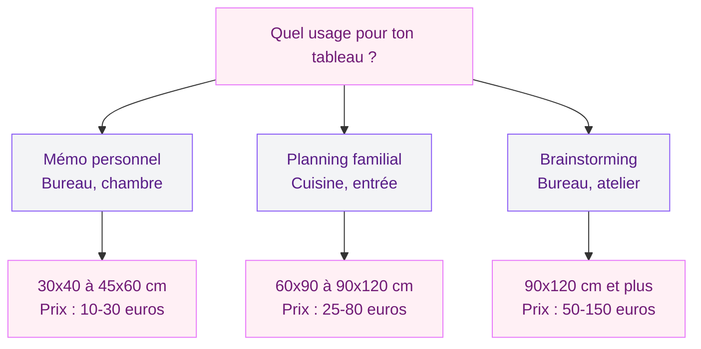
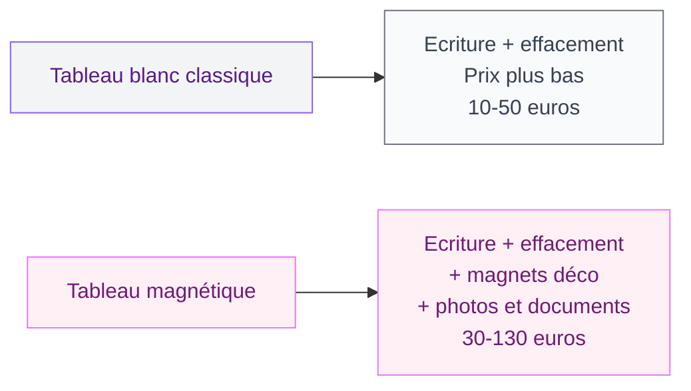
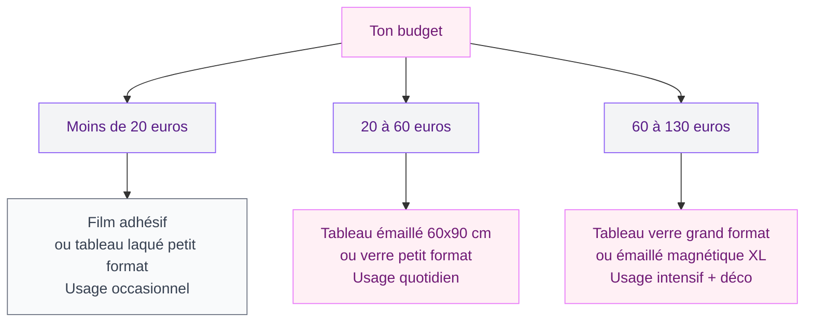

Tu en as marre des post-it qui se décollent et des listes griffonnées sur des bouts de papier ? Le tableau Velleda, c'est la solution simple et efficace pour organiser ta vie quotidienne - que ce soit pour le planning familial dans la cuisine, un espace brainstorming dans ton bureau ou même un mur d'idées dans ta chambre. Mais entre un modèle à 12 euros chez Action et un tableau en verre magnétique à 120 euros, le choix est large. Et surtout, il y a des erreurs à éviter si tu ne veux pas te retrouver avec un truc moche et inutilisable au bout de trois mois.

Je t'explique tout : les types de surfaces, les tailles adaptées à chaque usage, les petits détails qui font la différence au quotidien, et surtout comment intégrer ton tableau blanc dans ta déco sans casser l'ambiance.

---

## Tableau Velleda, tableau blanc, whiteboard : c'est quoi la différence ?

Petite mise au point rapide. "Velleda" est en fait une marque de BIC, comme "Sopalin" pour l'essuie-tout ou "Frigidaire" pour le réfrigérateur. C'est devenu un nom commun pour désigner tous les tableaux blancs effaçables à sec. Mais tous les tableaux blancs ne se valent pas, loin de là.

### Surface laquée (mélaminé)

C'est le modèle d'entrée de gamme. La surface est un revêtement laqué appliqué sur un panneau de fibres. Le prix est imbattable : entre 8 et 25 euros pour un format 45x60 cm chez Ikea, Action ou Bureau Vallée.

**Le hic** : au bout de 6 à 12 mois d'usage régulier, la surface commence à "fantômer". Le marqueur ne s'efface plus completement, et tu te retrouves avec des traces grises permanentes. Pour un usage occasionnel (liste de courses une fois par semaine), ça passe. Pour un usage quotidien, passe ton chemin.

### Surface émaillée (acier vitrifié)

Le cran au-dessus. La surface est en acier recouvert d'un émail cuit à haute température, ce qui la rend ultra résistante aux rayures et au fantômage. C'est ce qu'on trouve dans les entreprises et les salles de formation.

**Prix** : entre 40 et 90 euros pour un 60x90 cm (Bi-Office, Nobo, Legamaster). C'est un investissement, mais la surface reste impeccable pendant 10 à 15 ans minimum.

> [!TIP]
> Si tu comptes utiliser ton tableau tous les jours - planning familial, to-do list, brainstorming - le modèle émaillé est celui qui te fera gagner de l'argent sur le long terme. Le fantômage d'un modèle laqué t'obligera à le remplacer tous les ans.

### Surface en verre trempé

Le choix design par excellence. Un panneau de verre trempé (4 à 6 mm d'épaisseur), souvent disponible en blanc, noir, gris, rose poudré ou vert sauge. La surface est parfaitement lisse, le marqueur s'efface d'un coup de chiffon sans laisser aucune trace. Et visuellement, c'est un vrai objet déco.

**Prix** : entre 45 et 130 euros selon la taille. La marque Naga propose des modèles très réussis à partir de 50 euros (45x45 cm). Leroy Merlin et Castorama ont aussi des références intéressantes entre 60 et 100 euros pour du 60x90 cm.

**Limite** : le verre est lourd (un 60x90 cm pèse environ 6 à 8 kg), ce qui demande une fixation solide au mur. Et les modèles colorés foncés (noir, anthracite) nécessitent des marqueurs blancs ou néon spécifiques.

### Surface adhésive (film whiteboard)

Un rouleau de film autocollant que tu colles directement sur un mur, une porte ou un meuble. C'est la solution la plus discrète et la moins chère (10 à 20 euros le rouleau de 45x200 cm chez Action ou Amazon).

Parfait pour les locataires qui ne veulent pas percer, ou pour créer un grand espace d'écriture sans encombrer le mur. Mais la qualité d'effacement est moyenne, et le film peut se décoller avec le temps dans les pièces humides.

---

## Quelle taille pour quel usage ?

La taille, c'est vraiment le critère que tout le monde sous-estime. Un tableau trop petit, tu manques de place au bout de deux jours. Un tableau trop grand, il écrase ta pièce et fait "salle de classe".

  

### Petit format (30x40 cm à 45x60 cm)

Parfait pour un mémo personnel au-dessus du bureau, un petit rappel dans l'entrée ou une to-do list à côté du lit. Tu y notes 5 à 10 lignes de texte, ça suffit pour les rendez-vous de la semaine ou la liste des courses.

**Mes recommandations** : le Velleda BIC 45x60 cm à environ 15 euros (le classique indémodable), ou le tableau en verre Naga 45x45 cm à 50 euros si tu veux quelque chose de plus joli.

### Format moyen (60x90 cm à 90x120 cm)

C'est le format familial. Tu peux y mettre le planning de la semaine pour toute la famille, une zone pour les menus et une zone pour les listes de courses. C'est aussi la taille idéale si tu travailles de chez toi et que tu as besoin de visualiser tes projets.

Si tu cherches aussi des solutions d'organisation murale avec un côté plus déco, jette un oeil à notre guide sur les [tableaux planning et pense-bête](/guides/decoration/choisir-tableau-planning-pense-bete/) qui compare tous les formats.

> [!NOTE]
> Un tableau de 90x120 cm occupe environ la même surface murale qu'une grande toile déco. Pense à le placer comme tu placerais un cadre : centré au-dessus d'un meuble, avec 15 à 20 cm de marge en bas.

### Grand format (90x120 cm et plus)

Pour celles qui veulent un vrai mur d'expression. Les modèles de 120x180 cm ou 120x240 cm transforment un pan de mur entier en espace de travail. Idéal pour un atelier créatif, un bureau partagé, ou même la chambre d'un ado qui a besoin de place pour ses révisions.

**Prix** : entre 80 et 200 euros selon la surface. Les modèles émaillés grand format de Legamaster ou Nobo sont solides et durables.

---

## Magnétique ou pas : est-ce que ça vaut le coup ?

La fonction magnétique, c'est un vrai plus au quotidien. Tu peux y coller des photos, des tickets, des post-it avec des magnets déco au lieu de punaises - et ça change tout niveau pratique et esthétique.

Mais attention : tous les tableaux "magnétiques" ne se valent pas. Un tableau avec une fine couche de métal sous la surface tiendra à peine un magnet léger. Les vrais modèles magnétiques ont un panneau en acier complet derrière la surface.

**Comment tester ?** Prends un magnet de frigo standard et colle-le sur le tableau en magasin. S'il tient bien et glisse sans tomber, c'est bon. S'il se décroche ou tient à peine, la couche magnétique est trop fine.

> [!IMPORTANT]
> Les tableaux en verre sont tous magnétiques de base (le verre est posé sur un panneau métallique). C'est un des gros avantages de ce format - tu combines le côté design du verre et la fonction magnétique sans surcoût.

---

## Intégrer un tableau Velleda dans ta déco sans effet "bureau"

C'est LE point qui bloque la plupart des gens. Un tableau blanc, ça fait penser à la salle de réunion du boulot, pas à un intérieur cosy. Pourtant, avec les bons réflexes, tu peux l'intégrer de façon naturelle dans n'importe quelle pièce.

  

### Choisis la bonne couleur de surface

Le blanc classique, c'est pratique mais pas toujours joli. Les modèles en verre existent en noir mat, gris clair, vert olive, rose poudré ou même terracotta. Un tableau noir mat dans une cuisine blanche, c'est super graphique. Un tableau vert sauge dans un bureau scandinave, ça s'intègre sans effort.

### Encadre-le comme un vrai tableau

Certains modèles haut de gamme ont un cadre en bois ou en aluminium brossé qui leur donne un vrai look déco. Si ton modèle a un cadre en plastique gris pas terrible, tu peux le customiser avec du washi tape, du masking tape doré ou même un cadre en baguettes de bois collées par-dessus.

### Crée un "command center" mural

L'astuce qui change tout : au lieu de coller un tableau blanc tout seul au milieu d'un mur, crée une composition autour. Un tableau Velleda au centre, un petit panier mural pour le courrier à côté, un crochet pour les clés en dessous, et une petite plante en pot suspendu. Tu transformes un simple outil d'organisation en vrai coin déco fonctionnel.

Pour les règles d'accrochage et les hauteurs idéales, tu trouveras tout dans notre guide [bien accrocher un tableau mural](/guides/decoration/bien-accrocher-tableau-mural/).

> [!TIP]
> Mon secret pour un "command center" réussi : aligne tous les éléments sur un axe vertical imaginaire. Le tableau au centre, les accessoires répartis autour avec 5 à 10 cm d'espacement. L'ensemble doit former un rectangle visuel cohérent.

---

## Les accessoires qui font la différence

Un tableau Velleda sans les bons accessoires, c'est comme une cuisine sans ustensiles. Voici ce qui vaut le coup d'investir.

### Les marqueurs

Oublie les marqueurs bas de gamme à 2 euros le lot de 4. Ils sèchent vite, laissent des traces et les couleurs sont fades. Les marqueurs Velleda Liquid Ink de BIC (environ 8 euros les 4) sont la référence : écriture fluide, couleurs vives, effacement propre. Les Staedtler Lumocolor sont aussi très bons et durent longtemps.

Pour les tableaux en verre foncé, il te faudra des marqueurs craie liquide (chalk markers). Les Edding 4090 ou les Posca proposent de belles gammes de couleurs.

### L'effaceur

Un simple chiffon microfibre fait le job pour un usage quotidien. Evite les éponges humides sur les surfaces laquées - ça accélère le fantômage. Pour un nettoyage en profondeur une fois par mois, un spray nettoyant spécial tableau blanc (5 euros chez Bureau Vallée) remet la surface à neuf.

### Les magnets déco

Si ton tableau est magnétique, profites-en pour remplacer les magnets moches par des modèles design. Des petits aimants dorés ronds (lot de 10 à 8 euros chez Søstrene Grene), des magnets en forme de feuilles ou de fleurs, ou même des pinces magnétiques pour accrocher des photos Polaroid.

---

## Les erreurs classiques à éviter

J'ai vu (et fait) pas mal d'erreurs avec les tableaux blancs. Voici celles que tu dois absolument contourner.

  

**Acheter trop petit** - C'est l'erreur numéro 1. Un tableau de 30x40 cm pour un planning familial, ça ne marche pas. Tu manques de place au bout d'une semaine et tu finis par écrire de plus en plus petit jusqu'à ne plus rien lire. Prends toujours une taille au-dessus de ce que tu penses avoir besoin.

**Utiliser des marqueurs permanents** - Ça arrive plus souvent qu'on ne le pense (surtout quand les enfants s'en mêlent). Si ça t'arrive, pas de panique : repasse par-dessus avec un marqueur effaçable, puis efface les deux d'un coup. Le solvant du marqueur effaçable dissout l'encre permanente.

**Placer le tableau en plein soleil** - Les UV accélèrent le fantômage et jaunissent les surfaces laquées. Si ton tableau est dans une pièce lumineuse, place-le sur un mur qui ne reçoit pas de lumière directe.

**Oublier la fixation** - Un tableau de 90x120 cm pèse entre 4 et 10 kg selon le modèle. Les languettes adhésives ne suffiront pas. Prévois des vis et des chevilles adaptées à ton type de mur. Si tu hésites sur la méthode, consulte notre guide pour [choisir un tableau mural](/guides/decoration/choisir-tableau-mural/) qui détaille toutes les fixations possibles.

> [!WARNING]
> Ne laisse jamais un marqueur posé contre la surface du tableau pendant des heures. L'encre peut "marquer" la surface, surtout sur les modèles laqués. Utilise toujours le repose-marqueur ou un petit rebord en bas du tableau.

---

## Comparatif rapide : quel tableau Velleda selon ton budget

| Critère | Laqué | Emaillé | Verre | Film adhésif |
|---------|-------|---------|-------|-------------|
| Prix (60x90 cm) | 15-30 euros | 40-90 euros | 60-130 euros | 10-20 euros |
| Durée de vie | 1-2 ans | 10-15 ans | 10+ ans | 6-12 mois |
| Fantômage | Rapide | Très rare | Aucun | Fréquent |
| Magnétique | Parfois | Souvent | Toujours | Non |
| Look déco | Basique | Correct | Design | Discret |

---

## Sur le meme theme

- [tableau pour enfant](/guides/decoration/choisir-tableau-enfant/)
- [cadre tableau mural végétal](/guides/decoration/choisir-cadre-tableau-mural-vegetal/)

  

## FAQ

**Quelle est la différence entre un tableau Velleda et un tableau blanc classique ?**
Velleda est une marque de BIC qui fabrique des tableaux blancs effaçables. Le nom est devenu générique en France, comme "Scotch" pour le ruban adhésif. Tous les tableaux Velleda sont des tableaux blancs, mais tous les tableaux blancs ne sont pas des Velleda. D'autres marques comme Nobo, Legamaster ou Bi-Office proposent des produits de qualité équivalente ou supérieure.

  

**Comment nettoyer un tableau Velleda qui ne s'efface plus ?**
Si ton tableau fantôme (traces grises persistantes), essaie d'abord un spray nettoyant spécial tableau blanc (5 euros en papeterie). Si ça ne suffit pas, un peu d'alcool isopropylique sur un chiffon microfibre fait des miracles. Evite les produits abrasifs qui rayeraient la surface. Pour les cas désespérés, le dentifrice blanc (pas en gel) appliqué en fine couche et essuyé peut aussi fonctionner.

**Un tableau Velleda peut-il servir aussi de tableau magnétique ?**
Ça dépend du modèle. Les tableaux en verre sont toujours magnétiques. Les modèles émaillés et laqués sont magnétiques uniquement si leur panneau arrière est en acier - c'est souvent précisé sur l'emballage. Vérifie avec un magnet en magasin avant d'acheter si cette fonction est importante pour toi.

**Quelle taille choisir pour un planning familial ?**
Pour une famille de 2 à 4 personnes, un format 60x90 cm est le minimum confortable. Tu pourras y tracer un planning hebdomadaire avec une colonne par personne et une zone pour les notes. Pour une grande famille ou si tu veux aussi y mettre les menus de la semaine, monte à 90x120 cm sans hésiter.
