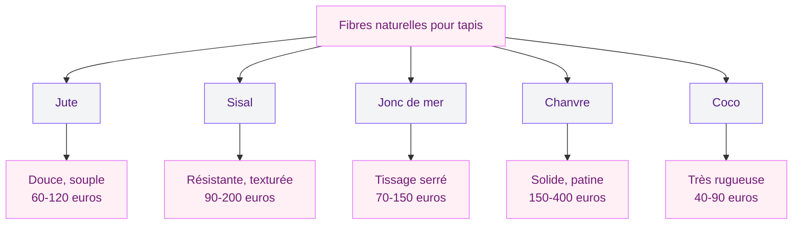
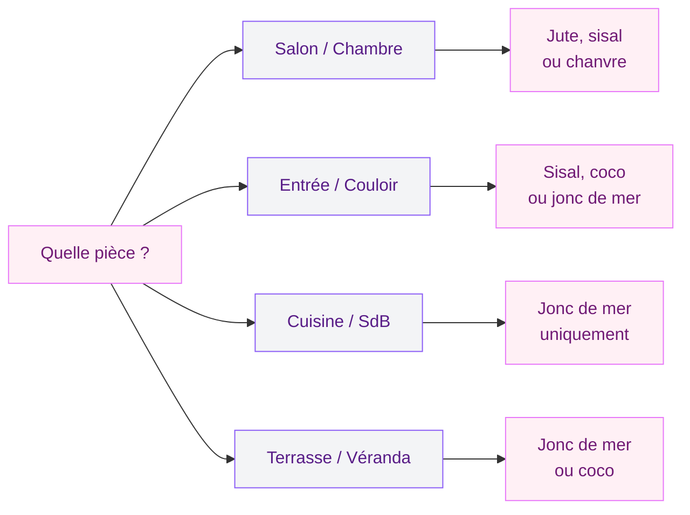

Tu cherches un tapis qui apporte de la texture, de la chaleur et un côté naturel à ton intérieur ? Les tapis en fibres naturelles cochent toutes ces cases. Jute, sisal, jonc de mer, chanvre, coco - chaque fibre a ses qualités, ses défauts et ses pièces de prédilection. Et entre un tapis sisal à 40 euros et un modèle en chanvre tissé main à 300 euros, le choix n'est pas anodin.

Je t'explique ici comment t'y retrouver, fibre par fibre, pièce par pièce, avec des repères de prix concrets et des conseils d'entretien pour que ton tapis dure des années.

## Pourquoi choisir un tapis en fibre naturelle

Un tapis en fibre végétale, c'est quoi exactement ? C'est un tapis tissé à partir de plantes : des herbes, des lianes, des écorces. Pas de plastique, pas de synthétique, pas de pétrochimie. Juste des végétaux transformés en fils, puis tissés en surface de sol.

  

### Le côté écologique

Les fibres naturelles sont biodégradables et renouvelables. Le jute pousse en 4 à 6 mois, le sisal en 7 à 10 ans avant la première récolte. Leur production demande moins d'eau et de pesticides que le coton conventionnel. Et en fin de vie, un tapis en jute ou en sisal se composte - essaie de faire pareil avec un tapis en polypropylène.

### La texture incomparable

Aucun tapis synthétique ne reproduit la texture d'un sisal ou d'un jonc de mer. Le tissage irrégulier, les variations de couleur naturelles, la matière brute sous les pieds - ça donne un cachet que le plastique ne peut pas imiter.

> [!TIP]
> Si tu débutes avec les fibres naturelles, commence par un tapis en jute. C'est la fibre la plus douce au toucher, la plus abordable et la plus facile à intégrer dans n'importe quel style de déco.

### Le prix accessible

Les tapis en fibres naturelles sont souvent moins chers que leurs équivalents en laine ou en coton haut de gamme. Un tapis en jute de 160x230 cm démarre autour de 60-80 euros chez IKEA (gamme LOHALS) ou La Redoute. En sisal, compte 90 à 150 euros pour la même taille. Le chanvre tissé main monte entre 200 et 400 euros, mais ça reste en dessous d'un tapis berbère en laine.

## Les 5 fibres naturelles à connaître

Chaque fibre a son caractère. Voici un tour d'horizon pour t'aider à choisir.

  

### Le jute : la fibre passe-partout

Le jute est la star des tapis naturels, et c'est mérité. Cette fibre est extraite de la tige d'une plante tropicale cultivée au Bangladesh et en Inde. Elle donne un tapis souple, doux sous les pieds (du moins par rapport aux autres fibres végétales), avec une couleur dorée très chaleureuse.

**Points forts** : prix bas, toucher agréable, look bohème-chic très tendance, facile à trouver partout.

**Points faibles** : c'est la fibre la moins résistante. Un tapis en jute dans un couloir à fort passage va s'user en 2 à 3 ans. Il absorbe l'humidité et peut moisir dans une pièce mal ventilée.

**Où le poser** : salon, chambre, bureau. Évite la cuisine, l'entrée et la salle de bain.

**Budget** : 50 à 120 euros en 160x230 cm. Les versions tissées main montent à 200-300 euros.

### Le sisal : le plus résistant

Le sisal provient des feuilles de l'agave sisalana, une plante originaire du Mexique. Ses fibres longues et rigides donnent un tapis à la texture prononcée, avec un tissage serré et une solidité qui surpasse toutes les autres fibres végétales.

**Points forts** : résistance au passage et à l'usure, anti-statique, large choix de tissages (bouclette, chevron, losange), teinture possible.

**Points faibles** : texture rugueuse - marcher pieds nus dessus n'est pas toujours agréable. Comme le jute, il craint l'eau et l'humidité.

**Où le poser** : salon, couloir, escalier, bureau, chambre d'amis. C'est le seul tapis naturel viable dans un couloir à fort passage.

**Budget** : 90 à 200 euros en 160x230 cm. Saint-Maclou propose une belle gamme entre 100 et 180 euros.

> [!WARNING]
> Les tapis en sisal et en jute ne supportent pas le nettoyage à l'eau. Un shampouinage classique va les déformer et les faire moisir. Utilise toujours un nettoyage à sec ou une poudre absorbante pour traiter les taches.

### Le jonc de mer : l'option salle d'eau

Le jonc de mer est une plante aquatique récoltée en Asie du Sud-Est (Chine, Vietnam). C'est la seule fibre naturelle qui pousse dans l'eau - ce qui lui donne un avantage énorme sur ses concurrentes.

**Points forts** : résistant à l'humidité et aux taches (surface légèrement cireuse), bonne résistance au passage, prix raisonnable.

**Points faibles** : toucher lisse et froid comparé au jute, choix de motifs limité, couleur vert-brun qui peut jaunir avec le temps.

**Où le poser** : entrée, salle de bain, cuisine, véranda - bref, partout où les autres fibres ont peur d'aller.

**Budget** : 70 à 150 euros en 160x230 cm. On en trouve chez Leroy Merlin et Castorama en rouleau, à partir de 15 euros le m2.

### Le chanvre : le haut de gamme discret

Le chanvre donne un tapis au caractère brut, avec des tons gris-vert qui évoluent et se patinent avec le temps. C'est une fibre écologique par excellence : le chanvre pousse sans pesticides, consomme peu d'eau et enrichit les sols.

**Points forts** : solidité impressionnante, patine qui s'embellit avec les années, résistante aux acariens, hypoallergénique.

**Points faibles** : prix élevé, offre limitée en France, toucher raide au début qui s'assouplit à l'usage.

**Où le poser** : salon, salle à manger, chambre. Il supporte bien les zones de passage moyen.

**Budget** : 150 à 400 euros en 160x230 cm. Certains modèles dépassent 500 euros mais durent 10 à 15 ans.

### La fibre de coco : la plus rustique

La fibre de coco provient de l'enveloppe des noix de coco. C'est la plus grossière de toutes les fibres naturelles, surtout présente dans les paillassons.

**Points forts** : ultra résistante au piétinement, gratte les semelles efficacement, prix très bas, imputrescible.

**Points faibles** : très rugueuse - impossible d'y marcher pieds nus confortablement. Rigide, elle ne s'assouplit pas avec le temps. Coloris limité (brun naturel).

**Où le poser** : entrée, hall, devant la porte, garage. C'est un tapis utilitaire avant tout.

**Budget** : 40 à 90 euros en format standard. Quelques euros pour un paillasson.

## Choisir la bonne fibre selon la pièce

Le choix de la fibre dépend avant tout de l'endroit où tu vas poser ton tapis. L'erreur la plus courante, c'est de choisir un beau tapis en jute pour l'entrée ou la cuisine - deux pièces qui vont le détruire en quelques mois.

  

### Salon et chambre : confort avant tout

Dans ces pièces, tu marches souvent pieds nus. Le jute est le meilleur choix pour sa douceur, suivi du chanvre pour les budgets plus élevés. Le sisal fonctionne aussi, mais prévois des chaussettes les premières semaines.

La taille compte beaucoup. Pour un salon, ton tapis doit déborder d'au moins 20 cm de chaque côté des assises du canapé. Un format 200x300 cm est souvent le minimum pour un séjour standard. En chambre, un 160x230 cm placé au pied du lit fait bien le travail.

Un tapis naturel se combine très bien avec un [tapis imprimé](/choisir-tapis-imprime/) superposé dessus en format plus petit - c'est une technique de layering très tendance qui ajoute de la profondeur.

### Entrée et couloir : résistance obligatoire

Ici, oublie le jute. Il va s'écraser et s'abîmer trop vite. Le sisal est le meilleur compromis entre esthétique et solidité. Le jonc de mer fonctionne aussi car il supporte bien la boue et l'humidité ramenées de l'extérieur. La fibre de coco fait un paillasson parfait devant la porte.

> [!NOTE]
> Un tapis en sisal dans un couloir à fort passage dure en moyenne 5 à 7 ans. Un tapis en jute dans le même couloir tiendra 1 à 2 ans. La différence de prix est d'environ 30 à 50 euros - le sisal est clairement le meilleur investissement ici.

### Cuisine et salle de bain : le jonc de mer ou rien

La règle est simple : si la pièce voit de l'eau régulièrement, le jonc de mer est ta seule option en fibre naturelle. Sa surface légèrement cireuse repousse les éclaboussures et il ne moisit pas comme le jute ou le sisal. Pour aller plus loin dans l'aménagement de ta salle de bain avec des matières naturelles, jette un oeil à nos idées pour [aménager une salle de bain en 2026](/amenager-une-salle-de-bain-en-2026-styles-et-conseils/).

## Entretien : les bons réflexes

L'entretien, c'est le point sensible des tapis naturels. Ils ne se nettoient pas comme un tapis synthétique, et certaines erreurs peuvent les abîmer définitivement.

  

### Le quotidien

Passe l'aspirateur une à deux fois par semaine, dans le sens du tissage, avec la brosse douce (pas la brosse rotative qui arrache les fibres).

### Les taches

Agis vite. Éponge le liquide avec un chiffon sec sans frotter. Saupoudre de la terre de Sommières sur la zone et laisse agir 2 à 4 heures. Aspire le tout. Pour les taches grasses, le bicarbonate de soude fonctionne aussi.

> [!IMPORTANT]
> Ne verse jamais d'eau directement sur un tapis en jute ou en sisal. L'humidité va créer des auréoles permanentes et peut provoquer des moisissures à la base du tissage. Le nettoyage à sec est la seule méthode sûre.

### L'humidité et la moisissure

Si ta pièce est mal ventilée, place un sous-tapis anti-humidité entre le sol et ton tapis naturel (15 à 40 euros en grande surface de bricolage). Aère la pièce régulièrement et retourne le tapis une fois par an pour équilibrer l'usure.

## Associer un tapis naturel à ta déco

Les tapis en fibres naturelles ont un gros avantage : ils sont neutres. Leur palette de beige, doré, brun et vert s'accorde avec à peu près tous les styles.

  

### Style scandinave et minimaliste

Un tapis en jute naturel posé sur un parquet clair, avec un mobilier en bois blond et des coussins en lin - c'est la combinaison classique qui fonctionne à tous les coups. Si tu veux pousser l'ambiance minimaliste plus loin, tu peux consulter nos [idées de décoration minimaliste](/decoration-minimaliste-idees-et-photos-faciles/) pour un rendu cohérent.

### Style bohème et ethnique

Le jute et le sisal sont les meilleurs amis du style bohème. Superpose un petit kilim coloré sur un grand tapis en jute, ajoute des poufs en cuir, des coussins à franges et des plantes vertes - l'ambiance est posée. Les matières naturelles comme le [rotin et l'osier](/rotin-osier/) complètent parfaitement ce tableau.

### Style contemporain et industriel

Un tapis en sisal à tissage chevron ou losange apporte de la chaleur à un intérieur béton-métal qui peut vite paraître froid. Choisis un tissage serré dans un ton anthracite (oui, le sisal se teinte) pour rester dans l'esprit industriel tout en adoucissant le sol.

### Style campagne et maison de famille

Le jonc de mer en revêtement mur à mur, c'est un classique des maisons de campagne françaises. Il remplace le carrelage ou le lino dans les pièces de vie, avec un côté chaleureux et authentique que le synthétique ne reproduit pas.

## Les erreurs à éviter

Quelques pièges classiques quand on achète son premier tapis en fibre naturelle :

- **Poser du jute dans une pièce humide** - Le jute absorbe l'eau comme une éponge et moisit en quelques semaines.
- **Utiliser un nettoyeur vapeur** - La chaleur humide déforme les fibres et crée des auréoles.
- **Oublier le sous-tapis** - Sans sous-tapis, le tapis glisse sur le carrelage et peut rayer le parquet par friction.
- **Choisir trop petit** - Un tapis trop petit flotte dans la pièce et donne un effet mesquin. Mieux vaut un tapis plus grand dans une fibre moins chère.
- **Ignorer les bordures** - Un tapis naturel sans bordure s'effiloche aux extrémités. Choisis un modèle avec une finition gansée ou surjetée.

## Sur le meme theme

- [tapis logo personnalisé](/choisir-tapis-logo-personnalise/)

## FAQ

### Un tapis en jute convient-il si j'ai des animaux ?

Le jute résiste moyennement aux griffes. Un chat va l'abîmer assez vite. Le sisal est un meilleur choix - sa texture rugueuse plaît aux chats comme griffoir, et elle résiste mieux à l'usure. Par contre, les poils d'animaux s'accrochent plus aux fibres naturelles qu'aux tapis synthétiques.

### Comment enlever une tache sur un tapis en fibre naturelle ?

Éponge immédiatement le liquide avec un chiffon sec (sans frotter). Saupoudre de la terre de Sommières ou du bicarbonate sur la tache et laisse agir 2 heures. Aspire ensuite. Pour les taches tenaces, utilise un produit de nettoyage à sec pour fibres végétales (8 à 15 euros en grande surface).

### Quelle est la durée de vie d'un tapis en fibre naturelle ?

Ça dépend de la fibre et de la pièce. Un tapis en jute dans un salon à passage modéré dure 3 à 5 ans. Un sisal dans les mêmes conditions tient 7 à 10 ans. Le chanvre peut dépasser 15 ans si tu en prends soin. Le jonc de mer se situe entre les deux, autour de 5 à 8 ans. Ces chiffres baissent fortement si le tapis est exposé à l'humidité ou à un passage intense.

### Peut-on poser un tapis en fibre naturelle sur un chauffage au sol ?

Oui. Le sisal et le jonc de mer supportent bien le chauffage au sol. Le jute aussi, à condition que la température ne dépasse pas 28 degrés en surface. Utilise un sous-tapis en feutre adapté pour éviter une surchauffe localisée. Évite la fibre de coco, trop épaisse, qui bloque la diffusion de chaleur.

### Un tapis en fibre naturelle est-il hypoallergénique ?

Les fibres végétales sont naturellement hypoallergéniques et anti-acariens - un vrai avantage par rapport aux tapis en laine ou aux moquettes synthétiques. Le chanvre et le sisal sont les plus performants. En revanche, si le tapis développe des moisissures dans une pièce humide, l'effet s'inverse. D'où l'importance de bien choisir la fibre en fonction de la pièce.
