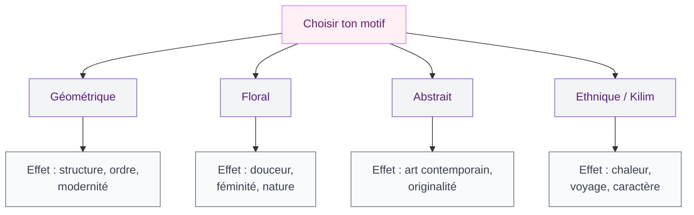
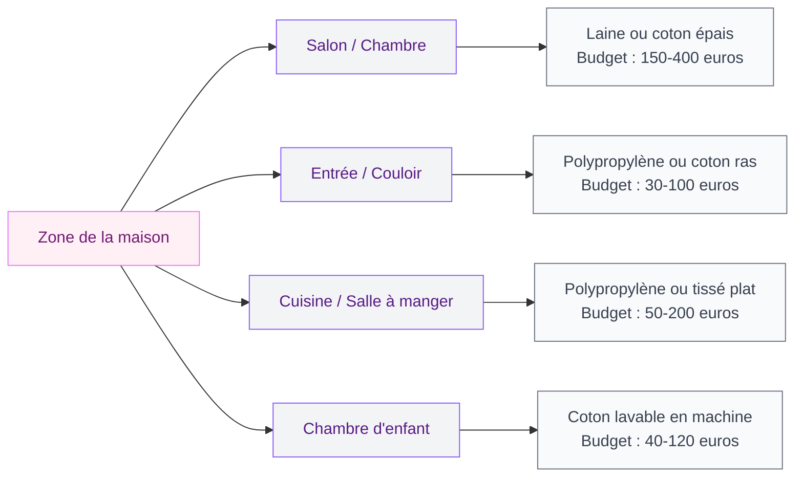
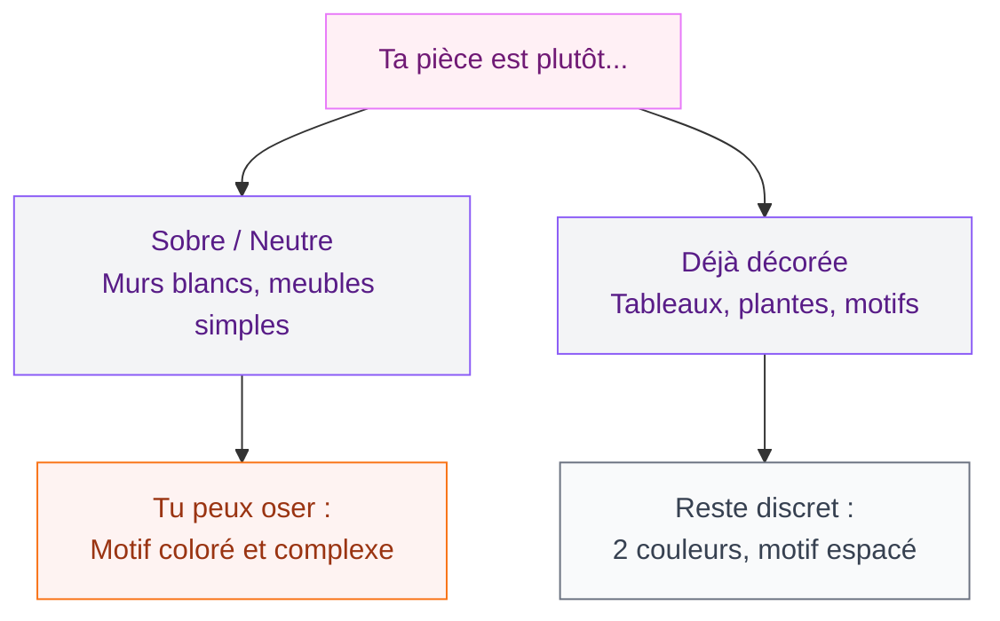

Un tapis imprimé, c'est le raccourci le plus efficace pour transformer une pièce sans toucher aux murs ni changer un meuble. Tu poses un tapis à motifs au pied du canapé, et d'un coup, le salon a du caractère. Mais voilà : entre les géométriques, les floraux, les abstraits et les ethniques, le choix peut vite tourner au casse-tête. Et un mauvais motif dans la mauvaise pièce, ça peut plomber toute une ambiance.

Je te donne ici tout ce qu'il faut savoir pour choisir un tapis imprimé qui fonctionne vraiment chez toi - du motif à la matière, en passant par la taille et le budget.

## Pourquoi un tapis imprimé change tout dans une pièce

Un tapis uni, c'est discret. Ça fait le job, mais ça n'apporte rien de plus qu'une surface douce sous les pieds. Un tapis imprimé, lui, joue un rôle de décoration à part entière. Il structure l'espace, attire le regard et donne le ton de toute la pièce.

C'est un peu comme un tableau au sol : il raconte quelque chose. Un motif géométrique crée un rythme régulier qui apaise. Un imprimé floral adoucit une pièce trop anguleuse. Un motif abstrait ajoute une touche d'art contemporain sans accrocher quoi que ce soit au mur.

Et puis, avantage pratique non négligeable : un tapis à motifs cache bien mieux les taches et l'usure qu'un tapis uni. Avec un chien, un chat ou des enfants, c'est un vrai plus.

> [!TIP]
> Si tu débutes en déco et que tu as peur de te tromper, commence par un tapis à motif géométrique dans des tons neutres (beige, gris, écru). C'est le choix le plus polyvalent - il s'adapte à presque tous les styles d'intérieur.

## Les grandes familles de motifs et leur effet

Tous les imprimés ne créent pas la même ambiance. Avant de craquer sur un modèle en ligne, comprends ce que chaque famille de motifs apporte visuellement.

### Géométrique : structure et modernité

Losanges, chevrons, lignes, triangles, hexagones... Les motifs géométriques sont les plus répandus, et pour cause : ils s'intègrent partout. Un tapis à chevrons noir et blanc chez H&M Home (à partir de 49,99 euros en 120x180 cm) donne un look scandinave épuré. Un kilim à losanges multicolores chez La Redoute (gamme Afelda, autour de 89 euros en 160x230 cm) tire plutôt vers le bohème.

La règle : plus le motif est petit et répétitif, plus il paraît "sage" et ordonné. Plus il est grand et contrasté, plus il capte l'attention.

### Floral : douceur et féminité

Le floral, c'est le grand retour de 2026. Mais on ne parle plus des roses de mamie - les imprimés floraux modernes sont souvent stylisés, dessinés à gros traits, avec des palettes limitées à deux ou trois couleurs. Zara Home propose des tapis en coton imprimé floral autour de 39,99 euros (format 80x150 cm) qui donnent un rendu très actuel.

Le piège à éviter : un imprimé floral trop chargé dans une petite pièce. Ça étouffe tout. Si ta pièce fait moins de 15 m2, opte pour un floral discret, avec des motifs espacés sur fond clair.

### Abstrait : l'audace maîtrisée

Taches de couleur, coups de pinceau, formes indéfinies... Le tapis abstrait, c'est pour celles qui veulent un sol qui fait "pièce d'art". Made.com et Westwing proposent de très beaux modèles entre 150 et 350 euros en format 160x230 cm.

L'avantage : un motif abstrait n'impose pas de direction, donc il fonctionne aussi bien dans un salon carré que rectangulaire. Et il pardonne mieux les petites imperfections, vu que le design est volontairement "imparfait".

### Ethnique et kilim : chaleur et voyages

Berbère, aztèque, indien, marocain... Ces motifs apportent du caractère et de la chaleur. Ils se marient très bien avec un intérieur aux matières naturelles comme le bois, le rotin ou le lin. Si tu aimes la [décoration marocaine](/guides/decoration/decoration-marocaine-moderne-ou-classique/), un tapis kilim authentique ou inspiré sera un choix évident.

Budget : un vrai kilim vintage démarre autour de 200-300 euros. Les imitations chez Ikea (gamme PERSISK et ses remplaçantes) tournent autour de 69-149 euros.

## Quelle taille pour quel espace

La taille, c'est le critère que les gens négligent le plus. Un motif magnifique sur un tapis trop petit, c'est gâché. Et un immense tapis imprimé dans un espace minuscule, ça déborde visuellement.

### Salon

La règle de base : le tapis doit être assez grand pour que les pieds avant du canapé et des fauteuils reposent dessus. En pratique, ça donne un 160x230 cm minimum pour un salon standard, 200x290 cm si la pièce est spacieuse.

Mon secret : avant d'acheter, découpe des feuilles de journal aux dimensions du tapis et pose-les au sol. Ça te donne une idée concrète de l'encombrement. Trust me, ça évite des retours fastidieux.

### Chambre

Deux options : un grand tapis (160x230 cm) qui dépasse largement du lit des deux côtés et du pied, ou deux petits tapis de chevet (60x110 cm) placés de chaque côté. Pour une chambre cosy avec un motif qui se répète, la première option est plus harmonieuse. Tu trouveras des idées complémentaires dans notre guide sur les [tendances chambre 2026](/guides/chambre/decoration-de-la-chambre-a-coucher-2026-tendances-et-photos/).

### Couloir et entrée

Format runner (60-80 cm de large, 200-300 cm de long). Les motifs linéaires ou les géométriques allongés fonctionnent très bien pour accompagner la perspective du couloir. Vérifie que le tapis est bien plat et stable - un antidérapant en dessous est presque obligatoire.

### Salle à manger

Le tapis doit dépasser de la table d'au moins 60 cm de chaque côté pour que les chaises restent sur le tapis même quand on les recule. Pour une table de 6 personnes, compte un 200x290 cm au minimum.

> [!WARNING]
> Évite les tapis à poils longs sous une table à manger : les miettes s'incrustent, les pieds de chaise s'enfoncent, et l'entretien devient un calvaire. Privilégie un tapis ras ou tissé plat.

## Choisir la bonne matière selon l'usage

Le motif, c'est ce qui attire l'oeil. La matière, c'est ce qui décide si ton tapis tiendra 6 mois ou 10 ans.

### Laine : le classique qui vieillit bien

Dense, chaude, résistante. Un tapis en laine imprimé, c'est un investissement (à partir de 200 euros en 160x230 cm chez Benuta ou La Redoute Intérieurs). La laine repousse naturellement la saleté et les liquides, et les couleurs tiennent dans le temps. Pour un salon ou une chambre, c'est le meilleur rapport qualité-longévité.

### Coton : accessible et facile d'entretien

Beaucoup de tapis imprimés d'entrée de gamme sont en coton. Avantage : ils passent souvent en machine (30 degrés, cycle délicat). Le motif est imprimé dessus, pas tissé, donc il peut s'effacer avec le temps. Parfait pour une chambre d'enfant ou un coin lecture, moins adapté aux zones de passage intensif.

### Polypropylène : le costaud pour les familles

C'est la fibre synthétique star des tapis modernes. Très résistante aux taches, facile à nettoyer avec un simple coup d'éponge, et elle coûte moins cher que la laine. Un tapis polypropylène imprimé chez Ikea (gamme VINDINGE ou VONSILD) démarre à 39,99 euros. Le hic : ça peut paraître un peu "plastique" au toucher, et ça ne vieillit pas aussi bien que la laine.

### Jute et fibres naturelles

Attention : les tapis en jute naturel sont rarement imprimés. On trouve des mélanges jute-coton avec des motifs, mais c'est plus rare. Si tu veux un look naturel avec un imprimé, tourne-toi vers les cotons épais avec une texture tissée visible.

## Comment associer un tapis imprimé au reste de la déco

C'est là où beaucoup de gens paniquent. "Mon canapé est gris, mes murs sont blancs, est-ce que je peux mettre un tapis à motifs colorés ?" Oui, et c'est même le meilleur scénario. Un intérieur neutre est la toile idéale pour un tapis imprimé qui va devenir la pièce maîtresse du décor.

### La règle du 60-30-10

Appliquée au tapis : 60 % de la pièce reste neutre (murs, gros meubles), 30 % porte une couleur dominante (souvent reprise dans le tapis), et 10 % apporte des accents via les accessoires (coussins, bougies, vases). Si ton tapis imprimé contient du jaune moutarde, ajoute deux ou trois coussins dans la même teinte et c'est harmonieux.

### Motif sur motif : oser le mix

Tu as déjà des rideaux à motifs ou des coussins imprimés ? Tu peux quand même poser un tapis imprimé, à condition de varier les échelles. Par exemple : petits motifs sur les coussins, grand motif sur le tapis. Et garde un élément commun - une couleur qui revient dans les deux imprimés. Si tu veux creuser le sujet des bonnes combinaisons, regarde notre article sur les [couleurs tendance pour les murs et la déco en 2026](/guides/couleurs/couleurs-dinterieur-de-mur-et-de-peinture-a-la-mode-2026/).

### Adapter l'imprimé au style de la pièce

- **Scandinave** : motifs géométriques simples, couleurs froides (gris, bleu clair, blanc)
- **Bohème** : kilim, imprimé ethnique, couleurs chaudes (terracotta, moutarde, bordeaux)
- **Contemporain** : abstrait, motifs larges, palette restreinte (noir, blanc, une couleur vive)
- **Classique** : motifs symétriques, médaillons, tons chauds et profonds

> [!NOTE]
> Un tapis imprimé peut aussi servir de point de départ pour décider la palette de toute une pièce. Choisis d'abord ton tapis, puis reprends ses couleurs pour le reste. C'est souvent plus facile que l'inverse.

## Entretien : garder les couleurs vives plus longtemps

Un tapis imprimé bien entretenu garde ses couleurs 5 à 10 ans sans problème. Mal entretenu, il ternit en 2 saisons. Voici les gestes qui comptent.

**Aspirer régulièrement** : deux fois par semaine pour les zones de passage, une fois pour les chambres. Toujours dans le sens du poil pour les tapis à velours, dans les deux sens pour les tapis ras.

**Tourner le tapis** : tous les 3 à 6 mois, pivote-le de 180 degrés. Ça répartit l'usure et l'exposition au soleil, surtout près des fenêtres.

**Traiter les taches immédiatement** : tamponne (ne frotte jamais !) avec un chiffon humide et un peu de savon de Marseille. Pour les taches tenaces sur laine, le bicarbonate de soude laissé 15 minutes puis aspiré fait des miracles.

**Protection solaire** : les UV décolorent les imprimés, surtout les tapis en coton. Si ton tapis est sous une baie vitrée, investis dans un film UV pour les vitres ou tire les rideaux aux heures les plus exposées. Ça rejoint d'ailleurs le sujet des [erreurs courantes avec les rideaux](/guides/decoration/erreurs-rideaux/) - bien gérer la lumière, ça protège aussi ton mobilier.

> [!IMPORTANT]
> Ne passe jamais un nettoyeur vapeur sur un tapis imprimé en coton ou en laine sans vérifier l'étiquette du fabricant. La chaleur combinée à l'humidité peut faire dégorger les couleurs et déformer les fibres.

## Budget : combien investir selon la qualité voulue

Le prix d'un tapis imprimé varie énormément selon la matière, la taille et la marque. Voici une grille réaliste pour un format 160x230 cm, le plus courant en salon.

- **Entrée de gamme (30-80 euros)** : Ikea, H&M Home, Action. Polypropylène ou coton fin, motif imprimé. Durée de vie 2-4 ans.
- **Milieu de gamme (80-250 euros)** : La Redoute, Benuta, Westwing, Maisons du Monde. Coton épais, polypropylène haute densité ou mélanges. Durée de vie 4-7 ans.
- **Haut de gamme (250-600 euros)** : Made.com, AM.PM, Caravane. Laine, coton tissé main, kilim authentique. Durée de vie 8-15 ans.
- **Luxe (600 euros et plus)** : The Rug Company, cc-tapis, Moroso. Pièces d'artiste, laine néo-zélandaise, soie. Durée de vie 15-30 ans.

Mon conseil : mets le prix sur le tapis du salon (tu le vois tous les jours, tes invités aussi) et économise sur les pièces secondaires. Un tapis Ikea dans l'entrée, un beau tapis laine dans le séjour - c'est un bon compromis.

> [!TIP]
> Les soldes de janvier et les ventes privées de mi-saison (septembre) sont les meilleurs moments pour acheter un tapis de qualité avec 30 à 50 % de réduction. Westwing et Made.com font régulièrement des opérations sur les tapis.

## FAQ

### Un tapis imprimé peut-il aller dans une pièce avec du parquet ?

Oui, c'est même l'une des meilleures combinaisons. Le parquet apporte la chaleur du bois et le tapis imprimé le graphisme. Pense juste à mettre un antidérapant entre les deux pour protéger le parquet des frottements.

### Comment savoir si un motif est trop "chargé" pour ma pièce ?

Si tu as déjà beaucoup d'éléments décoratifs (tableaux, plantes, bibelots, rideaux à motifs), opte pour un imprimé discret avec 2 couleurs maximum. Si ta pièce est plutôt sobre et minimaliste, tu peux te lâcher sur un motif plus complexe.

### Tapis imprimé ou tapis uni avec des coussins colorés ?

Les deux fonctionnent, mais le tapis imprimé a un avantage : il ancre visuellement l'espace. Un tapis uni avec des coussins disperse l'attention, un tapis imprimé la concentre. Si tu veux créer un "point focal" au sol, le tapis imprimé gagne.

Le tapis imprimé, c'est l'accessoire qui transforme une pièce plate en un espace vivant. Prends le temps de bien choisir la taille (mesure avant tout !), la matière (adaptée à l'usage réel de la pièce) et le motif (en accord avec le style existant). Et si tu doutes, rappelle-toi : un intérieur neutre encaisse presque n'importe quel imprimé. C'est le moment de prendre un risque déco - au sol, ça se change facilement.
