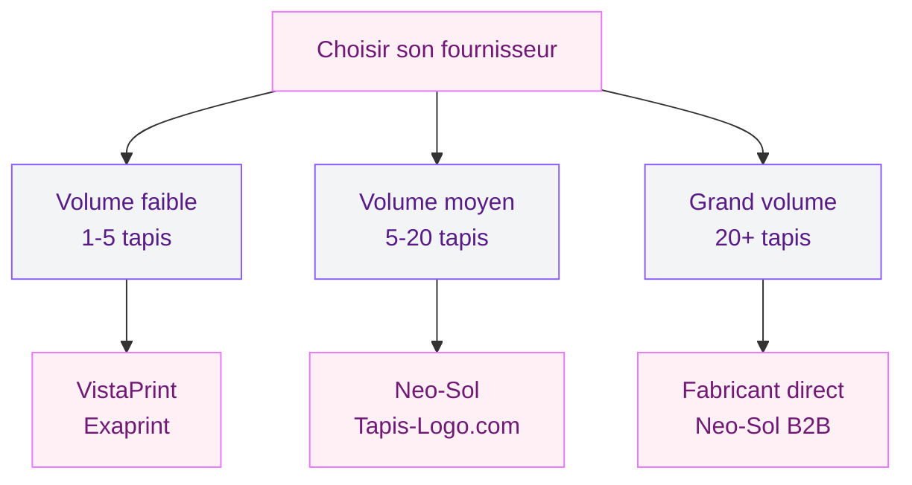
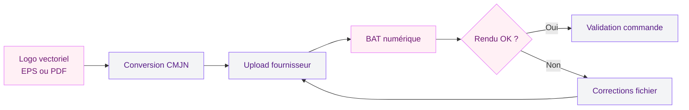
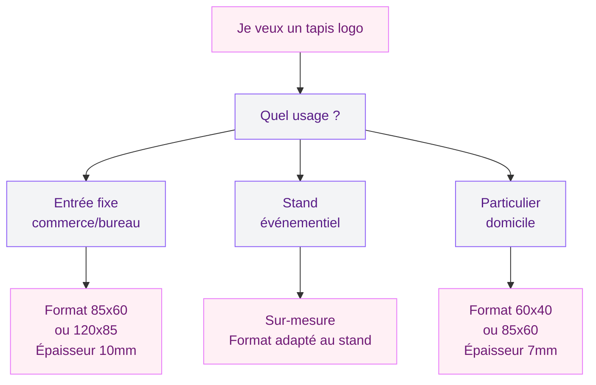

Un tapis personnalisé avec ton logo, c'est souvent la premiere chose que voient les clients quand ils poussent ta porte. Pas un simple paillasson, mais un vrai outil de communication - et ça change tout à l'image que tu renvoies. Que tu gères un cabinet médical, un salon de coiffure, une boutique ou un espace co-working, un tapis à tes couleurs dit "ici, on soigne les détails". Et c'est précisément ce genre de détail qui fait la différence.

Ce guide passe en revue tout ce qu'il faut savoir avant de commander : les formats disponibles, les matériaux, les fournisseurs sérieux, et les petits pièges à éviter. Parce que oui, on peut se tromper sur un tapis logo - et regretter son choix pendant deux ans.

## Pourquoi mettre un tapis logo à l'entrée ?

La réponse évidente, c'est le branding. Ton logo affiché dès le seuil, dans tes couleurs, avec ton typographie - ça ancre ton identité visuelle de manière concrète, physique. Mais il y a d'autres bonnes raisons, moins glamour mais bien réelles.

  

Un tapis d'entrée de qualité protège ton sol. Il capte la poussière, l'humidité, les salissures que les visiteurs apportent depuis l'extérieur. Moins de nettoyage, moins d'usure sur ton parquet ou ton carrelage. Et avec la couche caoutchouc antidérapante intégrée sur les modèles sérieux, tu évites aussi les glissades - ce qui n'est pas anodin en termes de responsabilité légale pour un commerce.

> [!NOTE]
> Un tapis d'entrée réduit jusqu'à 80% des salissures transportées à l'intérieur selon les fabricants spécialisés. C'est à la fois un argument déco et un argument pratique vraiment solide.

Sur un stand événementiel, le tapis logo joue un autre rôle : il délimite ton espace, attire l'oeil, et crée une identité visuelle cohérente avec ton backdrop et tes kakémonos. C'est du branding au sol - souvent négligé, toujours efficace quand c'est bien fait.

Et à la maison ? Certains particuliers commandent des tapis personnalisés pour une chambre d'enfant (prénom + illustration), un paillasson avec une phrase de bienvenue, ou une pièce à thème. Les volumes sont plus petits, les prix un peu moins compétitifs, mais c'est tout à fait faisable.

## Les dimensions : par où commencer ?

C'est la premiere question à régler, et souvent celle qu'on bâcle. Résultat : un tapis trop petit qui semble perdu dans l'entrée, ou trop grand qui bloque la porte.

  

Voici les formats standards qu'on retrouve chez la plupart des fournisseurs :

| Format | Dimensions | Usage typique |
|--------|-----------|---------------|
| Petit | 60 x 40 cm | Entrée d'appartement, bureau individuel |
| Moyen | 85 x 60 cm | Boutique, cabinet, petit commerce |
| Grand | 120 x 85 cm | Hall d'accueil, agence, restaurant |
| Sur-mesure | Jusqu'à 2m+ | Stand expo, grande surface, open space |

La regle pratique : la largeur du tapis doit être au minimum égale à la largeur de ta porte. Pour un hall d'accueil, vise un format qui couvre la zone de passage naturelle, généralement 1,5 à 2 fois la largeur de l'entrée.

> [!TIP]
> Avant de commander, pose un carton au sol dans les dimensions prévues et vis avec pendant 24h. Tu verras immédiatement si c'est trop petit ou si ça bloque le passage de la porte.

Si tu vises un stand événementiel, pense à la surface totale que tu veux couvrir. Un stand de 3x2 mètres avec un tapis intégral fait une impression très différente d'un simple tapis de sol standard. Certains fournisseurs proposent des découpes sur-mesure avec impression continue - c'est plus cher, mais l'effet est professionnel.

## Les matériaux et l'épaisseur

On distingue deux familles principales :

  

**7 mm d'épaisseur** - C'est le format standard, plus fin, plus léger. Adapté aux portes coulissantes ou aux endroits où l'épaisseur peut poser un problème (porte qui touche le tapis, seuil rehaussé). La couche de surface est en polyamide ou en velours imprimé, l'envers en caoutchouc naturel ou synthétique.

**10 mm d'épaisseur** - Le format "confort plus", plus absorbant, meilleur pour capter les salissures et l'humidité. Recommandé pour les entrées avec fort passage ou les zones où il pleut souvent (commerces, cabinets). L'envers caoutchouc est généralement plus épais, donc meilleure adhérence au sol.

> [!WARNING]
> Vérifie toujours la hauteur entre ton sol et le bas de ta porte avant de commander un tapis de 10 mm. Beaucoup de portes ont un jeu de 8 à 12 mm - avec un tapis épais, la porte peut ne plus s'ouvrir correctement.

Pour l'impression, les tapis logo utilisent presque exclusivement l'impression quadri (4 couleurs CMJN) en recto. C'est la technique standard qui permet de reproduire n'importe quelle couleur, dégradé ou photo. Le rendu est net, les couleurs tiennent dans le temps si le tapis est entretenu correctement.

## Où commander : tour des fournisseurs

Le marché des tapis personnalisés a bien évolué. Aujourd'hui, plusieurs acteurs sérieux se démarquent.

  

**Tapis-Logo.com** - Spécialiste français dédié aux tapis publicitaires. Interface claire, configurateur en ligne, délais annoncés de 7 à 10 jours ouvrés. Prix à partir de 35-40€ HT pour un format 60x40. Bon rapport qualité-prix pour les petites quantités. Leur configurateur permet d'uploader un logo vectoriel et de visualiser le rendu avant validation.

**Neo-Sol** - Fabricant français, plus orienté B2B et gros volumes. Qualité de fabrication reconnue, mais minimum de commande parfois plus élevé. Intéressant si tu équipes plusieurs sites ou si tu commandes en quantité pour un réseau de franchises. Les délais peuvent être plus longs (2 à 3 semaines).

**Exaprint** - Imprimeur généraliste qui propose des tapis parmi ses produits. Pratique si tu commandes déjà tes flyers ou kakémonos chez eux pour regrouper les frais de port. La gamme est moins spécialisée, mais les prix sont compétitifs et la qualité d'impression est fiable.

**VistaPrint** - La solution grand public, avec une interface très accessible. Idéal pour les particuliers ou les TPE qui veulent un seul tapis sans s'y connaître en PAO. Les prix sont corrects, le rendu un peu moins précis sur les petits détails graphiques. À éviter si ton logo a des aplats complexes ou des dégradés fins.

> [!TIP]
> Demande toujours un BAT (Bon A Tirer) numérique avant de valider ta commande. C'est une simulation du rendu final sur le tapis. Certains fournisseurs le facturent (5 à 15€), d'autres l'offrent. C'est toujours du temps et de l'argent économisés.

## Préparer ses fichiers : le point technique à ne pas négliger

C'est là que beaucoup de commandes partent de travers. Un fichier mal préparé donne un résultat flou, des couleurs décalées, ou un logo illisible.

  

Le format idéal pour l'impression sur tapis : **PDF vectoriel ou EPS**, à défaut un PNG en 150 dpi minimum à la taille réelle du tapis. Le JPEG compressé est à éviter - les artéfacts de compression ressortent à l'impression.

Pour les couleurs, les imprimantes travaillent en CMJN. Si ton logo est défini en RVB (ce qui est souvent le cas pour les logos web), il faut convertir avant d'envoyer le fichier. Un rouge vif en RVB peut devenir terracotta en CMJN si tu ne vérifies pas. Ton graphiste ou ton imprimeur peut faire cette conversion.

Si tu n'as pas de version vectorielle de ton logo (ce qui arrive, surtout pour les petites structures), demande à ton fournisseur s'il propose un service de vectorisation. Certains le font gratuitement, d'autres facturent 20 à 50€. C'est un investissement utile qui te sert ensuite pour toutes tes impressions.

## Le budget : à quoi s'attendre ?

Les prix varient selon le format, l'épaisseur et le fournisseur, mais voici des fourchettes réalistes en 2026 :

- **60 x 40 cm** : 30 à 55€ HT l'unité
- **85 x 60 cm** : 50 à 85€ HT l'unité
- **120 x 85 cm** : 80 à 140€ HT l'unité
- **Sur-mesure grand format** : à partir de 200€ HT selon dimensions

Les frais de port s'ajoutent (généralement 8 à 15€ pour un tapis standard, davantage pour les grands formats). Si tu commandes plusieurs tapis en une fois, le port est souvent dégressif.

Pour les entreprises assujetties à la TVA, ces achats sont récupérables - ça change le calcul. Un tapis à 120€ TTC revient à 100€ HT nets après récupération de TVA.

Certains fournisseurs proposent des remises volume dès 3 ou 5 tapis identiques - si tu équipes plusieurs espaces d'accueil ou anticipes plusieurs événements, commande en une fois pour optimiser les coûts.

L'entretien a aussi un coût à intégrer. Un tapis d'entrée professionnel se passe l'aspirateur régulièrement et se lavette à la main ou en machine (cycle délicat, eau froide) selon les recommandations du fabricant. Avec un entretien correct, un tapis logo de qualité tient 3 à 5 ans en usage bureau standard.

## Personnaliser au-delà du logo

Le tapis logo, c'est rarement juste le logo posé sur fond uni. Les possibilités de personnalisation sont bien plus larges.

**Le fond** : blanc, couleur de ta charte, motif graphique, photo... L'impression quadri permet théoriquement n'importe quel visuel. La limite, c'est la lisibilité - un fond trop chargé noie le logo. Un fond uni dans ta couleur principale avec le logo centré, c'est souvent la solution la plus efficace.

**Le texte** : slogan, adresse, numéro de téléphone, site web. À manier avec parcimonie - le tapis d'entrée n'est pas un panneau publicitaire. Un slogan court peut fonctionner ("Bienvenue chez nous", ton accroche de marque), une adresse complète, rarement.

**La forme** : la plupart des tapis sont rectangulaires, mais certains fournisseurs proposent des découpes sur-mesure (ovale, forme personnalisée). Plus complexe, plus cher, mais peut créer un effet mémorable pour un stand ou une entrée premium.

Si tu décores un espace de travail plus large, le tapis logo s'intègre dans une réflexion globale sur [l'aménagement du bureau](https://www.cristallina.fr/guides/decoration/amenagement-bureau) et la cohérence visuelle des espaces.

## Quelques erreurs à éviter

**Commander sans BAT** - On l'a dit, mais ça vaut d'être répété. Un logo pixellisé ou des couleurs décalées sur un tapis, ça ne se corrige pas après livraison.

**Sous-estimer le format** - L'erreur classique. Sur les photos produit, les tapis semblent grands. Dans ta vraie entrée, un 60x40 peut paraître minuscule. Mesure ton espace, pose un carton, puis commande.

**Choisir le prix le plus bas sans regarder la qualité** - Les tapis bas de gamme ont une couche imprimée qui se décolle ou s'efface rapidement. L'impression reste, mais terne et écaillée. Ce n'est pas le message que tu veux envoyer à tes clients.

**Oublier les contraintes de pose** - Sol carrelé lisse ? Le caoutchouc adhère bien. Moquette ? La couche caoutchouc peut glisser ou marquer la moquette. Vérifie la compatibilité avec ton type de sol.

> [!CAUTION]
> Si ton tapis est destiné à un espace extérieur ou semi-extérieur (auvent, véranda), vérifie explicitement que le modèle est prévu pour un usage outdoor. Les tapis intérieur standard se dégradent rapidement à l'humidité et sous l'effet des UV.

## L'intégrer dans ta déco globale

Un tapis logo ne vit pas seul. Il fait partie d'un ensemble - l'entrée ou l'espace d'accueil dans son intégralité. Pour qu'il fonctionne vraiment, il doit s'harmoniser avec le reste : couleurs des murs, mobilier, signalétique, éclairage.

Si ton espace d'accueil est sobre et minimaliste, un tapis avec juste ton logo sur fond sombre ou clair s'intégrera parfaitement. Si ton espace est plus coloré, ton tapis doit s'y adapter - ou au contraire jouer le contraste assumé.

Tu peux aussi t'inspirer des principes de la [décoration feng shui](https://www.cristallina.fr/amenagement-feng-shui) pour l'entrée : un espace d'accueil dégagé, bien éclairé, avec un sol propre et une identité visuelle claire crée une premiere impression positive qui influence inconsciemment la perception de tes visiteurs.

Pour une entrée de bureau ou un couloir de réception, pense aussi à [l'éclairage](https://www.cristallina.fr/eclairage-ambiance-techniques-sublimer) : un spot LED orienté vers le tapis le met en valeur et rend les couleurs plus vives, surtout dans un hall sans lumière naturelle.

## Sur le meme theme

- [tapis imprimé](/choisir-tapis-imprime/)
- [tapis en fibre naturelle : guide pour bien choisir](/choisir-tapis-fibre-naturelle/)
- [tableau noir ardoise](/choisir-tableau-noir-ardoise/)
- [rotin et osier](/rotin-osier/)
- [coussins décoratifs](/coussins-decoratifs-pour-les-salons-les-fauteuils-et-les-sols/)

## Synthèse pour choisir

Avant de cliquer sur "commander", voici les questions à te poser :

En résumé : pour une entrée de commerce ou de bureau, pars sur un 85x60 ou 120x85 en 10 mm avec impression quadri. Prépare un fichier vectoriel en CMJN, demande un BAT, et commande chez un spécialiste comme Tapis-Logo.com ou Neo-Sol si tu veux un résultat fiable. Le budget tourne autour de 60 à 120€ HT selon le format - c'est un investissement rentable quand on pense à l'image renvoyée chaque jour à ses clients.

Et si tu hésites encore entre plusieurs options de déco pour ton espace professionnel, [les idées de décoration murale](https://www.cristallina.fr/deco-murale-idees-habiller-murs-style) peuvent compléter parfaitement l'identité visuelle que tu construis au sol.
