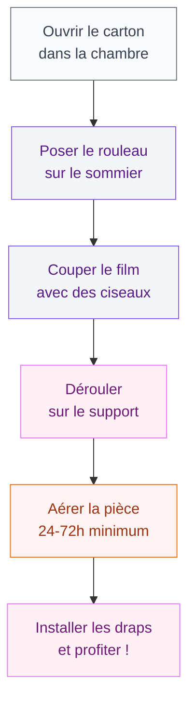

Tu viens de recevoir ton matelas Emma, il est posé en rouleau dans ta chambre, et tu meurs d'envie de t'y allonger. C'est compréhensible ! Mais avant de plonger dedans, il y a une question qui revient tout le temps : combien de temps faut-il vraiment attendre avant d'utiliser le matelas Emma ? La réponse courte, c'est entre 24 et 72 heures. La réponse longue, c'est ce que je t'explique dans cet article.

## Pourquoi le matelas Emma arrive-t-il roulé ?

Quand tu commandes un matelas Emma en ligne, il t'est livré compressé et enroulé dans un film plastique, glissé dans une boîte compacte. Ça peut surprendre la première fois - on ne s'attend pas forcément à ce qu'un matelas tienne dans un carton de cette taille !

  

Ce système de livraison "bed-in-a-box" est utilisé par la plupart des marques de matelas en ligne (Emma, Tediber, Casper, Simba...). L'avantage est évident : la livraison est plus simple, moins chère, et tu peux porter le carton seul jusque dans ta chambre sans forcer.

Mais compresser un matelas en mousse ou en latex, même pendant quelques semaines, a une conséquence directe : le matelas a besoin de temps pour retrouver son volume et sa forme d'origine une fois sorti de son emballage.

> [!NOTE]
> Le fait d'être compressé n'abîme pas le matelas Emma. Les matériaux sont conçus pour supporter cette phase de transport. Ton matelas retrouvera toutes ses propriétés de confort une fois bien "gonflé".

## Combien de temps avant d'utiliser le matelas Emma ?

La règle standard recommandée par Emma et la plupart des fabricants de literie : **attends au minimum 24 heures, idéalement 48 à 72 heures** avant de dormir dessus.

  

Voici ce qui se passe selon les délais :

- **Les 2 premières heures** : le matelas commence à se décompresser. Tu vois clairement le volume augmenter.
- **Après 24 heures** : le matelas a retrouvé environ 90 % de sa forme. Il est techniquement utilisable.
- **Après 48 à 72 heures** : la décompression est complète, le mousse a retrouvé toute son élasticité et son soutien. C'est là que le confort est optimal.

> [!TIP]
> Si tu ne peux vraiment pas attendre (déménagement, nuit sans autre solution), dormir dessus après 24 heures ne cassera pas ton matelas. Mais le confort sera peut-être un peu en dessous de ce que tu devrais ressentir.

## Est-ce qu'on peut dormir dessus avant les 72 heures ?

Oui, tu peux. Emma elle-même dit que le matelas peut être utilisé dès la sortie du carton. Mais tu risques de ne pas profiter pleinement du confort prévu si la mousse n'a pas encore totalement repris sa forme.

  

Il y a aussi la question des odeurs. Un matelas neuf, surtout en mousse, peut dégager une odeur un peu chimique les premières heures - c'est ce qu'on appelle le "off-gassing". Ce phénomène est normal et sans danger, mais bien aérer la pièce les premiers jours aide vraiment.

La température de ta chambre joue aussi un rôle. Une pièce à 18-20 °C permet à la mousse de se détendre correctement. En hiver, si ta chambre est froide (en dessous de 15 °C), la décompression peut prendre un peu plus de temps - compte plutôt 72 heures que 48.

> [!WARNING]
> Ne dépose pas ton matelas Emma sur un support inadapté pendant la phase de décompression. Un sol dur et plat, ou directement sur ton sommier, c'est parfait. Évite de le laisser debout contre un mur ou plié - ça perturberait la reprise de forme.

## Comment bien déballer le matelas Emma ?

Pour que la décompression se passe dans les meilleures conditions, voici comment procéder :

  

1. **Porte le carton dans ta chambre** avant de l'ouvrir - c'est beaucoup plus simple.
2. **Pose le rouleau sur le sommier ou le sol** à l'endroit où tu veux l'installer.
3. **Coupe le film plastique** avec des ciseaux (attention à ne pas abîmer le tissu du matelas en coupant trop profond).
4. **Déroule délicatement** le matelas dans le bon sens.
5. **Laisse la pièce aérée** - ouvre une fenêtre si possible.

> [!TIP]
> C'est pratique d'avoir quelqu'un avec toi pour déballer un matelas double ou king size. Le matelas Emma Original 160x200 cm pèse environ 30 kg - pas impossible seul, mais plus simple à deux.

## Que faire si le matelas ne reprend pas bien sa forme ?

Dans la grande majorité des cas, un matelas Emma reprend parfaitement sa forme après 72 heures. Mais si après 4 ou 5 jours tu constates encore des creux ou des bosses anormaux, voici quelques pistes :

  

- **Vérifie ton support** : un sommier à lattes trop espacées ou une base inadaptée peut déformer un matelas en mousse. Emma recommande des lattes espacées de 7 cm maximum.
- **Retourne le matelas** : certains modèles Emma ne sont pas réversibles (ils ont un côté haut et un côté bas), mais vérifier que tu l'as posé dans le bon sens peut aider.
- **Attends encore quelques jours** : dans de rares cas, la décompression peut prendre jusqu'à 7 jours, surtout si ta chambre est froide (la mousse se détend moins vite par temps froid).

Si le problème persiste au-delà d'une semaine, contacte le service client Emma. La marque propose une garantie 10 ans et une période d'essai de 100 nuits - si le matelas est défectueux, tu as largement le temps de le signaler.

> [!IMPORTANT]
> Ne laisse JAMAIS ton matelas Emma enroulé et emballé au-delà d'un mois après la livraison. Au-delà de cette durée, la mousse risque de ne plus retrouver sa forme complète. Si tu l'as reçu mais que tu ne peux pas l'utiliser tout de suite, déballe-le quand même et pose-le à plat.

## La période d'essai de 100 nuits Emma

Une fois que ton matelas a bien décompressé et que tu commences à l'utiliser, tu entres dans la période d'essai de 100 nuits proposée par Emma. C'est du temps pour vraiment tester si ce matelas correspond à ta façon de dormir.

Les premières semaines, ton corps s'adapte à ce nouveau support. C'est normal de trouver la surface un peu ferme ou un peu souple les premiers jours - comme une paire de chaussures neuves qui se façonne à ton pied. Emma conseille d'attendre au moins 3 à 4 semaines avant de te faire un avis définitif.

Si après cet essai le matelas ne te convient pas, Emma vient le récupérer gratuitement et te rembourse intégralement. C'est un vrai filet de sécurité qui change tout quand on achète un matelas en ligne sans l'essayer en magasin avant.

## Quel sommier avec le matelas Emma ?

Le choix du support influe directement sur la durée de vie et le confort de ton matelas. Emma est compatible avec :

- **Sommier à lattes** (lattes espacées de max 7 cm) - c'est l'option recommandée
- **Sommier tapissier**
- **Sommier électrique** (lit réglable)
- **Lit plateforme** (base plate)
- **Sol** (tatami, tapis épais)

Si tu as une [chambre à coucher à redécorer pour 2026](/decoration-de-la-chambre-a-coucher-2026-tendances-et-photos/), c'est le bon moment pour choisir un sommier adapté et penser à l'ensemble de ton espace nuit en même temps que ton nouveau matelas.

Le prix d'un bon sommier à lattes pour un 160x200 cm tourne autour de 150 à 400 euros selon les marques. IKEA propose des sommiers compatibles Emma à partir de 150 euros environ (le LEIRSUND par exemple). Si tu optes pour un lit à plateforme, assure-toi que la surface est bien plane et ventilée.

## Entretien du matelas Emma les premières semaines

Les six premières semaines après installation, ton matelas Emma passe par une phase d'adaptation qui mérite un peu d'attention.

**Les deux premières semaines**, la mousse continue de s'ajuster à ton poids et à ta morphologie. Si tu partages le lit, la surface va progressivement se répartir selon vos deux zones de confort. C'est tout à fait normal : ce n'est pas un signe de défaut.

**À partir de la troisième semaine**, tu peux commencer à retourner le matelas de 180 degrés (tête-pied) pour uniformiser l'usure. Fais-le une fois par mois les six premiers mois, puis tous les deux à trois mois ensuite. Ce simple geste double presque la durée de vie du matelas.

Côté odeurs, si le "off-gassing" dure plus de cinq jours, aère ta chambre plus activement : ouvre la fenêtre deux heures le matin. Un ventilateur positionné face au matelas accelere aussi l'aération.

Pour la protection, installe une alèse dès la première nuit. Pas la peine de prendre le modèle Emma officiel (autour de 60-80 euros selon la taille) : une alèse molleton imperméable comme celles de chez Linandelle ou Kadolis, entre 25 et 45 euros, fait très bien le travail. L'alèse empêche la transpiration nocturne de s'imprégner dans la mousse et facilite le nettoyage en cas d'accident.

Évite les housses de protection en plastique : le plastique retient l'humidité et crée une chaleur qui accélère l'usure. Préfère toujours une alèse en tissu respirant.

Enfin, un point souvent oublié : lave ta housse amovible Emma régulièrement. Elle se détache facilement avec la fermeture éclair, passe en machine à 60 °C et se remet en place en deux minutes. Emma recommande un lavage toutes les six à huit semaines.

## Sur le meme theme

- [pistolet à calfeutrer](/pistolet-a-calfeutrer/)
- [isolation dalle béton](/isolation-dune-dalle-en-beton-techniques-options-disolation-et-cout/)
- [facades de maisons modernes 2026](/facades-de-maisons-modernes-2026/)

## Récap : tout ce qu'il faut retenir

Pour résumer en quelques points clés :

- Attends **24 à 72 heures** après le déballage avant de dormir sur ton matelas Emma.
- Décompresse-le à **plat sur son support définitif**, dans une pièce aérée.
- Les odeurs disparaissent en **2 à 7 jours** avec une bonne ventilation.
- Ne laisse jamais ton matelas emballé roulé plus d'**un mois**.
- Retourne-le de 180 degrés **une fois par mois** les six premiers mois.
- Mets une **alèse respirante** dès la première nuit.
- Si ton matelas ne reprend pas sa forme après une semaine, contacte Emma (garantie 10 ans + 100 nuits d'essai).

Prendre ces 48 à 72 heures de patience te permettra de profiter pleinement du confort de ton Emma dès la première nuit. Et si tu es en pleine réorganisation de ta chambre, que tu penses à des solutions de rangement ou à une nouvelle déco, n'oublie pas de jeter un oeil à nos conseils sur l'[entretien du parquet taché](/parquet-tache/) - pendant que tu réaménages, autant en profiter pour remettre tout votre sol en état aussi !

Un bon matelas, un bon support, un peu de patience... et des nuits de qualité pour les années à venir. C'est tout ce qu'on veut, non ?
