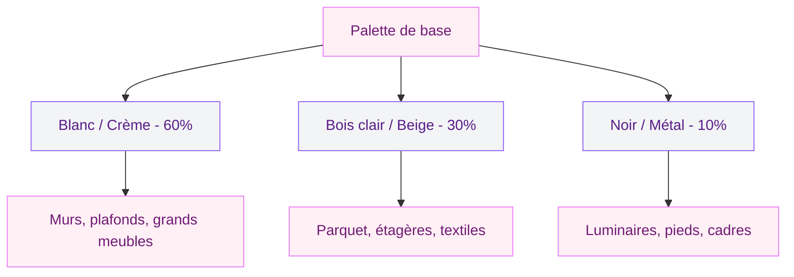
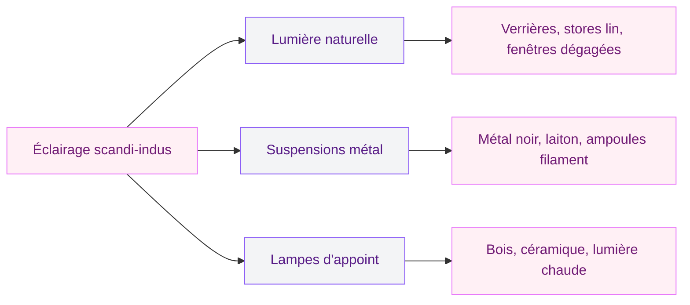
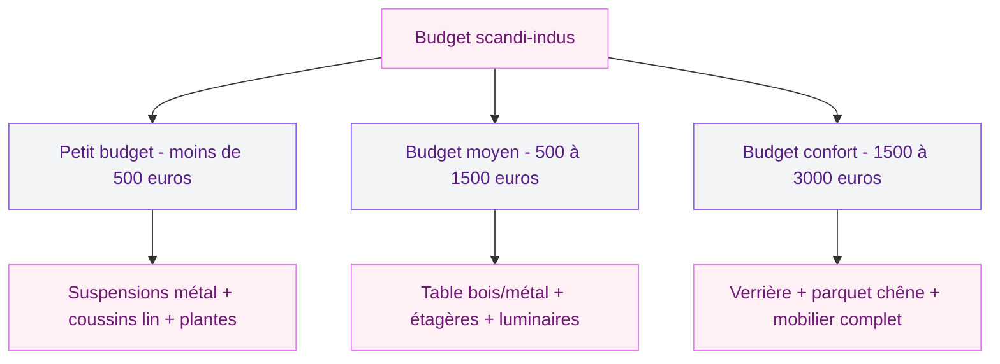

Tu adores les lignes épurées du style scandinave, mais tu craques aussi pour le caractère brut du look industriel ? Bonne nouvelle : ces deux univers se complètent mieux que tu ne le penses. Le bois blond du Nord, la lumière douce des intérieurs danois, les suspensions en métal noir, les briques apparentes - tout ça peut cohabiter dans un même espace sans que ça fasse "catalogue de meubles".

Le mix scandinave-industriel, c'est l'un des duos déco les plus efficaces du moment. Il permet de créer un intérieur à la fois chaleureux et structuré, doux et affirmé. Je t'explique comment réussir ce mélange pièce par pièce, sans fausse note.

## Pourquoi ces deux styles fonctionnent si bien ensemble

Si tu y regardes de près, le style scandinave et le style industriel partagent un ADN commun : la fonctionnalité, les lignes simples et l'absence de fioritures. Les deux refusent le superflu. Un fauteuil scandinave est beau parce qu'il est utile, pas parce qu'il est décoré. Une étagère industrielle en métal est pensée pour ranger, pas pour paraître.

  

Cette base commune, c'est ce qui rend le mariage naturel. Le scandinave apporte la douceur, la luminosité et la rondeur. L'industriel apporte la structure, le contraste et le caractère. L'un sans l'autre peut vite devenir soit trop froid (full indus), soit trop lisse (full scandi). Ensemble, ils s'équilibrent.

> [!NOTE]
> Le style scandinave est né dans les années 1950 dans les pays nordiques, où la lumière naturelle est rare. Le style industriel vient des lofts new-yorkais reconvertis à partir des années 1970. Deux origines différentes, mais une même logique : aller à l'essentiel.

## La palette de couleurs : le socle du mix

C'est par les couleurs que tout commence. Et la bonne nouvelle, c'est que les deux styles partagent une préférence pour les tons neutres. Ça simplifie tout.

  

### Les bases à poser

Le blanc reste la couleur dominante en scandinave. Pour la version industrielle, on parle plutôt de gris - gris béton, gris anthracite, gris chaud. Le duo gagne en profondeur quand tu combines les deux : des murs blancs lumineux avec des éléments gris foncé pour ancrer l'espace.

Ajoute du noir par petites touches - pieds de meubles, luminaires, cadres - pour le côté industriel. Et du beige ou du sable pour la chaleur scandinave. Tu obtiens une palette cohérente et facile à vivre.

### Les accents de couleur

Pour éviter la monotonie, injecte une ou deux couleurs d'accent. Le terracotta fonctionne très bien dans ce registre. Le vert sauge aussi, comme on le voit dans les [salons modernes et élégants en 2026](/salons-modernes-et-elegants-2026/). L'idée, c'est d'utiliser ces touches par petites doses : un coussin, un vase, une affiche.

> [!TIP]
> La règle du 60-30-10 aide beaucoup ici : 60 % de couleur dominante (blanc, gris clair), 30 % de couleur secondaire (bois clair, beige) et 10 % de couleur d'accent (noir, terracotta ou vert). Ce ratio crée un équilibre visuel presque automatique.

## Les matériaux : le coeur du mélange

Le choix des matériaux est l'élément qui fait ou défait ton mix scandi-indus. Ici, la règle est simple : le bois et le métal doivent se retrouver dans chaque pièce.

  

### Le bois clair, pilier scandinave

Chêne clair, bouleau, pin naturel - ce sont les essences phares du style nordique. Tu les retrouves dans le parquet, les étagères, les plateaux de table, les pieds de chaise. Le bois clair illumine un espace et lui donne cette douceur typiquement scandinave.

Pour un rendu authentique, privilégie les finitions huilées ou matifiées plutôt que le vernis brillant. Un parquet en chêne clair huilé, par exemple, garde son aspect naturel tout en étant protégé.

Quelques repères de prix :
- **Parquet chêne clair massif** : 45 à 90 euros le m2 pose comprise
- **Table à manger en chêne naturel** : à partir de 350 euros (type La Redoute, Made)
- **Étagère murale en bouleau** : 25 à 60 euros

### Le métal, signature industrielle

Acier noir mat, fer forgé, fonte - le métal industriel est brut, assumé, graphique. Il se décline en pieds de table, suspensions, étagères ouvertes, cadres de miroirs. Pour un look scandi-indus réussi, choisis du métal noir ou du métal brut gris foncé. Évite le chrome brillant, qui tire trop vers le contemporain classique.

L'association la plus simple et la plus efficace : une table avec un plateau en chêne clair et des pieds en métal noir. Ce meuble résiste à toutes les modes et incarne parfaitement le croisement des deux styles. Tu trouveras plus d'idées sur le sujet dans notre guide sur [le mobilier métallique comme tendance déco](/le-mobilier-metallique-une-tendance-deco-sure/).

### Les matières complémentaires

Au-delà du bois et du métal, d'autres matières complètent le tableau :

- **Le lin et le coton** (coussins, rideaux, plaids) : ils apportent la douceur scandinave
- **Le béton ciré** (plan de travail, sol) : il renforce le côté industriel
- **Le cuir vieilli** (fauteuil, pouf) : il fait la passerelle entre les deux mondes
- **La brique apparente** (mur d'accent) : un classique industriel qui se réchauffe facilement avec des accessoires scandinaves

> [!WARNING]
> Attention à ne pas surcharger en métal. Si chaque meuble a des pieds en acier noir, l'ambiance bascule vite du côté froid et impersonnel. Alterne avec du bois pur, du rotin ou du tissu pour garder l'équilibre.

## L'éclairage : l'arme secrète du duo

La lumière est un élément central dans les deux styles. Les intérieurs scandinaves sont pensés pour maximiser la clarté naturelle (jours courts en hiver oblige). L'industriel mise sur des luminaires à forte personnalité.

  

### Maximiser la lumière naturelle

Pas de rideaux lourds ni de voilages épais. Opte pour des stores en lin léger ou des rideaux en coton fin, de couleur claire. Si tu as la possibilité de poser une verrière intérieure entre deux pièces, fonce - c'est l'élément déco parfait du mix scandi-indus. La verrière en métal noir laisse circuler la lumière tout en structurant l'espace.

Prix d'une verrière intérieure en acier :
- **Verrière 3 carreaux prête à poser** : 400 à 800 euros
- **Verrière sur mesure posée** : 1 200 à 3 000 euros selon la taille

### Les luminaires qui font le lien

Les suspensions métalliques sont les stars de ce mix. Une grosse suspension en métal noir au-dessus de la table à manger, un lampadaire articulé en acier près du canapé, des appliques murales en laiton vieilli dans le couloir - chaque luminaire raconte l'histoire industrielle.

Pour la touche scandinave, ajoute des lampes à poser en bois ou en céramique claire sur les meubles d'appoint. Les guirlandes lumineuses (à ampoules rondes, pas les guirlandes de Noël) créent aussi une ambiance nordique très douce en soirée.

## Pièce par pièce : comment appliquer le mix

  

### Le salon

C'est la pièce où le mix fonctionne le mieux. Commence par un canapé en lin ou en tissu gris clair - la base scandinave. Ajoute une table basse avec un plateau en bois massif et des pieds en métal. Au mur, une étagère ouverte en métal noir avec des objets triés sur le volet : plantes vertes, bouquins, quelques bougies.

Pour le sol, un parquet clair est idéal. Si tu as du carrelage ou un sol foncé, un grand tapis en laine écru ou beige fera l'affaire pour adoucir l'ensemble. Tu trouveras d'autres inspirations dans notre article sur la [décoration minimaliste](/decoration-minimaliste-idees-et-photos-faciles/) : le minimalisme est un pont naturel entre les deux styles.

### La cuisine

La cuisine scandi-indus est un classique. Des meubles bas en bois clair (chêne ou bouleau), un plan de travail en béton ciré ou en pierre grise, des étagères ouvertes en métal noir pour la vaisselle. Les tabourets de bar avec assise en bois et pieds en métal complètent le look.

Côté crédence, le carrelage métro blanc reste un choix sûr qui fait le lien entre les deux esthétiques. Les poignées en métal noir sur des façades de placards en bois clair créent un contraste élégant et fonctionnel.

### La chambre

Ici, le scandinave doit dominer - la chambre est un espace de repos, pas un atelier. Une tête de lit en bois naturel, du linge de lit en lin lavé blanc ou beige, des coussins doux. Les touches industrielles restent discrètes : une lampe de chevet articulée en métal, un petit portant en acier noir pour les vêtements, un cadre métallique au mur.

### Le bureau

Si tu travailles de chez toi, le mix scandi-indus est parfait pour un espace productif et agréable. Un bureau en bois clair et métal, une chaise ergonomique dans des tons neutres, des rangements en métal noir au mur. L'ambiance industrielle donne du sérieux à l'espace, tandis que le scandinave le rend accueillant. Va jeter un oeil à notre guide pour [fabriquer un bureau avec des caissons](/fabriquer-un-bureau-avec-des-caissons/) si tu veux un projet DIY dans cet esprit.

## Les erreurs à éviter

Même si le mix paraît simple sur le papier, certaines erreurs reviennent souvent.

**Trop de métal, pas assez de douceur.** C'est la faute numéro un. Si tu mets du métal partout, tu te retrouves avec un loft industriel pur et dur, pas un mix. Le bois, le textile et les plantes doivent compenser chaque élément métallique.

**Des couleurs trop froides.** Le gris béton sans chaleur humaine, ça donne un intérieur triste. Ajoute toujours des matières chaudes : un plaid en laine, un tapis en jute, des coussins en lin.

**Oublier les plantes.** Les plantes vertes sont le liant secret du mix scandi-indus. Un monstera dans un pot en terre cuite, un ficus sur une étagère en métal, des succulentes sur le rebord de fenêtre - elles apportent la vie qui manque parfois aux deux styles pris séparément.

**Copier un showroom.** Un intérieur scandi-indus réussi a de l'âme. Ajoute des objets personnels, des photos, des souvenirs de voyage. C'est ce qui fait la différence entre un intérieur "Pinterest" et un endroit où on a vraiment envie de vivre.

> [!IMPORTANT]
> Le bon ratio pour un équilibre réussi : environ 60 % de scandinave (douceur, lumière, bois) et 40 % d'industriel (métal, béton, lignes graphiques). Si tu inverses, l'atmosphère risque de devenir trop froide.

## Budget : combien ça coûte ?

Pas besoin de tout refaire pour obtenir un look scandi-indus. Quelques pièces bien choisies suffisent à transformer un espace.

Quelques achats malins pour démarrer :
- **2 suspensions en métal noir** (Leroy Merlin, IKEA) : 30 à 80 euros les deux
- **Coussins en lin naturel** (La Redoute, H&M Home) : 15 à 25 euros pièce
- **Plantes vertes en pots terre cuite** : 10 à 30 euros chacune
- **Petit meuble d'appoint bois/métal** : 60 à 150 euros
- **Tapis en jute ou laine** (160x230 cm) : 80 à 200 euros

## Sur le meme theme

- [décoration art déco](/50-idees-de-decoration-art-deco/)

## FAQ

### Est-ce que le style scandi-indus fonctionne dans un petit appartement ?

Oui, et même très bien. Les deux styles privilégient les lignes simples et le désencombrement, ce qui aide à agrandir visuellement l'espace. Mise sur des meubles fins (pieds en métal fin, étagères aériennes) et des couleurs claires pour gagner en volume.

### Quelles plantes choisir pour un intérieur scandi-industriel ?

Les plantes à feuillage généreux marchent le mieux : monstera, ficus lyrata, pilea, pothos. Place-les dans des pots en terre cuite, en béton ou en céramique mate pour rester dans le registre du mix. Évite les cache-pots en plastique brillant.

### Comment intégrer de la couleur dans un intérieur scandi-indus sans casser l'ambiance ?

Le plus simple, c'est de passer par les accessoires : coussins, plaids, vases, affiches. Le terracotta, le vert sauge et le jaune moutarde sont les couleurs qui s'intègrent le plus naturellement dans ce mix. Limite-toi à une ou deux teintes d'accent et garde les surfaces principales en tons neutres.

### Peut-on mixer scandi-indus avec un autre style ?

Oui, le japandi (japonais + scandinave) s'intègre naturellement puisqu'il partage la même base épurée. Le style bohème peut aussi fonctionner en apportant des textiles et de la chaleur, mais il faut doser pour ne pas perdre la lisibilité du mix.

### Où trouver du mobilier scandi-industriel à prix accessible ?

IKEA reste une référence pour les bases scandinaves et propose toujours davantage de pièces à pieds métalliques. Maisons du Monde a une gamme scandi-indus assez fournie. Pour du plus original, regarde du côté de Made.com, La Redoute Intérieurs, et les sites de seconde main comme Leboncoin ou Selency pour des pièces vintage industrielles authentiques.
