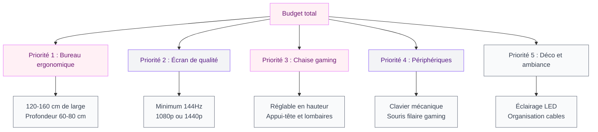
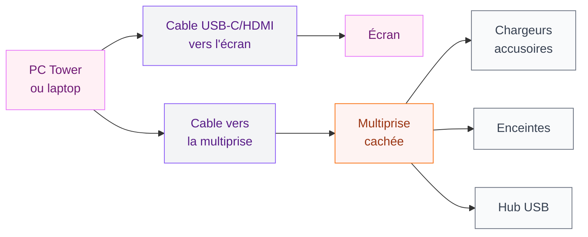

Tu passes des heures devant ton écran et tu en as marre de jouer dans un coin sombre avec un bureau bancal et des cables qui trainent partout ? On est d'accord, une vraie station de gaming ca change tout - pas seulement les performances, mais aussi l'envie de s'installer et de jouer. Et non, ca ne veut pas dire investir 5 000€ dans du matériel LED ultra-criard. On peut créer un setup gamer qui déchire visuellement tout en restant dans un budget raisonnable. Je te donne ma méthode pas à pas.

## Le bureau : la base de tout

Ton bureau, c'est la pièce centrale du setup. Et c'est souvent là qu'on fait des erreurs : soit on prend quelque chose de trop petit, soit on recycle un vieux meuble de lycée qui tient à peine debout.

  

**La taille minimale pour un setup gaming : 120 cm de large.** En dessous, tu vas te battre pour caser l'écran, le clavier, la souris et les enceintes. L'idéal, c'est 140 à 160 cm pour avoir de l'espace sans te sentir à l'étroit.

Pour la profondeur, 60 à 80 cm, c'est le bon compromis. Ca laisse de la distance avec l'écran (important pour les yeux) tout en restant dans une emprise raisonnable.

Côté matières, les options :

- **Bureau en MDF avec plateau épais** : bon rapport qualité/prix. Le Linnmon d'Ikea (69€ en 150x75 cm) reste une valeur sure, surtout si tu le combines avec des pieds Adils ou des caissons Alex.
- **Bureau avec panneau perforé** : pratique pour fixer des accessoires (étagères, bras d'écran, etc.). Les modèles Gaming de chez Flexispot autour de 150-200€ ont cette fonctionnalité intégrée.
- **Bureau assis-debout** : investissement plus lourd (350-800€) mais franchement utile pour les longues sessions. Le Bekant d'Ikea démarre à 459€ avec la version électrique.

> [!TIP]
> Si tu veux un bureau entièrement personnalisé sans te ruiner, pense à [fabriquer ton bureau avec des caissons](/fabriquer-un-bureau-avec-des-caissons/). Ca permet d'avoir exactement la longueur et la configuration voulues, avec rangement intégré.

## Le setup écran : moniteur ou double écran ?

L'écran, c'est l'investissement qui fait la plus grande différence à l'usage. Un mauvais écran sur un bon PC, c'est du gachis. À l'inverse, un écran de qualité compense beaucoup de choses.

  

**Pour le gaming, le minimum en 2026 :** un moniteur 1080p à 144 Hz. C'est le seuil en dessous duquel tu vas sentir la différence. Si ton budget le permet, visez directement du 1440p à 144 ou 165 Hz - le rendu est nettement meilleur et la durée de vie du setup plus longue.

Les tailles qui fonctionnent bien :

- **24 pouces** : parfait pour les petits espaces, bonne densité de pixels en 1080p
- **27 pouces** : le point d'équilibre idéal pour le gaming, surtout en 1440p
- **32 pouces et plus** : impressionnant, mais attention à la distance oeil-écran (au moins 70-80 cm recommandés)

**Le double écran :** ca complique la gestion des cables mais c'est un vrai confort si tu streames, regardes des vidéos en parallèle ou travailles aussi sur ta station. Un écran principal gaming + un écran secondaire plus classique pour les taches annexes, c'est une combinaison très populaire.

> [!NOTE]
> Pour ton setup, pense à prévoir un bras moniteur réglable. Ca libère de la place sur le bureau, permet d'ajuster la hauteur et l'inclinaison facilement, et donne un rendu beaucoup plus aéré. Les bras Huanuo sur Amazon (30-50€) sont corrects pour commencer.

## La chaise gaming : arrête de lésiner là-dessus

Les longues sessions de jeu avec une mauvaise chaise, ca finit en mal de dos chronique. C'est le type d'investissement qu'on reporte sans cesse et qu'on regrette d'avoir retardé.

  

Une chaise gaming correcte doit avoir :

- Réglage de la hauteur
- Réglage de l'inclinaison du dossier
- Appuie-bras réglables (en hauteur idéalement)
- Support lombaire (coussin ou intégré)
- Appuie-tête

**Les marques et prix en 2026 :**

- **Ikea Matchspel** (229€) : un très bon rapport qualité/prix, design sobre qui ne hurle pas "je suis un gamer".
- **AKRacing Core Series** (à partir de 250€) : solide, bien construite, bonne durabilité.
- **Secret Lab Titan** (380-450€) : la référence dans le milieu, disponible en différentes tailles selon ta morphologie.
- **Herman Miller Embody Gaming** (1 500€) : pour ceux qui veulent le top absolu et jouent 40h/semaine - c'est une chaise de bureau de haut de gamme adaptée au gaming.

> [!WARNING]
> Méfie-toi des chaises gaming à moins de 100€. Elles ressemblent souvent à des chaises haut de gamme mais la mousse s'affaisse rapidement et le plastique craque. Mieux vaut une chaise de bureau classique ergonomique dans ce budget.

## Les périphériques : clavier, souris et casque

**Le clavier mécanique** : si tu joues beaucoup, le mécanique s'impose. Le retour tactile et la durabilité sont sans comparaison avec le membranaire. Les switches Cherry MX Red (discrets) ou Brown (retour tactile) sont les plus polyvalents. Budget : à partir de 60€ pour un HyperX Alloy FPS, 100-150€ pour un Logitech G Pro ou un Corsair K70.

  

**La souris gaming** : ici, le critère principal c'est le capteur et le poids. Les souris filaires restent supérieures en termes de réactivité pour le gaming compétitif. La Razer DeathAdder V3 (70€) et la Logitech G Pro X Superlight 2 (150€) sont des valeurs sures. Si tu préfères sans fil, le budget monte mais la technologie a beaucoup progressé.

**Le casque** : pour le gaming solo, un bon casque stéréo suffit largement. Pour le jeu en équipe ou les FPS, un micro intégré de qualité devient important. Le SteelSeries Arctis Nova 1 (80€) est une belle option abordable ; le HyperX Cloud Alpha (100€) aussi.

## La gestion des cables : le détail qui change tout esthétiquement

C'est le truc que presque tout le monde bâcle et qui pourtant transforme complètement l'aspect visuel d'un setup.

  

**Mes conseils concrets :**

1. **Chemins de cables sous le bureau** : les rails à cables autocollants (3-10€ sur Amazon) fixés sous le plateau permettent de faire disparaitre 80% des cables de la vue.
2. **Gaine de rangement** : pour regrouper plusieurs cables en un seul faisceau propre. La gaine velcro se retire facilement contrairement à la gaine spirale.
3. **Gestion à l'arrière du bureau** : une boite à cables ou un tiroir de rangement sous bureau (Signum chez Ikea, 15€) pour cacher la multiprise et les adaptateurs.
4. **Cables courts** : remplace les cables trop longs par des cables à la bonne longueur. Ca semble bête mais ca fait vraiment la différence.

## L'ambiance : éclairage et déco

C'est là que ca devient fun. L'ambiance d'un setup gaming, c'est beaucoup l'éclairage.

**Le rétroéclairage LED derrière l'écran** (biais lighting) : ca réduit la fatigue oculaire et ca donne cet effet "glow" très sympa. Les Govee TV Backlight ou Philips Hue Play démarrent à 30-50€. Certains écrans gaming ont même cette fonctionnalité intégrée.

**Les bandes LED sous le bureau** : populaires, accessibles (15-40€ pour des Govee ou Elgato), syncronisables avec la musique ou les jeux sur certains modèles.

**La lampe de bureau** : une lampe à col de cygne ou une lampe barre posée au-dessus de l'écran évite les reflets et les yeux qui brulent en soirée. La Benq ScreenBar (100€) est faite pour ca.

Pour la déco autour : les panneaux acoustiques colorés (qui absorbent aussi un peu le son, pratique pour les voisins), les figurines de jeux vidéo, quelques plantes pour apporter du vivant... et voilà, le setup a de la personnalité.

Si ton setup gaming est dans ta chambre et que tu cherches une ambiance cohérente avec le reste de la pièce, jette un oeil à [comment décorer une chambre dans un style jungle](/decorer-une-chambre-dans-un-style-jungle/) pour voir comment intégrer des touches naturelles même dans un espace tech.

> [!TIP]
> Trust me : un fond de mur peint dans une teinte sombre (anthracite, bleu marine, vert bouteille) derrière ton setup amplifie x10 l'effet des LEDs et donne une vraie identité visuelle à ta station.

## Organisation et rangement autour du setup

Un setup bien organisé, ca facilite aussi la session : plus besoin de chercher la manette, le câble USB ou les écouteurs pendant 5 minutes.

**Les solutions qui marchent :**

- **Support manette** (10-20€) : fixable sous le bureau ou posé sur le bureau, ca change la vie
- **Hub USB externe** : au moins 4 ports USB accessibles en surface, sans chercher derrière la tour
- **Organisateur de bureau** (Ikea Kvissle, 15€ ou Yamazaki, 30-40€) : pour les petits accessoires
- **Etagère murale au-dessus du setup** : pour les jeux physiques, figurines et manettes en exposition

Pour garder tout ca propre au quotidien, les memes réflexes que pour [ranger une chambre](/ranger-chambre/) s'appliquent : une place définie pour chaque objet, et on y revient à chaque fois.

> [!IMPORTANT]
> Pense à la ventilation de ta pièce. Un PC gaming chauffe, et une pièce mal ventilée monte vite en température. Si ton bureau est dans un espace confiné, prévois une solution d'aération ou au moins quelques degrés de marge dans la configuration thermique de ta machine.

## Budget récapitulatif selon les niveaux

Voici trois niveaux de setup pour t'aider à te positionner :

**Setup entrée de gamme (600-900€ en matériel annexe, hors PC)**
- Bureau Ikea 120-150 cm : 70-100€
- Chaise gaming basique (Ikea Matchspel) : 229€
- Moniteur 24" 144Hz : 150-180€
- Clavier + souris gaming corrects : 80-100€
- Casque filaire : 50-80€
- Cables et gestion : 30€

**Setup milieu de gamme (1 200-1 800€)**
- Bureau 140-160 cm + caissons : 200-350€
- Chaise AKRacing ou SecretLab : 300-400€
- Moniteur 27" 1440p 165Hz : 300-400€
- Clavier mécanique + souris gaming : 150-200€
- Casque + micro séparé : 100-150€
- Éclairage LED + lampe : 80-120€

**Setup haut de gamme (2 500€ et plus)**
- Bureau assis-debout électrique : 500-800€
- Chaise ergonomique premium : 500-1 000€
- Double écran ou ultra-wide 34" : 600-900€
- Périphériques haut de gamme : 300-400€
- Système son 2.1 : 150-300€
- Déco et ambiance soignée : 100-200€

## Sur le meme theme

- [peindre sans poncer](/peindre-sans-poncer/)
- [décoration petit salon](/decoration-petit-salon/)

## FAQ

**Quelle taille de bureau pour un setup gaming avec double écran ?**
Minimum 160 cm de large pour deux écrans 24-27 pouces avec de l'espace pour le clavier, la souris et les bras articulés. 180 cm, c'est encore plus confortable.

**Faut-il absolument une chaise gaming ou une chaise de bureau convient ?**
Une chaise de bureau ergonomique haut de gamme (type Herman Miller, Steelcase) est souvent superieure aux chaises gaming milieu de gamme en termes de confort et de santé posturale. L'important c'est les réglages et le support lombaire, pas l'aspect "racing".

**Comment intégrer un setup gaming dans une chambre sans que ca soit envahissant ?**
Choisis un bureau sobre sans trop de RGB, une chaise dans une couleur neutre, et concentre les éléments déco gaming sur un seul mur. Une peinture sombre derrière le setup crée une zone visuelle distincte du reste de la pièce.

**Quel éclairage pour réduire la fatigue oculaire ?**
Le biais lighting derrière l'écran est prouvé efficace pour réduire la fatigue. Combine ca avec une lumière d'ambiance douce dans la pièce (jamais jouer dans le noir complet) et une lampe de bureau orientée sur le clavier sans reflet sur l'écran.

**C'est quoi le minimum pour un bon setup gaming sans se ruiner ?**
Un bureau stable d'au moins 120 cm, un moniteur 24" à 144 Hz, une chaise avec support lombaire réglable, et une bonne gestion des cables. Avec 600-700€ de matériel annexe (hors PC), tu peux monter quelque chose de vraiment correct.
