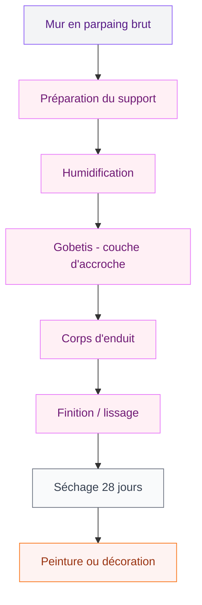
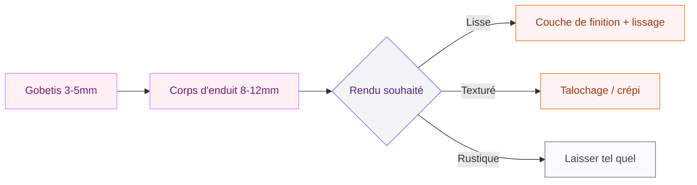

Tu as un mur en parpaing qui fait tache dans ta maison ou ton garage ? Ces blocs de béton gris, c'est pas vraiment le look qu'on vise quand on décore. La bonne nouvelle : avec un enduit bien appliqué, tu peux transformer ça en surface lisse et peinte, prête à accueillir n'importe quelle finition déco. Et contrairement à ce qu'on croit, c'est tout à fait faisable en DIY si tu prends le temps de bien préparer.

Je te donne ici tout ce qu'il faut savoir, du choix de l'enduit jusqu'à la finition, étape par étape.

## Pourquoi enduire ses parpaings ?

Le parpaing brut, c'est poreux, irrégulier, et pas du tout étanche. L'enduit joue plusieurs rôles à la fois : il protège le mur contre l'humidité et les infiltrations, corrige les défauts de planéité (les joints en creux, les petits décalages entre blocs), et prépare la surface pour recevoir une peinture ou un enduit décoratif.

  

Pour un mur extérieur, c'est aussi une protection contre les intempéries. Pour un mur intérieur, ça permet d'obtenir une surface lisse sur laquelle tu pourras peindre, poser du papier peint ou appliquer un [enduit décoratif type crépi](https://www.cristallina.fr/crepir-un-mur-interieur/).

Les parpaings de béton sont classés Rt3 (résistance à l'arrachement élevée), ce qui signifie que tous les types d'enduits - OC1, OC2, OC3 - sont compatibles. Tu as donc le choix.

## Choisir le bon enduit

Avant d'acheter quoi que ce soit, il faut identifier ton support et l'usage du mur.

  

**Enduit ciment (OC3)** : le plus résistant, idéal pour les murs extérieurs ou les pièces humides (cave, garage, sous-sol). Il résiste bien aux chocs et à l'eau. Chez Brico Dépôt, un sac de 25 kg coûte autour de 8-12€, ce qui en fait l'option la plus économique.

**Enduit chaux-ciment (OC2)** : un bon compromis pour les murs extérieurs exposés. Plus souple que le ciment pur, il respire mieux et craint moins les fissures dues aux variations de température. Compte 12-18€ le sac de 25 kg.

**Enduit gypse/plâtre (OC1)** : uniquement pour l'intérieur, hors pièces humides. Il sèche plus vite et se travaille plus facilement. C'est le choix standard pour les murs intérieurs en parpaing avant peinture. Environ 10-15€ le sac de 25 kg chez Leroy Merlin ou Castorama.

**Enduit prêt à l'emploi** : plus cher (20-30€ le seau de 15 kg), mais plus simple à utiliser pour les petites surfaces ou les débutants.

> [!TIP]
> Pour calculer la quantité, compte environ 15 kg d'enduit par m² pour une épaisseur de 10 mm. Une couche d'enduit sur parpaing fait généralement entre 10 et 15 mm au total (en plusieurs passes). Prends toujours 10-15% de marge.

## Le matériel nécessaire

Pas besoin d'investir une fortune. Voici l'essentiel :

  

- Taloche (en plastique ou en bois) et platoir pour étaler
- Truelle et lisseuse
- Règle de maçon pour dresser l'enduit
- Seau et malaxeur (ou perceuse avec fouet)
- Pinceau large pour mouiller le support
- Brosses métalliques et spatule pour le nettoyage
- Lunettes de protection et gants

Pour les grandes surfaces, un projeté mécanisé (à la machine à enduire) est possible, mais ça demande du matériel que tu peux louer - et un peu d'entraînement.

## Étape 1 : préparer le support

C'est l'étape que tout le monde a envie de zapper pour aller plus vite. Mauvaise idée.

  

Un enduit posé sur un support mal préparé va se fissurer ou se décoller dans les mois qui suivent. Donc on prend le temps.

**Nettoie le mur** : brosse métallique sur les zones friables, retire les éclats de mortier qui dépassent, les traces de gras ou de peinture. Si le mur a des trous ou des joints creux, rebouche-les avec un mortier de réparation.

**Vérifie la planéité** : une règle de maçon te permet de repérer les creux et les bosses. Pour un écart de plus de 20 mm, il faudra poser des repères (baguettes ou plots de mortier) pour guider l'épaisseur de ta couche.

**Mouille le mur** : avant chaque couche, humidifie le parpaing à l'eau propre avec un pinceau large ou un pulvérisateur. Le parpaing est très absorbant - s'il est sec, il va pomper l'eau de ton enduit trop vite et l'empêcher de bien adhérer. Le support doit être "saturé en surface sans être ruisselant".

> [!WARNING]
> N'applique jamais d'enduit sur un mur gelé ou en plein soleil. En dessous de 5°C, le mortier ne fait pas sa prise correctement. En plein été, humidifie encore plus et travaille tôt le matin pour éviter le séchage trop rapide.

## Étape 2 : le gobetis (couche d'accroche)

Le gobetis, c'est la première couche fine et granuleuse qu'on projette sur le mur. Son rôle : créer une rugosité pour que le corps d'enduit accroche bien.

  

Tu prépares un mélange assez fluide - plus liquide que la pâte à crêpes mais moins que de l'eau - et tu le projettes en gestes vifs à la truelle ou au balai. L'idée n'est pas de couvrir uniformément mais de créer des éclaboussures qui vont former des "plots d'accroche".

Épaisseur : 3 à 5 mm maximum.

Laisse sécher 24 à 48h avant la couche suivante. Le gobetis doit être ferme mais pas encore complètement dur.

## Étape 3 : le corps d'enduit

C'est la couche principale. Elle apporte l'épaisseur et corrige les défauts de planéité.

Prépare ton mortier selon les proportions du fabricant (en général 1 volume de ciment pour 3 volumes de sable fin, ou suis les instructions du sac si tu utilises un enduit prêt à doser). La consistance doit être celle d'une crème épaisse - elle tient sur la truelle sans couler.

**Application** : charge la taloche et applique l'enduit par plaques en appuyant bien, du bas vers le haut. Répartis en couches de 8 à 12 mm. Puis dresse avec la règle de maçon : tu poses la règle à plat sur les repères (ou les bords du mur) et tu la fais glisser en zigzag pour égaliser. Rabats l'excédent et remplis les creux.

Une couche de corps d'enduit peut être suffisante si tu vises un rendu rustique ou un crépi texturé. Pour un rendu lisse, il faudra une couche de finition.

**Conseil** : si tu dois t'arrêter et reprendre le lendemain, crée un arrêt net en biseau. Un raccord "à plat" se verra toujours.

> [!TIP]
> Pour les grands murs, pose des baguettes de repère verticales (appelées "ébrasements" ou "phares") fixées au mortier, espacées de 1,5 à 2 m. Tu les utilises comme guides pour la règle. Chez Leroy Merlin, les baguettes alu coûtent 2-3€ l'unité.

## Étape 4 : la couche de finition

Pour un rendu lisse, tu appliques une dernière couche fine (3 à 5 mm) avec un enduit de finition - soit un enduit de finition lisse prêt à l'emploi, soit de la barbotine (mélange très fluide du même enduit).

Pendant que cette couche est encore fraîche, tu lisses avec la lisseuse (une taloche mousse humide fonctionne très bien). Tu travailles par cercles puis tu lisses dans un seul sens. Si des petites bulles apparaissent, humidifie légèrement.

Pour un rendu texturé style crépi, tu travailles la surface avec une taloche rustique en bois ou en éponge pendant que l'enduit est encore frais. Tu obtiendras une texture proche de ce qu'on voit sur les murs extérieurs.

Si tu envisages de [recouvrir le parpaing avec une autre méthode](https://www.cristallina.fr/recouvrir-parpaings/), comme du lambris ou des panneaux, l'enduit n'est pas toujours obligatoire - mais il reste une bonne base.

## Le séchage : la patience qui paie

Un enduit ciment a besoin de 28 jours pour atteindre sa résistance maximale. Pendant cette période, il faut protéger le mur du soleil direct, du vent fort et du gel.

Les 3 premiers jours sont les plus délicats : humidifie légèrement le mur une à deux fois par jour pour éviter un séchage trop rapide qui provoquerait des fissures. C'est ce qu'on appelle la "cure" de l'enduit.

Tu peux peindre à partir de 2 à 4 semaines selon les conditions. Pour un enduit plâtre intérieur, le délai est plus court : 1 à 2 semaines suffisent.

## Les erreurs classiques à éviter

**Trop d'eau dans le mélange** : un mortier trop liquide coule, ne tient pas sur le mur et sera moins résistant une fois sec. Respecte les proportions.

**Couches trop épaisses d'un coup** : au-delà de 15 mm en une seule passe, le risque de fissures augmente. Vaut mieux deux passes fines.

**Appliquer sur un mur mouillé en surface mais sec en profondeur** : humidifie progressivement pour que l'eau pénètre bien dans les blocs.

**Oublier les arrêts de rive** : aux angles, fenêtres et portes, pose des baguettes d'angle métalliques ou PVC pour des arêtes nettes et durables.

> [!CAUTION]
> Si tu remarques des efflorescences blanches (dépôts salins) sur tes parpaings, traite-les d'abord avec un produit anti-efflorescence avant d'enduire. Sinon, ces sels remonteront à travers l'enduit et feront des cloques ou des taches blanches après quelques mois.

## Après l'enduit : quelles finitions ?

Une fois le mur enduit et sec, les possibilités sont nombreuses.

**Peinture minérale ou acrylique** : c'est la finition la plus simple. Une peinture spéciale murs extérieurs pour l'extérieur, ou une peinture acrylique classique pour l'intérieur. Deux couches suffisent sur un enduit lisse.

**Enduit décoratif** : béton ciré, stuc vénitien, enduit taloché... Ces finitions se posent sur l'enduit de base et apportent un cachet particulier. Si tu aimes le rendu brut et industriel, le béton ciré sur parpaing enduit, c'est vraiment très beau.

**Carrelage ou faïence** : l'enduit sert alors de sous-couche. Vérifie que l'épaisseur est régulière et que la surface est bien plane avant de coller.

Si tu as un [parquet taché par des projections de mortier pendant les travaux](https://www.cristallina.fr/parquet-tache/), traite ça dès que possible avant que le mortier durcisse complètement.

## Budget récapitulatif

Pour un mur de 20 m² à enduire en 3 couches :

- Enduit ciment 3 sacs de 25 kg : 25-35€
- Sable (si mélange maison) : 5-10€
- Baguettes d'angle : 10-15€
- Outillage (si achat) : 30-50€

**Total matériaux : 70-110€** pour 20 m², soit 3,5 à 5,5€ par m². À comparer avec un tarif d'artisan qui tourne autour de 25-40€/m² pose comprise.

Le DIY est vraiment rentable ici, surtout si tu as plusieurs murs à traiter.

> [!IMPORTANT]
> Pour un mur extérieur, pense à vérifier si tu as besoin d'un enduit hydraulique certifié (DTU 26.1). Pour une maison individuelle en auto-rénovation, ce n'est pas obligatoire, mais ça garantit une meilleure durabilité face aux intempéries.

## Sur le meme theme

- [crépir un mur intérieur](/crepir-un-mur-interieur/)
- [pistolet à calfeutrer](/pistolet-a-calfeutrer/)
- [isolation dalle béton](/isolation-dune-dalle-en-beton-techniques-options-disolation-et-cout/)
- [comment recouvrir des parpaings](/recouvrir-parpaings/)
- [peindre du lino](/peindre-lino/)

## Questions fréquentes

**Peut-on enduire un mur en parpaing directement avec du plâtre ?**
Oui, pour l'intérieur uniquement. Le plâtre adhère bien sur les parpaings. Pose quand même une couche d'accroche (gobetis ou enduit d'accroche) pour éviter les décollements.

**Combien de temps faut-il pour enduire 10 m² ?**
En comptant la préparation, l'application en 2 couches et le nettoyage, prévois une journée complète pour un débutant. Un maçon expérimenté fait ça en 2-3 heures.

**Peut-on enduire sur une peinture existante ?**
C'est déconseillé. La peinture forme une barrière qui empêche l'enduit d'adhérer correctement. Il faut décaper ou au minimum utiliser un primaire d'adhérence.

**Faut-il un professionnel pour enduire un mur en parpaing ?**
Pas obligatoirement. Un mur intérieur simple est tout à fait accessible en DIY. Pour un mur extérieur ou de grandes surfaces, un pro sera plus rapide et plus régulier, mais le résultat DIY peut être très correct avec de la méthode.
