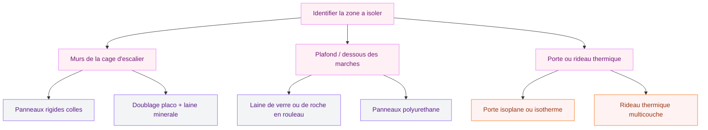
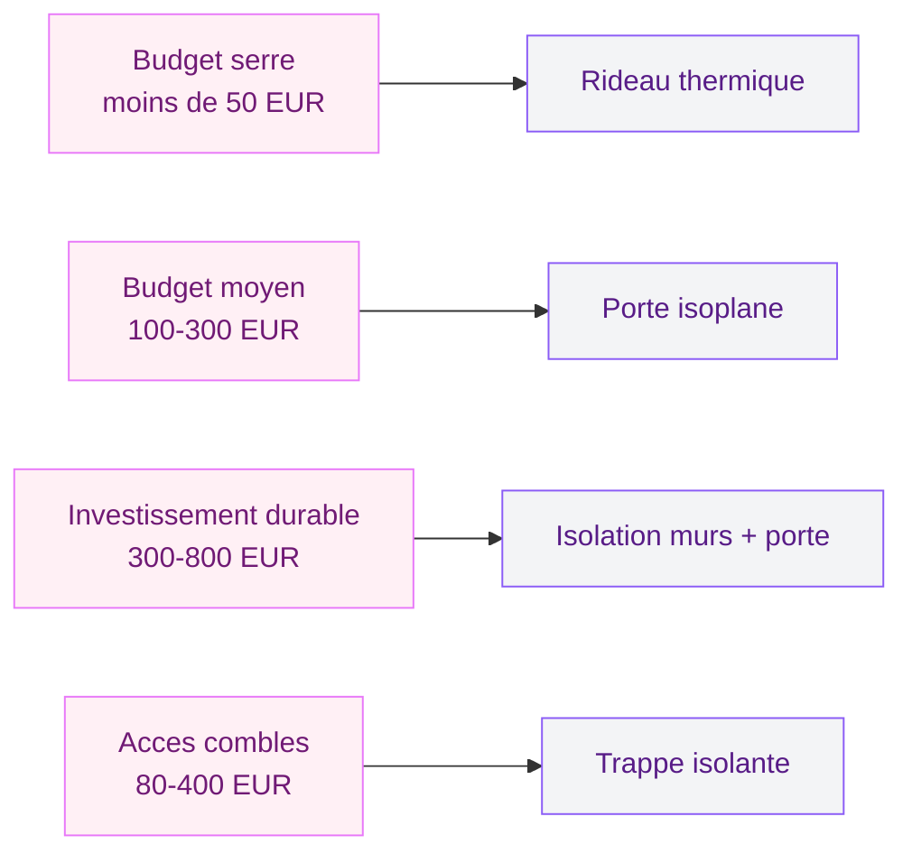

# Comment isoler une montée d'escalier : stop aux courants d'air

Tu as beau monter le chauffage, ton salon reste froid et ta facture d'énergie grimpe ? Il y a de fortes chances que ta montée d'escalier soit la coupable. C'est un vrai "tuyau à air" : la chaleur monte naturellement vers l'étage et l'air froid descend. Résultat, tu chauffes pour rien.

Bonne nouvelle : isoler une montée d'escalier, ce n'est pas un chantier titanesque. Avec les bonnes solutions - une porte, un rideau thermique, des panneaux isolants - tu peux réduire les pertes de chaleur de 10 à 15 % et gagner 2 à 3 degrés dans ton salon. Je t'explique tout, solution par solution, avec les prix et les marques qui valent le coup.

## Pourquoi ta montée d'escalier te fait perdre de la chaleur

La physique est simple : l'air chaud est plus léger, donc il monte. Ta montée d'escalier fonctionne comme une cheminée ouverte. L'air chaud du rez-de-chaussée file vers l'étage, et l'air froid du haut (surtout si tes combles ou ta chambre sont moins chauffés) redescend. C'est ce qu'on appelle l'effet de tirage.

Les conséquences sont directes :

- **Inconfort au rez-de-chaussée** : courants d'air et sensation de froid près de l'escalier
- **Surchauffe à l'étage** : tes chambres reçoivent toute la chaleur qui devrait rester en bas
- **Facture de chauffage gonflée** : tu compenses en augmentant le thermostat, pour un résultat moyen
- **Bruit** : les sons circulent aussi bien que l'air dans une cage d'escalier ouverte

> [!NOTE]
> Une montée d'escalier non isolée, c'est l'équivalent d'une fenêtre ouverte en permanence. L'ADEME estime que les déperditions par les ponts thermiques intérieurs représentent jusqu'à 10 % des pertes totales d'un logement.

## Solution 1 : installer une porte en haut ou en bas de l'escalier

C'est la méthode la plus efficace pour couper la circulation d'air. Une porte pleine crée une vraie barrière thermique et phonique entre les deux niveaux.

### Où la placer ?

- **En bas de l'escalier** : tu protèges le salon et tu emprisonnes la chaleur au rez-de-chaussée. C'est le choix idéal si tu passes tes soirées en bas.
- **En haut de l'escalier** : tu isoles l'étage et tu évites de chauffer les chambres en journée. Pratique si tu dors la fenêtre ouverte.
- **Les deux** : la solution royale, mais pas toujours possible selon la configuration.

### Quel type de porte choisir ?

| Type de porte | Prix moyen | Isolation thermique | Isolation phonique |
|---|---|---|---|
| Porte pleine isoplane | 80-200 EUR | Bonne | Correcte |
| Porte isotherme (type cave) | 150-350 EUR | Très bonne | Bonne |
| Porte vitrée double vitrage | 300-600 EUR | Bonne | Bonne |
| Porte coulissante galandage | 400-900 EUR (pose comprise) | Moyenne | Moyenne |

Pour un bon rapport qualité-prix, je te recommande une porte isoplane chez Lapeyre (à partir de 120 EUR) ou une porte isotherme Bloc-porte chez Leroy Merlin (environ 180 EUR). Si tu veux garder la luminosité, une porte vitrée avec double vitrage reste une bonne option, mais le budget monte vite.

> [!TIP]
> Ajoute un joint d'étanchéité en silicone ou en mousse sur le cadre de ta porte (3-8 EUR chez Castorama). Ça fait toute la différence sur les infiltrations d'air et ça se pose en 10 minutes.

### Pose par un pro ou DIY ?

La pose d'une porte battante classique est accessible si tu as un peu de matériel. Compte 2 à 3 heures pour un bricoleur moyen. Pour une porte à galandage, fais appel à un menuisier : il faudra créer une cloison, et les erreurs coûtent cher. Budget pose par un pro : 150 à 400 EUR selon la complexité.

## Solution 2 : poser un rideau thermique isolant

Si tu ne peux pas ou ne veux pas installer une porte (escalier ouvert, budget serré, locataire), le rideau thermique est ton meilleur allié. C'est moins performant qu'une porte, mais ça coupe déjà bien les courants d'air et c'est réversible.

### Comment bien le choisir ?

Tous les rideaux ne se valent pas. Pour une isolation réelle, il te faut un modèle avec doublure thermique (plusieurs couches de tissu, parfois avec une face argentée). Les rideaux classiques en voilage ne servent à rien ici.

Mes recommandations :

- **Moondream rideau thermique** : environ 60-90 EUR pour 140x260 cm, très efficace, existe en plusieurs coloris
- **Rideau isolant IKEA (modèle Hilleborg)** : 35-50 EUR, bon rapport qualité-prix
- **Rideau thermique Deconovo (Amazon)** : 25-40 EUR, correct pour un petit budget

Pour la tringle, prends un modèle costaud type tringle extensible en métal (15-30 EUR) plutôt qu'une tringle à pression qui finira par tomber avec le poids du rideau.

> [!WARNING]
> Mesure bien la largeur de ton passage : le rideau doit dépasser de 10 à 15 cm de chaque côté pour éviter que l'air ne passe sur les bords. S'il est trop juste, l'isolation sera quasi nulle.

### Astuce double rideau

Pour les montées d'escalier très exposées (maison ancienne, courants d'air forts), tu peux installer deux rideaux : un en haut et un en bas. Le coût reste raisonnable (100-150 EUR au total) et l'effet est bluffant.

## Solution 3 : isoler les parois et le plafond de la cage d'escalier

Cette approche est plus technique mais aussi plus durable. L'idée est d'ajouter de l'isolant directement sur les murs, le plafond ou sous les marches pour réduire les échanges thermiques.

### Isoler les murs de la cage d'escalier

Deux options principales :

- **Panneaux rigides collés** (polyuréthane ou polystyrène extrudé) : entre 15 et 30 EUR/m2 matériau seul. Tu les colles directement sur le mur avec un mortier-colle. Épaisseur recommandée : 4 à 6 cm. C'est la solution la plus simple en DIY.
- **Doublage placo + laine minérale** : plus performant (isolation thermique et phonique), mais ça demande de monter une ossature métallique. Budget : 25-45 EUR/m2 pose comprise par un plaquiste.

Si ta cage d'escalier donne sur un mur extérieur ou un espace non chauffé (garage, cave), c'est là que l'isolation murale est la plus rentable.

### Isoler sous les marches

Si ton escalier donne sur une cave ou un garage, isoler le dessous des marches est très efficace. La méthode la plus courante : fixer des panneaux de laine de roche ou de polyuréthane (type Efisol TH38, environ 12-20 EUR/m2) sous la volée d'escalier, puis recouvrir avec un parement si tu veux un rendu propre.

Pour les escaliers en bois, tu peux aussi ajouter un isolant mince multicouche (type Triso-Super 12, environ 15 EUR/m2) qui se fixe avec des agrafes. C'est moins performant qu'un isolant classique, mais ça prend peu de place.

## Solution 4 : fermer la trémie avec un panneau ou une trappe

Si ton escalier débouche sur des combles ou un grenier, la trémie (l'ouverture dans le plancher) est un gouffre thermique. Installer une trappe isolante ou un panneau amovible peut faire une différence énorme.

Tu trouves des trappes isolantes prêtes à poser chez Leroy Merlin ou Brico Dépôt entre 80 et 200 EUR. Pour un modèle sur mesure, compte 200-400 EUR. L'avantage : ça se pose en une heure et ça coupe complètement le pont thermique.

> [!IMPORTANT]
> Si tu fermes la trémie vers les combles, vérifie que la ventilation de tes combles reste correcte. Un espace confiné sans aération peut provoquer des problèmes d'humidité et de condensation. Garde au moins une VMC ou des chatières de ventilation.

## Comparatif des solutions : laquelle choisir ?

Mon conseil : commence par le rideau thermique si tu es locataire ou si tu veux tester l'impact avant d'investir. Tu sentiras la différence en quelques heures. Si tu es propriétaire, la porte reste le meilleur investissement long terme. Et si ta montée d'escalier communique avec un espace non chauffé (cave, garage, combles), combine porte + isolation des parois pour un résultat optimal.

## Les erreurs à éviter quand tu isoles ta montée d'escalier

J'en vois souvent, et elles gâchent le résultat :

1. **Oublier les joints** : une porte sans joint d'étanchéité laisse passer autant d'air qu'un rideau bas de gamme. Investis 5 EUR dans un bon joint, ça change tout.
2. **Choisir un rideau trop fin** : un voilage ou un rideau décoratif classique n'isole pas. Il te faut une doublure thermique.
3. **Négliger le bas de porte** : l'air passe surtout par en dessous. Un bas de porte brosse ou en silicone (5-12 EUR) est obligatoire.
4. **Bloquer la ventilation** : isoler ne veut pas dire tout calfeutrer. Garde une ventilation correcte pour éviter la condensation, surtout dans les escaliers donnant sur des espaces humides.
5. **Sous-dimensionner le rideau** : s'il ne couvre pas toute l'ouverture avec un bon débord, l'air contourne l'obstacle.

## Combien ça coûte et quelles aides existent ?

Pour te donner une vue d'ensemble :

| Solution | Budget DIY | Budget avec pose pro |
|---|---|---|
| Rideau thermique | 30-90 EUR | - |
| Porte isoplane | 80-200 EUR | 250-500 EUR |
| Porte isotherme | 150-350 EUR | 300-700 EUR |
| Isolation murs (10 m2) | 150-300 EUR | 300-600 EUR |
| Trappe isolante | 80-200 EUR | 150-400 EUR |

Côté aides, l'isolation de la cage d'escalier peut entrer dans le cadre de MaPrimeRénov' si elle fait partie d'un projet de rénovation globale. En revanche, une simple porte ou un rideau ne sont pas éligibles seuls. Rapproche-toi de ton espace France Rénov' pour un diagnostic gratuit.

Si tu te lances dans l'isolation des murs de ta cage d'escalier, ça peut être l'occasion de revoir aussi [l'enduit de tes murs intérieurs](/guides/decoration/crepir-un-mur-interieur/) pour une finition impeccable. Et si ton escalier communique avec une cave aux murs en parpaings, jette un oeil à notre guide pour [recouvrir des parpaings de façon esthétique](/guides/decoration/recouvrir-parpaings/) - ça te donnera des idées pour combiner isolation et déco.

## Comment isoler un escalier en colimaçon ?

Les escaliers en colimaçon posent un défi supplémentaire : la forme ronde rend l'installation d'une porte classique compliquée. Voici les solutions qui fonctionnent :

- **Rideau thermique courbe** : utilise une tringle flexible ou un rail courbe (type rail de rideau de douche ajustable, 20-40 EUR) pour épouser la forme
- **Panneaux isolants découpés sur mesure** : colle des panneaux de polyuréthane directement sur le mur du fût central et la paroi extérieure
- **Store enrouleur thermique** : une alternative élégante au rideau, avec un mécanisme compact. Compte 60-120 EUR pour un modèle isolant chez Stores Discount ou MadeInStore

Pour un escalier en colimaçon, le rideau reste la solution la plus simple et réversible. L'isolation des parois autour du fût est un plus si ton escalier traverse un espace non chauffé.

Pour l'ambiance de ton entrée et de ta cage d'escalier, pense aussi au [choix d'un bon éclairage](/guides/decoration/decoration-marocaine-moderne-ou-classique/) - une montée d'escalier bien isolée et joliment éclairée, c'est un vrai gain de confort au quotidien. Et si tu cherches à optimiser le chauffage de la pièce en contrebas, découvre notre comparatif des [poêles à granulés suspendus](/guides/decoration/poele-a-granules-suspendu/) qui s'intègrent parfaitement dans un salon ouvert.

> [!TIP]
> Avant de te lancer, fais le test de la bougie : allume une bougie en bas et en haut de ton escalier. Si la flamme vacille fort, c'est que le courant d'air est important et qu'une isolation fera vraiment la différence. C'est simple et ça te motive à passer à l'action !

## Sur le meme theme

- [peindre du lino](/guides/decoration/peindre-lino/)

## FAQ

### Est-ce que je peux isoler ma montée d'escalier moi-même ?

Oui, la plupart des solutions (rideau thermique, porte battante, panneaux collés) sont accessibles en DIY. Seule la porte à galandage ou le doublage placo nécessitent un pro si tu n'as pas l'habitude. Budget DIY : 30 à 300 EUR selon la solution choisie.

### Quelle est la solution la plus efficace pour isoler un escalier ?

La combinaison porte pleine + isolation des parois donne les meilleurs résultats. Une porte seule coupe déjà 60 à 70 % des échanges d'air. Ajoute des panneaux isolants sur les murs et tu gagnes encore 15 à 20 % de performance.

### Un rideau thermique suffit-il pour isoler un escalier ?

Un bon rideau thermique (doublure multicouche, largeur suffisante) réduit les courants d'air de 40 à 50 %. C'est un bon début, surtout si tu es locataire ou que ton budget est limité. Pour une isolation complète, combine-le avec un bas de porte et des joints sur les encadrements proches.
