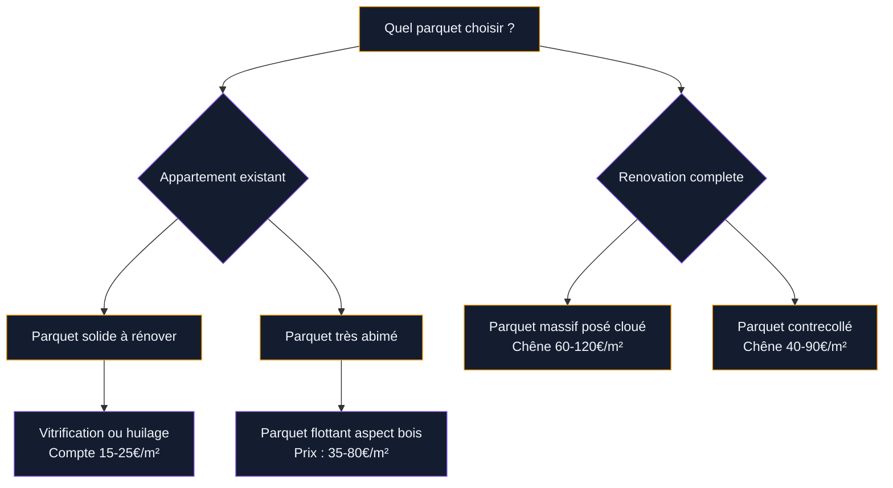
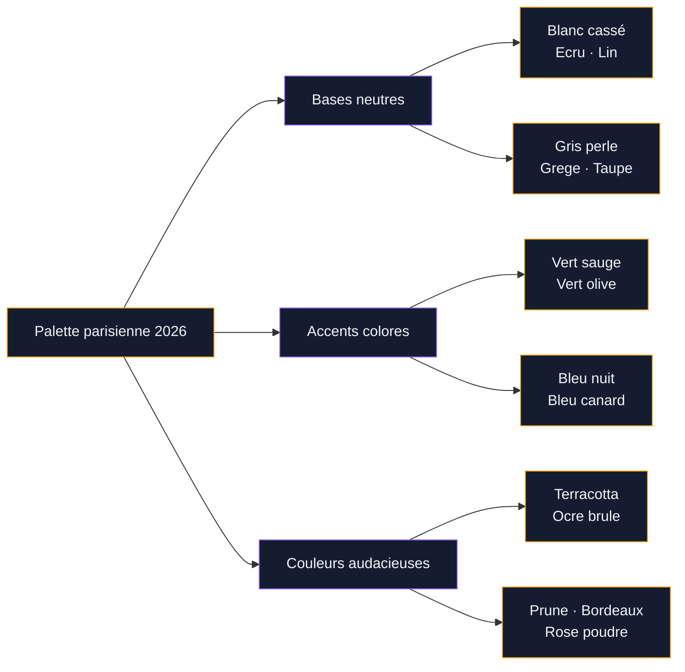

Le style parisien, c'est cette façon un peu magique de mélanger l'ancien et le moderne sans que rien ne semble forcé. Un parquet en chevrons sous une console design, des moulures Haussmann repeintes en blanc cassé devant une bibliothèque industrielle, un canapé en velours face à une table basse scandinave... C'est exactement ce que les magazines de déco appellent "effortless chic" - et pourtant, il y a une vraie logique derrière.

Si tu vis dans un appartement parisien classique ou si tu veux simplement t'inspirer de ce style reconnaissable partout dans le monde, ce guide est fait pour toi. On va parler matières, couleurs, mobilier et petits détails qui font toute la différence.

## Comprendre les codes du style parisien moderne

Le style parisien ne cherche pas la perfection. C'est même ce qui le rend si attachant : les murs ne sont pas forcément impeccables, le mobilier mélange les époques, et ça marche. Cette liberté repose malgré tout sur quelques principes que les Parisiennes appliquent instinctivement.

  

**La règle des trois époques** : dans une pièce réussie selon ce style, tu trouveras toujours du mobilier ancien (ou avec une patine), du mobilier contemporain et au moins un élément vintage ou récupéré. Pas de tout-matching, pas de tout-neuf.

**La palette sobre avec une touche de caractère** : blanc, ecru, gris perle, taupe, anthracite. Sur cette base neutre, on pose une ou deux touches de couleur - un bleu nuit profond, un vert sauge, un terracotta discret.

**Les matières nobles et imparfaites** : marbre légèrement veiné, bois avec des noeuds, lin froissé, velours côtelé. Le trop-lisse est proscrit.

> [!TIP]
> L'astuce clé du style parisien : chaque pièce doit raconter une histoire. Avant d'acheter quoi que ce soit, demande-toi d'abord ce qui te plait vraiment chez un objet, pas ce qui est tendance.

## L'architecture intérieure : exploiter les moulures et les volumes

Si ton appartement a des moulures, des corniches, des rosaces ou des boiseries, c'est une mine d'or. Ces éléments architecturaux sont la signature des appartements parisiens classiques - et ils s'associent parfaitement avec une déco contemporaine à condition de les traiter correctement.

  

### Peindre les moulures : la méthode Haussmann actualisée

L'erreur la plus courante : laisser les moulures en blanc pur sur des murs blancs. Résultat : tout se noie, on ne voit rien. Les options qui fonctionnent vraiment :

- **Moulures blanc cassé (type Farrow & Ball "All White" ou "Pointing") sur mur de couleur** : le contraste doux met en valeur le relief sans être criard
- **Moulures dans le même ton que le mur mais avec un fini différent** : mat pour le mur, satiné pour les moulures. La lumière fait le travail
- **Moulures peintes dans une couleur franche** : bleu nuit, vert anglais, terracotta. Très parisien et très affirmé

Pour un résultat pro, Farrow & Ball reste la référence (39 € le litre environ), mais Little Greene propose des équivalents très proches à 28-32 € le litre. La marque française Ressource a aussi d'excellentes teintes dans sa gamme "Architecte".

### Quand l'appartement manque de caractère architectural

Tu habites dans un appartement des années 70-80 avec des plafonds bas et des murs nus ? Pas de panique. Le style parisien peut fonctionner sans héritage Haussmannien :

- Installer des moulures rapportées (Orac Decor propose des profils très convaincants, entre 15 et 45 € le mètre selon le modèle)
- Créer une tête de lit en lambris peint
- Poser un soubassement en partie basse des murs

> [!NOTE]
> Les moulures Orac Decor s'installent à la colle, sans travaux lourds. Compte 2 à 3 heures pour une pièce standard et un résultat bluffant une fois peint.

## Le parquet : pilier du style parisien

Difficile d'imaginer un intérieur parisien sans parquet. Le point Hongrie et le chevron sont les deux motifs traditionnels, mais ils ne sont pas les seuls qui fonctionnent.

  

Pour un parquet existant en mauvais état, plusieurs solutions avant de tout changer. Si tu as un [parquet taché](/guides/decoration/parquet-tache/) ou abimé, il est souvent possible de le poncer et de le retravailler plutôt que de le remplacer entièrement - une économie substantielle.

### Les finitions qui font le style

Le parquet parisien n'est jamais trop brillant. Les finitions tendance :

- **Huile naturelle** : aspect mat et chaleureux, révèle le grain du bois. Marques Rubio Monocoat (35-50 €/litre) ou Bona (25-40 €/litre)
- **Vitrification mate ou satinée** : plus résistante à l'entretien, choisir du 30% ou 40% de brillance maximum
- **Parquet blanchi** : très parisien, donne de la lumière. Le bois est décapé puis teinté blanc ou gris clair

## Les couleurs qui définissent le style parisien en 2026

Le style parisien a évolué. La palette traditionnelle blanc/bois/beige reste une base, mais les intérieurs les plus inspirants d'aujourd'hui osent davantage. Si tu cherches des idées précises pour tes murs, les [couleurs du salon 2026](/guides/decoration/couleurs-du-salon-2026-palettes-de-murs-et-de-decors/) donnent un aperçu des tendances actuelles qui s'intègrent parfaitement dans cet univers.

  

### Oser la couleur comme une vraie Parisienne

Le secret, c'est de choisir une seule couleur forte et de la décliner sur plusieurs surfaces plutôt que de multiplier les teintes. Un appartement avec un salon en vert anglais profond (murs + boiseries) et tout le reste en blanc et bois naturel est infiniment plus cohérent qu'un appartement avec cinq couleurs différentes.

Les teintes qui marchent vraiment en 2026 :

| Couleur | Marque et référence | Prix indicatif |
|---|---|---|
| Vert de Sauge | Farrow & Ball "Mizzle" | 52 €/litre |
| Bleu nuit | Little Greene "Hague Blue" | 34 €/litre |
| Terracotta chaleureux | Ressource "Tuscane" | 38 €/litre |
| Prune discret | Farrow & Ball "Brassica" | 52 €/litre |
| Vert olive | Benjamin Moore "Rosemary Sprig" | 45 €/litre |

## Le mobilier : mélanger les époques avec naturel

C'est là que le style parisien se distingue vraiment de tous les styles "thème". Il n'y a pas de liste de meubles à acheter en un seul endroit. L'authenticité vient du mélange.

  

### La structure de base

**Le canapé** : c'est la pièce maîtresse. Dans un appartement parisien, il est souvent en velours (bleu, vert, rose poudre, terracotta), en lin naturel ou en cuir patiné. Les marques accessibles qui tiennent la route : Maisons du Monde (canapé Bobochic reversible en velours, autour de 800-1200 €), La Redoute Intérieurs (gamme "Saaga" en lin, 600-900 €), ou les trouvailles de seconde main sur Selency ou Vide Dressing.

**La table basse** : souvent en matériau brut - marbre, bois massif, rotin, verre teinté. Éviter le stratifié brillant et le chrome trop lisse. IKEA a quelques basiques (table "Listerby" en chêne plaqué à 149 €) à personnaliser, ou chercher une table vintage en marbre chez les brocanteurs (100-300 € en province, un peu plus à Paris).

**La bibliothèque** : dans le style parisien, la bibliothèque est presque un élément architectural. Elle peut occuper un mur entier. La référence accessible reste la série "Billy" d'IKEA rehaussée avec des façades "Semikolon" de chez Superfront (35-65 € la façade) pour un résultat beaucoup plus haut de gamme.

> [!TIP]
> Avant d'acheter du neuf, passe une heure sur Selency, Le Bon Coin ou Emmaüs. Le mobilier des années 50-70 - fauteuils "oreilles", consoles en rotin, buffets scandinaves en teck - s'intègre parfaitement dans le style parisien et coûte souvent 3 à 5 fois moins cher que son équivalent neuf "inspiré vintage".

### Les accessoires et objets qui font le style

Le style parisien, c'est aussi l'accumulation intelligente de petits objets chargés de sens :

- **Les livres disposés partout** : sur les étagères bien sûr, mais aussi empilés sur la table basse, posés sur un radiateur, glissés sous une lampe
- **Les plantes en pots en terre cuite ou cache-pots en céramique artisanale** : le caoutchouc, le pothos, le monstera et les figuiers lyrata sont les classiques
- **Les textiles en lin et coton lavé** : rideaux longs jusqu'au plafond (et non raccourcis à la fenêtre), plaids jetés naturellement sur le canapé
- **Les lampes à abat-jour** : bannir les spots encastrés comme unique source de lumière. Le style parisien joue avec les zones d'ombre et de lumière chaude

## La salle de bain et la cuisine : deux pièces souvent négligées

Beaucoup de gens s'arrêtent au salon et à la chambre. Or, une cuisine et une salle de bain dans l'esprit parisien changent vraiment la perception globale de l'appartement.

### La cuisine parisienne en 2026

La tendance est aux façades en bois teint naturel, aux plans de travail en marbre ou en pierre reconstituée, et aux crédences en carrelage métro blanc ou en zellige. L'inox brossé pour les robinetteries et les petits électroménagers remplace le chrome poli.

Quelques repères de prix pour une cuisine rénovée dans ce style :
- Façades IKEA "Axstad" + pieds ajustables : 1500-3000 € selon la surface
- Carrelage métro blanc (La Plateforme du Bâtiment) : 15-25 €/m²
- Zellige marocain artisanal : 60-120 €/m² selon la provenance
- Robinetterie Grohe "Eurosmart" en inox : 120-180 €

### La salle de bain style appartement haussmannien

Quelques éléments suffisent à transformer une salle de bain banale :
- Miroir rond ou ovale à bords biseautés (IKEA "Hovet" à 99 €, ou version laiton chez H&M Home autour de 79 €)
- Vasque à poser en céramique blanche ou en marbre blanc
- Robinetterie en laiton brossé ou vieilli (Hansgrohe "Axor" ou Grohe "Atrio", 150-350 € la robinetterie)
- Panier en rotin ou en osier pour les serviettes
- Sol en carrelage hexagonal blanc ou en marbre Carrare (60-150 €/m²)

> [!WARNING]
> Méfie-toi des "kits salle de bain style parisien" vendus sur certains sites. Les éléments bon marché en faux laiton ternissent très vite. Mieux vaut investir dans deux ou trois vrais accessoires de qualité plutôt que remplir la pièce de détails qui vieillissent mal.

## Le style parisien se marie avec d'autres univers

Une des forces du style parisien, c'est sa capacité à s'hybrider. Il fonctionne avec la déco scandinave (la neutralité des deux styles se complète bien), avec la déco japonaise (wabi-sabi + patine parisienne = beaucoup de raffinement), mais aussi avec des touches plus romantiques.

Si tu aimes les intérieurs chargés d'histoire avec des détails floraux et des matières luxueuses, la [décoration française romantique](/guides/decoration/decoration-francaise-idees-et-photos-romantiques/) peut te donner des idées à intégrer dans ta version du style parisien. Le résultat est souvent plus personnel et plus chaleureux.

Pour aller plus loin dans les exemples concrets et les photos d'inspiration, les [appartements modernes](/guides/decoration/appartements-modernes-60-photos-et-conseils-de-decoration/) donnent une bonne vue d'ensemble des intérieurs contemporains qui s'inspirent de cette esthétique.

> [!IMPORTANT]
> Le style parisien n'est pas un style de magazine à reproduire à l'identique. Son charme vient précisément du fait qu'il reflète la personnalité de celui qui habite dans l'espace. Les "imperfections" - le mur pas tout à fait impeccable, le meuble dépareillé qui vient de chez ta grand-mère - sont des atouts, pas des défauts.

## Budget : ce qu'on peut faire à différents niveaux

Il n'est pas nécessaire de tout rénover d'un coup pour obtenir un résultat parisien. Voici comment prioriser selon ton budget :

**Budget 500-1000 €** : repeindre les murs dans une belle teinte (200-400 €), changer les abat-jours et ajouter deux lampes de sol (100-200 €), investir dans de beaux textiles - rideaux longs en lin (80-150 €), un plaid de qualité (40-80 €).

**Budget 1500-3000 €** : ajouter les éléments ci-dessus plus un beau canapé d'occasion ou une pièce de mobilier vintage, rénover le parquet si nécessaire, installer des moulures rapportées dans la pièce principale.

**Budget 5000 € et plus** : rénovation complète d'une pièce ou deux, parquet massif, peintures haut de gamme, mobilier mixte neuf/vintage de qualité.

La clé dans tous les cas : acheter moins mais mieux. Une belle lampe en laiton à 180 € aura plus d'impact que cinq accessoires décoratifs à 30 € chacun.

## Sur le meme theme

- [décoration dorée](/guides/decoration/decoration-doree-sur-les-murs-les-meubles-ou-les-accessoires/)

## Les erreurs à ne pas faire

Pour finir, les pièges classiques quand on veut adopter ce style :

- **Tout assortir** : les sets de meubles vendus ensemble donnent un résultat trop uniforme, à l'opposé de l'esprit parisien
- **Les fausses matières trop lisses** : le marbre effet plastique, le "bois" en PVC ou le "laiton" qui ternit en deux mois cassent complètement l'ambiance
- **Les spots encastrés comme seul éclairage** : ils aplatissent l'espace et suppriment le jeu d'ombres qui crée le charme des intérieurs parisiens
- **Les murs trop chargés** : la galerie de photos sympathique dans d'autres styles peut sembler désordonnée ici. Préférer peu d'objets, bien choisis, à beaucoup de petites choses
- **Oublier les plantes** : le vert des plantes est presque toujours présent dans les intérieurs parisiens - c'est lui qui apporte la vie

Le style parisien moderne, c'est finalement une manière d'habiter qui assume le temps qui passe, qui valorise ce qu'on a déjà et qui intègre le beau sans ostentation. C'est un style de vie autant qu'un style de déco - et ça, ça s'apprend en observant, en essayant et en faisant confiance à son propre goût.
