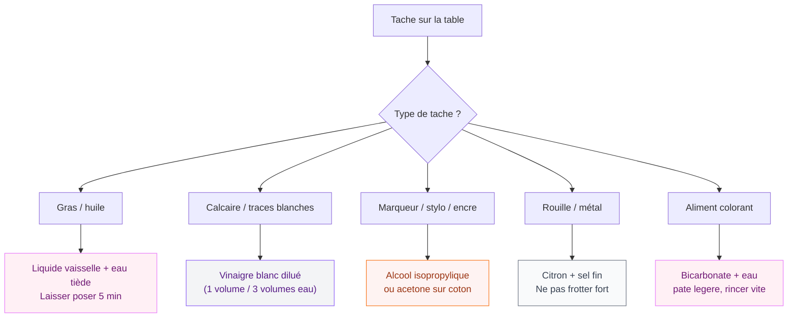

J'ai craqué pour une table en céramique il y a deux ans, attirée par ce look minimaliste et cette surface ultra-lisse. Et puis j'ai vite compris que "facile d'entretien" ne veut pas dire "on fait n'importe quoi". Quelques erreurs plus tard - une tentative de nettoyage avec de la crème à récurer dont on ne parlera plus - j'ai appris les bonnes méthodes. Je te partage tout ici pour que tu évites mes bêtises.

## Pourquoi la céramique demande un soin particulier

La céramique, c'est de l'argile cuite à très haute température, souvent recouverte d'un émail protecteur. Ce qui lui donne ce beau fini brillant ou satiné, c'est aussi ce qui peut être attaqué par des produits chimiques agressifs ou des abrasifs. La bonne nouvelle : elle est naturellement résistante aux rayures légères, à la chaleur et aux taches courantes. La mauvaise : une fois l'émail endommagé, il n'y a pas vraiment de retour en arrière.

<div class="my-8">
  
</div>


Autre point à avoir en tête : la plupart des tables en céramique ont un plateau en céramique posé sur une structure en bois, métal ou stratifié. Les bords et dessous peuvent donc avoir des règles d'entretien différentes. On se concentre ici sur la surface céramique elle-même.

> [!NOTE]
> La céramique résiste bien aux températures jusqu'à 200-300°C selon les marques - tu peux y poser une casserole chaude rapidement. Mais les chocs thermiques brutaux répétés (froid/chaud) peuvent fragiliser la surface sur le long terme.

## Le nettoyage quotidien : simple et rapide

Pour l'entretien de tous les jours, tu n'as besoin de presque rien. Voici ce que je fais systématiquement après chaque repas.

<div class="my-8">
  
</div>


### Les bons gestes au quotidien

**Ce qu'il te faut :**
- Un chiffon microfibre doux
- De l'eau tiède
- Une goutte de liquide vaisselle (Fairy, Sun ou n'importe quelle marque douce)

**La méthode :**

1. Commence par passer un coup sec avec le chiffon pour enlever les miettes et la poussière. Ce geste évite les micro-rayures que les particules pourraient causer si tu passes directement un chiffon humide dessus.
2. Humidifie légèrement ton chiffon avec de l'eau tiède. Bien essoré, pas trempé.
3. Si tu as des traces de gras ou de sauce, ajoute une petite goutte de liquide vaisselle.
4. Passe délicatement le chiffon en mouvements circulaires ou rectilignes.
5. Rince avec un chiffon propre humidifié à l'eau claire pour ne pas laisser de résidu de savon.
6. Sèche immédiatement avec un chiffon sec. C'est cette étape que tout le monde zappe - et pourtant c'est elle qui évite les traces blanches et les dépôts calcaires.

> [!TIP]
> Le chiffon microfibre Vileda ou E-Cloth (environ 5-8€ la pièce) est vraiment le meilleur allié de la céramique. Il attrape la saleté sans laisser de peluches et s'utilise avec très peu d'eau.

## Les taches difficiles : que faire selon le type

Même avec un entretien régulier, certaines taches résistent. Voici comment gérer chaque cas.

<div class="my-8">
  
</div>




### Taches grasses (huile, beurre, sauce)

Le liquide vaisselle suffit dans 90% des cas. Applique une petite quantité directement sur la tache, laisse poser 3 à 5 minutes, puis frotte doucement avec le côté doux d'une éponge (jamais le côté vert abrasif). Rince et sèche.

Si la tache a séché et est incrustée, un passage au nettoyant multi-surfaces type Mr. Propre dilué dans l'eau fera le travail.

### Traces blanches et dépôts calcaires

Chez moi, avec l'eau dure de Paris, c'était le problème numéro un. La solution : vinaigre blanc dilué. Mélange 1 volume de vinaigre pour 3 volumes d'eau, applique avec un chiffon, laisse agir 2-3 minutes. Rince bien et sèche. Le calcaire part tout seul.

Tu peux aussi utiliser un détartrant pour salle de bain type Cillit Bang Calcaire (attention à bien rincer après) ou le produit Starwax qui est spécifiquement conçu pour les surfaces vitrées et céramiques.

> [!WARNING]
> N'utilise jamais le vinaigre pur et concentré, ni l'acide chlorhydrique (présent dans certains détartrants). Ces produits peuvent attaquer l'émail sur le long terme. Toujours diluer, toujours rincer.

### Traces de marqueur, stylo ou encre

L'alcool à 70° (vendu en pharmacie, environ 2€) sur un coton suffit généralement. Pour les traces plus tenaces, un peu d'acétone (dissolvant à ongles sans colorant) fonctionne bien. Applique sur un coton, frotte doucement, rince rapidement à l'eau claire. L'acétone ne laisse pas de trace sur la céramique émaillée si tu rinces vite.

### Aliments colorants (café, thé, vin rouge, betterave)

Le bicarbonate de soude en pâte est ton ami. Mélange une cuillère à soupe de bicarbonate avec quelques gouttes d'eau pour obtenir une pâte molle. Applique sur la tache, laisse agir 5 minutes, puis frotte doucement avec le côté doux d'une éponge. Rince et sèche. Résultat impeccable sur le café et le thé.

Pour le vin rouge qui a séché, une éponge humide avec du liquide vaisselle concentré laissé à poser 10 minutes fait généralement l'affaire.

## Ce qu'il ne faut absolument pas faire

```mermaid
flowchart LR
    subgraph INTERDIT["A eviter absolument"]
        direction TB
        X1["Eponge abrasive\ncote vert/scotch-brite"]
        X2["Poudre a recurer\n(Vim, Ajax poudre)"]
        X3["Javel pure\nou concentree"]
        X4["Cutter / grattoir\nmetal"]
        X5["Acide chlorhydrique\n(certains deboucheurs)"]
    end

<div class="my-8">
  
</div>


    subgraph OK["Alternatives autorisees"]
        direction TB
        O1["Microfibre douce"]
        O2["Bicarbonate en pate douce"]
        O3["Javel diluee, rincer vite"]
        O4["Grattoir plastique\nspecial ceramique"]
        O5["Detartrant dilue\nbien rince"]
    end

    style X1 fill:#FEF3F2,stroke:#F97316,color:#9A3412
    style X2 fill:#FEF3F2,stroke:#F97316,color:#9A3412
    style X3 fill:#FEF3F2,stroke:#F97316,color:#9A3412
    style X4 fill:#FEF3F2,stroke:#F97316,color:#9A3412
    style X5 fill:#FEF3F2,stroke:#F97316,color:#9A3412
    style O1 fill:#FFF0F5,stroke:#E879F9,color:#701A75
    style O2 fill:#FFF0F5,stroke:#E879F9,color:#701A75
    style O3 fill:#FFF0F5,stroke:#E879F9,color:#701A75
    style O4 fill:#FFF0F5,stroke:#E879F9,color:#701A75
    style O5 fill:#FFF0F5,stroke:#E879F9,color:#701A75
```

**Les éponges abrasives** : le côté vert d'une éponge classique peut rayer l'émail. Utilise toujours le côté doux ou une microfibre.

**Les poudres récurantes** (Vim poudre, Ajax poudre) : même principe, les particules abrasives attaquent l'émail.

**La javel concentrée directement** : peut décolorer certaines céramiques teintées et est très agressive pour les joints si ta table en a. En dilution très faible (quelques gouttes dans un litre d'eau), elle peut être utilisée ponctuellement pour désinfecter, mais rince toujours abondamment après.

**Les grattoirs métalliques** : pour décoller une incruste sèche, beaucoup de gens prennent un couteau ou une spatule métallique. Mauvaise idée - ça raye l'émail. Préfère un grattoir en plastique pour vitrocéramique (disponible en supermarché, type Wpro ou Fackelmann, autour de 3€).

> [!CAUTION]
> Si tu utilises un nettoyant vapeur sur ta table, vérifie d'abord les préconisations du fabricant. Certaines tables en céramique ne supportent pas la vapeur sous pression sur les joints ou les bords.

## Entretien mensuel : redonner de l'éclat

Même en nettoyant régulièrement, une table en céramique peut ternir avec le temps à cause des micro-résidus de calcaire, de savon ou de gras. Un nettoyage plus profond une fois par mois suffit à lui redonner son éclat.

<div class="my-8">
  
</div>


### Nettoyage en profondeur

Commence par un nettoyage classique à l'eau tiède et liquide vaisselle. Laisse sécher complètement. Ensuite, tu as deux options :

**Option 1 - Nettoyant spécial céramique** : Des produits comme le Starwax Spécial Ceramique (environ 8€ en GSB) ou le Frank Fonner sont formulés pour nettoyer sans abîmer l'émail. Suis les instructions sur le flacon, en général application + frottage doux + rinçage.

**Option 2 - Méthode naturelle** : Prépare un mélange avec un verre d'eau tiède, une cuillère à soupe de vinaigre blanc et quelques gouttes d'extrait de citron ou d'huile parfumée citron (optionnel, pour l'odeur). Applique avec un chiffon microfibre, passe sur toute la surface, rince à l'eau claire et sèche immédiatement. Le résultat est bluffant.

### Traiter les micro-rayures

Si tu remarques de légères rayures superficielles sur l'émail, un polish pour vitrocéramique type Astonish ou HG peut aider à les atténuer. Ces produits comblent légèrement les micro-rayures et redonnent un aspect plus uniforme. À utiliser avec un chiffon doux en mouvements circulaires, pas plus d'une fois tous les 2-3 mois.

## Comparaison avec l'entretien d'autres surfaces

Quand j'ai choisi ma table, j'ai longtemps hésité entre céramique, marbre et bois. Et honnêtement, l'entretien a pesé dans ma décision. La céramique est clairement la plus simple à vivre au quotidien.

Pour le parquet ou les sols bois par exemple, les taches peuvent être bien plus problématiques à traiter - si tu as eu des soucis de taches sur du parquet, [notre guide sur le parquet taché](/guides/decoration/parquet-tache/) te donnera toutes les solutions. La céramique a l'avantage d'être imperméable, ce que le bois n'est pas naturellement.

Côté salle de bain, les règles d'entretien du carrelage sont assez proches - si tu veux des conseils similaires pour ton [carrelage de douche italienne](/guides/salle-de-bain/carrelage-douche-italienne/), on a aussi un article dédié.


## Sur le meme theme

- [éclairage cave à vin](/guides/decoration/conseils-pour-leclairage-dune-cave-a-vin/)
- [enduire un mur en parpaing](/guides/decoration/comment-enduir-un-mur-en-parpaing/)

## Questions fréquentes

**Peut-on utiliser de l'eau de Javel sur une table en céramique ?**

Oui, mais très diluée et ponctuellement. Quelques gouttes dans un litre d'eau, application rapide, rinçage abondant immédiat. La javel concentrée peut attaquer les joints et décolorer certaines céramiques de couleur.

**Que faire si ma table est rayée ?**

Pour les rayures légères sur l'émail, un polish vitrocéramique (Astonish, environ 5€) peut atténuer l'aspect. Pour des rayures profondes qui atteignent la céramique sous l'émail, il n'y a pas vraiment de solution de réparation à la maison - c'est souvent irréversible.

**Peut-on poser des assiettes chaudes sur une table en céramique ?**

Oui, la céramique résiste bien à la chaleur - c'est même un de ses grands avantages. Cela dit, évite les contacts prolongés avec des flammes ou des poêles brûlantes, et pas de choc thermique extrême (glace puis casserole bouillante au même endroit).

**Comment éviter les traces blanches après nettoyage ?**

La clé : sécher immédiatement et complètement avec un chiffon sec après chaque nettoyage. Les traces blanches sont presque toujours dues à de l'eau calcaire qui sèche sur la surface. Un chiffon microfibre sec en dernier passage résout 99% du problème.

> [!IMPORTANT]
> Si ta table a des joints entre plusieurs dalles de céramique, nettoie-les séparément avec une vieille brosse à dents et un mélange bicarbonate + eau. Les joints encrassés peuvent noircir et dénaturer l'ensemble, même si la céramique elle-même est impeccable.

**Le vinaigre blanc peut-il abîmer ma table ?**

Dilué, non. En usage régulier avec une bonne dilution (1 volume pour 3 volumes d'eau minimum), il ne pose pas de problème sur la céramique émaillée. Par contre, évite de l'utiliser pur ou de le laisser agir longtemps.

## Mon kit d'entretien idéal

Pour résumer, voilà ce que j'ai dans mon placard pour entretenir ma table :

- **Chiffons microfibre Vileda** (pack de 4, environ 6€) - pour tout usage quotidien
- **Liquide vaisselle** (Fairy Extra+ ou équivalent) - nettoyage quotidien
- **Vinaigre blanc** (en grande bouteille, ~1,50€ au supermarché) - détartrage mensuel
- **Bicarbonate de soude** (boîte de 500g, ~2€) - taches colorantes
- **Grattoir plastique pour vitrocéramique** (Wpro, ~3€) - incrustations séchées
- **Alcool isopropylique** (en pharmacie, ~2€) - marqueurs et encre
- **Polish vitrocéramique Astonish** (environ 5€ sur Amazon) - brillance mensuelle

Total du kit : environ 20€, de quoi entretenir ta table pendant des années. Bien moins que le coût d'une réparation ou d'un remplacement.

Si tu as envie d'aller plus loin dans l'entretien de ton intérieur, jette un oeil à [notre guide sur les meubles de salle de bain en béton ciré](/guides/salle-de-bain/meuble-salle-de-bain-beton-cire/) - une autre surface qui demande quelques précautions spécifiques.

Ce qu'il faut retenir : microfibre + eau tiède + liquide vaisselle pour le quotidien, séchage immédiat pour éviter les traces, et on oublie les abrasifs. Ta table te remerciera pendant des années.
