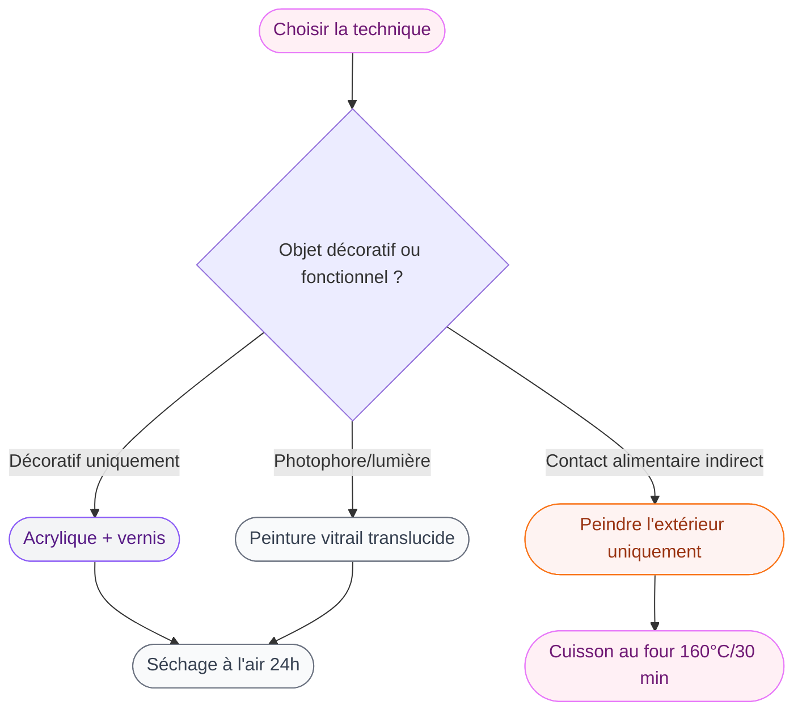

Tu as des bocaux Mason qui trainent dans un placard ou des bouteilles en verre que tu n'oses pas jeter parce qu'elles sont jolies ? Bonne nouvelle : avec un peu de peinture et quelques heures, tu peux les transformer en déco vraiment sympas. Que ce soit des vases, des photophores, des rangements ou juste des objets ornementaux, peindre du verre est plus accessible que tu ne le penses.

Je t'explique tout ce qu'il faut savoir pour que ta peinture tienne dans le temps et que le résultat soit soigné - même si tu débutes.

## Pourquoi peindre du verre, c'est une bonne idée

Les bocaux et bouteilles en verre recyclés sont gratuits ou presque, et ils ont une silhouette naturellement sympa. Quelques couches de peinture suffisent à les faire ressembler à des achats de boutique déco. Et avec les bonnes techniques, la peinture tient parfaitement, même si l'objet est manipulé régulièrement.

C'est aussi un excellent moyen de personnaliser ta déco à moindre coût. Plutôt que d'acheter un vase à 25 euros, tu récupères une bouteille d'huile d'olive et tu la peins dans la couleur exacte qui va avec tes rideaux.

> [!TIP]
> Garde tes bocaux de confiture et tes bouteilles d'apéro pendant quelques semaines - tu vas vite avoir un stock parfait pour te lancer !

## Quelle peinture choisir pour peindre du verre ?

C'est la question qui change tout. Le verre est une surface lisse et non poreuse, donc la peinture n'accroche pas naturellement. Il existe plusieurs options selon l'usage que tu vas faire de ton objet.

### Peinture acrylique pour verre (la plus polyvalente)

C'est ce que j'utilise le plus souvent. La **peinture acrylique spéciale verre** adhère directement au verre sans apprêt et, une fois cuite au four ou scellée avec un vernis, elle devient très résistante. La gamme Pébéo Vitrea 160 (environ 6 euros le pot de 45 ml chez Cultura) est une valeur sûre : les couleurs sont intenses et le résultat après cuisson est vraiment solide.

Si tu peins un objet décoratif qui ne sera pas en contact avec l'eau ou la chaleur, une peinture acrylique classique (Pébéo Studio Acrylics, Daler-Rowney Simply) avec un vernis de finition par-dessus marche aussi très bien.

### Peinture en bombe (pour les fonds rapides)

La peinture en bombe donne un fini lisse et uniforme que tu obtiendras difficilement au pinceau. C'est idéal pour les fonds opaques - par exemple pour donner un aspect mat à toute une bouteille. La bombe Rust-Oleum Chalk Paint (environ 13 euros) donne un rendu poudré ultra tendance. Spray it Stone de Rust-Oleum imite même les textures minérales.

> [!NOTE]
> Pour peindre à la bombe, travaille toujours dehors ou dans un endroit bien ventilé, à une distance d'environ 25-30 cm du verre. Plusieurs couches légères valent mieux qu'une couche épaisse qui coule.

### Peinture à la craie (Chalk Paint)

La Annie Sloan ou ses équivalents moins chers (la marque Rust-Oleum ou la peinture craie Leroy Merlin aux alentours de 8-9 euros) donnent un effet mat et vintage très chouette sur les bocaux. Elle accroche sur le verre sans préparation particulière, mais elle est moins résistante à l'humidité, donc réserve-la aux objets purement décoratifs.

### Peinture pour verre "vitrail"

Si tu veux un effet translucide qui laisse passer la lumière - parfait pour des photophores - les peintures vitrail comme la gamme Pébéo Vitrail (environ 5-6 euros le pot) sont faites pour ça. Elles colorent le verre tout en restant transparentes.

## Préparer ses bocaux et bouteilles avant de peindre

Une bonne préparation, c'est 80 % du résultat. Même les meilleures peintures ne tiennent pas sur une surface grasse ou humide.

**1. Enlève toutes les étiquettes.** Le truc imparable : laisse tremper le bocal dans de l'eau chaude avec du liquide vaisselle pendant 30 minutes. Les étiquettes se décollent facilement. Pour les restes de colle, un peu d'huile d'olive ou de l'alcool isopropylique sur un chiffon.

**2. Lave soigneusement avec du savon.** Rince bien pour éliminer toute trace de savon.

**3. Dégraisse avec de l'alcool à 90°.** C'est l'étape que les gens oublient souvent, et pourtant c'est ce qui fait la différence. Passe un coton imbibé d'alcool isopropylique sur toute la surface. La peinture accrochera beaucoup mieux.

**4. Laisse sécher complètement** avant de toucher le verre. Manipule-le ensuite le moins possible pour éviter de transférer le gras de tes mains.

> [!WARNING]
> Si tu sautes l'étape de dégraissage, ta peinture risque de se décoller en quelques jours, surtout si le bocal est manipulé régulièrement ou exposé à l'humidité.

## Techniques d'application selon l'effet voulu

### Au pinceau : pour les motifs et les effets texturés

Le pinceau te donne le contrôle maximum. Pour un fond opaque, commence par une couche légère que tu laisses sécher, puis applique une deuxième couche dans le sens opposé pour couvrir les traces de pinceau. 2 à 3 couches suffisent généralement.

Pour un effet texturé - des coups de pinceau visibles, un style "touche expressionniste" - utilise une peinture acrylique assez épaisse et un pinceau en soies naturelles. C'est un style qui fonctionne très bien sur des vases ou des bouteilles à poser sur une étagère.

### À l'éponge : pour les effets dégradés et mouchetés

Coupe une éponge naturelle (ou de cuisine) en petits morceaux et tamponne la peinture sur le verre. Tu obtiendras un effet moucheté très organique. En utilisant deux couleurs en dégradé - par exemple du blanc en bas et du rose en haut - tu crées facilement un effet ombré tendance.

### Par immersion (dip technique)

Cette technique est spectaculaire et donnera un effet "trempé" très moderne. Tu dilues ta peinture acrylique avec un peu d'eau, tu la verses dans un récipient plus grand, et tu trempes à moitié ton bocal dedans. En le retirant lentement, tu obtiens une ligne franche entre le verre nu et la partie peinte.

## Fixer et protéger la peinture : l'étape qui change tout

Une peinture non fixée sur du verre s'écaille rapidement, surtout si l'objet est manipulé. Il y a deux méthodes principales.

### La cuisson au four (pour les peintures spécial verre)

Si tu utilises une peinture type Pébéo Vitrea ou une autre peinture marquée "cuisson", c'est la méthode la plus fiable. Laisse sécher ta peinture 24 heures à l'air libre, puis place le bocal dans le four froid (c'est important). Monte à 160°C et laisse cuire 30 minutes. Laisse ensuite refroidir complètement dans le four éteint avant de sortir ton objet.

Résultat : la peinture est quasiment permanente et résiste au lave-vaisselle en position haute (sans le programme haute température).

### Le vernis de fixation

Pour les peintures acryliques classiques, applique 2 couches d'un vernis pour verre ou d'un vernis polyuréthane à finition mate ou brillante selon ton goût. Le vernis Mod Podge spécial verre (environ 8-9 euros) ou le vernis bombe Rust-Oleum (12 euros) fonctionnent très bien.

> [!IMPORTANT]
> Si tu peins un bocal que tu vas utiliser comme vase avec de l'eau, peins et scelle uniquement l'extérieur. L'eau à l'intérieur ne doit pas être en contact avec la peinture.

## 5 idées déco pour t'inspirer

### 1. Vases coordonnés pour un coin salon

Récupère trois bouteilles de tailles différentes (bouteille de vin, d'huile, de sauce). Peins-les dans trois tons du même camaïeu - par exemple blanc cassé, rose poudré et terracotta. Le résultat ressemble à une collection achetée en boutique. Place-les sur une étagère avec quelques branches séchées et tu as une composition digne d'un compte Pinterest. Si tu cherches d'autres idées de mise en scène autour des couleurs, l'article sur la [peinture Luxens](/guides/couleurs/peinture-luxens/) donne de bonnes pistes sur les associations de teintes tendance.

### 2. Photophores graphiques

Des bocaux Mason avec des motifs géométriques peints à la peinture vitrail dorée ou cuivrée. Place une bougie chauffe-plat à l'intérieur et la lumière traversera les zones non peintes pour créer un beau jeu d'ombres. C'est rapide à faire et l'effet est garanti le soir.

### 3. Bocaux à suspendre (style macramé)

Peins des bocaux en blanc mat ou en couleur terracotta, puis enroule de la ficelle de jute ou du macramé autour du goulot pour créer un système de suspension. A accrocher dans une fenêtre ou sur une terrasse avec de petites plantes grasses ou des herbes aromatiques.

### 4. Contenant de salle de bain façon spa

Peins des bocaux à confiture en blanc ou en bleu pâle avec un effet craie. Place-les sur le bord de ta baignoire ou sur une étagère de salle de bain pour y ranger des coton-tiges, des barrettes ou des fleurs séchées. L'effet "spa maison" est immédiat. Pour une salle de bain plus structurée, l'article sur le [meuble de salle de bain en béton ciré](/guides/decoration/peindre-lino/) peut t'aider à penser la cohérence globale de la pièce.

### 5. Déco avec des motifs inspirés de styles culturels

Une bouteille peinte avec des motifs en arabesque ou des teintes ocre et bleu peut s'intégrer magnifiquement dans une déco orientale. Si tu te lances dans ce type d'ambiance, jette un oeil à notre article sur la [décoration marocaine](/guides/decoration/decoration-marocaine-moderne-ou-classique/) pour comprendre comment assembler les pièces cohéremment.

## Les erreurs à éviter absolument

**Peindre sans dégraisser.** On l'a dit, mais c'est vraiment l'erreur numéro un. Le gras laissé par tes mains suffit à empêcher la peinture d'adhérer correctement.

**Appliquer des couches trop épaisses.** Une couche épaisse = des coulures garanties. Plusieurs couches fines, c'est toujours mieux.

**Ne pas laisser sécher entre les couches.** Chaque couche doit être sèche au toucher avant d'en appliquer une nouvelle. Compte environ 20-30 minutes avec une peinture acrylique dans une pièce tempérée.

**Utiliser du verre froid pour la cuisson.** Si ton bocal vient du frigo ou a été lavé à l'eau froide juste avant, laisse-le revenir à température ambiante. Un choc thermique peut le fissurer dans le four.

**Peindre l'intérieur d'un bocal alimentaire.** Même avec une peinture "spéciale verre", ne peins jamais l'intérieur d'un contenant qui va accueillir de la nourriture ou des boissons.

## Budget et matériel pour commencer

Pour te lancer avec un kit de base :

- Peinture acrylique spéciale verre Pébéo Vitrea (2-3 couleurs) : 12-18 euros
- Pinceau plat et pinceau rond (taille 6 et 10) : 5-8 euros chez Cultura ou Amazon
- Alcool isopropylique (pharmacie ou droguerie) : 3-4 euros
- Vernis de finition mat ou brillant : 8-10 euros

Total pour démarrer : moins de 40 euros, et tu auras largement assez de matériel pour une dizaine de projets. Les bocaux et bouteilles, eux, ne coûtent rien.

> [!TIP]
> Commence par des bocaux de récupération avant d'acheter des contenants neufs. Tu verras vite quel style te convient le mieux - mat ou brillant, opaque ou transparent - avant d'investir dans du matériel supplémentaire.

Si tu aimes les projets DIY sur les végétaux et que tu cherches un compagnon de verdure facile à soigner pour mettre en scène tes créations, la [péperomia hope](/guides/decoration/la-peperomia-hope/) est une plante magnifique qui s'accorde très bien avec des vases peints.

## En résumé : par où commencer ?

Si tu n'as jamais peint de verre, commence simple : un bocal Mason, une peinture acrylique Pébéo Vitrea en blanc, un pinceau plat. Nettoie bien, dégraisse, applique deux couches fines, laisse sécher 24h et cuis au four. Tu verras que le résultat est vraiment solide et que le geste est facile à reproduire.

Une fois que tu as le coup de main, les possibilités sont infinies : dégradés, motifs, techniques mixtes, formats variés. C'est un de ces DIY qui donne une grande satisfaction pour un investissement minimal. Lance-toi !

---

## FAQ

**Quelle peinture utiliser pour peindre des bocaux en verre ?**
La peinture acrylique spéciale verre (type Pébéo Vitrea 160) est la plus adaptée. Elle adhère directement sur le verre et, après cuisson au four à 160°C pendant 30 minutes, elle devient très résistante. Pour un usage purement décoratif, une acrylique classique avec vernis fonctionne aussi.

**Comment faire tenir la peinture sur le verre ?**
Deux étapes clés : dégraisse d'abord le verre à l'alcool isopropylique, puis fixe la peinture soit par cuisson au four (160°C, 30 min pour les peintures spéciales verre), soit avec un vernis polyuréthane ou un Mod Podge spécial verre.

**Peut-on peindre l'intérieur d'un bocal ?**
Pour la déco pure (cailloux, fleurs séchées), oui. Mais ne peins jamais l'intérieur d'un bocal destiné à contenir des aliments, des boissons ou de l'eau potable, même avec des peintures labellisées "non toxiques".

**La peinture sur bocaux résiste-t-elle au lave-vaisselle ?**
Une peinture spéciale verre cuite au four tient bien en panier supérieur du lave-vaisselle, sans programmes à très haute température. Pour une durabilité maximale, le lavage à la main reste préférable.

**Combien de couches de peinture faut-il appliquer sur le verre ?**
En général, 2 à 3 couches fines donnent un résultat opaque et homogène. Laisse bien sécher entre chaque couche - environ 20 à 30 minutes à température ambiante.
