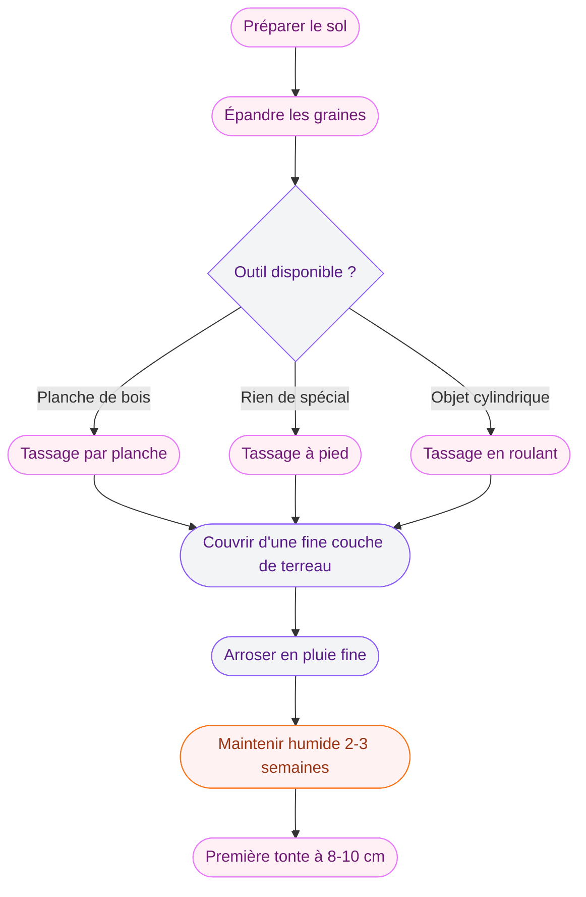
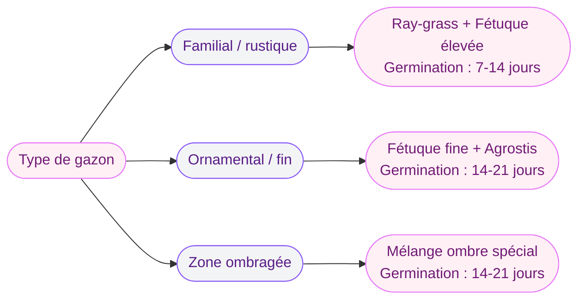

Tu rêves d'une belle pelouse verte et bien dense, mais tu bloques sur le rouleau à gazon ? Cet outil, certes pratique, n'est pas toujours accessible - que ce soit par manque de budget, de place pour le stocker, ou simplement parce que tu ne veux pas en acheter pour une seule utilisation. Bonne nouvelle : on peut tout à fait semer du gazon sans rouleau et obtenir un résultat vraiment satisfaisant. Il suffit de connaître les bonnes techniques pour remplacer ce tassage et assurer que tes graines soient bien en contact avec la terre.

Je vais te montrer comment faire ça proprement, étape par étape.

## Pourquoi le rouleau est-il utilisé en premier lieu ?

Avant de chercher des alternatives, comprends bien le rôle du rouleau dans le semis. Son objectif n'est pas mystérieux : il sert à tasser légèrement le sol après avoir épandu les graines de gazon. Ce tassage fait deux choses. D'abord, il assure un bon contact entre les graines et la terre - et c'est ce contact qui permet aux semences d'absorber l'humidité du sol et de germer. Ensuite, il évite que le vent ou l'arrosage ne déplace les graines avant qu'elles aient eu le temps de s'ancrer.

  

Donc quand on cherche à se passer de rouleau, c'est exactement ces deux effets qu'on cherche à reproduire par d'autres moyens.

Un sol trop meuble empêche les graines de germer correctement car elles restent "en l'air" sans contact avec l'humidité de la terre. C'est pourquoi le tassage, qu'il soit fait avec un rouleau ou autrement, fait vraiment la différence.

## Prépare bien ton sol avant de commencer

Le succès du semis sans rouleau dépend beaucoup de la qualité de la préparation du sol. Un sol bien travaillé en amont réduira beaucoup l'effort nécessaire pour compenser l'absence de rouleau.

  

### Ameublir, niveler, éliminer les indésirables

Commence par retourner le sol sur environ 20 à 30 cm de profondeur avec une fourche-bêche. Retire toutes les pierres, les racines et les mauvaises herbes que tu trouves. Ensuite, utilise un râteau pour niveler la surface - une surface plane facilitera grandement l'homogénéité de ton semis.

Laisse reposer le sol quelques jours après cette préparation. Cela permet aux mauvaises herbes restantes de germer... pour mieux les éliminer avant le semis. Ce délai de "fausse germination" te fera gagner du temps sur le long terme.

> [!TIP]
> Pour un sol très compact ou argileux, enrichis-le avec du sable de rivière et du compost avant de semer. Tu vas obtenir un terrain plus aéré qui favorise la germination, et tes racines de gazon s'y développeront beaucoup mieux.

### Choisir le bon moment

La période idéale pour semer du gazon en France se situe entre mi-août et mi-octobre, ou au printemps de mars à mai. Les températures douces et les pluies naturelles favorisent la germination. Évite absolument les périodes de gel ou de canicule - tes graines n'y survivraient pas.

## Les alternatives concrètes au rouleau

Voici maintenant le coeur de la question. Tu as plusieurs options selon ce que tu as sous la main.

  

### Technique 1 : Le tassage à pied

La méthode la plus simple et la plus accessible, c'est tout bêtement de marcher sur le sol après le semis. Mais attention, pas n'importe comment !

Après avoir épandu tes graines de gazon, avance à petits pas en quadrillant toute la surface, ligne par ligne. Le poids de ton corps suffit à créer le contact graines-terre dont tu as besoin. Pour uniformiser la pression, avance dans un sens puis recommence perpendiculairement.

Pour de meilleurs résultats, porte des chaussures à semelles plates (pas des talons ni des semelles très crantées qui creuseraient des sillons). Et marche lentement, en te concentrant sur chaque zone.

### Technique 2 : Une planche de bois

C'est la méthode que je préfère pour les petites surfaces car elle donne un résultat très régulier. Prends une planche en bois assez large (une planche de coffrage ou un vieux morceau de parquet fait très bien l'affaire) et pose-la à plat sur le sol ensemencé.

Monte dessus et fais quelques pas sur la planche pour distribuer ton poids uniformément. Déplace-la section par section jusqu'à couvrir toute la surface. L'avantage sur le tassage direct à pied, c'est que la pression est mieux répartie et tu évites les traces de chaussures.

> [!TIP]
> Si tu as une longue planche, attache une corde à chaque extrémité et tire-la sur le sol après t'être tenu dessus - tu reproduis exactement l'effet d'un rouleau avec beaucoup moins d'effort !

### Technique 3 : Des objets lourds cylindriques de fortune

L'idée ici est de reproduire la forme et la fonction du rouleau avec des objets du quotidien. Un seau de peinture vide bien rempli d'eau, un pot de jardin cylindrique ou même un tonneau peuvent faire l'affaire. Roule l'objet sur le sol dans des lignes parallèles, en te déplaçant méthodiquement.

Ce n'est pas aussi précis qu'un vrai rouleau, mais ça tasse quand même le sol de manière satisfaisante sur de petites surfaces.

### Technique 4 : Le treillis ou filet de protection

Cette approche est un peu différente. Après le semis, tends un filet anti-oiseaux ou un voile de forçage léger sur la surface. Ce filet ne tasse pas les graines, mais il les protège du vent et des oiseaux, et il maintient une certaine humidité au sol. Si tu combines ça avec un arrosage doux et régulier, tu peux obtenir de bons résultats même sans tassage.

## Couvrir les graines : une étape que beaucoup oublient

Après le tassage (quel que soit l'outil utilisé), ajoute une fine couche de terreau sur les graines. Une épaisseur de 3 à 5 mm suffit largement. Cette couverture légère fait plusieurs choses utiles : elle fixe les graines pour qu'elles ne bougent pas au premier coup de vent ou d'arrosage, elle maintient l'humidité autour des semences, et elle améliore le contact terre-graine.

  

N'enterre pas les graines trop profondément - elles ont besoin de lumière pour germer. 5 mm, c'est vraiment le maximum.

Certains jardiniers utilisent à la place du tourbe, de la vermiculite ou de la fibre de coco. Ces matières retiennent bien l'humidité, ce qui peut être utile si tu vis dans une région sèche ou si tu sembles pendant une période chaude du printemps.

## L'arrosage : l'élément qui compense tout le reste

Sans rouleau, ton arrosage devient encore plus stratégique. Des graines mal tassées qui reçoivent un arrosage trop puissant vont se déplacer et créer des zones chauve là où tu n'en veux pas. Voici comment faire :

  

**Les 2 premières semaines** : arrose deux fois par jour en pluie très fine, matin et soir, en évitant les heures chaudes. Le sol doit rester constamment humide sans être détrempé. Une pomme d'arrosoir ou un tuyau avec une buse "pluie" fonctionnent très bien.

**Semaines 3 et 4** : une fois que tu vois les premières pousses, tu peux passer à un seul arrosage quotidien, plus généreux. Les racines commencent à se développer et peuvent aller chercher l'eau un peu plus en profondeur.

**Après la première tonte** : arrose tous les 2-3 jours selon la météo. Ton gazon est maintenant bien établi.

> [!WARNING]
> Évite à tout prix les arrosages avec un jet puissant les deux premières semaines. Même un arrosage en "jet pluie" un peu fort peut déplacer les graines qui n'ont pas encore germé. Si tu as un doute, arrose encore plus doucement que tu ne le penses nécessaire.

## Choisir les bonnes graines selon ta situation

Le choix des graines influence aussi le succès de ton semis, surtout quand tu n'utilises pas de rouleau. Certaines variétés sont plus tolérantes à une préparation imparfaite du sol.

Pour un jardin familial avec du passage, opte pour un mélange robuste à base de ray-grass anglais (rye-grass) et de fétuque élevée. Ces variétés germent vite (7-14 jours) et supportent les imperfections de semis.

Pour une pelouse ornementale plus fine, les mélanges à base de fétuque fine et d'agrostis demandent plus de précision dans la préparation, donc assure-toi de bien tasser le sol avant.

Si tu as des zones ombragées, il existe des mélanges spéciaux pour l'ombre - ne cherche pas à faire germer un gazon de plein soleil sous tes arbres, ça ne prendra jamais.

## Semer sur un gazon existant : une option souvent sous-estimée

Si tu veux juste rénover une pelouse un peu clairsemée plutôt que de créer un gazon de toutes pièces, le sursemis est une excellente option qui se passe très bien de rouleau.

Le principe : tu semmes directement sur ton gazon existant après une tonte courte et un scarifiage léger. Les graines tombent entre les brins d'herbe déjà en place, et ceux-ci servent de "filet" naturel qui les retient. L'ancien gazon maintient l'humidité du sol, ce qui favorise la germination.

Pour les extérieurs, si tu cherches des idées pour [aménager les abords de ta maison](/maisons-modernes-2026-images-dexterieur-et-dinterieur/), sache que la qualité de ta pelouse change vraiment l'impression générale. Un gazon dense et homogène valorise même les façades les plus simples.

> [!IMPORTANT]
> Pour le sursemis, tonds ton gazon existant à 3-4 cm avant de semer. Une hauteur inférieure à ça expose trop le sol et risque de brûler les nouvelles pousses. Une hauteur supérieure empêche les graines de toucher la terre.

## Les erreurs à éviter absolument

**Semer trop dense** : plus de graines ne signifie pas un meilleur gazon. Les plants surchargés se font concurrence pour les nutriments et l'eau. La dose recommandée est généralement de 30 à 50g par m2 selon les variétés.

**Négliger le nivellement** : si ton sol a des creux et des bosses, l'eau va s'y accumuler et créer des zones gorgées d'eau mortelles pour les semences. Prends le temps de bien rater et niveler avant de commencer.

**Tondre trop tôt** : attends que ton gazon atteigne 8 à 10 cm avant la première tonte. Tondre trop tôt arrache les jeunes plants dont les racines sont encore superficielles.

**Piétiner pendant la germination** : une fois que tu as semé et tassé, évite de marcher sur la zone pendant au moins 3 semaines, le temps que les racines s'installent.

Pour d'autres projets de jardin qui peuvent se faire sans outils complexes, la pose de [bordures de jardin sans béton](/poser-bordure-jardin-sans-beton/) est un bel exemple de travaux accessibles avec les moyens du bord.

## Le calendrier de suivi semaine par semaine

| Période | Action |
|---------|--------|
| J+0 | Semis + tassage + couche de terreau |
| J+1 à J+14 | Arrosage 2x/jour en pluie fine |
| J+7 à J+14 | Premières pousses visibles selon variété |
| J+14 à J+21 | Arrosage 1x/jour |
| J+28 à J+35 | Première tonte à 8-10 cm, hauteur coupe 6 cm |
| J+35 à J+60 | Gazon établi, arrosage selon météo |

La patience est vraiment de mise ici. Si tu sembles au printemps ou en automne dans de bonnes conditions, tu devrais voir tes premières pousses en une à deux semaines selon les variétés et la température.

Si tu as d'autres projets de rénovation intérieure en parallèle, tu peux par exemple consulter notre guide sur [crépir un mur intérieur](/crepir-un-mur-interieur/) pour donner un coup de neuf à ta façade pendant que ton gazon pousse.

> [!TIP]
> Prends une photo de ta pelouse le jour du semis puis une photo par semaine au même endroit et à la même heure. Tu vas adorer observer la progression, et ça t'aide aussi à identifier les zones où la germination est moins bonne pour une intervention rapide.

## En résumé

Se passer de rouleau pour semer du gazon, c'est tout à fait possible et beaucoup de jardins ont été réussis comme ça. La clé est dans la préparation du sol (nivellement, ameublissement), dans le tassage alternatif (à pied, avec une planche ou un objet cylindrique), et surtout dans l'arrosage régulier et doux des premières semaines.

Pour les petites et moyennes surfaces, les méthodes "débrouille" fonctionnent très bien. Sur de grandes surfaces (au-delà de 100 m2), louer un rouleau pour la journée reste plus efficace - compte une trentaine d'euros la demi-journée. Mais pour ton jardin de ville ou ton petit coin de verdure, les alternatives suffisent largement. Lance-toi !

---

## Sur le meme theme

- [isolation dalle béton](/isolation-dune-dalle-en-beton-techniques-options-disolation-et-cout/)
- [peindre des bocaux ou bouteilles en verre](/comment-peindre-des-bocaux-ou-des-bouteilles-en-verre/)

## FAQ

**Peut-on semer du gazon directement sur de la terre sans la préparer ?**
Techniquement oui, mais le résultat sera décevant. Les mauvaises herbes prendront le dessus, les graines auront du mal à germer sur un sol compact, et ton gazon sera inégal. La préparation du sol (bêchage, nivellement, nettoyage) prend 1 à 2 heures mais change tout.

**Combien de temps faut-il pour voir pousser du gazon semé sans rouleau ?**
Les premières pousses apparaissent généralement entre 7 et 14 jours selon la variété et la température. Le gazon est considéré comme "établi" au bout de 6 à 8 semaines. Avec un bon tassage à pied et un arrosage régulier, le résultat sans rouleau est comparable à celui obtenu avec un rouleau.

**Quelle quantité de graines utiliser par m2 ?**
En règle générale, compte entre 30 et 50g de graines par m2 selon les variétés. Pour un mélange rustique familial, 35g/m2 est une bonne base. Pour un gazon fin ornemental, va jusqu'à 50g/m2. Consulte toujours les instructions du fabricant car les densités varient.

**Est-ce qu'arroser avec un tuyau suffit ou faut-il une pomme d'arrosoir ?**
Un tuyau avec une buse réglable sur "pluie fine" convient très bien, et c'est plus confortable pour couvrir de grandes surfaces. L'essentiel est que les gouttelettes soient petites et que le débit soit modéré. Un jet direct, même "doux", risque de déplacer les graines ou d'éroder le sol.

**Peut-on poser de la paille sur les graines pour garder l'humidité ?**
Oui, c'est une technique utilisée dans les zones sèches ou en été. Épands une couche très fine de paille (on doit voir le sol à travers) après le semis. Cette couverture maintient l'humidité et protège un peu du vent. Retire-la partiellement une fois que les premières pousses atteignent 2-3 cm.
