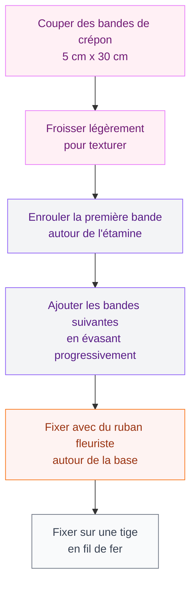

Tu veux décorer ton intérieur avec des fleurs qui ne fanent jamais ? Que ce soit pour un tableau végétal, un bouquet de chevet ou une guirlande au-dessus du lit, les fleurs faites main en tissu ou en papier sont une idée vraiment sympa. Et franchement, ce n'est pas aussi compliqué qu'on le croit.

Je t'explique tout ici : les matériaux à choisir, les étapes à suivre, et les petits trucs qui font la différence entre une fleur qui fait "bof" et une création dont tu seras vraiment fière.

## Tissu ou papier : lequel choisir ?

Avant de se lancer, il faut choisir ton matériau de prédilection. Les deux ont leurs avantages selon ce que tu veux faire.

  

**Les fleurs en papier**, c'est souvent plus accessible pour commencer. Le papier crépon (vendu chez Cultura à environ 2 € le rouleau) est parfait : il est souple, facile à travailler, et on peut lui donner des formes organiques avec les doigts. Le papier de soie (Rougier & Plé, 1,50 € la feuille) donne des fleurs légères et aériennes, idéales pour des mobiles ou des guirlandes. Pour quelque chose de plus solide et sculptural, le papier cartonné (cardstock) est très bien.

**Les fleurs en tissu** sont plus durables et donnent un rendu plus luxueux. Le feutre (Mondial Tissu, environ 1,20 € les 20 cm) est parfait pour débuter : il ne s'effiloche pas et ne nécessite pas d'ourlet. La soie, le satin ou le voile donnent des fleurs raffinées mais demandent un peu plus de soin dans la découpe.

> [!TIP]
> Si tu débutes, commence par le papier crépon. Il pardonne les imperfections et se froisse naturellement pour imiter la texture des vrais pétales.

## Les outils de base

Pas besoin d'un atelier complet pour se lancer. Voici le matériel de base :

  

- Des ciseaux à bouts fins (les ciseaux de couture Fiskars à 8 € sont top pour la précision)
- Un crayon ou une craie pour tracer les gabarits
- De la colle à chaud (pistolet Rapid à 15 € + bâtons rechargeables)
- Du fil de fer pour tiges (rouleaux de fil floral vert chez Cultura, 3 € environ)
- Du ruban de fleuriste vert pour habiller les tiges
- Des étamines en pistil (sachet de 100 chez Amazon, environ 4 €)

Pour les fleurs en tissu, ajoute à cette liste une bougie ou un briquet pour fondre les bords des pétales en tissu synthétique - ça évite l'effilochage et crée un bord légèrement arrondi très joli.

## Tuto fleurs en papier crépon : la rose

La rose en papier crépon est un grand classique, et une fois qu'on a la technique, ça va vraiment vite.

  

**Étape 1 : prépare tes bandes**

Coupe 6 à 8 bandes de papier crépon d'environ 5 cm de hauteur et 25-30 cm de longueur. Coupe dans le sens de la largeur du rouleau (perpendiculaire aux fils du papier) pour avoir de l'élasticité.

**Étape 2 : texturiser les pétales**

Tiens chaque bande entre les deux pouces et tire doucement en étirant vers les bords. Ca crée naturellement une courbe dans le papier qui imite la forme d'un pétale. Répète pour toutes tes bandes.

**Étape 3 : construire la fleur**

Prends une étamine (ou un petit bourgeon en papier froissé) et commence à enrouler la première bande tout autour, bien serrée. Pince la base avec tes doigts et maintiens-la. Ajoute la deuxième bande en la plaçant légèrement plus basse et plus évasée. Continue ainsi en évasant de plus en plus au fur et à mesure.

**Étape 4 : fixer et finir**

Une fois toutes tes bandes posées, pince très fort la base de la fleur et enroule plusieurs fois du ruban de fleuriste pour sécuriser. Glisse un fil de fer et continue d'enrouler le ruban jusqu'en bas pour former la tige.

> [!NOTE]
> Pour une rose plus volumineuse, découpe des pétales individuels (forme ovale allongée) dans du papier crépon et assemble-les un par un autour d'un centre. C'est plus long mais le résultat est vraiment réaliste.

## Tuto fleurs en papier de soie : la fleur de fête

Ce type de fleur géante est parfait pour décorer un mur lors d'une fête ou comme backdrop photo.

  

**Ce qu'il te faut** : 8 à 10 feuilles de papier de soie (50 x 70 cm), du fil ou un attache-torsade, des ciseaux.

1. Empile toutes les feuilles les unes sur les autres
2. Plie l'ensemble en accordéon (bandes d'environ 4 cm)
3. Plie le tout en deux et marque le centre
4. Coupe les extrémités en arrondi (pour des pétales ronds) ou en pointe (pour des pétales plus stylisés)
5. Attache au centre avec du fil ou un attache-torsade
6. Déplie délicatement chaque feuille vers le haut, une par une, en commençant par celles du dessus

> [!WARNING]
> Le papier de soie se déchire facilement quand il est plié en accordéon. Tire les feuilles très doucement, une à une, sans trop tirer sur les bords des plis.

Le résultat : une fleur de 30 à 40 cm de diamètre, hyper décorative. Tu peux les accrocher au mur avec de la colle repositionnable ou des punaises cachées derrière le centre de la fleur.

## Tuto fleurs en tissu : la fleur en feutre

Le feutre est vraiment le meilleur ami de la fleur en tissu pour débuter. Il ne s'effiloche pas, il est disponible dans des dizaines de coloris et il coûte très peu.

  

**Étape 1 : découpe les pétales**

Dessine un gabarit de pétale sur un morceau de carton : une forme ovale légèrement pointue en haut, environ 6 cm de hauteur. Trace ce gabarit sur ton feutre et découpe 6 à 8 pétales. Si tu veux une fleur avec du volume, fais 2 séries de pétales de tailles légèrement différentes.

**Étape 2 : donne du galbe**

Pour que les pétales ne soient pas plats, pince le bas de chaque pétale et fais un petit pli. Maintiens avec une goutte de colle à chaud. Ca donne immédiatement du relief à ta fleur.

**Étape 3 : assemble**

Commence par les grands pétales : dispose-les en étoile sur ta surface de travail, pointes vers l'extérieur. Colle-les ensemble au centre avec de la colle à chaud. Pose ensuite les petits pétales par-dessus, en décalant pour remplir les espaces.

**Étape 4 : le centre fait tout**

Un bouton vintage (les ventes de mercerie chez Emmaüs sont une mine d'or), quelques perles de rocaille, un demi-pompon... le centre d'une fleur en tissu peut vraiment sublimer l'ensemble. Colle-le avec de la colle forte.

> [!TIP]
> Pour des fleurs en tissu synthétique (satin, organza), passe le bord de chaque pétale découpé rapidement au-dessus d'une flamme de bougie. Le tissu fond légèrement et crée un bord naturellement arrondi et anti-effilochage. Attention à ne pas brûler, juste frôler la flamme !

## Tuto fleur en tissu de récup : la fleur bohème

Tu as de vieilles chemises en coton, des chutes de tissu à fleurs, des foulards usés ? Tout ça peut devenir de belles fleurs.

Découpe des bandes de tissu d'environ 3 cm de large et 40 à 50 cm de long. Plie chaque bande en deux dans le sens de la longueur. Commence à nouer et enrouler la bande sur elle-même en maintenant la base : le tissu se froisse naturellement et forme des "pétales" organiques au fur et à mesure.

Sécurise toutes les 5 cm avec du fil ou de la colle à chaud au niveau de la base. Continue d'ajouter des bandes jusqu'à obtenir le volume voulu. L'aspect imparfait et irrégulier est justement ce qui rend ces fleurs jolies - elles ont du caractère.

Ce type de fleur se marie très bien avec le style boho ou une [décoration marocaine moderne](/guides/decoration/decoration-marocaine-moderne-ou-classique/). On peut les accrocher en grappe au mur, les intégrer dans une couronne murale ou les coller sur un cadre miroir.

## Idées déco pour utiliser tes créations

Une fois tes fleurs faites, comment les valoriser ?

**Un tableau floral** : colle tes fleurs sur une toile tendue peinte en blanc cassé ou noir. Varie les tailles, les matières, les reliefs. Tu peux aussi [peindre des bocaux en verre](/guides/decoration/comment-peindre-des-bocaux-ou-des-bouteilles-en-verre/) pour créer des vases qui s'accordent avec tes créations.

**Une guirlande pour une étagère** : enfile tes fleurs en papier sur du fil de lin à l'aide d'une aiguille passée dans le centre de chaque fleur. Suspend cette guirlande devant une étagère ou le long d'une fenêtre.

**Une couronne murale** : prends un cercle en bois ou en osier (Maisons du Monde en propose autour de 8 €) et colle tes fleurs dessus avec un pistolet à colle. Mixe fleurs en tissu, en papier, et pourquoi pas des petites branches séchées.

**Un vase bouquet permanent** : assemble tes fleurs en papier crépon sur des tiges en fil de fer de longueurs différentes, et dispose-les dans un vase. Ca ressemble vraiment à un vrai bouquet de loin. Et ça ne jaunit pas, ne perd pas ses pétales, ne demande pas d'eau. Parfait à côté d'une [péperomia hope](/guides/decoration/la-peperomia-hope/) ou d'une autre plante verte pour mélanger le naturel et le fait main.

> [!IMPORTANT]
> Si tu prévois d'exposer tes fleurs en papier dans une pièce très lumineuse, opte pour des papiers crépons ou de soie résistants à la décoloration UV. Les gammes Canson ou Clairefontaine ont des versions "premium" qui durent beaucoup plus longtemps que les versions low-cost.

## Sur le meme theme

- [fabriquer un four à pizza](/guides/decoration/fabriquer-four-a-pizza/)
- [artisanat recyclé pour la maison](/guides/decoration/artisanat-avec-des-materiaux-recycles-pour-la-maison/)

## Questions fréquentes

**Quelle colle utiliser pour les fleurs en papier ?**
La colle à chaud est la plus pratique pour assembler vite et solidement. Pour des finitions plus délicates (papier de soie fin), préfère de la colle blanche liquide type Cléo ou de la colle UHU appliquée en très fine couche pour ne pas faire de taches.

**Comment conserver les fleurs en papier longtemps ?**
Évite l'humidité et la lumière directe du soleil. Une vitrine ou un cadre vitré est idéal pour les préserver. Pour fixer les couleurs du papier crépon, une légère vaporisation de laque pour cheveux (le vieux truc de grand-mère) fonctionne vraiment bien.

**Peut-on faire des fleurs en tissu sans coudre ?**
Oui ! La colle à chaud remplace très bien la couture pour la plupart des fleurs en tissu, sauf si tu veux une finition vraiment soignée. Le feutre en particulier se colle très bien sans aucune couture.

**Quels tissus éviter pour les débutants ?**
Évite la mousseline et le voile qui glissent partout sous les ciseaux, et les tissus très épais type jean qui sont difficiles à couper en formes précises. Commence par le feutre, le coton ou le crépon de coton.

**Comment donner un aspect vintage aux fleurs en papier ?**
Trempe tes fleurs assemblées dans du thé froid pendant quelques secondes, puis laisse sécher à plat. Ca donne un beau teint écru, légèrement crème, très brocante. Tu peux aussi colorer directement le papier blanc avec de l'encre aquarelle avant de le découper.

**Peut-on faire des fleurs en papier avec des enfants ?**
Les fleurs en accordéon de papier de soie sont parfaites avec des enfants à partir de 6-7 ans. Seule la partie "attache au centre" peut nécessiter l'aide d'un adulte. Pour les plus jeunes, les fleurs en rouleau de papier crépon sont aussi très accessibles.
