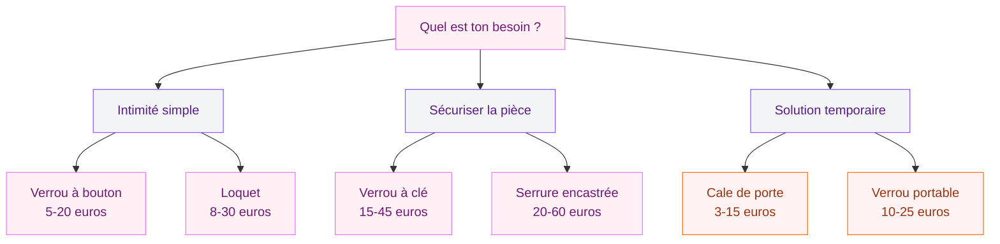
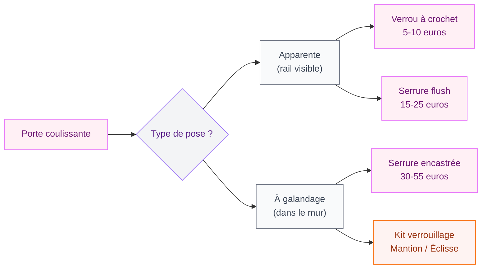

Tu veux pouvoir fermer ta porte de chambre, de salle de bain ou de bureau à clé - ou au moins la bloquer correctement ? Tu n'es pas la seule. Que ce soit pour avoir un peu d'intimité, sécuriser une pièce ou simplement empêcher les enfants d'entrer dans ton atelier créatif, verrouiller une porte intérieure est un besoin ultra courant. Et la bonne nouvelle, c'est que les solutions sont nombreuses, accessibles et souvent très simples à installer.

Je t'ai préparé un tour complet de toutes les options qui existent, des plus classiques aux plus malignes. Avec des prix concrets, des marques que tu trouveras facilement, et des conseils d'installation pour chaque situation.

## Les différents types de verrous pour porte intérieure

Avant de te lancer, il faut comprendre qu'il existe plusieurs familles de systèmes de verrouillage. Chaque type répond à un besoin différent - et surtout, tous ne demandent pas le même niveau de bricolage.

  

### Le verrou à bouton (targette)

C'est le plus répandu dans les maisons françaises. Tu le connais : un petit bouton rotatif sur la poignée, ou une targette coulissante sur le montant de la porte. Un tour et c'est verrouillé de l'intérieur.

**Prix moyen** : 5 à 20 euros chez Leroy Merlin ou Castorama. La targette basique Bricard démarre à 6 euros, et les modèles design en inox brossé montent à 15-20 euros.

**Idéal pour** : salle de bain, toilettes, chambre d'enfant.

**Limite** : ça ne verrouille que de l'intérieur. Impossible de fermer à clé quand tu quittes la pièce.

### Le verrou à clé (serrure à condamnation)

Là, on passe à un cran au-dessus. Un verrou à clé te permet de verrouiller ta porte des deux côtés - de l'intérieur ET de l'extérieur. C'est ce qu'il te faut si tu veux sécuriser une pièce quand tu n'es pas dedans (bureau, chambre d'amis, buanderie).

**Prix moyen** : 15 à 45 euros. Le verrou Bricard Alpha démarre à 18 euros, le Yale Y600 tourne autour de 25 euros. Chez Vachette, compte 30 à 45 euros pour un modèle robuste.

**Idéal pour** : bureau, pièce de rangement, chambre d'amis qu'on veut fermer.

> [!TIP]
> Si tu choisis un verrou à clé, prends un modèle avec au moins 3 clés fournies. Tu en perdras forcément une, et avoir un double chez un voisin de confiance, c'est la tranquillité.

### Le loquet (clenche ou bec-de-cane)

Le loquet est un mécanisme qui bloque la porte par un crochet ou un levier pivotant. C'est le système qu'on voit souvent sur les vieilles portes de ferme ou dans les maisons de campagne - mais il revient en force dans les intérieurs actuels, version moderne et minimaliste.

**Prix moyen** : 8 à 30 euros. Les loquets design de chez Hoppe ou FSB coûtent entre 15 et 30 euros.

**Idéal pour** : portes de style rustique, déco [style industriel](/style-industriel-moderne/) ou campagne chic.

### La serrure encastrée (à mortaiser)

C'est la solution la plus propre visuellement : la serrure est encastrée dans l'épaisseur de la porte. Rien ne dépasse, tout est intégré. Par contre, l'installation demande un peu plus de travail - il faut creuser dans le chant de la porte.

**Prix moyen** : 20 à 60 euros pour la serrure seule (sans poignée). Chez Bricard, le modèle Série 740 coûte environ 35 euros. Yale propose des serrures à mortaiser entre 25 et 50 euros.

**Idéal pour** : rénovation complète, portes neuves, quand tu veux un résultat vraiment soigné.

> [!WARNING]
> L'installation d'une serrure à mortaiser demande de percer dans l'épaisseur de la porte. Si ta porte est creuse (âme alvéolaire), vérifie bien que le chant est assez épais pour accueillir le boîtier. Les portes creuses bon marché n'ont parfois que 3 cm de bois massif sur les bords.

## Comment choisir la bonne solution

Le choix dépend de trois critères simples : ton besoin de sécurité, ton budget et ton niveau en bricolage.

  

**En résumé** :

- **Besoin d'intimité basique** (salle de bain, WC) : verrou à bouton, le plus simple et le moins cher.
- **Besoin de fermer à clé** (bureau, pièce sensible) : verrou à clé ou serrure encastrée.
- **Solution temporaire** (locataire, logement étudiant) : cale de porte ou verrou portable - pas de trou à percer.

## Installer un verrou soi-même : le tuto pas à pas

Bonne nouvelle : poser un verrou à bouton ou à clé, c'est un projet de 20 à 30 minutes. Tu n'as pas besoin d'être bricoleuse aguerrie. Voici les étapes.

  

### Le matériel nécessaire

- Un verrou (évidemment)
- Un crayon pour tracer les repères
- Une perceuse-visseuse
- Un forêt à bois adapté au diamètre (souvent 8 ou 10 mm)
- Un mètre ruban
- Un tournevis cruciforme

### Étape 1 : positionner le verrou

Place le verrou sur la tranche de la porte, à hauteur de la poignée existante (environ 1 mètre du sol). Marque les emplacements des vis avec ton crayon.

### Étape 2 : pré-percer les trous

Avec ton forêt à bois, perce les avant-trous aux emplacements marqués. Ça évite que le bois éclate quand tu visseras.

### Étape 3 : fixer le verrou

Visse le boîtier du verrou sur la tranche de la porte. Vérifie que le pêne (la partie qui coulisse) sort et rentre correctement.

### Étape 4 : poser la gâche

La gâche, c'est la pièce métallique fixée sur le dormant (le cadre de la porte) dans laquelle le pêne vient se loger. Ferme ta porte, repère où le pêne arrive sur le cadre, et fixe la gâche à cet endroit.

### Étape 5 : tester

Ouvre, ferme, verrouille, déverrouille. Tout doit coulisser sans forcer. Si ça frotte, ajuste légèrement la position de la gâche.

> [!NOTE]
> La plupart des verrous vendus en grande surface incluent un gabarit de perçage en carton. Suis-le à la lettre, ça te fera gagner du temps et évitera les erreurs de positionnement.

## Solutions sans percer (parfait pour les locataires)

Si tu es locataire ou si tu ne veux pas abîmer ta porte, il existe des solutions malignes qui ne laissent aucune trace.

  

### La cale de porte anti-intrusion

Pas la petite cale en bois de mamie. Je parle des cales de sécurité en acier ou en caoutchouc renforcé, conçues pour bloquer une porte par le bas. Tu la glisses sous la porte, et personne ne peut l'ouvrir de l'extérieur.

**Prix** : 8 à 15 euros sur Amazon. Le modèle Master Lock 265D est une référence à environ 12 euros.

### Le verrou portable de voyage

C'est un petit dispositif métallique que tu insères dans la gâche de la porte (là où le pêne entre). Ça bloque l'ouverture de l'extérieur, sans vis, sans perçage. Ultra pratique pour les locations Airbnb ou les [chambres d'amis](/amenager-chambre-cocooning/).

**Prix** : 10 à 25 euros. Le Addalock est le plus connu (environ 18 euros).

### Le bloque-poignée

Si ta porte a une poignée en levier (et non un bouton rond), tu peux utiliser un bloque-poignée. C'est une pièce en U qui empêche la poignée de s'abaisser. Simple, efficace, zéro trou.

**Prix** : 5 à 12 euros.

> [!IMPORTANT]
> Les solutions sans percer sont top pour l'intimité, mais elles ne remplacent pas un vrai verrou côté sécurité. Si tu as des objets de valeur à protéger, investis dans une serrure fixe.

## Cas particulier : verrouiller une porte coulissante

Les portes coulissantes, c'est génial pour [optimiser l'espace dans un petit intérieur](/agrandir-petit-espace-astuces/), mais les verrouiller, c'est une autre histoire. Les verrous classiques ne fonctionnent pas puisque la porte ne pivote pas - elle glisse.

  

### Les solutions adaptées

- **Verrou à crochet** : un petit crochet qui s'accroche dans un oeillet. C'est la solution la plus simple pour une porte coulissante apparente. Compte 5 à 10 euros.
- **Serrure pour porte coulissante à galandage** : si ta porte rentre dans la cloison, il existe des serrures spécifiques encastrées dans le chant. Les modèles Mantion ou Éclisse coûtent entre 30 et 55 euros.
- **Serrure à bouton flush** : un bouton rotatif encastré dans la porte, affleurant la surface pour ne pas gêner le coulissement. Entre 15 et 25 euros chez les fabricants spécialisés.

## Verrouiller une porte intérieure pour les enfants

Quand tu as des petits à la maison, le verrouillage prend une dimension différente. L'objectif n'est pas de transformer ta maison en bunker - c'est de protéger tes enfants des pièces dangereuses (cuisine, garage, buanderie) tout en leur laissant de l'autonomie ailleurs.

### Les solutions adaptées aux familles

- **Bloque-porte en hauteur** : un loquet posé en haut de la porte, hors de portée des petites mains. Compte 4 à 8 euros chez Bébé Confort ou Safety 1st.
- **Poignée à condamnation adulte** : certaines poignées HOPPE intègrent un système MiniLock - un discret bouton dans la rosace que seul un adulte peut actionner. Entre 35 et 60 euros la paire de poignées.
- **Cache-serrure** : un petit capot qui se clipse sur la clé pour empêcher les enfants de la tourner. Environ 3 euros l'unité.

> [!TIP]
> Pour la salle de bain, choisis un verrou avec un système de déverrouillage d'urgence par l'extérieur (pièce ou tournevis plat). Ça existe chez la plupart des marques et ça te sauvera le jour où ton petit s'enferme accidentellement. Le modèle Vachette "WC" avec déblocage pièce est à moins de 15 euros.

## Où acheter et combien prévoir

Voici un récapitulatif des enseignes et des budgets pour chaque solution.

| Solution | Prix moyen | Où acheter | Difficulté |
|----------|-----------|------------|------------|
| Targette / verrou à bouton | 5-20 euros | Leroy Merlin, Castorama, Brico Dépôt | Facile |
| Verrou à clé | 15-45 euros | Leroy Merlin, Amazon, Bricomarché | Facile |
| Serrure encastrée | 20-60 euros | Leroy Merlin, quincailleries | Moyen |
| Loquet design | 8-30 euros | Amazon, quincailleries spécialisées | Facile |
| Cale de porte sécurité | 8-15 euros | Amazon, Castorama | Aucune |
| Verrou portable | 10-25 euros | Amazon | Aucune |
| Serrure porte coulissante | 15-55 euros | Mantion, Éclisse, Leroy Merlin | Moyen |
| Bloque-porte enfant | 4-8 euros | Pharmacies, Amazon, Aubert | Facile |

**Mon conseil budget** : pour une salle de bain ou des WC, une targette Bricard à 8 euros fait largement le job. Pour un bureau ou une pièce à sécuriser, un verrou à clé Yale entre 20 et 30 euros est le meilleur rapport qualité-prix.

## Les erreurs à éviter

Quelques pièges classiques que je vois souvent quand on veut poser un verrou :

- **Oublier de vérifier l'épaisseur de la porte** : les serrures encastrées ont besoin d'au moins 35 mm d'épaisseur. Mesure avant d'acheter.
- **Choisir un verrou trop petit** : la course du pêne (la longueur de la partie qui dépasse) doit être d'au moins 15 mm pour un verrouillage solide.
- **Négliger l'alignement** : si la gâche et le pêne ne sont pas parfaitement en face, la porte ne se verrouillera pas correctement. Prends le temps de bien tracer tes repères.
- **Ignorer le sens d'ouverture** : un verrou prévu pour une porte qui s'ouvre à droite ne marchera pas sur une porte qui s'ouvre à gauche (et inversement). Vérifie bien le sens avant l'achat.
- **Utiliser des vis trop longues** : sur une porte creuse, des vis trop longues traverseront le panneau. Utilise des vis de 15 à 20 mm maximum.

Pour un [rangement bien organisé](/rangement-creatif-optimisation/) ou un [dressing optimisé](/dressing-optimise-solutions-rangement-garde-robe/), un verrou à clé est aussi une option intéressante pour protéger tes affaires les plus précieuses.

## Sur le meme theme

- [enduire un mur en parpaing](/comment-enduir-un-mur-en-parpaing/)
- [remplacer une roulette de véranda](/remplacer-roulette-veranda/)
- [comment nettoyer une table en céramique](/comment-nettoyer-une-table-en-ceramique/)
- [bien accrocher un tableau mural](/bien-accrocher-tableau-mural/)
- [tiny house container](/tiny-house-container/)

## FAQ

### Peut-on verrouiller une porte intérieure sans faire de trous ?

Oui, plusieurs solutions existent : cales de porte anti-intrusion (8-15 euros), verrous portables type Addalock (10-25 euros) et bloque-poignées (5-12 euros). Ces options conviennent bien aux locataires qui ne peuvent pas modifier les portes.

### Combien coûte l'installation d'un verrou par un serrurier ?

Un serrurier facture entre 80 et 150 euros pour la pose d'un verrou simple sur une porte intérieure (déplacement + main d'oeuvre). Pour une serrure encastrée, compte 120 à 200 euros. Si tu te sens capable de le faire, tu économises facilement 100 euros.

### Quel verrou choisir pour une porte de salle de bain ?

Le verrou à bouton avec déverrouillage d'urgence est le standard pour les salles de bain. Le modèle Vachette "WC" ou le Bricard Série 171 intègrent un système qui permet d'ouvrir de l'extérieur avec une pièce ou un tournevis plat en cas de blocage. Budget : 10 à 20 euros.

### Est-ce légal de verrouiller une porte intérieure en location ?

Oui, tu as le droit d'installer un verrou sur une porte intérieure en tant que locataire, à condition de remettre la porte en état à ton départ (reboucher les trous). Les solutions sans perçage sont idéales pour éviter ce souci. Vérifie aussi ton bail, certains mentionnent des restrictions.
