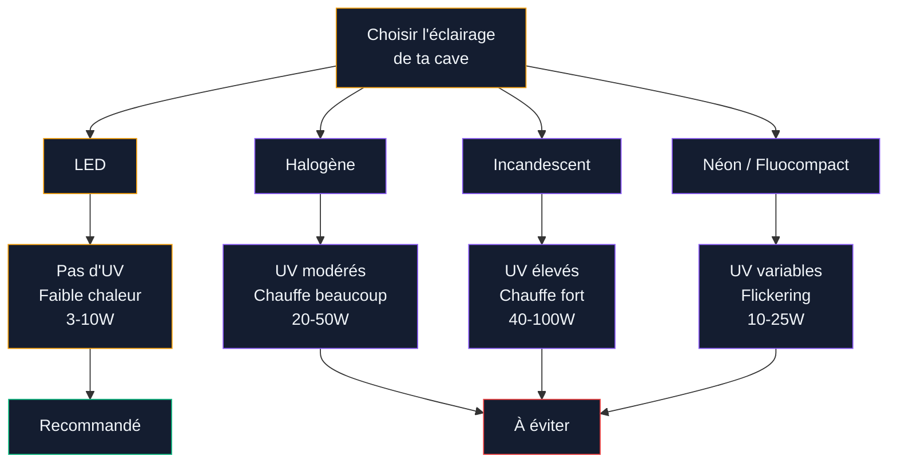
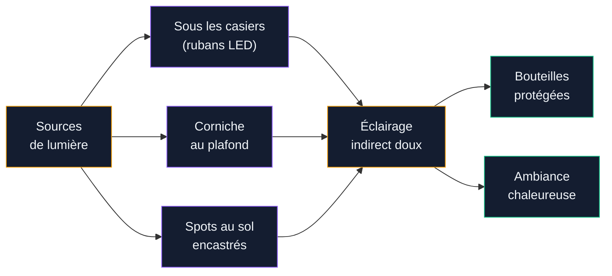

Tu as une cave à vin (ou tu comptes en aménager une), et tu te demandes comment l'éclairer sans transformer tes bouteilles en piquette ? Question légitime. La lumière est l'ennemi silencieux du vin - les UV accélèrent le vieillissement et peuvent créer ce qu'on appelle le "gout de lumière", un défaut irréversible qui détruit les aromes. Mais une cave plongée dans le noir total, c'est pas très pratique non plus quand tu veux choisir une bouteille. Je te donne mes conseils pour trouver le bon équilibre entre esthétique, fonctionnalité et protection de tes crus.

## Pourquoi la lumière abime le vin

Avant de parler ampoules et luminaires, il faut comprendre le problème de fond. Le vin est une matière vivante, sensible à trois facteurs principaux : la température, l'humidité et la lumière. Ce dernier point est souvent sous-estimé.

  

Les rayons ultraviolets (UV) déclenchent des réactions chimiques dans le vin. Ils cassent les molécules soufrées et provoquent une oxydation prématurée. Le résultat ? Un vin qui perd ses aromes fruités, développe des notes de chou ou de laine mouillée, et vieillit beaucoup trop vite. C'est le fameux "gout de lumière" - un terme technique utilisé par les oenologues pour décrire cette altération.

**Tous les vins ne sont pas égaux face à ce risque.** Les bouteilles en verre clair (rosés, certains blancs, champagnes) sont les plus vulnérables. Le verre foncé filtre une partie des UV, mais pas la totalité. Même un Bordeaux en bouteille sombre peut souffrir d'une exposition prolongée.

> [!WARNING]
> Les vins blancs et rosés en bouteille claire perdent leurs qualités aromatiques en quelques semaines sous un éclairage direct mal choisi. Si ta cave contient ce type de bouteilles, la question de l'éclairage n'est pas optionnelle - elle est prioritaire.

Les chiffres à retenir : une ampoule incandescente classique émet des UV, chauffe à plus de 80°C en surface et consomme beaucoup d'énergie. À l'inverse, une LED de qualité émet zéro UV, chauffe à peine (30-40°C en surface) et consomme 5 à 10 fois moins. Le choix est vite fait.

## LED : le meilleur allié de ta cave à vin

La technologie LED s'est imposée comme la référence pour l'éclairage des caves à vin, et pour de bonnes raisons.

  

**Pas d'émission d'UV** : c'est le critère numéro un. Les LED de qualité n'émettent aucun rayonnement ultraviolet, ce qui protège tes bouteilles même en cas d'exposition prolongée.

**Très faible dégagement de chaleur** : une LED de 5W chauffe à peine, là ou une halogène de puissance équivalente peut faire grimper la température ambiante de plusieurs degrés. Dans une cave ou la température idéale se situe entre 10 et 14°C, c'est un avantage considérable.

**Consommation basse** : entre 3 et 10W par point lumineux selon l'intensité. Pour une cave de 10 à 15 m², 3 à 5 spots LED suffisent largement.

### Quelle température de couleur choisir ?

La température de couleur se mesure en Kelvin (K). Pour une cave à vin, vise entre **2200K et 2700K** - c'est la plage "blanc chaud" qui donne une lumière ambrée et chaleureuse.

- **2200K** : lumière très chaude, presque orangée. Ambiance tamisée, idéale pour une cave de dégustation.
- **2700K** : blanc chaud standard. Bon compromis entre ambiance et visibilité pour lire les étiquettes.
- **Au-delà de 3000K** : trop blanc, trop froid. Ca donne un côté clinique qui ne colle pas du tout à l'esprit cave à vin.

Pour une ambiance encore plus soignée, pense aux LED avec variateur (dimmer). Ca te permet de baisser l'intensité lors des dégustations et de monter un peu quand tu cherches une bouteille précise au fond du casier.

> [!TIP]
> Les rubans LED en 2200K collés sous les casiers ou les étagères créent un effet d'éclairage indirect spectaculaire. Prix : 15 à 30 euros pour 5 mètres de ruban LED de qualité chez Philips Hue ou Govee. Combine avec un variateur pour ajuster l'ambiance selon le moment.

## Placement des luminaires : les règles d'or

La ou tu places tes sources lumineuses est aussi important que le type de lumière que tu choisis. Deux principes à respecter absolument.

  

### Règle 1 : jamais de lumière directe sur les bouteilles

C'est la règle de base. Aucun spot, aucune ampoule ne doit éclairer directement les bouteilles. Même une LED sans UV finit par générer un léger réchauffement si elle pointe en continu sur une zone.

**Les bons emplacements :**

- **Sous les étagères ou les casiers** : l'éclairage tombe vers le bas et éclaire la rangée du dessous par réflexion. Les bouteilles de la rangée du haut restent dans l'ombre.
- **En corniche au plafond** : la lumière rebondit sur le plafond ou les murs et crée un éclairage diffus dans toute la pièce.
- **Au sol, le long des murs** : des spots encastrés au sol éclairent vers le haut et créent un jeu de lumière dramatique sans toucher les bouteilles.

### Règle 2 : favoriser l'éclairage indirect

L'éclairage indirect, c'est quand la source lumineuse n'est pas visible et que la lumière arrive par réflexion sur une surface (mur, plafond, tablette). Le résultat est plus doux, plus homogène, et surtout sans point chaud.

Concrètement, ca veut dire :
- Rubans LED cachés derrière des moulures ou sous des tablettes
- Spots orientés vers le mur ou le plafond, pas vers les casiers
- Luminaires encastrés avec un angle de diffusion large (60° minimum)

Si tu t'intéresses aux techniques d'éclairage indirect pour d'autres pièces, le guide sur les [techniques d'éclairage d'ambiance](/eclairage-ambiance-techniques-sublimer/) détaille ces méthodes avec des exemples concrets.

## Luminosité : combien de lux dans une cave à vin ?

L'intensité lumineuse se mesure en lux. Pour te donner un repère, un bureau de travail c'est 300 à 500 lux, un salon c'est 150 à 300 lux. Pour une cave à vin, on vise beaucoup plus bas.

  

**La recommandation : entre 50 et 100 lux maximum.** C'est suffisant pour circuler, lire les étiquettes et choisir une bouteille, sans agresser le contenu.

Pour une cave de 10 m², ca correspond à environ :
- 3 spots LED de 3W en blanc chaud
- Ou un ruban LED de 5 mètres réglé à 30-40 % de son intensité maximale
- Ou 2 appliques murales LED de 5W orientées vers le plafond

**Le budget :** pour un éclairage LED complet d'une cave de 10 à 15 m², compte entre 80 et 250 euros selon le niveau de finition. Un kit de rubans LED basique démarre à 25 euros, des spots encastrés de qualité (type Paulmann ou Nobile) coutent 20 à 40 euros pièce, et un variateur compatible ajoute 30 à 60 euros.

> [!NOTE]
> Installe un détecteur de présence ou un minuteur pour que l'éclairage s'éteigne automatiquement après 5 à 10 minutes. Ca évite d'oublier la lumière allumée pendant des heures - premier risque d'altération dans une cave d'amateur.

## Les conditions idéales autour de l'éclairage

L'éclairage ne fonctionne pas tout seul. Il s'inscrit dans un écosystème complet. Si la température ou l'humidité de ta cave posent problème, même le meilleur éclairage LED ne sauvera pas tes bouteilles.

  

**Température :** entre 10 et 14°C, stable. Les variations sont pires que la température absolue. Vérifie que tes luminaires ne créent pas de points chauds localisés - c'est le cas avec les halogènes, rarement avec les LED.

**Humidité :** entre 60 et 80 %. Trop sec, les bouchons se dessèchent et l'air entre dans la bouteille. Trop humide, les étiquettes pourrissent et la moisissure s'installe. Pour l'éclairage, ca implique de choisir des luminaires étanches (indice IP44 au minimum, IP65 si ta cave est vraiment humide).

**Stockage :** bouteilles à l'horizontale pour que le bouchon reste en contact avec le vin. Cette position influence aussi l'éclairage : les étiquettes sont souvent sur le côté, donc il faut un éclairage suffisant pour les lire sans manipuler les bouteilles.

Si tu envisages d'aménager ton sous-sol pour y installer une cave, le guide sur le [sous-sol aménagé en espace de vie](/sous-sol-amenage-espace-vie-cosy/) te donnera des idées pour combiner cave à vin et espace cosy dans le même volume.

> [!IMPORTANT]
> Choisis des luminaires avec un indice de protection IP44 minimum pour ta cave. L'humidité ambiante (60-80 %) abime rapidement les composants électriques non protégés et peut créer des courts-circuits. Pour les caves enterrées très humides, monte à IP65.

## Erreurs fréquentes à éviter

Quelques pièges classiques que je vois régulièrement dans les caves mal éclairées.

**Laisser la lumière allumée en permanence.** Même une LED sans UV finit par réchauffer légèrement l'air ambiant si elle tourne 24h/24. Et l'exposition continue à n'importe quelle lumière reste un facteur de stress pour le vin. Solution : minuteur ou détecteur de présence, 15 euros max pour un modèle correct.

**Utiliser des spots halogènes "parce qu'on les avait déjà".** Les halogènes émettent des UV, chauffent énormément (jusqu'à 200°C en surface) et consomment 5 à 10 fois plus qu'une LED. Le cout de remplacement par des LED se rentabilise en quelques mois sur la facture d'électricité.

**Placer des spots directement au-dessus des casiers.** Même avec des LED, la chaleur descend. Un spot encastré au plafond pile au-dessus d'un casier crée un point chaud localisé sur les bouteilles du dessus. Décale les spots de 20-30 cm vers l'allée de circulation.

**Oublier la zone de dégustation.** Si ta cave a un coin dégustation (table, fauteuils), il mérite son propre éclairage - un peu plus fort que le reste de la cave. Un suspension design au-dessus de la table avec un variateur fait très bien le travail. Pour l'inspiration, les [tendances en éclairage moderne](/eclairage-moderne-tendances/) proposent des modèles qui fonctionnent bien dans ce contexte.

## Idées déco pour sublimer l'éclairage de ta cave

L'éclairage d'une cave à vin, c'est aussi une opportunité déco. Quelques idées qui marchent très bien.

**Les casiers rétroéclairés** : des rubans LED placés à l'arrière des casiers à bouteilles créent un halo lumineux autour de chaque rangée. L'effet est spectaculaire, surtout avec un ruban en 2200K (blanc très chaud). Budget : 20 à 40 euros de rubans + 10 euros de connecteurs et alimentation.

**La voute éclairée** : si ta cave a un plafond vouté (classique dans les maisons anciennes), des spots encastrés dans la voute ou des rubans LED qui suivent la courbe valorisent l'architecture. C'est un vrai argument esthétique qui transforme une simple pièce de stockage en lieu de prestige.

**Les niches lumineuses** : creuser ou aménager des niches dans le mur pour y poser quelques bouteilles de collection, éclairées individuellement par un petit spot LED orientable. Ca met en valeur tes plus beaux crus comme des oeuvres d'art.

**Le mélange matériaux + lumière** : pierre naturelle, brique, bois brut - ces matériaux typiques des caves gagnent en caractère sous un éclairage indirect chaud. Une lumière rasante sur un mur en pierre révèle chaque relief et chaque texture. Pour une touche de raffinement supplémentaire, les [accents dorés en décoration](/decoration-doree-sur-les-murs-les-meubles-ou-les-accessoires/) apportent un côté luxueux qui se marie bien avec l'univers du vin.

> [!TIP]
> Pour une ambiance de cave professionnelle sans le budget d'un architecte, combine ruban LED 2200K sous les casiers + 2 spots orientables au plafond dirigés vers les murs + un variateur centralisé. Cout total : 150 à 200 euros, installation comprise si tu fais toi-même.

## Sur le meme theme

- [comment nettoyer une table en céramique](/comment-nettoyer-une-table-en-ceramique/)

## FAQ

**Est-ce que les LED peuvent abimer le vin ?**
Non, les LED de qualité n'émettent pas de rayons UV et produisent très peu de chaleur. C'est la source lumineuse la plus sure pour une cave à vin. Le seul risque : laisser une LED allumée en permanence, ce qui peut créer un léger réchauffement cumulé de l'air ambiant. Un minuteur règle ce problème.

**Quelle puissance d'éclairage pour une cave de 10 m² ?**
Vise entre 50 et 100 lux, ce qui correspond à 3 spots LED de 3W ou un ruban LED de 5 mètres à intensité réduite. L'objectif est de voir suffisamment pour lire les étiquettes sans créer un éclairage permanent agressif. Budget : 80 à 150 euros pour un kit complet.

**Comment protéger les bouteilles en verre clair de la lumière ?**
Les vins blancs et rosés en bouteille transparente sont les plus sensibles. Range-les dans les zones les plus sombres de ta cave, loin de toute source lumineuse directe. Tu peux aussi utiliser des housses de bouteille en tissu (5 à 10 euros le lot de 10) ou des casiers fermés avec porte opaque.

**Faut-il un éclairage spécial pour une cave à vin réfrigérée (armoire à vin) ?**
Les armoires à vin de qualité intègrent déjà un éclairage LED interne adapté (basse puissance, pas d'UV, avec interrupteur de porte). Si tu dois remplacer l'ampoule, choisis une LED en 2700K avec le bon culot (souvent E14 ou G4). Évite les ampoules génériques à incandescence qui chauffent et émettent des UV.
