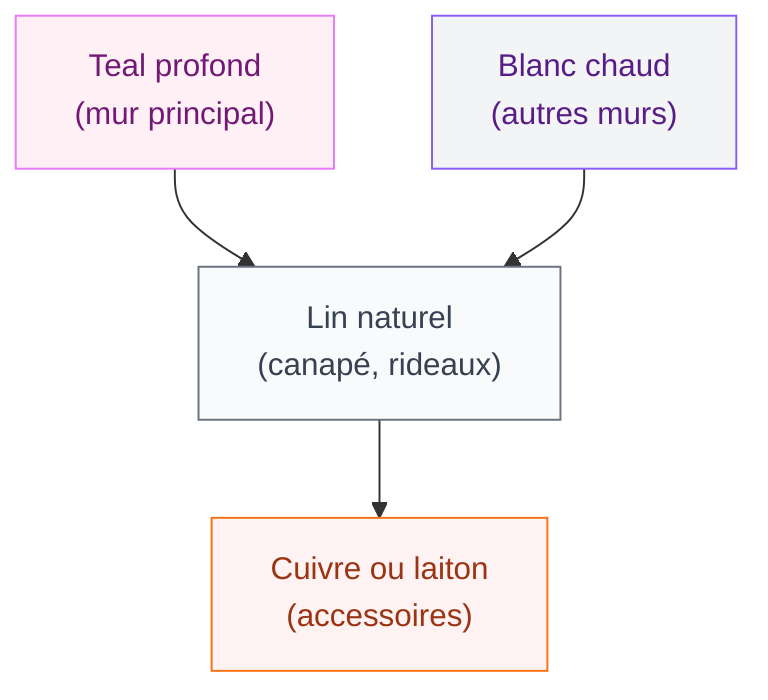
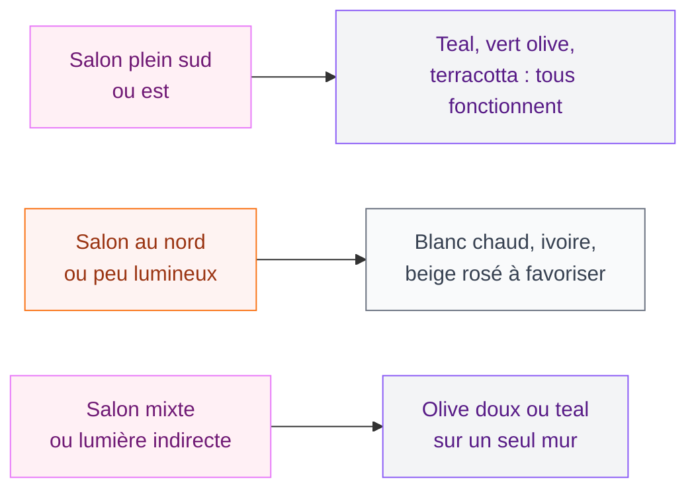
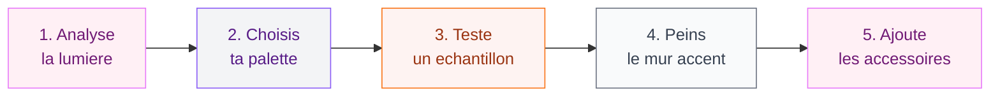

Tu te demandes quelle couleur choisir pour repeindre ton salon cette année ? Bonne nouvelle : 2026 offre des palettes vraiment belles, du teal profond au blanc cassé ultra doux, en passant par le vert olive et la terracotta. Je t'explique tout ce qu'il faut savoir pour faire le bon choix selon ton espace, ta lumière et ton style.

## La couleur phare de 2026 : le Transformative Teal

Cette année, les experts et les grandes maisons de peinture s'accordent sur une teinte : le teal, ce bleu-vert aquatique à la fois intense et apaisant. WGSN et Coloro l'ont baptisé "Transformative Teal", et honnêtement, le nom colle parfaitement à ce que cette couleur fait dans un salon.

  

C'est une couleur qui change l'ambiance d'une pièce du sol au plafond. Pas effacée du tout, pas agressive non plus. Elle apporte de la profondeur et une vraie sensation de calme. Tu imagines un salon avec un grand mur teal, un canapé en lin naturel beige et quelques coussins cuivre ? C'est exactement l'ambiance qu'on cherche en 2026.

> [!TIP]
> Si tu as un petit salon peu lumineux, peins un seul mur en teal (le mur derrière le canapé, par exemple) et garde les autres en blanc chaud. Tu obtiendras l'effet sans "écraser" la pièce.

Pour les marques accessibles, Zara Home propose des coussins dans cette palette bleu-vert autour de 25-35€. Pour la peinture, Tollens et Farrow & Ball ont chacun leurs declinaisons de teal - attends-toi à payer 50-70€ le litre pour une qualité mat velours.

## Les grandes palettes tendance pour le salon 2026

Plutôt que te donner une seule couleur, voilà comment construire une palette complète pour ton salon. Parce que la vraie magie, c'est dans la combinaison.

  

### Palette 1 - Teal et neutres chauds

- Mur principal : teal profond ou bleu-vert
- Murs secondaires : blanc cassé ou beurre frais
- Sol et mobilier : bois clair ou chêne moyen
- Accessoires : laiton, coton naturel, céramique blanche

C'est la palette qui marche dans presque tous les salons. Elle donne une ambiance douce avec un vrai caractère.

### Palette 2 - Vert olive et ivoire

Le vert olive reste très fort cette année. C'est plus discret que le teal, plus facile à vivre au quotidien. Il se marie super bien avec l'ivoire, le lin et le bois foncé.

- Mur accent : vert olive soutenu (pas kaki, pas militaire - pense "olive mûre")
- Autres murs : ivoire ou blanc minéral
- Mobilier : velours moutarde ou tissu lin
- Accessoires : poteries naturelles, osier, plantes tropicales

Tu hésites entre les deux ? Consulte aussi notre guide sur les [salons modernes et elegants 2026](/salons-modernes-et-elegants-2026/) pour voir comment ces palettes s'intègrent dans différents styles de déco.

### Palette 3 - Terracotta soleil doux

La terracotta ne quitte pas les tendances, mais en 2026 elle se fait plus douce, plus poudreuse. Fini la version orange vif un peu criarde - place à une terracotta beige rosé, réchauffée, sophistiquée.

- Mur principal : terracotta poudreuse ou rose saumon
- Murs secondaires : beige rosé ou chaux blanche
- Sol : tomettes, béton ciré ou bois clair
- Accessoires : cuivre mat, textiles à motifs subtils, céramique artisanale

> [!NOTE]
> La terracotta est particulièrement adaptée aux salons qui manquent de chaleur naturelle - appartements en étage avec peu de lumière directe, pièces au nord. Elle "réchauffe" visuellement même par temps gris.

### Palette 4 - Blanc chaud et bois

C'est le choix le plus safe et pourtant pas du tout ennuyeux quand c'est bien fait. Les blancs chauds de 2026 ne sont pas les blancs froids des années 2010. On parle d'Alabaster, de blanc cassé légèrement beige, de blanc lait.

Sherwin-Williams a sorti "Alabaster" qui fait un carton - c'est un blanc doux qui s'adapte à toutes les lumières. Équivalent accessible : la peinture "Blanc Antique" de Leroy Merlin autour de 30€ le litre.

## Comment choisir selon la lumière de ton salon ?

C'est LE facteur que les gens oublient, et c'est dommage parce que ça fait toute la différence.

  

**Salon exposé sud ou est** : tu peux te permettre les couleurs foncées et saturées. Le teal, le vert olive soutenu, la terracotta intense - tout ça fonctionne. La lumière naturelle équilibrera la profondeur des teintes.

**Salon au nord ou peu fenêtré** : reste sur les blancs chauds, les beiges et les teintes poudreuses. Un mur teal dans un salon sombre, ça peut vite faire "cave". Si tu veux quand même une couleur forte, concentre-toi sur les accessoires (coussins, tapis, plaid) plutôt que les murs.

**Salon avec lumière mixte** : une bonne option, c'est de peindre le mur le plus éclairé (souvent le mur face à la fenêtre) dans la couleur foncée, et garder les autres neutres.

> [!WARNING]
> Teste toujours un échantillon de peinture de 30x30 cm sur ton mur pendant 48h avant d'acheter les bidons. Une couleur sur une petite carte cartonnée et la même couleur sur un grand mur, c'est vraiment pas la même chose - surtout pour les teintes sombres.

## Associer couleurs de murs et couleurs de decor

Choisir la couleur des murs c'est la moitié du travail. Le reste, c'est savoir quoi mettre dedans.

  

**Avec le teal :**
- Bois clair (chêne, frêne) pour équilibrer
- Métaux : laiton ou cuivre (pas d'acier froid)
- Textiles : lin, coton naturel, velours prune
- A éviter : trop de blanc pur qui "cassera" l'ambiance

**Avec le vert olive :**
- Bois foncé (noyer, teck) qui donne beaucoup de caractère
- Céramique artisanale en tons ocre ou crème
- Plantes vertes à feuilles larges qui prolongent la palette naturelle
- A éviter : le rose vif ou le rouge qui clash complètement

**Avec la terracotta :**
- Raphia, osier, rotin - les matières naturelles sont tes meilleures amies
- Textiles ethniques ou à imprimés géométriques discrets
- Bois clair ou pin naturel
- A éviter : le blanc pur trop froid, préfère le chaux ou le blanc cassé

Si tu cherches à affiner tes associations de couleurs, notre article sur les [couleurs compatibles avec l'orange pour les murs et la decoration](/couleurs-compatibles-avec-lorange-pour-les-murs-et-la-decoration/) te donnera des idées pour travailler les tonalités chaudes dans tout l'appartement.

## Budget : ce que ça coûte vraiment de repeindre son salon

Soyons honnêtes sur les chiffres parce que ça aide à planifier.

  

**Peinture haut de gamme** (Farrow & Ball, Little Greene) : 80-120€ le litre. Pour un salon standard de 20m², compte 2-3 litres pour deux couches. Budget peinture : 200-350€.

**Peinture milieu de gamme** (Tollens, V33, Dulux Valentine) : 30-50€ le litre. Budget : 80-150€.

**Peinture entrée de gamme** (Leroy Merlin, Castorama marque propre) : 15-30€ le litre. Budget : 40-80€.

> [!TIP]
> Mon conseil si tu veux le résultat d'une peinture premium sans le prix : achète une peinture de marque moyenne (Tollens ou V33) dans la bonne teinte, et ajoute une troisième couche. Tu obtiens une profondeur de couleur bien supérieure à deux couches d'une peinture cheap.

**Accessoires pour changer l'ambiance sans repeindre :**
- Tapis Ikea collection STOCKHOLM : 129-299€ selon taille
- Coussins H&M Home en velours coloré : 15-25€ pièce
- Plaid La Redoute en laine mélangée : 35-65€
- Vases et céramiques Maisons du Monde : 12-45€ pièce

Parfois, changer trois coussins et un tapis donne autant d'impact qu'une peinture complète - et pour 100€ au lieu de 300€.

## Les erreurs à éviter en 2026

**1. Suivre la tendance sans penser à son intérieur**
Le teal c'est magnifique sur Pinterest. Mais si tu as des meubles en bois foncé, un canapé gris anthracite et peu de lumière, le résultat sera probablement lourd. Adapte la tendance à TON salon.

**2. Peindre tous les murs en couleur soutenue**
C'est le piège le plus classique. Un mur accent fort + trois murs neutres, c'est souvent bien plus efficace que quatre murs teal. La couleur ressort mieux, la pièce respire.

**3. Oublier les finitions**
Une peinture mate velours et une peinture satinée dans la même teinte ne donnent pas le même rendu visuel. Pour les murs d'un salon, la finition mat velours est la plus tendance en 2026 - elle absorbe la lumière et donne de la profondeur sans reflets.

**4. Négliger les transitions avec les autres pièces**
Si ton salon est ouvert sur la cuisine ou le couloir, pense à la cohérence de l'ensemble. Pas besoin d'utiliser la même couleur partout - mais les teintes doivent dialoguer. En 2026, on aime les palettes qui "voyagent" d'une pièce à l'autre avec des variations de ton.

Pour de l'inspiration sur la cohérence de couleurs dans toute la maison, jette un oeil à notre guide sur la [decoration de la chambre a coucher 2026](/decoration-de-la-chambre-a-coucher-2026-tendances-et-photos/) qui explore les mêmes palettes dans un autre contexte.

## Le plan d'action en 5 etapes

1. **Analyse ta lumière** : Nord/sud, directe/indirecte ? Note à quelle heure la lumière entre et comment elle change dans la journée.
2. **Choisis ta palette** : Parmi les 4 proposées, laquelle correspond le mieux à tes meubles existants ?
3. **Teste un échantillon** : Achète 3-4 petits pots de peinture (5€ pièce chez la plupart des enseignes) et peins des carrés de 30x30 cm sur ton mur. Attends 48h.
4. **Commence par le mur accent** : Ne peins pas tout d'un coup. Un mur fort, observe pendant une semaine, puis décide si tu veux aller plus loin.
5. **Ajuste avec les accessoires** : Une fois les murs fixés, apporte les textiles, les plantes et les petites pièces déco pour affiner la palette.

La couleur de ton salon en 2026, c'est avant tout une histoire de cohérence entre tes murs, ta lumière et ce que tu aimes vivre au quotidien. Les tendances sont là pour t'inspirer, pas pour t'imposer un résultat. Prends le temps de tester, d'observer, et fais confiance à ce qui te fait vraiment envie quand tu pousses la porte de chez toi.

> [!IMPORTANT]
> Avant d'acheter quoi que ce soit, photographie ton salon en pleine journée et en soirée avec ta lampe principale allumée. Ces deux photos te montreront exactement les dominantes de couleur actuelles - et t'aideront à choisir ce qui les équilibrera ou les prolongera.

---

## Sur le meme theme

- [salon brun](/salons-bruns-idees-et-images/)
- [bleu salon](/bleu-salon/)

## FAQ - Couleurs salon 2026

**Quelle est la couleur tendance pour un salon en 2026 ?**
Le Transformative Teal (bleu-vert profond) est la couleur de l'année selon WGSN et Coloro. Le vert olive, la terracotta douce et le blanc chaud style Alabaster sont aussi très presents dans les tendances salon 2026.

**Comment utiliser le teal dans un salon sans que ce soit trop sombre ?**
Peins uniquement le mur derrière le canapé ou le mur principal en teal, et garde les autres murs en blanc chaud ou beige. Ajoute des textiles clairs (lin, coton naturel) et des accessoires en laiton pour équilibrer la teinte sombre.

**Le vert olive convient-il à tous les types de salon ?**
Le vert olive s'adapte bien aux salons avec lumière moyenne à forte. Pour les salons peu lumineux, préfère un vert olive dilué ou un kaki très clair, ou limite-le à un seul mur accent plutôt qu'aux quatre murs.

**Quel budget prévoir pour repeindre un salon de 20m² ?**
Compte entre 80€ (peinture entrée de gamme) et 350€ (peinture premium type Farrow & Ball) pour la peinture seule d'un salon standard. La main-d'oeuvre d'un professionnel s'ajoute à cela : comptez 200-400€ supplémentaires selon la région.

**Comment tester une couleur avant de peindre tout le salon ?**
Achète des petits pots d'échantillon (5-8€ pièce) et peins des carrés de minimum 30x30 cm directement sur ton mur. Observe-les à différentes heures de la journée et la nuit avec ton éclairage habituel pendant au moins 48h avant de prendre ta décision finale.
