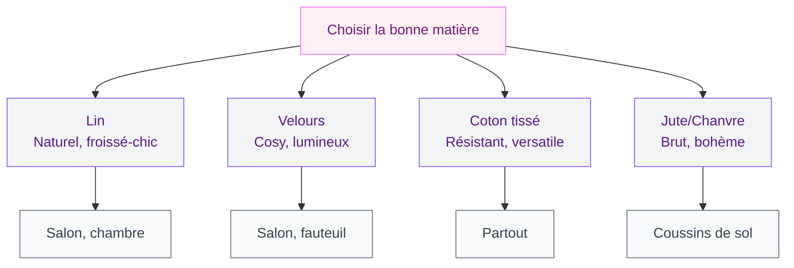
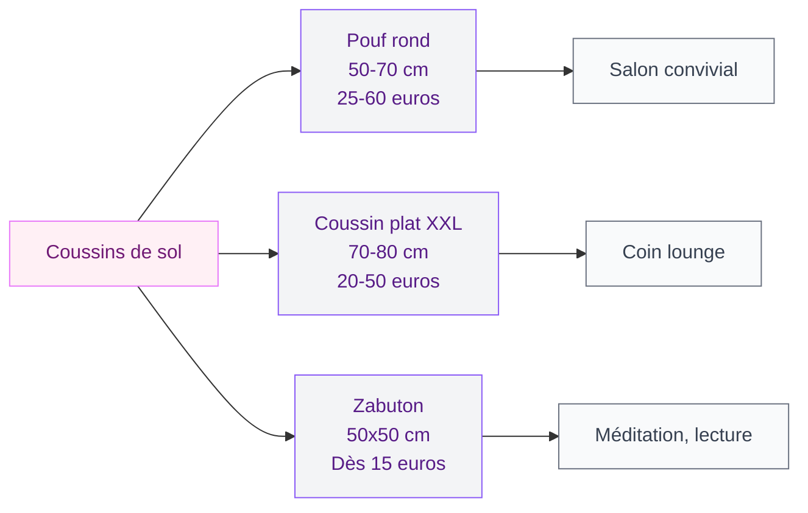
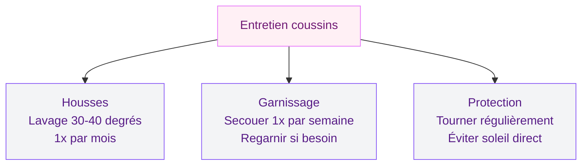

Un canapé sans coussins, c'est comme une tartine sans beurre : ça fonctionne, mais il manque quelque chose. Les coussins décoratifs transforment un salon "correct" en un espace où tu as envie de t'installer. Et c'est la façon la plus rapide et la moins chère de changer l'ambiance d'une pièce.

Que tu veuilles relooker ton canapé, rendre ton fauteuil accueillant ou créer un coin sol cosy, je t'explique tout : tailles, matières, couleurs, et où trouver les bons plans sans exploser ton budget.

## Pourquoi les coussins changent tout dans ta déco

Tu as peut-être remarqué : dans les magazines déco et les photos Pinterest qui te font rêver, il y a toujours des coussins. Ce n'est pas un hasard. Ils apportent trois choses en un seul accessoire.

  

D'abord, **la couleur**. Même avec un canapé gris ou beige, deux ou trois coussins dans des tons de sauge, de terracotta ou de moutarde suffisent à donner du caractère. Et quand tu te lasses, tu changes les housses plutôt que le canapé - ça coûte 15 euros au lieu de 800.

Ensuite, **la texture**. Un coussin en lin froissé à côté d'un velours lisse, avec un troisième en tricot grossier : tu crées de la richesse visuelle sans rien ajouter d'autre.

Et puis, **le confort**. Un canapé rigide devient moelleux, un fauteuil ferme se fait douillet, un coin sol devient un vrai nid.

> [!TIP]
> Pour un résultat harmonieux, choisis tes coussins en trois tailles différentes. La règle classique : un grand (60x60 cm) au fond, un moyen (50x50 cm) devant, et un petit (40x40 cm) ou un rectangulaire (30x50 cm) en touche finale.

## Les matières à connaître (et celles à éviter)

Tous les coussins ne se valent pas. Le garnissage et la housse changent complètement le rendu et le confort. Voici un tour des matières les plus courantes avec leurs avantages et leurs limites.

  

### Le lin : le chouchou des intérieurs naturels

Le lin, c'est la star des coussins déco en 2026. Son aspect froissé-chic donne un rendu décontracté et élégant. Il vieillit bien, se lave facilement, et respire en été. Par contre, il se froisse - mais c'est justement son charme.

Budget : 15-30 euros la housse chez H&M Home ou IKEA. Chez Harmony Textile ou Linge Particulier, ça grimpe à 40-70 euros, mais la qualité du tissage est supérieure.

### Le velours : la touche cosy par excellence

Le velours apporte un côté luxueux et douillet. Il capte la lumière de façon magnifique - un coussin vert bouteille ou prune change selon l'heure de la journée. Matière idéale pour les salons qui manquent de chaleur.

Attention : le velours attire les poils d'animaux et marque au toucher. Si tu as un chat ou un chien, choisis du velours foncé ou du côtelé, plus résistant. Budget : 10-20 euros chez Zara Home, 25-45 euros chez La Redoute.

### Le coton tissé et le jacquard

Le coton tissé ou le jacquard à motifs sont des valeurs sûres. Résistants, faciles à laver, ils existent dans des milliers de motifs. C'est le choix idéal si tu veux des coussins à motifs sans investir trop.

Les housses en coton jacquard géométrique se trouvent en lot de 4 sur Amazon entre 20 et 35 euros le set.

### Le jute et les fibres naturelles

Pour les coussins de sol, le jute et le chanvre donnent un rendu brut et authentique, parfait pour un style bohème. Ces matières sont plus rigides - pas idéal pour s'y blottir longtemps. Combine un coussin jute avec un tapis dans la même veine : notre guide sur les [tapis en fibre naturelle](/choisir-tapis-fibre-naturelle/) te donnera des idées.

> [!WARNING]
> Évite le polyester bas de gamme à tout prix. Oui, il est pas cher (5-8 euros le coussin), mais il se déforme vite, il peluche et surtout il donne un aspect "cheap" à toute ta déco. Mieux vaut deux bons coussins que six mauvais.

## Coussins pour le canapé : combien, comment, où ?

La question que tout le monde se pose : combien de coussins mettre sur un canapé ? Trop peu, c'est plat. Trop, c'est encombrant et tu ne sais plus où t'asseoir.

  

### La règle des nombres impairs

Les designers utilisent presque toujours un nombre impair : 3, 5 ou 7 selon la taille du canapé. L'oeil humain trouve les groupes impairs plus dynamiques. Un 2 places supporte bien 3 coussins, un 3 places sera parfait avec 5, et un grand angle peut monter à 7.

### L'art du mixage

Ne prends pas tous tes coussins identiques - c'est l'erreur classique. Mixe en gardant un fil conducteur :

1. **Choisis une palette de 2-3 couleurs** qui se complètent (par exemple terracotta, crème et vert olive)
2. **Mixe les textures** : un uni en velours, un à motifs en coton, un en lin froissé
3. **Varie les tailles** : du plus grand au fond vers le plus petit devant
4. **Garde un élément commun** : même famille de couleurs, même style de motifs ou même matière dans des teintes différentes

Si tu cherches l'inspiration pour la palette couleur de tout ton salon, notre guide sur les [couleurs du salon 2026](/couleurs-du-salon-2026-palettes-de-murs-et-de-decors/) te donnera plein d'idées d'associations.

> [!NOTE]
> Un coussin rectangulaire (30x50 cm) placé devant un coussin carré donne immédiatement un rendu "décoré" à ton canapé. C'est le petit détail qu'on voit chez les décorateurs et qui change tout, pour seulement 10 à 20 euros.

## Coussins pour fauteuil : sublimer une assise

Un fauteuil avec un coussin bien choisi, c'est un fauteuil dans lequel tu as immédiatement envie de t'installer. Mais attention, l'espace est plus réduit que sur un canapé - il faut être précis.

  

### Le bon format pour chaque fauteuil

Pour un fauteuil classique (bergère ou club), un coussin carré de 40x40 ou 45x45 cm suffit. Pour un fauteuil large type papasan, un coussin de 50x50 cm ou deux petits de 30x30 cm placés en biais.

Pour les fauteuils de terrasse, les coussins d'assise outdoor (40x40 ou 45x45 cm) se vendent en lot de 4 entre 30 et 60 euros chez IKEA ou Amazon. Choisis des housses déperlantes et anti-UV.

Si tu réfléchis au fauteuil lui-même, nos conseils pour [choisir ta chaise de salon](/chaise-salon/) t'aideront à trouver la bonne combinaison.

### Couleur du coussin vs couleur du fauteuil

La règle de base : le coussin contraste avec le fauteuil. Fauteuil coloré (bleu canard, vert) = coussin neutre (crème, écru). Fauteuil neutre (gris, beige, noir) = coussin qui claque - moutarde, corail, imprimé wax.

## Les coussins de sol : un coin détente à petit prix

Les coussins de sol font un retour en force. Ils créent un espace informel, parfait pour bouquiner, jouer avec les enfants ou accueillir des invités quand le canapé est plein.

  

### Quel type de coussin de sol choisir ?

Il existe trois grandes familles :

- **Les poufs ronds** (diamètre 50-70 cm, épaisseur 15-20 cm) : le plus classique. En coton tissé, en jute tressée ou en cuir, ils sont stables et confortables. Budget : 25-60 euros chez Maisons du Monde ou La Redoute.
- **Les coussins plats XXL** (70x70 cm ou 80x80 cm) : ils se posent au sol et peuvent se superposer pour créer un vrai coin lounge. En lin, en coton ou en velours. Budget : 20-50 euros pièce chez H&M Home ou IKEA.
- **Les zabutons japonais** (50x50 cm environ, assez plats) : parfaits pour un coin méditation ou un style minimaliste. Souvent en coton matelassé, à partir de 15 euros chez Muji ou sur Etsy.

### Où placer tes coussins de sol ?

Le meilleur spot : près d'une fenêtre avec de la lumière naturelle, sur un tapis, avec une caisse en bois à côté pour poser une tasse. Si tu veux pousser l'ambiance, un style [décoration minimaliste](/decoration-minimaliste-idees-et-photos-faciles/) avec coussins de sol en lin et tapis jute, c'est l'harmonie parfaite.

## Les styles tendance 2026 pour tes coussins

Chaque année apporte ses influences. En 2026, trois grandes directions se dessinent en matière de coussins déco.

### Le style wax et motifs africains

Les imprimés wax - motifs colorés inspirés du textile ouest-africain - sont partout cette année. Sur un canapé neutre, un ou deux coussins wax dans des tons jaune, orange et marron apportent une énergie dingue. Budget : 15-35 euros la housse chez des créateurs sur Etsy.

L'astuce : pas plus de deux coussins à motifs forts sur le même canapé. Équilibre avec des unis dans les tons du motif.

### Le style japandi et tons neutres

À l'opposé, le japandi (japonais + scandinave) privilégie les tons doux : beige, taupe, gris perle. Coussins unis en matières naturelles (lin, coton épais, laine bouillie), textures subtiles. Budget : MUJI (15-30 euros), IKEA gamme SANELA (12-18 euros), H&M Home premium (20-40 euros).

### Le style graphique et géométrique

Les motifs géométriques - chevrons, losanges, rayures, triangles - restent un choix sûr pour apporter du dynamisme sans tomber dans l'excès. En noir et blanc sur un canapé coloré, ou en couleur sur un canapé neutre, ils s'adaptent à presque tous les intérieurs.

Les sets de 4 housses à motifs géométriques en coton se trouvent facilement entre 18 et 30 euros sur Amazon ou chez Primark Home.

> [!IMPORTANT]
> Pense à acheter des housses avec fermeture éclair plutôt que des coussins complets. Tu gardes les garnissages (qui durent des années) et tu changes juste les housses au fil des saisons. C'est plus économique et plus écologique.

## Entretien : comment garder tes coussins beaux longtemps

Un coussin bien entretenu dure 3 à 5 ans sans problème. Voici les gestes essentiels.

**Laver les housses** une fois par mois. Coton et lin passent en machine à 30-40 degrés. Velours : 30 degrés, programme délicat, pas de sèche-linge.

**Regonfler le garnissage** : secoue tes coussins chaque semaine. Si le garnissage s'aplatit, ajoute de la ouate en vrac (5-10 euros le kilo chez Mondial Tissus).

**Protéger du soleil** : les coussins près d'une fenêtre exposée décolorent avec le temps. Tourne-les régulièrement ou utilise des rideaux filtrants. D'ailleurs, consulte nos conseils sur les [erreurs de rideaux à éviter](/erreurs-rideaux/) pour harmoniser ta fenêtre.

## Où acheter tes coussins décoratifs : le comparatif prix

Pour que tu puisses faire ton shopping en connaissance de cause, voici un récapitulatif des prix selon les enseignes et les gammes.

| Enseigne | Gamme | Prix moyen (housse) | Points forts |
|----------|-------|---------------------|--------------|
| IKEA | SANELA, GURLI | 8-18 euros | Rapport qualité-prix, velours correct |
| H&M Home | Lin, coton | 12-30 euros | Matières naturelles, couleurs tendance |
| Zara Home | Velours, lin lavé | 20-40 euros | Design soigné, belles textures |
| La Redoute | AM.PM, intérieur | 15-45 euros | Large choix, promos fréquentes |
| Maisons du Monde | Tous styles | 10-35 euros | Motifs variés, collections saison |
| Amazon | Sets de housses | 18-35 euros (lot 4) | Économique en lot, livraison rapide |
| Etsy | Artisanale, wax | 15-50 euros | Pièces uniques, créateurs indépendants |

## FAQ - Les questions que tu te poses sur les coussins déco

### Combien de coussins mettre sur un canapé 3 places ?

L'idéal, c'est 5 coussins : deux grands (60x60 cm) dans les angles, deux moyens (50x50 cm) devant, et un rectangulaire (30x50 cm) au centre. Si ça te semble beaucoup, 3 coussins bien choisis fonctionnent aussi. Varie les tailles et les textures.

### Quelles couleurs de coussins choisir pour un canapé gris ?

Le gris se marie avec quasiment tout, ce qui est à la fois un avantage et un piège. Pour un rendu chaleureux : moutarde, terracotta, ocre. Pour une ambiance fraîche et contemporaine : bleu canard, vert sauge, blanc cassé. Évite le gris sur gris, sauf si tu varies les textures (un velours gris foncé avec un lin gris clair, par exemple).

### Quel garnissage choisir pour un coussin déco ?

La plume d'oie donne le rendu le plus moelleux (20-40 euros le garnissage seul). La fibre polyester creuse est un bon compromis : hypoallergénique et lavable, 8-15 euros. La mousse, plus ferme, est à réserver aux coussins d'assise (sol ou fauteuil).

### Comment laver des coussins décoratifs sans les abîmer ?

Retire la housse et lave-la séparément. Coton et lin : machine à 30-40 degrés. Velours : 30 degrés max, séchage à plat. Le garnissage synthétique passe en machine à 30 degrés. Le garnissage plume se lave à 40 degrés avec deux balles de tennis pour éviter l'agglomération.

### Peut-on utiliser des coussins d'intérieur en extérieur ?

Non. Les coussins d'intérieur (coton, lin, velours) n'ont pas de traitement déperlant ni anti-UV. Pour la terrasse, choisis des coussins outdoor en oléfine ou acrylique teinte masse (15-25 euros pièce) qui résistent à la pluie, aux UV et aux taches.
