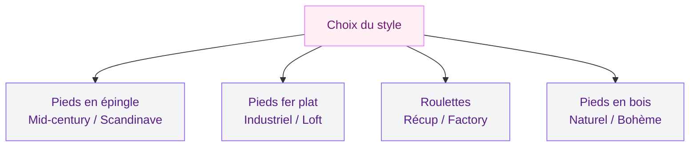
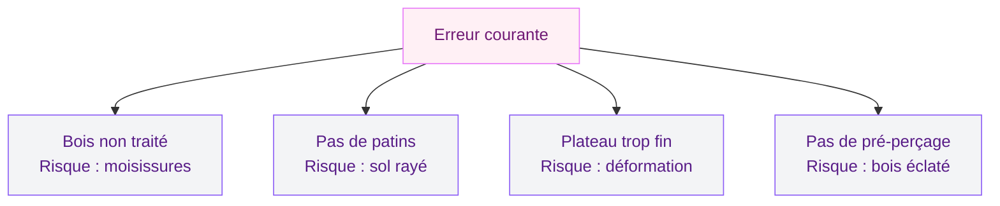

Tu as envie d'une table basse qui ne ressemble à rien de ce qu'on trouve en magasin ? Le genre de pièce qui fait dire à tes invités "c'est toi qui l'as faite ?!" avec un air impressionné ? Bonne nouvelle : fabriquer sa propre table basse, c'est un projet DIY accessible même si tu n'as jamais touché une perceuse de ta vie.

Et le meilleur dans tout ça ? Tu vas dépenser entre 30 et 200 euros pour un meuble qui vaudrait trois fois plus en boutique déco. Je t'explique tout, du choix du plateau aux finitions qui font la différence.

## Pourquoi fabriquer sa table basse plutôt que l'acheter

Le marché des tables basses, c'est souvent deux extrêmes : les modèles à 49 euros chez Ikea (corrects mais tout le monde a les mêmes) ou les pièces design à 600-1200 euros chez Made.com ou AM.PM. Entre les deux ? Pas grand-chose.

  

Fabriquer ta propre table basse te permet de créer un meuble pile à tes dimensions, dans le style exact que tu veux, et surtout avec un budget maîtrisé. Tu choisis le bois, la forme, les pieds, la finition - chaque détail est personnalisé.

L'autre avantage que je trouve génial : tu peux changer de plateau ou de pieds quand tu te lasses. J'ai vu des copines garder les mêmes pieds en métal pendant cinq ans et simplement changer le plateau au gré de leurs envies. C'est un meuble évolutif, et ça, aucun magasin ne te le proposera.

> [!TIP]
> Avant de te lancer, mesure bien ton canapé et ton espace salon. Une table basse idéale fait entre 40 et 45 cm de hauteur, et sa longueur devrait représenter environ deux tiers de celle de ton canapé.

## Choisir le bon plateau : le coeur de ta table basse

Le plateau, c'est ce que tout le monde voit en premier. C'est lui qui donne le style à ta table. Voici les options les plus populaires, avec les prix réels que tu trouveras en 2026.

  

### Le plateau en bois massif

C'est le choix classique et indémodable. Une planche de chêne massif de 100 x 60 cm coûte entre 40 et 80 euros en scierie ou chez un grossiste bois. Chez Leroy Merlin, le plateau chêne lamellé-collé de 120 x 60 cm tourne autour de 55 euros.

Le bois massif a un grain unique, des imperfections naturelles, des nuances de couleur qui rendent chaque table différente. Si tu aimes le style scandinave ou naturel, c'est ton allié numéro un.

Pour la finition, un saturateur bois incolore (Blanchon, environ 25 euros le litre) protège le bois tout en gardant son aspect brut. Si tu veux un effet plus soutenu, l'huile teintée Rubio Monocoat (35-40 euros) donne un rendu magnifique en une seule couche.

### Le plateau en palette recyclé

Le grand classique du DIY déco ! Les palettes Europe se récupèrent gratuitement derrière les magasins de bricolage ou sur Le Bon Coin pour 0 à 5 euros pièce. Si tu apprécies le style récup, tu adoreras aussi notre guide pour [fabriquer un bar en palettes](/comment-fabriquer-soi-meme-un-bar-en-palettes/) - les techniques de base sont les mêmes.

Deux palettes empilées avec des roulettes en dessous, ça te donne une table basse en 2 heures chrono. Mais attention : toutes les palettes ne se valent pas.

> [!WARNING]
> Utilise uniquement des palettes marquées "EUR" ou "EPAL" - elles sont traitées thermiquement (marquage HT). Évite les palettes avec un marquage MB (bromure de méthyle, un pesticide toxique). En cas de doute, passe ton chemin.

### Le plateau en verre ou plexiglas

Pour un look contemporain et aérien, un plateau en verre trempé de 8 mm (environ 60-90 euros sur mesure chez un vitrier ou sur mesure-verre.com) apporte de la légèreté. Le plexiglas est moins cher (30-50 euros) et incassable, mais il se raye plus facilement.

### Le plateau récup original

C'est là que ta créativité entre en jeu. J'ai vu des tables basses fabriquées avec une vieille porte en bois, un volet récupéré chez Emmaüs, un couvercle de malle ancienne, ou même un plateau de jeu de société géant intégré sous une vitre. Les recycleries sont une vraie mine d'or pour trouver l'objet qui deviendra ton plateau signature.

## Les pieds : ce petit détail qui change tout

Une fois ton plateau choisi, les pieds vont définir l'allure finale de ta table basse. Et contrairement à ce qu'on pense, tu n'as pas besoin de les fabriquer toi-même.

  

### Les pieds en épingle (hairpin legs)

C'est LE best-seller du moment pour les tables basses DIY. Les pieds en épingle en acier donnent un look mid-century moderne très réussi. Chez La Fabrique des Pieds, un lot de 4 pieds de 40 cm coûte environ 35-50 euros. Sur Amazon, tu trouves des lots équivalents entre 25 et 40 euros.

Avantage : la fixation est ultra simple. Quatre vis par pied, directement dans le plateau. En 20 minutes, ta table est assemblée.

### Les pieds en fer plat

Pour un style plus industriel, les pieds en fer plat (en U, en X ou en trapèze) apportent du caractère. Compte 50 à 90 euros pour un jeu de deux pieds chez un artisan métalier sur Etsy ou chez La Fabrique des Pieds. Le rendu avec un plateau en bois brut est vraiment canon.

### Les roulettes industrielles

Si tu veux pouvoir déplacer ta table facilement (pratique pour le ménage ou pour reconfigurer ton salon), des roulettes industrielles vintage à 15-25 euros les 4 chez Leroy Merlin ou Brico Dépôt complètent parfaitement un plateau en palette.

### Les pieds en bois tournés ou biseautés

Pour un look plus classique ou bohème, des pieds de table en bois tourné se trouvent chez Nordlinger Pro entre 20 et 40 euros les 4. Tu peux aussi récupérer les pieds d'un vieux meuble en brocante et les adapter à ta table - c'est du [upcycling](/decoration-recup-upcycling-maison-unique/) pur et simple, et le résultat a souvent bien plus de personnalité.

> [!NOTE]
> Quelle que soit l'option choisie, vérifie que la hauteur de tes pieds + l'épaisseur du plateau donne bien entre 35 et 45 cm de hauteur totale. En dessous de 35 cm, tu seras trop basse par rapport à un canapé standard.

## 6 projets concrets pour te lancer ce week-end

Assez de théorie, place à la pratique ! Voici 6 idées de tables basses originales, classées de la plus simple à la plus élaborée.

  

### 1. La table palette express (budget : 15-30 euros)

La plus rapide à réaliser. Prends une palette EPAL, ponce-la au grain 80 puis 120, applique deux couches de lasure ou de vernis mat, et fixe 4 roulettes en dessous. Temps de réalisation : 2 heures (hors séchage).

Pour un look plus soigné, démonte les lames du dessous pour ne garder que le plateau supérieur et ses traverses. Ça allégera visuellement l'ensemble.

### 2. La table en chêne + hairpin legs (budget : 80-130 euros)

Mon combo préféré pour un résultat "boutique déco" à petit prix. Un plateau chêne lamellé-collé 100 x 60 cm (55 euros chez Leroy Merlin), 4 pieds en épingle de 40 cm (35 euros), une ponceuse orbitale et un saturateur bois.

Étapes : ponce le plateau au grain 150, arrondis légèrement les bords à la cale à poncer, applique 2 couches de saturateur, visse les pieds. C'est tout. Le résultat vaut facilement une table à 350 euros en magasin.

### 3. La table touret industrielle (budget : 20-60 euros)

Les tourets de câble électrique sont souvent donnés gratuitement sur les chantiers ou vendus 10-20 euros sur Le Bon Coin. Ponce, traite le bois, et tu as une table ronde ultra originale. Pour un rendu plus raffiné, peins le pied central en noir mat et laisse le plateau en bois naturel.

### 4. La table caisse de vin empilées (budget : 10-30 euros)

Quatre caisses de vin en bois (récupérées gratuitement chez un caviste ou 2-5 euros pièce en recyclerie) disposées en carré, vissées entre elles, plateau en verre posé dessus. Tu obtiens une table avec rangement intégré au centre - parfait pour les magazines et les télécommandes.

### 5. La table béton + bois (budget : 50-100 euros)

Pour les plus audacieuses. Un plateau en béton ciré coulé dans un coffrage, monté sur des pieds en bois. Le béton ciré (kit Résinence à 45 euros chez Castorama) te permet de couler un plateau de 80 x 60 cm. Le contraste béton/bois est très tendance et apporte un côté brut-chic au salon.

### 6. La table porte ancienne (budget : 30-80 euros)

Trouve une vieille porte en bois chez Emmaüs ou en recyclerie (10-30 euros), découpe-la aux bonnes dimensions si besoin, ponce et vernis, puis ajoute des pieds en épingle ou des pieds en X industriels. Les moulures et les patines d'origine donnent un cachet impossible à reproduire avec du neuf.

## Les outils dont tu as vraiment besoin

Pas la peine d'investir dans un atelier complet. Pour la plupart de ces projets, tu auras besoin de :

  

- **Une ponceuse orbitale** : la Bosch PEX 300 AE (environ 60 euros) ou la Black+Decker KA280K (40 euros) font parfaitement l'affaire. Tu peux aussi en louer une chez Kiloutou pour 15 euros la journée.
- **Une visseuse-perceuse** : la Bosch EasyDrill 18V (50 euros) ou un modèle équivalent. C'est l'outil le plus utile que tu puisses avoir chez toi.
- **Du papier abrasif** : grains 80, 120 et 150. Un lot de feuilles chez Brico Dépôt coûte 3-4 euros.
- **Des vis à bois** : 4 x 30 mm pour la plupart des assemblages pieds/plateau. Un sachet de 50 vis coûte moins de 3 euros.

Si tu veux aller plus loin dans les projets DIY mobilier, jette un oeil à notre guide pour [fabriquer un bureau avec des caissons](/guides/decoration/fabriquer-un-bureau-avec-des-caissons/) - la logique de construction est très similaire.

> [!IMPORTANT]
> Pense toujours à protéger ton sol pendant le ponçage ! Un vieux drap ou une bâche plastique évitera les rayures et simplifiera le nettoyage. Et si tu ponces à l'intérieur, ouvre bien les fenêtres et porte un masque anti-poussière.

## Les finitions qui font la différence

Une table basse brute, c'est déjà beau. Mais avec quelques gestes supplémentaires, tu passes du "fait maison" au "fait sur mesure".

**Le chanfrein des bords** - Avec une cale à poncer, arrondis légèrement les arêtes de ton plateau. Ça évite les angles vifs (surtout si tu as des enfants) et ça donne un look plus travaillé.

**La teinte** - Une huile teintée change complètement l'aspect du bois. Le chêne naturel devient noyer foncé, le pin basique prend une allure scandinave blonde. Rubio Monocoat propose plus de 40 teintes (35-40 euros), et une seule couche suffit.

**Le bois brûlé (Shou Sugi Ban)** - Technique japonaise qui consiste à brûler légèrement la surface du bois au chalumeau, puis à brosser et huiler. Le résultat est noir, texturé, et complètement waterproof. C'est spectaculaire sur un plateau en pin ou en sapin.

**Le pochoir ou le stencil** - Pour une touche graphique, un pochoir mandala ou géométrique peint sur le plateau apporte de l'originalité. Les pochoirs grand format se trouvent entre 5 et 15 euros chez Cultura ou sur Etsy. Si tu as déjà [peint du verre ou du bois](/guides/decoration/peindre-sans-poncer/), la technique est similaire.

## Erreurs classiques à éviter

Après avoir vu (et parfois fait) pas mal de tables basses DIY, voici les pièges les plus courants :

**Ne pas traiter le bois de palette** - Une palette non poncée et non traitée va s'éclater, piquer et éventuellement moisir. Le ponçage + 2 couches de lasure, c'est le minimum.

**Oublier les patins** - Des patins en feutre sous les pieds de ta table (2-3 euros chez Ikea) protègent ton parquet et évitent les bruits quand tu la bouges. Un détail qui change la vie au quotidien.

**Choisir un plateau trop fin** - En dessous de 18 mm d'épaisseur, un plateau en bois risque de vriller avec le temps, surtout s'il est large. Vise 22 à 30 mm minimum pour un rendu solide et durable.

**Ne pas pré-percer avant de visser** - Sur du bois dur comme le chêne, visser directement sans pré-percer fait éclater le bois. Un foret de 3 mm avant chaque vis, ça prend 10 secondes et ça sauve ton projet.

## Sur le meme theme

- [artisanat recyclé pour la maison](/guides/decoration/artisanat-avec-des-materiaux-recycles-pour-la-maison/)
- [fabriquer un four à pizza](/guides/decoration/fabriquer-four-a-pizza/)
- [pneus recyclés pour la déco](/guides/decoration/pneus-recycles-pour-la-decoration/)

## FAQ

### Quel budget prévoir pour une table basse DIY ?

Entre 15 et 200 euros selon le projet. Une table palette + roulettes revient à 15-30 euros, tandis qu'une table en chêne massif avec pieds en métal design peut monter à 130-200 euros. Dans tous les cas, c'est deux à quatre fois moins cher que l'équivalent en magasin.

### Combien de temps faut-il pour fabriquer une table basse ?

Les projets les plus simples (palette + roulettes) prennent 2 heures hors séchage. Une table avec plateau poncé, teinté et pieds vissés demande une demi-journée. Le séchage des finitions ajoute 24 à 48 heures selon le produit utilisé.

### Quels outils sont vraiment nécessaires pour débuter ?

Une visseuse-perceuse et du papier abrasif suffisent pour les projets de base. Une ponceuse orbitale (40-60 euros) accélère beaucoup le travail si tu comptes faire plusieurs projets. Tout le reste peut se louer chez Kiloutou ou Loxam à la journée.

### Comment protéger le bois d'une table basse DIY ?

Le saturateur bois ou l'huile dure sont les meilleurs choix pour un usage quotidien. Ils pénètrent dans le bois (donc pas de film qui s'écaille), résistent aux taches de café et de verre, et se renouvellent facilement une fois par an. Évite le vernis brillant qui marque chaque micro-rayure.
