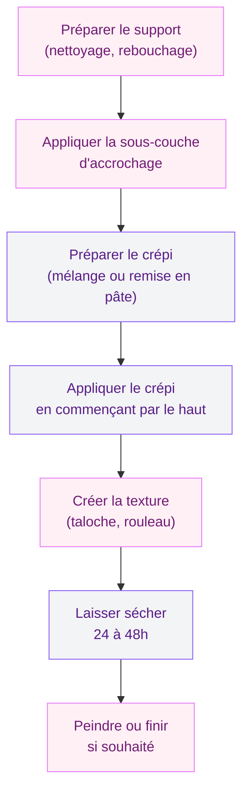

Tu as un mur abîmé, des inégalités qui t'agacent depuis des mois, ou tu cherches simplement à donner du relief et du caractère à ta déco ? Crépir un mur intérieur, c'est une technique accessible qui change vraiment la donne. Pas besoin d'être un pro du bâtiment : avec les bons outils, la bonne méthode et un peu de patience, tu obtiens un rendu qui en jette - et qui dure.

Dans cet article, je te guide pas à pas, de la préparation du support jusqu'aux finitions. On parle aussi des matériaux, des erreurs à éviter et des astuces pour gagner du temps. Allez, on s'y met !

## Qu'est-ce que le crépi intérieur exactement ?

Le crépi intérieur, c'est un enduit décoratif qu'on applique sur les murs pour créer une texture, masquer des défauts ou simplement apporter du caractère à une pièce. Contrairement au crépi extérieur, formulé pour résister aux intempéries, le crépi intérieur est conçu pour les conditions stables d'une pièce de vie.

  

Il se décline en plusieurs composants selon ce que tu veux obtenir :
- **Crépi à base de plâtre** : léger, facile à travailler, idéal pour les pièces à faible humidité (salon, chambre)
- **Crépi à base de chaux** : plus respirant, parfait pour les pièces humides ou les maisons anciennes
- **Enduit décoratif en résine** : ultra résistant, large choix de textures, super pour les salles de bain ou cuisines

La texture varie aussi beaucoup : crépi fin (grain discret), crépi moyen, crépi ribé (effet rayé), taloché (finition lisse-texturée). Chaque rendu crée une ambiance différente - le crépi taloché donne un côté brut très tendance en ce moment, tandis que le crépi fin se fond dans des intérieurs plus classiques.

> [!NOTE]
> Le crépi intérieur n'est pas que décoratif : il comble les petites fissures, régularise les surfaces irrégulières et améliore l'acoustique d'une pièce. Deux raisons valables pour se lancer !

## Le matériel dont tu as besoin

Avant de te lancer, réunis tout le matériel. Rien de plus frustrant que de commencer et de réaliser qu'il te manque un outil clé.

  

**Outils indispensables :**
- Une taloche (la plaque rectangulaire en plastique ou en bois pour tenir le crépi)
- Un couteau à enduire ou une spatule large
- Un rouleau à crépir (rouleau nid d'abeille pour les textures, rouleau classique pour les finitions lisses)
- Un bac à peinture
- Du papier de masquage et du scotch de peintre
- Des bâches de protection pour le sol et les meubles

**Pour la préparation :**
- Brosse métallique
- Ponceuse ou papier de verre grain 80-120
- Produit de dégraissage ou eau savonneuse
- Gobeletage (produit d'accrochage) si le support est très lisse

**Budget indicatif :**
Pour 10 m² de mur, compte environ 30 à 60€ de matériaux (crépi + apprêt). Le matériel de base (taloche, rouleau, couteau) te revient entre 25 et 50€ si tu ne l'as pas déjà. Chez Leroy Merlin ou Castorama, tu trouves facilement des kits crépi débutant autour de 35-45€.

## Étape 1 : préparer le support

C'est l'étape que beaucoup bâclent - et c'est exactement là que tout se joue. Un crépi appliqué sur un mur mal préparé va claquer, se fissurer ou se décoller dans les mois qui suivent. Prends le temps de faire les choses bien, et tu n'auras pas à recommencer.

  

**Nettoie le mur :** enlève toute trace de poussière, graisse ou ancienne peinture qui se décolle. Un coup de brosse métallique sur les zones fragiles, puis un passage à l'eau savonneuse. Laisse sécher complètement - au moins 24 heures.

**Rebouche les fissures :** utilise un enduit de rebouchage pour les fissures fines. Pour les fissures larges (plus de 2 mm), passe d'abord un enduit de rebouchage fibre. Laisse sécher selon les indications du fabricant.

**Ponce si nécessaire :** si ton mur a des aspérités importantes ou d'anciens reliefs de peinture, ponce légèrement pour homogénéiser la surface. Aspire la poussière ensuite.

**Applique une sous-couche d'accrochage :** sur les supports très lisses (placo neuf, béton poli), un gobeletage ou une impression d'accrochage est recommandé. Ce produit crée une surface rugueuse qui va retenir le crépi. Chez Leroy Merlin, le Semin Gobetis coûte environ 18€ pour 5 kg - largement suffisant pour une pièce.

> [!WARNING]
> Ne saute pas l'étape de la sous-couche sur du placo neuf ou du béton lisse. Sans accrochage, ton crépi risque de se décoller en plaques entières quelques mois après la pose. C'est une des erreurs les plus courantes chez les bricoleurs débutants.

## Étape 2 : préparer le crépi

Si tu utilises un crépi en poudre (à mélanger), respecte bien les proportions eau/poudre indiquées sur le sac. En général : 1 volume d'eau pour 3 volumes de poudre.

  

Mélange dans un grand seau avec un malaxeur (ou une perceuse équipée d'un fouet) jusqu'à obtenir une consistance homogène, sans grumeaux. La texture idéale ressemble à une pâte épaisse qui ne coule pas de la taloche quand tu la renverses légèrement.

Pour les crépis prêts à l'emploi en seau (Parexlangro, Weber, Knauf), c'est encore plus simple : tu mélangez juste légèrement si la matière s'est décantée, et c'est parti.

> [!TIP]
> Humidifie ta taloche et ton rouleau avant de commencer. Ça évite que le crépi colle trop aux outils et te facilite la vie pour les passages ultérieurs. Un simple rinçage à l'eau claire suffit.

## Étape 3 : appliquer le crépi

C'est là que la technique entre en jeu. Voici la méthode qui marche :

  

**1. Commence par le haut du mur.** Dépose une quantité de crépi sur ta taloche avec le couteau à enduire. Applique par zones de 50 cm x 50 cm environ, en appuyant fermement sur la taloche tout en faisant des mouvements circulaires ou verticaux selon la texture que tu veux.

**2. Travaille en couches régulières.** L'épaisseur idéale est d'environ 1 à 1,5 cm. Trop fin, le crépi ne tient pas bien. Trop épais, il risque de craqueler en séchant.

**3. Enchaine les zones sans laisser de joints secs.** Si tu travailles par sections, fais attention à reprendre chaque zone avant que la précédente soit sèche. Les raccords visibles sur un crépi sec sont très difficiles à rattraper.

**4. Crée la texture souhaitée.** Selon le rendu voulu :
- Texture circulaire : mouvements ronds avec la taloche
- Texture verticale : passages du haut vers le bas
- Texture au rouleau : passe le rouleau nid d'abeille sur le crépi encore frais pour créer un relief plus prononcé

## Étape 4 : le séchage

Le crépi intérieur demande en général 24 à 48 heures pour sécher complètement. Ce délai varie selon :
- L'épaisseur appliquée (plus c'est épais, plus c'est long)
- L'humidité de la pièce
- La température ambiante (en dessous de 10°C, le séchage ralentit beaucoup)

Pendant le séchage, évite les courants d'air directs et les variations de température brutales. Pas besoin de chauffer la pièce à fond non plus - une température entre 15 et 25°C est idéale.

Tu peux vérifier que le crépi est sec en appuyant légèrement du doigt : il doit être dur et ne laisser aucune empreinte.

## Étape 5 : finitions et peinture

Une fois sec, ton crépi peut rester en état naturel (gris ou blanc selon le produit) ou recevoir une peinture. Le crépi non peint a un charme brut très tendance - surtout en nuances de beige, sable ou gris clair.

Si tu veux peindre :
1. Applique d'abord une couche d'impression pour crépi (sous-couche spécifique)
2. Attends le temps de séchage indiqué (souvent 4 heures)
3. Applique ta peinture en deux couches, au rouleau à poils longs pour bien pénétrer dans les reliefs

Pour une finition sympa et durable sur un crépi texturé, les peintures mat ou velours rendent mieux que les peintures brillantes qui accentuent chaque irrégularité.

> [!TIP]
> Si tu veux garder l'aspect naturel de ton crépi tout en le protégeant (surtout en cuisine ou salle de bain), une couche de lasure transparente mate fait très bien le job. Chez Leroy Merlin, la Luxens Vernis Murs & Plafonds coûte environ 15€ pour 0,75 L.

## Choisir entre DIY et faire appel à un pro

Honnêtement ? Crépir un mur intérieur de moins de 20 m², c'est tout à fait faisable seul si tu es à l'aise avec les travaux de peinture de base. Le résultat ne sera peut-être pas aussi parfait qu'un artisan expérimenté, mais avec de la patience il sera largement satisfaisant.

Pour les grandes surfaces, les pièces humides (salle de bain, cuisine) ou si tu veux un crépi décoratif avec des effets complexes (béton ciré, stuc vénitien), mieux vaut faire appel à un professionnel. Compte environ 25 à 45€ par m² pour une pose de crépi intérieur par un artisan, main d'oeuvre comprise.

## Les erreurs courantes (et comment les éviter)

Quelques pièges dans lesquels presque tout le monde tombe au moins une fois :

**Crépir sur un mur humide.** Si ton mur présente des traces d'humidité ou de salpêtre, règle d'abord le problème source. Le crépi n'est pas un traitement anti-humidité - il masque temporairement mais le problème revient.

**Appliquer trop fin ou trop épais.** En dessous de 5 mm, le crépi tient mal et se fissure. Au-delà de 2 cm, le poids propre peut faire décrocher la couche. Vise 1 à 1,5 cm et tu seras dans la zone idéale.

**Laisser des raccords secs.** Travaille section par section en reprenant toujours sur du frais. Si tu dois t'arrêter, trace une ligne droite avec du scotch de peintre - tu reprendras proprement de l'autre côté.

**Oublier de protéger le sol et les meubles.** Le crépi est très difficile à enlever une fois sec sur un parquet ou une toile de canapé. Prends 15 minutes pour bien protéger avant de commencer - tu me remercieras plus tard.

Si ta maison a des murs en parpaings que tu cherches à habiller, crépir est une alternative intéressante à [recouvrir les parpaings avec d'autres revêtements](/recouvrir-parpaings/) - les deux techniques sont complémentaires selon l'effet que tu recherches.

## Comment rénover un crépi existant ?

Tu as déjà du crépi mais il est abîmé, jauni ou simplement daté ? Pas besoin de tout arracher. Voici les options :

**Repeinture simple :** si la surface est saine mais défraîchie, une couche d'impression + deux couches de peinture suffisent. Résultat rapide et pas cher.

**Recrepage par-dessus :** si le crépi existant est stable (il ne se décolle pas, pas de cloque), tu peux appliquer une nouvelle couche par-dessus après avoir appliqué une sous-couche d'accrochage. Attention à ne pas trop alourdir le mur avec des couches successives.

**Dépose et recrépage complet :** si le crépi se décolle, craquèle ou présente des traces d'humidité, dépose l'ancien avec un burin et une masse, puis reprends depuis le début. Plus long, mais c'est la seule vraie solution.

> [!CAUTION]
> Si ta maison date d'avant 1997, fais analyser l'ancien crépi avant de le gratter. Certains crépis anciens contiennent de l'amiante. Une analyse coûte environ 30€ chez un laboratoire agréé - c'est un investissement qui en vaut la peine pour ta santé et celle de ta famille.

## Sur le meme theme

- [enduire un mur en parpaing](/comment-enduir-un-mur-en-parpaing/)
- [pistolet à calfeutrer](/pistolet-a-calfeutrer/)
- [isolation dalle béton](/isolation-dune-dalle-en-beton-techniques-options-disolation-et-cout/)

## Quelques inspirations déco avec le crépi

Le crépi intérieur revient fort dans les tendances déco 2025-2026. Quelques idées pour t'inspirer :

**Le mur unique texturé.** Un seul mur crépi dans un salon crée un point focal fort sans alourdir l'espace. Très efficace dans les petites pièces.

**Le crépi peint en couleur.** Un crépi taloché peint en terracotta, vert sauge ou bleu denim donne une profondeur de couleur qu'une peinture classique ne peut pas reproduire. L'irrégularité de la surface crée des variations lumineuses très organiques.

**L'effet béton.** Un crépi fin gris clair, taloché en finition lisse, imite l'effet béton ciré à une fraction du prix. Avec [un sol en lino peint](/peindre-lino/) dans la même palette, le résultat est vraiment bluffant.

**Le crépi brut nature.** Laissé sans peinture, en beige naturel ou blanc cassé, le crépi apporte une texture artisanale très en accord avec les tendances wabi-sabi et décoration naturelle du moment.

---

Crépir un mur intérieur, c'est l'un de ces travaux qu'on redoute avant de commencer et dont on est vraiment fier une fois terminé. La technique s'acquiert vite, les outils sont accessibles, et le rendu transforme vraiment un espace. La clé, c'est de ne pas bâcler la préparation - le reste suit naturellement.

Tu te lances sur quel mur en premier ?
