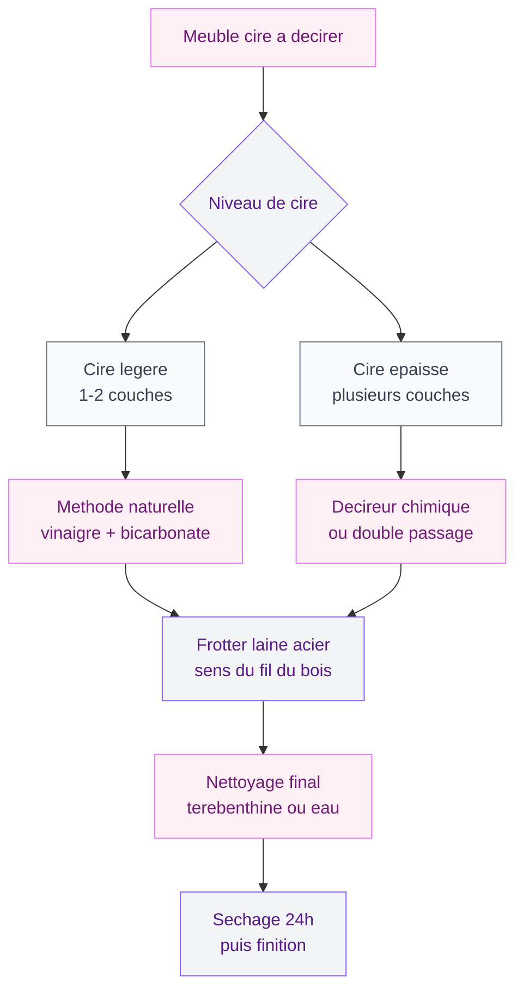
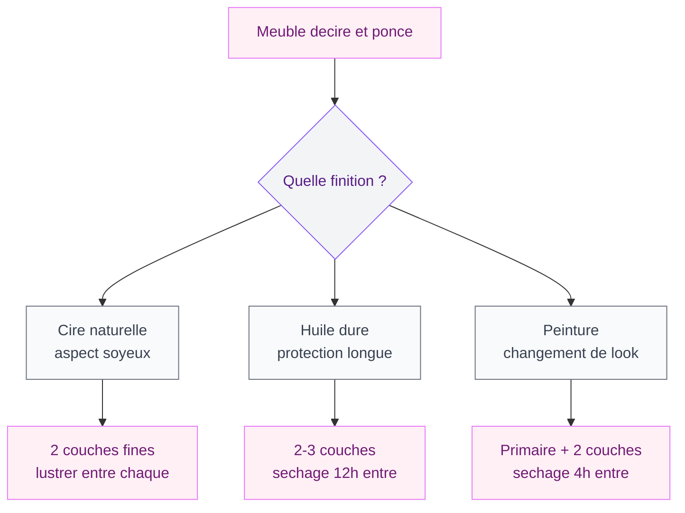

Tu as récupéré un vieux meuble en bois chez tes grands-parents ou en brocante, et tu veux lui donner une seconde vie ? Avant de peindre ou appliquer une nouvelle finition, il y a une étape clé : décirer le meuble. La cire accumulée au fil des années forme une barrière grasse qui empêche tout nouveau produit d'adhérer - résultat direct : ça s'écaille en quelques semaines.

Bonne nouvelle : tu peux décirer avec des produits naturels que tu as déjà dans ta cuisine. Je te montre tout, étape par étape.

## Pourquoi faut-il décirer un meuble avant de le rénover ?

La cire, c'est un produit gras qui pénètre dans les fibres du bois et forme un film protecteur en surface. Très bien pour entretenir un meuble ancien, mais cette couche grasse pose deux gros problèmes quand tu veux rénover :

- **La peinture n'accroche pas.** La cire repousse les produits à base d'eau (acryliques) et empêche même les peintures glycéro de bien adhérer.
- **Le nouveau vernis ou la nouvelle cire ne pénètre pas.** Les anciennes couches de cire saturent la surface du bois et bloquent l'absorption.

Si ton meuble a été ciré pendant des décennies, il a accumulé plusieurs couches superposées. Plus le bois est foncé et brillant, plus il y a de cire à retirer. Et si tu veux éclaircir le bois pour obtenir un rendu plus clair et moderne, le décapage complet est la première étape.

> [!NOTE]
> Un test rapide pour savoir si ton meuble est ciré : frotte un coin discret avec un chiffon imbibé d'essence de térébenthine. Si le chiffon se colore et que la surface devient mate, c'est bien de la cire.

## Le matériel dont tu as besoin

Prépare ton équipement avant de te lancer.

**Matériel de base :**
- Laine d'acier fine (grade 000 ou 0000)
- Brosse en nylon ou brosse à dents pour les moulures
- Chiffon en coton propre (vieux draps, t-shirts)
- Spatule en plastique (pas en métal, pour ne pas rayer)
- Papier de verre grain 120 et grain 180
- Gants de ménage et lunettes de protection

**Produits (au choix selon ta méthode) :**
- Vinaigre blanc + bicarbonate de soude
- Décireur du commerce (type Starwax ou Libéron)
- Essence de térébenthine

> [!WARNING]
> Travaille toujours dans une pièce bien aérée. Les décireurs chimiques et même l'essence de térébenthine dégagent des vapeurs irritantes. Ouvre les fenêtres en grand et porte tes gants.

## Méthode 1 : décirer avec un décireur du commerce

C'est la méthode la plus rapide et la plus efficace, surtout si le meuble a accumulé beaucoup de couches de cire au fil des ans. Un bon décireur dissout la cire en quelques minutes sans abimer le bois en dessous.

### Les étapes

**Étape 1 - Préparer le meuble.** Retire les poignées, les tiroirs et tout ce qui se démonte. Pose le meuble sur une bâche. Si possible, travaille dehors ou dans un garage.

**Étape 2 - Appliquer le décireur.** Imbibe un chiffon en coton et applique généreusement sur toute la surface. C'est le produit qui fait le travail, pas toi.

**Étape 3 - Laisser agir.** Laisse poser 5 à 15 minutes selon le produit. La cire se ramollit et se décolle.

**Étape 4 - Frotter avec la laine d'acier.** Frotte avec de la laine d'acier fine (grade 000), toujours dans le sens du fil. La cire ramollie s'accumule en petits rouleaux.

**Étape 5 - Essuyer et recommencer si besoin.** Sur un meuble très ciré, deux ou trois passages sont souvent utiles.

**Étape 6 - Nettoyage final.** Un chiffon imbibé d'essence de térébenthine retire les dernières traces grasses. Laisse sécher 24 heures.

### Quel décireur choisir ?

- **Libéron Décireur liquide** (12-15 euros/litre) - Efficace, bonne pénétration, odeur supportable. Mon choix par défaut.
- **Starwax Décireur** (10-13 euros/litre) - Plus agressif, bien pour les meubles avec beaucoup de couches.

Pour une commode ou un buffet, compte un demi-litre environ.

## Méthode 2 : décirer au vinaigre blanc (recette naturelle)

Si tu préfères une recette naturelle, le vinaigre blanc est ton meilleur allié. C'est un acide doux qui dissout la cire sans attaquer le bois, pour presque rien.

### La recette de base

Mélange dans un seau :
- 1 litre d'eau chaude (pas bouillante, juste chaude au toucher)
- 2 verres de vinaigre blanc (environ 30 cl)
- 1 cuillère à soupe de savon de Marseille râpé ou liquide

Trempe un chiffon dans ce mélange, essore-le bien (le bois n'aime pas être trempé), et frotte la surface. Rince avec un chiffon propre humide, puis sèche immédiatement.

### La recette renforcée vinaigre + bicarbonate

Pour les couches plus tenaces, ajoute du bicarbonate de soude - son léger pouvoir abrasif aide à décoller la cire incrustée.

- 1 litre d'eau chaude
- 2 verres de vinaigre blanc
- 3 cuillères à soupe de bicarbonate de soude

Attention : ça mousse au mélange, c'est normal. Attends que la mousse retombe avant d'utiliser.

Applique avec un chiffon, laisse agir 5 minutes, puis frotte avec la laine d'acier fine dans le sens du bois. Essuie avec un chiffon sec.

> [!TIP]
> Cette recette au vinaigre et bicarbonate de soude fonctionne aussi très bien pour le nettoyage courant des meubles en bois. Dilue davantage (1 verre de vinaigre pour 2 litres d'eau) et tu as un nettoyant multi-usage doux pour toutes tes surfaces en bois.

## Méthode 3 : le décapage pour les cas difficiles

Parfois, un simple décireur ne suffit pas. Si ton meuble a été ciré pendant 50 ans, si la cire est mélangée à du vernis, ou si tu veux décaper le bois jusqu'à le mettre blanc, il faut passer au décapage complet.

### Décapage chimique

Le décapant chimique (type V33 ou Syntilor) est plus agressif qu'un décireur. Il retire tout : cire, vernis, peinture. C'est la méthode à utiliser quand tu veux repartir de zéro.

**Les étapes du décapage chimique :**

1. Applique le décapant en couche épaisse avec un pinceau (dans le sens du bois)
2. Laisse agir 15 à 30 minutes - la surface va cloquer et bouillonner
3. Retire la matière ramollie avec une spatule en plastique
4. Frotte les résidus avec une brosse en nylon ou de la laine d'acier
5. Nettoie avec un chiffon imbibé d'alcool à brûler
6. Laisse sécher 48 heures avant toute nouvelle finition

### Ponçage en finition

Après un décapage chimique ou naturel, un ponçage au grain 180 uniformise la surface et prépare le bois à recevoir sa nouvelle finition. Pour un bois très foncé, commence au grain 80, puis 120, puis 180.

## Comment éclaircir un meuble en bois foncé après le décapage

Après le décapage, le bois apparait souvent plus clair, mais pas toujours assez à ton goût. Voici les options selon l'effet recherché.

### Eclaircir avec de l'eau oxygénée

L'eau oxygénée à 130 volumes (en pharmacie ou droguerie) éclaircit le bois de plusieurs tons. Applique au pinceau sur le bois propre, laisse agir une nuit, puis rince à l'eau claire.

### Eclaircir avec de l'acide oxalique

Pour un éclaircissement plus prononcé, l'acide oxalique (ou "sel d'oseille") est la recette des pros. Dissous 200 g dans 1 litre d'eau chaude, applique au pinceau, laisse agir 2 heures, puis rince abondamment.

### Eclaircir avec vinaigre blanc + citron

Pour un éclaircissement léger, mélange vinaigre blanc et jus de citron à parts égales. Applique au chiffon, laisse agir 30 minutes, essuie. Parfait pour rafraichir la teinte sans la transformer.

> [!CAUTION]
> L'eau oxygénée à 130 volumes est un produit concentré qui peut brûler la peau. Porte des gants épais et des lunettes. Ne la confonds pas avec l'eau oxygénée à 10 volumes qu'on trouve en supermarché - celle-là n'aura aucun effet sur le bois.

## Quelle finition appliquer après le décapage ?

Le bois est propre, déciré, poncé. Il est nu et vulnérable - protège-le rapidement avec une nouvelle finition.

### La cire (pour garder un aspect naturel)

Applique une cire d'abeille ou une cire naturelle en pâte - deux couches fines valent mieux qu'une épaisse. 30 minutes de séchage entre chaque, puis lustre avec un chiffon doux.

### L'huile (pour une protection durable)

L'huile dure ou l'huile de lin pénètre dans les fibres et protège en profondeur. Ma finition préférée pour les meubles du quotidien (tables, bureaux, plans de travail) : aspect naturel, bonne protection, entretien simple.

### La peinture (pour un changement radical)

Maintenant que le meuble est parfaitement décapé, la peinture va adhérer sans problème. Si tu veux repeindre un meuble ancien, toute la préparation que tu viens de faire est la clé d'un résultat qui tient dans le temps. Un bon primaire d'accrochage, puis deux couches de peinture, et le tour est joué. Pour plus de détails sur cette étape, regarde mon [guide pour peindre sans poncer](/guides/decoration/peindre-sans-poncer).

## Cas particuliers et erreurs à éviter

### Meubles avec des moulures et sculptures

La laine d'acier ne passe pas partout. Utilise une vieille brosse à dents ou une brosse en nylon fine pour appliquer le décireur dans les creux. Une spatule en bois taillée en pointe peut aussi aider.

### Ne jamais utiliser de laine d'acier sur du chêne mouillé

Le chêne contient des tanins qui réagissent à l'acier en présence d'humidité - résultat : des taches noires difficiles à retirer. Sur du chêne, utilise la laine d'acier uniquement à sec, ou remplace-la par un tampon synthétique (type Scotch-Brite vert).

### Ne pas sauter l'étape du nettoyage final

Appliquer la finition directement après le décapage, c'est une erreur fréquente. Les résidus de décireur empêchent la nouvelle finition d'adhérer. L'essence de térébenthine ou l'alcool à brûler en nettoyage final, c'est obligatoire.

Pour d'autres idées de rénovation, jette un oeil au [guide des maisons rustiques modernisées](/guides/decoration/maisons-rustiques-modernes-idees-et-photos-de-decoration) ou à l'[article sur la déco shabby chic](/guides/decoration/decoration-shabby-chic-idees-et-photos-de-style-et-de-decoration).

## FAQ - Décirer un meuble en bois

### Comment savoir si mon meuble est ciré ou verni ?

Frotte un coin discret avec un chiffon imbibé d'essence de térébenthine. Si la surface devient mate et que le chiffon se colore en jaune-brun, c'est de la cire. Si rien ne se passe et que la surface reste brillante et dure, c'est du vernis. La méthode de décapage ne sera pas la même : un décireur pour la cire, un décapant pour le vernis.

### Peut-on décirer un meuble sans produits chimiques ?

Oui, la recette au vinaigre blanc et bicarbonate de soude fonctionne très bien pour des couches de cire légères à moyennes. Le vinaigre dissout la cire et le bicarbonate aide à la décoller par son action abrasive douce. Pour des couches très épaisses accumulées sur des décennies, un décireur commercial sera plus rapide et plus efficace.

### Combien de temps faut-il pour décirer un meuble complet ?

Pour une commode ou un buffet de taille moyenne, compte 2 à 3 heures de travail effectif avec un décireur du commerce (application, temps de pose, frottage, nettoyage). Avec la méthode au vinaigre, prévois un peu plus - 3 à 4 heures - parce que tu devras probablement faire plusieurs passages. Ajoute ensuite 24 à 48 heures de séchage avant d'appliquer la nouvelle finition.

### Le décapage abime-t-il le bois ?

Non, si tu respectes les temps de pose et que tu utilises les bons outils. La laine d'acier fine (grade 000) et la spatule en plastique ne rayent pas le bois. Ce qui peut l'abimer, c'est de frotter trop fort avec une laine d'acier trop grossière, ou de laisser un décapant chimique agir trop longtemps. Le ponçage de finition au grain 180 rattrape les petites imperfections.

### Faut-il décirer un meuble avant de le peindre en blanc ?

Absolument. C'est même encore plus important pour une peinture blanche, parce que le moindre résidu de cire va provoquer des auréoles jaunâtres qui se verront très bien sur un fond blanc. Décire, ponce, dépoussiére, applique un primaire d'accrochage, et seulement après, passe ta peinture blanche. Deux couches minimum pour un blanc bien opaque.
