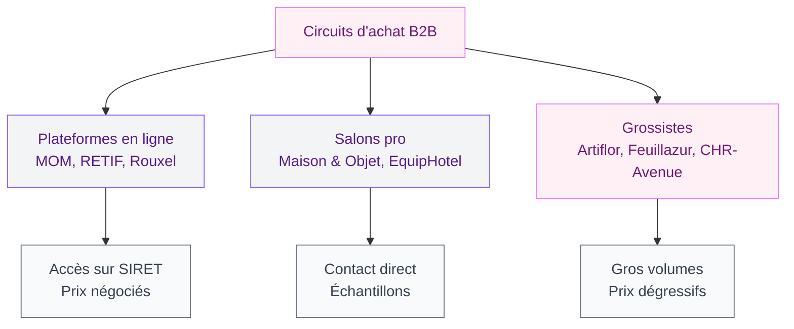
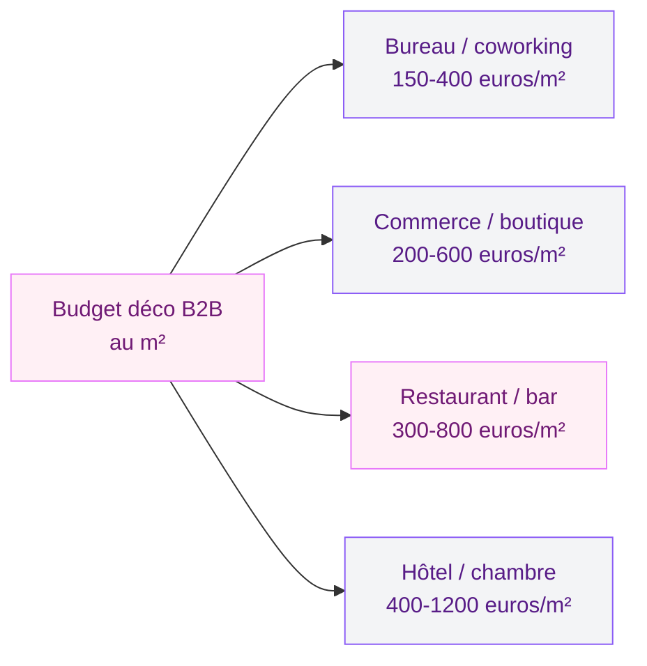
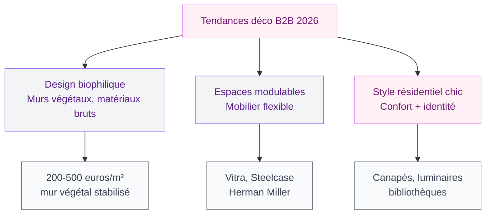

Tu ouvres ta boutique, tu relookes ton bureau ou tu repenses l'aménagement d'un restaurant ? La déco pro, c'est un monde à part. Les volumes sont plus grands, les contraintes plus strictes, et les fournisseurs ne sont pas ceux que tu croises en scrollant sur Instagram le dimanche soir. Bonne nouvelle : une fois que tu connais les bons circuits d'achat et les erreurs classiques, tu peux créer un espace professionnel qui a autant de caractère qu'un intérieur perso - mais qui tient le choc au quotidien.

## Ce qui change entre la déco maison et la déco B2B

La première chose à comprendre, c'est que décorer un espace professionnel et décorer un salon, ce n'est pas le même métier. Les enjeux diffèrent sur trois axes.

  

**La durabilité avant tout.** Un fauteuil de salon supporte 2-3 heures d'usage par jour. Un siège de salle d'attente, c'est 8 à 12 heures. Les tissus, les mousses, les finitions - tout doit résister à un usage intensif. En B2B, on parle en cycles d'abrasion Martindale : un tissu pro doit dépasser les 30 000 cycles minimum. Pour comparaison, un tissu résidentiel standard tourne autour de 15 000 cycles.

**Les normes de sécurité.** En espace recevant du public (ERP), le mobilier doit répondre à des exigences feu (M1 ou M2 selon les cas). Les textiles aussi. Un rideau magnifique trouvé chez Zara Home ne passera pas l'inspection dans un hôtel ou un restaurant. Tu dois toujours demander les fiches techniques et les certificats de conformité.

**Le budget se calcule autrement.** En B2B, on raisonne en coût total de possession. Un canapé à 800 euros qui dure 2 ans revient plus cher qu'un canapé à 2 000 euros qui tient 8 ans. Les professionnels qui débutent font souvent l'erreur de raisonner en prix d'achat pur - et ils le regrettent au bout de 18 mois.

> [!WARNING]
> Si tu équipes un ERP (établissement recevant du public), chaque pièce de mobilier et chaque textile doivent avoir leur certificat de conformité feu. En cas de contrôle, l'absence de ces documents peut entraîner une fermeture administrative.

## Les circuits d'achat pro : où trouver le bon matériel

C'est la question numéro un. Quand tu débutes en B2B, tu te retrouves vite perdue entre les grossistes, les plateformes en ligne, les salons pro et les revendeurs spécialisés. Voilà comment t'y retrouver.

  

### Les plateformes B2B en ligne

La plus connue en France pour la déco et le mobilier, c'est **MOM** (Maison & Objet Market). C'est la version digitale du salon Maison & Objet : plus de 3 000 marques, des prix négociés pour les pros, et la possibilité de commander des échantillons avant de s'engager. L'accès est réservé aux professionnels - il faut un SIRET pour s'inscrire.

Autres plateformes qui valent le détour :

- **RETIF** : le spécialiste de l'équipement de commerces. Vitrines, présentoirs, PLV, déco saisonnière. Catalogue très large avec des prix clairs. Un présentoir à bijoux commence à 15 euros, une tête de mannequin autour de 25 euros.
- **Rouxel** : plutôt orienté agencement technique (rayonnages, stockage, manutention) mais aussi mobilier de bureau et équipement de locaux. Pratique pour tout ce qui est "back office".
- **Alibaba / Made-in-China** : pour les commandes en gros volume à prix compétitif, mais attention aux délais (4-8 semaines), aux frais de douane, et au contrôle qualité aléatoire.

### Les salons professionnels

Rien ne remplace le contact direct. Les salons permettent de toucher les matériaux, de tester le confort, et de négocier en face-à-face.

- **Maison & Objet** (Paris, janvier et septembre) : le rendez-vous déco et design par excellence. Plus de 2 500 exposants. Entrée réservée aux pros.
- **EquipHotel** (Paris, tous les 2 ans) : spécialisé hôtellerie-restauration. Mobilier, éclairage, textiles, accessoires de chambre et de salle de bain.
- **Workspace Expo** (Paris, annuel) : tout pour l'aménagement de bureaux. Ergonomie, acoustique, mobilier collaboratif.

> [!TIP]
> Avant d'aller à un salon pro, prépare ta visite : liste des stands à voir, budget max par catégorie, photos de ton espace actuel sur ton téléphone. Les commerciaux adorent quand tu arrives avec un brief clair - et tu obtiens de meilleures conditions.

### Les grossistes spécialisés

Pour la décoration florale et les accessoires, des grossistes comme **Artiflor** ou **Feuillazur** proposent des catalogues énormes à prix pro. Fleurs artificielles, vases, bougies, nappes - tout ce qui habille un espace commercial sans demander d'entretien.

Pour le mobilier de restauration, des enseignes comme **Alterego Design** ou **CHR-Avenue** offrent des gammes pensées pour l'usage intensif : chaises empilables à partir de 45 euros, tables de bistrot dès 120 euros, banquettes sur mesure à partir de 300 euros le mètre linéaire.

## Décorer un espace pro : les règles qui changent tout

  

### Penser en zones, pas en pièces

En résidentiel, on décore pièce par pièce. En B2B, on pense en zones fonctionnelles. Un restaurant, par exemple, combine la zone d'accueil (première impression), la salle (confort et ambiance), le bar (dynamisme et identité), et les sanitaires (propreté et détail). Chaque zone a son propre brief déco.

La méthode qui marche : commence par lister tes zones, puis attribue à chacune une ambiance, une palette et un budget. Un commerce de prêt-à-porter peut avoir une zone vitrine très travaillée (30 % du budget déco), une zone cabines soignée (20 %), et un espace de vente plus sobre (50 %).

### L'éclairage fait 80 % du travail

Si je ne devais te donner qu'un seul conseil pour la déco pro, ce serait celui-ci : investis dans l'éclairage. Un mauvais éclairage tue n'importe quel aménagement, même avec du mobilier magnifique. Un bon éclairage rattrape un mobilier basique.

En B2B, on combine trois types de lumière :

- **L'éclairage général** (plafonniers, spots encastrés) : 300 à 500 lux pour un bureau, 150 à 300 lux pour un restaurant.
- **L'éclairage d'accentuation** (spots directionnels, réglettes LED) : pour mettre en valeur un produit, un tableau, une zone clé. C'est ce qui fait la différence entre un commerce qui a du caractère et un espace fade.
- **L'éclairage d'ambiance** (suspensions basses, lampes à poser, rubans LED indirects) : pour créer l'atmosphère. En restauration, c'est le nerf de la guerre.

Un bon plan lumière pro coûte entre 2 000 et 8 000 euros pour un espace de 80 m², pose comprise. C'est un investissement, mais c'est le poste qui a le plus d'impact sur le ressenti de tes clients.

> [!IMPORTANT]
> Choisis des sources LED avec un IRC (indice de rendu des couleurs) supérieur à 90. En dessous, les couleurs de ta déco et de tes produits paraîtront ternes. C'est vrai aussi pour les teintes murales - un joli [vert olive en cuisine](/guides/cuisine/cuisine-olive/) ou un doré subtil sur les murs perdent tout leur charme sous un éclairage à IRC 80.

### La signalétique, ce détail qui n'en est pas un

Beaucoup de pros investissent des milliers d'euros en mobilier et oublient la signalétique. Les panneaux directionnels, les numéros de table, les étiquettes de prix, les affichages légaux - tout ça participe à l'identité visuelle de ton espace. Un restaurant qui a des menus plastifiés sur une table en chêne massif, c'est un contresens complet.

Pour une signalétique cohérente, prévois un budget de 500 à 2 000 euros selon la taille de l'espace. Des prestataires comme **Pixartprinting** ou **Exaprint** proposent de la signalétique personnalisée à prix corrects.

## Budget réaliste : combien ça coûte vraiment

Parlons chiffres. Les budgets varient énormément selon le secteur et le niveau de finition, mais voici des fourchettes réalistes pour t'aider à planifier.

  

### Répartition type pour un commerce de 60 m²

- **Mobilier** : 40-50 % du budget (comptoir, présentoirs, assises)
- **Éclairage** : 15-20 % (plan lumière, suspensions, spots)
- **Revêtements** : 15-20 % (sol, murs, plafond)
- **Accessoires et déco** : 10-15 % (plantes, objets, signalétique)
- **Textiles** : 5-10 % (rideaux, coussins, nappes)

Pour un budget serré, la stratégie la plus intelligente est d'investir sur les postes visibles (comptoir, éclairage, mur d'accent) et de rester sobre sur le reste. Un mur bien peint avec un bon éclairage et un comptoir en matériau noble donne plus d'effet qu'un mobilier complet mais bas de gamme.

Si tu veux pousser l'idée du [style minimaliste](/guides/decoration/decoration-minimaliste-idees-et-photos-faciles/) dans ton local pro, c'est une approche maline : moins de meubles, mais mieux choisis. Ton budget va plus loin et le résultat est souvent plus impressionnant.

## Les erreurs que tout le monde fait (et comment les éviter)

  

### Erreur 1 : copier un intérieur résidentiel

C'est le piège classique. Tu as vu un beau salon sur Pinterest et tu veux reproduire l'ambiance dans ta boutique. Le problème : un canapé en velours côtelé, ça ne survit pas à 50 clients par jour. Un parquet massif huilé, c'est magnifique chez toi mais c'est un cauchemar à entretenir dans un restaurant.

La solution : inspire-toi du résidentiel pour l'ambiance, mais choisis des matériaux et finitions conçus pour le pro. Un tissu "aspect velours" en polyester haute résistance donne le même effet visuel mais supporte l'usage intensif. Un sol vinyle imitation parquet (type **Forbo** ou **Gerflor**) coûte 20-35 euros/m² et résiste à tout.

### Erreur 2 : négliger l'acoustique

Dans un open space ou un restaurant, le bruit est l'ennemi numéro un du confort. Et pourtant, c'est le dernier poste auquel les pros pensent. Résultat : des espaces magnifiques visuellement mais invivables au quotidien.

Des solutions simples existent : panneaux acoustiques muraux (à partir de 30 euros/m² chez **Baux** ou **Felt Right**), plafonds suspendus absorbants, tapis et rideaux épais. Même des [tableaux muraux](/guides/decoration/bien-accrocher-tableau-mural/) avec des supports en feutre acoustique peuvent améliorer le confort sonore.

### Erreur 3 : commander sans échantillon

En B2B, les quantités sont plus importantes et les retours plus compliqués. Commande toujours des échantillons avant de passer une commande. Un tissu qui paraît beige sur ton écran peut arriver verdâtre en vrai. Un bois "chêne naturel" chez un fournisseur et un autre n'auront pas du tout la même teinte.

La plupart des fournisseurs pro envoient des échantillons gratuitement ou pour quelques euros. C'est un petit investissement qui peut t'éviter une erreur à plusieurs milliers d'euros.

> [!CAUTION]
> Sur les plateformes d'import (Alibaba, DHgate), méfie-toi des photos retouchées. Demande toujours une photo du produit réel avec un nuancier à côté. Et commande un exemplaire test avant de lancer une commande en volume.

## Tendances déco B2B en 2026

Cette année, plusieurs tendances fortes se dégagent dans l'aménagement professionnel.

**Le biophilique continue sa progression.** Murs végétaux stabilisés, jardinières intégrées au mobilier, matériaux bruts (pierre, bois, liège) - la nature s'invite dans tous les espaces pro. Un mur végétal stabilisé coûte entre 200 et 500 euros/m² mais ne demande aucun entretien. C'est un investissement qui parle à la clientèle sensible à l'environnement.

**Les espaces modulables.** Fini les agencements figés. Le mobilier sur roulettes, les cloisons amovibles, les assises empilables permettent de reconfigurer un espace selon les besoins : réunion le matin, coworking l'après-midi, événement le soir. Des marques comme **Vitra** ou **Steelcase** proposent des gammes entières dédiées à cette flexibilité.

**Le style "résidentiel chic" en milieu pro.** La grande tendance, c'est justement de casser les codes du bureau froid et impersonnel. Les espaces de coworking comme **WeWork** ou **Wojo** ont montré la voie : canapés moelleux, bibliothèques décoratives, luminaires d'esprit résidentiel. L'idée est de créer un lieu où les gens se sentent comme chez eux. Si tu veux creuser cette direction, jette un oeil à notre article sur les [salons modernes et élégants en 2026](/guides/decoration/salons-modernes-et-elegants-2026/) pour trouver de l'inspiration adaptable au pro.

## Sur le meme theme

- [salons modernes 2026](/guides/decoration/salons-modernes-tendances-2026/)

## FAQ

### Faut-il un SIRET pour acheter chez un grossiste déco ?

La plupart des grossistes et plateformes B2B demandent un numéro SIRET ou un extrait Kbis pour ouvrir un compte. C'est le cas de MOM, RETIF ou Rouxel. Certains grossistes physiques acceptent les particuliers sur présentation d'une pièce d'identité, mais les prix affichés sont alors TTC et non HT.

### Quel budget minimum prévoir pour décorer un local commercial de 50 m² ?

Compte entre 10 000 et 20 000 euros HT pour un résultat correct, éclairage compris. En dessous, tu risques de faire des compromis qui se verront vite. Ce budget couvre le mobilier principal, un plan lumière basique, un revêtement de sol correct et quelques éléments de décoration.

### Peut-on mélanger du mobilier résidentiel et du mobilier pro ?

Oui, à condition de réserver le mobilier résidentiel aux zones à faible usage : un coin lecture dans une boutique, un espace d'accueil dans un bureau. Pour les zones à fort passage (salle de restaurant, espace de vente), reste sur du mobilier certifié pour l'usage professionnel.

### Comment négocier les prix avec un fournisseur B2B ?

Le levier principal, c'est le volume. A partir de 10 pièces identiques, tu peux obtenir 10-20 % de remise. Pour les commandes plus importantes (50+ pièces), certains fabricants descendent jusqu'à -35 %. Pense aussi à grouper tes achats chez un même fournisseur pour atteindre les seuils de remise quantitative.
