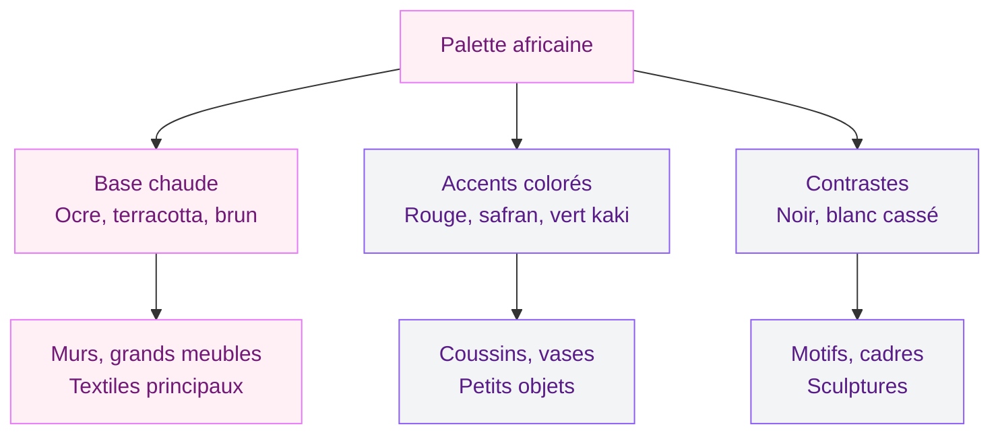
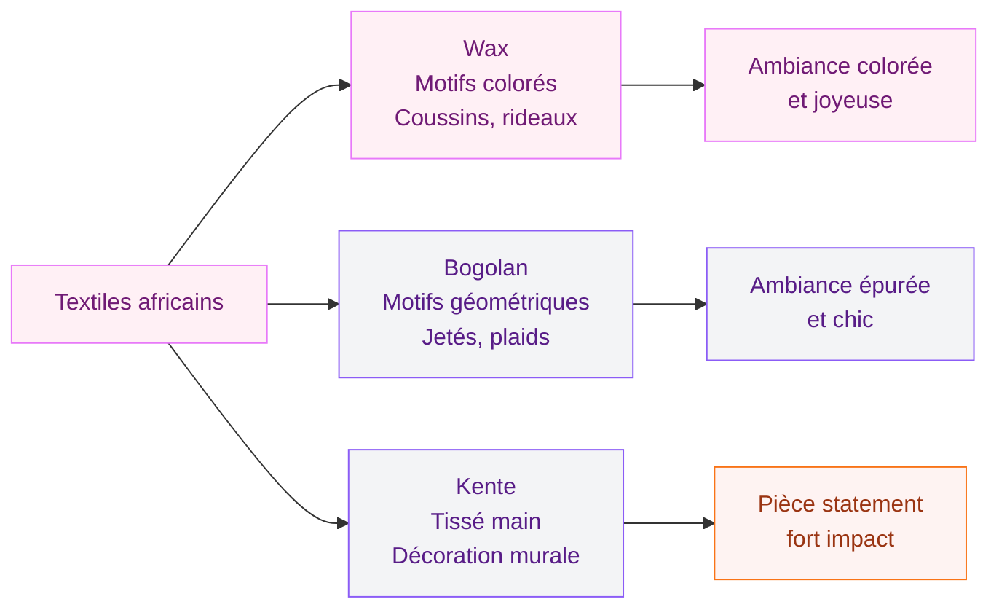

La déco africaine, c'est un style qui te saisit immédiatement. Des couleurs chaudes qui rappellent la savane, des matériaux bruts qui respirent l'authenticité, des motifs géométriques qui racontent des histoires millénaires. Et contrairement à ce qu'on pourrait croire, ce n'est pas un style réservé aux intérieurs ethniques complets - quelques pièces bien choisies suffisent à transformer n'importe quel salon, chambre ou entrée en un espace vibrant et accueillant.

Le truc, c'est de comprendre ce qui fait la force de cette esthétique pour l'intégrer intelligemment chez toi, sans tomber dans la caricature ni dans l'accumulation. Je te guide à travers les couleurs, les matériaux, les objets et les astuces concrètes pour créer un intérieur inspiré de l'Afrique - avec des budgets adaptés à tous les portefeuilles.

## Les couleurs de la déco africaine : la terre, le soleil, la brousse

La palette africaine s'inspire directement de la nature du continent. C'est sa force : ces couleurs fonctionnent ensemble parce qu'elles existent ensemble dans les paysages d'Afrique de l'Ouest, d'Afrique australe ou de la Corne de l'Afrique.

  

### La base chaude

**Le terracotta et l'ocre** - Ce sont les couleurs reines. Pas le terracotta pastel qu'on voit partout dans les intérieurs scandinaves, non. Ici, on parle d'un ocre profond, terreux, brut. Sur un mur, ça crée une ambiance enveloppante immédiate. Chez Dulux Valentine, la teinte "Terre d'Afrique" (environ 35EUR les 2,5L) donne exactement ce ton. Tollens propose aussi la gamme "Savane" avec trois nuances d'ocre magnifiques autour de 42EUR le pot.

**Le brun et le chocolat** - En accent ou en large aplat, le marron chaud évoque le bois d'ébène, les poteries en terre cuite sèches au soleil. Ça se marie avec tout dans un intérieur africain.

**Le jaune safran** - Plus rare mais tellement beau. Utilise-le en petites touches - coussins, vases, bougies - pour ponctuer les tons terreux.

### Les accents de couleur

**Le rouge grenat et le bordeaux** - Inspirés des tissus Masai et des teintures végétales traditionnelles. Un jeté de canapé bordeaux sur un fond d'ocre, c'est un combo qui marche à chaque fois.

**Le vert kaki et le vert olive** - La brousse africaine, les forêts tropicales. Ce vert-là, naturel et un peu fané, apporte de la fraîcheur sans casser l'ambiance chaude.

**Le noir graphique** - Utilisé avec parcimonie pour les motifs, les cadres, les sculptures en bois. Il structure l'ensemble et apporte du contraste.

> [!TIP]
> Pour démarrer sans prendre de risque, peins un seul mur en ocre profond et garde les autres en blanc cassé chaud. Ajoute des textiles dans les tons terracotta et bordeaux. Tu obtiens 80% de l'ambiance africaine avec un budget peinture de 40-50EUR.

## Les matériaux : le naturel avant tout

Si je devais résumer la déco africaine en un mot, ce serait "matière". Tout est texture, tout est organique, tout est tangible. Pas de plastique, pas de surfaces ultra-lisses - on est dans le brut, le fait-main, le vivant.

  

### Le bois sculpté

Le bois est le pilier de l'artisanat africain. Tables basses en bois de manguier, tabourets Senufo (originaires de Côte d'Ivoire, ces tabourets sculptés dans une seule pièce de bois sont devenus des icônes déco), étagères en bois recyclé... Le bois africain, c'est rarement du bois lisse et vernis. C'est du bois brut, parfois taillé à la hache, avec des marques d'outils visibles.

**Où trouver ?** Un tabouret Senufo authentique, c'est 150-400EUR selon la taille (Etsy, boutiques spécialisées comme Africa e Mediterraneo). Pour une version accessible, Maisons du Monde propose des tabourets en manguier sculpté autour de 80-120EUR.

### Le rotin, l'osier et le raphia

Les fibres tressées sont partout dans la maison africaine traditionnelle : paniers de rangement, sets de table, abat-jours, miroirs encadrés de rotin. C'est un des moyens les plus simples et les moins chers d'africaniser ton intérieur.

**Budget malin** : les paniers muraux tressés (style sénégalais ou rwandais) font un effet décoratif énorme pour pas cher. Chez H&M Home, tu trouves des sets de 3 paniers muraux à 25-40EUR. Sur Etsy, les paniers rwandais authentiques Sisal & Sweetgrass tournent autour de 20-50EUR pièce.

### La céramique artisanale

Pots, vases, bols - la poterie africaine a cette texture granuleuse, imparfaite et vivante qui fait tout son charme. Les tons sont souvent neutres (beige, brun, noir) avec des motifs gravés ou peints à la main.

**Mon coup de coeur** : les vases en terre cuite noire du Burkina Faso. Leur finition fumée, obtenue par un processus de cuisson ancestral, donne un noir mat velouté absolument splendide. Prix : 40-90EUR en import direct.

> [!NOTE]
> Les matériaux africains authentiques sont presque toujours durables et éco-responsables. Le raphia est une fibre naturelle renouvelable, le bois utilisé provient souvent d'essences locales, et la poterie est cuite au feu de bois sans émaux chimiques. C'est de la déco verte sans le marketing.

### Le cuir et les peaux

Le cuir travaillé à la main - poufs marocains-sahéliens, tapis en peau de vache, coussins en cuir de chèvre teint - apporte une dimension chaleureuse supplémentaire. Un pouf en cuir fait main (style marocain partagé avec l'Afrique de l'Ouest) coûte entre 40 et 90EUR, et c'est un ajout polyvalent : assise d'appoint, repose-pieds, table basse improvisée.

## Les objets déco : masques, paniers et textiles

C'est là qu'on entre dans le vif du sujet. Les objets décoratifs africains sont à la fois beaux et chargés de sens - chaque pièce a une histoire, une fonction, un territoire d'origine.

  

### Les masques africains

Le masque est probablement l'objet le plus iconique de la déco africaine. Mais attention : un masque accroché sur un mur blanc, seul, ça fait un peu "souvenir de voyage". L'astuce, c'est de composer un mur de masques - trois à cinq pièces de tailles différentes, disposées de façon asymétrique, sur un fond d'ocre ou de brun chaud.

**Prix indicatifs** :
- Masques décoratifs (fabrication récente, bois sculpté) : 25-80EUR sur Etsy ou dans les boutiques africaines en ville
- Masques anciens ou de collection : 200-2000EUR+ chez les antiquaires spécialisés
- Reproductions accessibles : Maisons du Monde propose des masques muraux à partir de 20EUR

### Les paniers tressés muraux

C'est LA tendance déco africaine du moment. Tu les as forcément vus sur Instagram : ces paniers ronds et plats, aux motifs géométriques noirs et naturels, accrochés en composition sur un mur. L'inspiration vient directement des paniers Bolga du Ghana et des paniers Sisal du Rwanda.

Comment les disposer ? Regroupe 5 à 9 paniers de tailles et motifs différents en une composition organique au-dessus d'un canapé ou d'une tête de lit. L'effet est immédiat et spectaculaire.

> [!TIP]
> Sur Amazon, tu trouves des lots de 6-8 paniers muraux africains entre 35 et 60EUR le set. Ils ne sont pas artisanaux, mais le rendu visuel est honnête. Pour de l'authentique, Etsy reste la meilleure source avec des artisans ghanéens et rwandais qui vendent en direct entre 15 et 40EUR la pièce.

### Les textiles wax et bogolan

**Le wax** - Ce tissu imprimé aux motifs colorés et géométriques est devenu un élément déco à part entière. En coussins (lot de 2 housses wax chez Etsy : 20-30EUR), en chemin de table, en habillage d'abat-jour, ou même tendu comme un tableau sur un cadre en bois. Le wax apporte une explosion de couleur que tu doses selon ton envie.

**Le bogolan (ou mudcloth)** - Tissu malien teint à la boue avec des motifs géométriques blancs sur fond brun ou noir. C'est plus sobre que le wax, plus "earthy", et ça s'intègre facilement dans un intérieur contemporain. Un coussin bogolan authentique : 25-50EUR. Un plaid ou jeté de canapé : 60-120EUR.

**Le kente** - Tissu ghanéen tissé à la main, aux couleurs vives (or, vert, rouge, bleu). Traditionnellement porté pour les grandes occasions, il fait un magnifique élément décoratif mural ou dessus de lit.

## Les sculptures et figurines

Au-delà des masques, la sculpture africaine offre une variété énorme : statuettes en bois (couples, danseurs, animaux de la savane), girafes sculptées, personnages Ashanti, poupées de fertilité... Posées sur une console, une étagère ou à même le sol pour les grandes pièces, elles donnent du caractère instantanément.

  

**Mon conseil** : choisis une ou deux pièces fortes plutôt que dix petites figurines. Un grand personnage en bois sombre de 60-80 cm de haut posé au sol à côté d'un canapé, ça vaut mieux qu'une armée de petits éléphants sur une étagère.

## Pièce par pièce : où et comment intégrer la déco africaine

  

### Le salon africain

C'est la pièce où tu peux le plus t'exprimer. Voici une combinaison qui fonctionne à coup sûr :
- Un canapé en lin beige ou couleur sable (Ikea Kivik à 600EUR, ou Made.com pour un budget plus large)
- 3-4 coussins : deux en bogolan, un en wax, un uni terracotta
- Une table basse en bois de manguier ou en tronc d'arbre (Maisons du Monde à partir de 200EUR)
- Un tapis en jute ou en sisal (Ikea LOHALS à 99EUR pour un 160x230)
- Une composition de paniers muraux au-dessus du canapé
- Deux à trois sculptures ou masques en bois disposés dans la pièce

Le tout sur des murs ocre chaud ou blanc cassé. Ça fonctionne autant dans un appartement parisien de 50m2 que dans une maison avec de grands volumes.

### La chambre africaine

Pour la chambre, joue la carte de la douceur. La déco africaine peut être très enveloppante et propice au sommeil si tu restes sur les tons chauds sans trop de contrastes.

- Linge de lit en lin lavé couleur sable ou terracotta clair (La Redoute, 50-80EUR la parure)
- Un jeté de lit en bogolan ou en tissu tissé
- Des paniers muraux au-dessus de la tête de lit
- Une lampe de chevet avec un pied en céramique artisanale
- Des coussins en raphia ou en lin brodé de motifs africains

Si tu cherches des idées pour composer une [chambre dans un style végétal et exotique](/decorer-une-chambre-dans-un-style-jungle/), la déco africaine s'y prête vraiment bien.

### L'entrée et le couloir

Souvent oubliés, ces espaces de passage sont parfaits pour des touches africaines fortes. Un miroir rond encadré de raphia tressé, un tabouret Senufo pour poser les clés, un ou deux masques sur le mur, et une petite plante dans un pot en terre cuite artisanal. Simple, efficace, accueillant.

> [!WARNING]
> Évite de surcharger un petit espace avec trop d'objets africains. Dans une entrée ou un couloir étroit, un seul bel objet bien éclairé aura plus d'impact qu'une accumulation qui donne un effet bazar.

## Mixer déco africaine et style contemporain

C'est probablement la question la plus fréquente : comment intégrer des pièces africaines dans un intérieur moderne sans que ça jure ? La réponse est simple - le contraste est ton ami.

**Fond moderne + objets africains** - Des murs blancs, un mobilier aux lignes épurées, un sol en béton ciré ou en parquet clair... et tu poses là-dessus des coussins wax, un tapis en jute, un masque en bois. Le contraste entre la modernité du fond et la chaleur des objets crée un équilibre naturel.

**Le style "ethno-chic"** - C'est le mélange le plus courant en France : base scandinave (bois clair, blanc, lignes simples) enrichie de touches africaines. Les [salons modernes](/salons-modernes-et-elegants-2026/) intègrent ce type de mix sans difficulté.

**Le style "afro-bohème"** - Plus libre, plus coloré. On mélange wax, macramé, plantes vertes, rotin, coussins de sol. C'est joyeux, décontracté, et ça reflète une personnalité assumée.

La [décoration marocaine](/decoration-marocaine-moderne-ou-classique/) partage beaucoup de codes avec la déco africaine - les deux styles se mixent très bien si tu veux créer un intérieur inspiré de tout le continent.

## DIY : 3 projets simples pour une touche africaine

**1. Cadre en tissu wax** - Achète 50 cm de tissu wax (5-8EUR le coupon dans les marchés ou en ligne), tends-le sur un châssis en bois (Cultura, 5EUR), et accroche. Tu as un tableau unique pour moins de 15EUR.

**2. Customisation de pot de fleur** - Prends un pot en terre cuite basique, peins-le en noir mat, puis dessine des motifs géométriques au Posca blanc. Inspiration : les motifs Ndebele d'Afrique du Sud.

**3. Suspension en macramé avec perles en bois** - Un macramé classique auquel tu ajoutes des grosses perles en bois naturel et quelques coquillages. Ça donne un style coastal africain très actuel.

> [!IMPORTANT]
> Si tu achètes des objets artisanaux africains, privilégie les circuits courts et le commerce équitable. Des plateformes comme Etsy permettent d'acheter directement aux artisans. Les boutiques physiques spécialisées dans les grandes villes françaises (Paris, Lyon, Marseille) sont aussi de bonnes sources pour s'assurer de la provenance.

## Sur le meme theme

- [décoration art déco](/50-idees-de-decoration-art-deco/)

## FAQ

**Quelle est la différence entre déco africaine et déco ethnique ?**
La déco ethnique est un terme parapluie qui englobe des influences du monde entier (africaines, asiatiques, sud-américaines...). La déco africaine est spécifique au continent et se distingue par ses matériaux (bois sculpté, raphia, bogolan), sa palette (ocre, terracotta, noir) et ses objets (masques, paniers tressés, sculptures).

**Comment éviter l'effet "musée" ou "souvenir de voyage" ?**
La clé, c'est de mixer. Ne crée pas une pièce 100% africaine - intègre les objets dans un décor contemporain, varie les tailles et les hauteurs, et évite d'accumuler trop de petits objets. Trois belles pièces bien placées valent mieux que vingt bibelots.

**La déco africaine est-elle adaptée aux petits espaces ?**
Oui, et c'est même un atout. Les [couleurs qui donnent de la profondeur](/des-couleurs-pour-donner-de-la-profondeur-a-un-mur-ou-a-une-piece/) comme l'ocre et le terracotta réchauffent les petits volumes sans les écraser. Les paniers muraux et les textiles n'encombrent pas l'espace au sol. Un petit studio avec un mur ocre, deux paniers tressés et un coussin bogolan aura déjà un vrai caractère.
