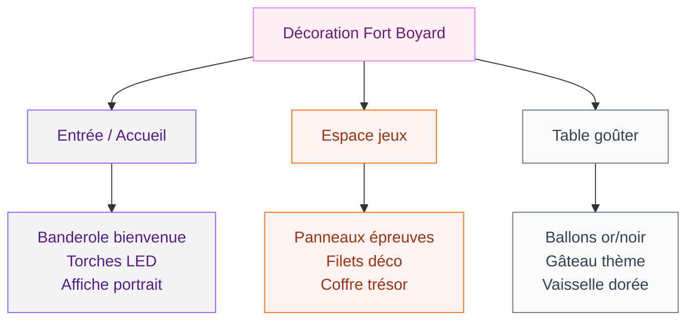
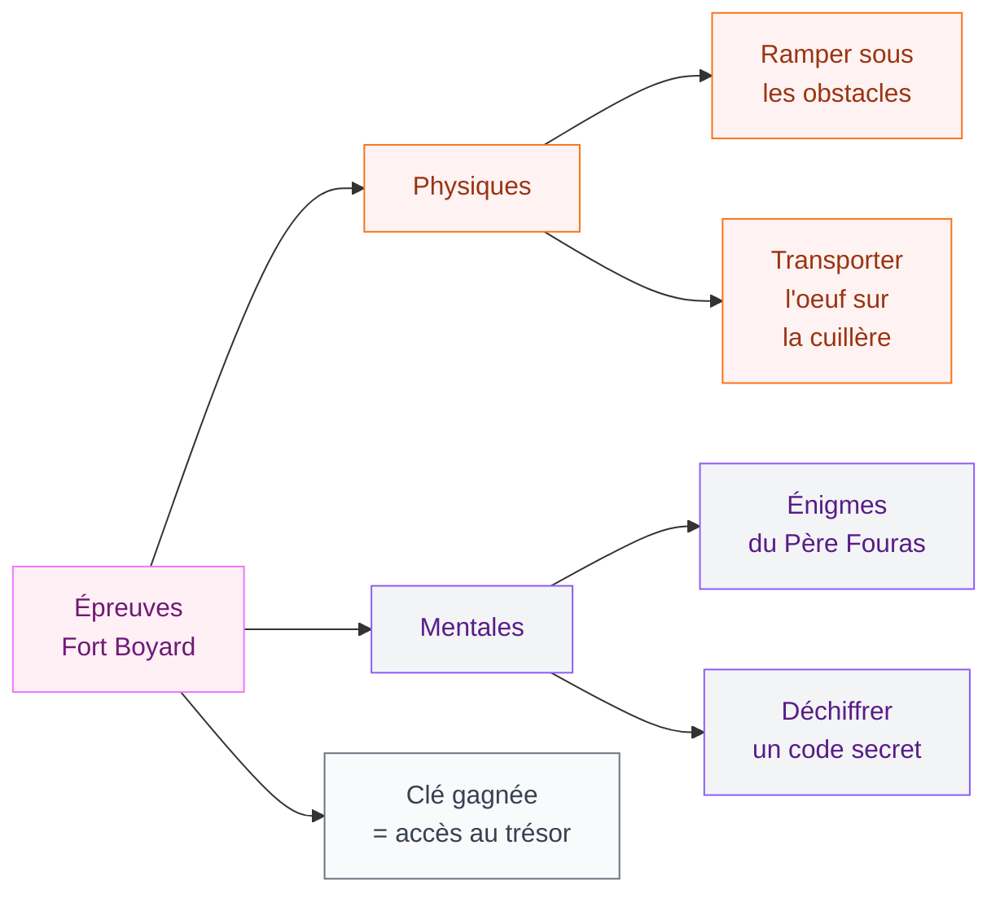
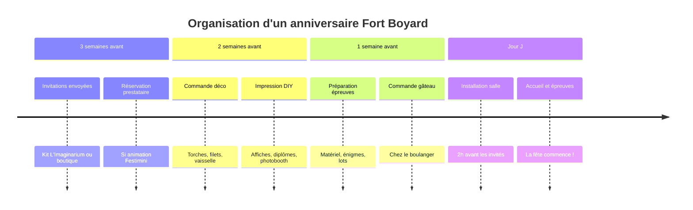

Fort Boyard, c'est LE thème d'anniversaire qui fait briller les yeux des enfants - et même des adultes qui ont grandi avec l'émission. Torches, cellules mystérieuses, épreuves impossibles, la clé en or... tout un univers à recréer chez toi pour une fête mémorable. Je t'explique comment monter une décoration cohérente, des invitations jusqu'à la table du goûter, avec des idées DIY faciles et des références concrètes.

## L'ambiance Fort Boyard : les codes à retenir

Avant de foncer acheter des ballons, prends une minute pour bien cerner l'univers. Fort Boyard, c'est avant tout :

  

- Des couleurs précises : or, noir, orange, rouge bordeaux
- Un style aventure/mystère mêlant pierres grises, torches, cellules et trésors
- Des éléments iconiques : clés en or, tigres, araignées, bougies, roues de fortune
- Une ambiance mi-forteresse médiévale, mi-jeu de piste

Garde ces codes en tête pour que chaque élément de ta déco parle le même langage. L'or est vraiment la couleur pivot - elle unifie tout sans que ça fasse brouillon.

> [!TIP]
> Commence par poser une palette de 3 couleurs max : noir + or + orange. Tu peux ensuite ajouter du bordeaux en accent sans que ça devienne surchargé. C'est la même logique qu'une déco murale réussie - comme quand on travaille une [déco terracotta dans une chambre](/deco-terracotta-chambre/), les nuances chaudes fonctionnent ensemble.

## Les invitations : le premier contact avec l'aventure

L'invitation donne le ton. Pour Fort Boyard, deux options s'offrent à toi :

  

**DIY imprimable (budget : 0 à 5 euros)**

L'Imaginarium propose un kit décoration Fort Boyard à imprimer entièrement gratuit sur son site (limaginarium-anniversaires.fr). Tu y trouves des invitations au format A5, des affiches de bienvenue, des diplômes de fin d'épreuve et même des boîtes à pop-corn à monter. Il suffit d'imprimer sur du papier cartonné 200g et de découper.

**Invitations achetées (budget : 3 à 8 euros pour 10 cartes)**

La boutique Fêtes Vous Même (shop.fetesvousmeme.fr) propose des packs "Aventure au Fort" avec invitations coordonnées à la table. Compte 3 à 8 euros le pack de 10 selon les finitions.

Pour le texte de l'invitation, joue sur le registre de l'émission :

> "Tu es sélectionné(e) pour participer à l'expédition Fort Boyard. Rendez-vous le [date] à [heure] chez [prénom] pour affronter les épreuves et remporter le trésor. Pas de forfaiture !"

> [!NOTE]
> Pense à indiquer sur l'invitation si des épreuves physiques sont prévues (pour que les enfants viennent en baskets plutôt qu'en tenue habillée). Un petit détail qui évite les déceptions le jour J.

## La décoration de la salle : créer l'ambiance forteresse

  

### Les éléments muraux

**Les affiches et banderoles**

Imprime ou commande des affiches format A3 avec le logo Fort Boyard, des portraits "façon Père Fouras", ou des numéros de cellules. Colle-les sur du papier kraft brun pour renforcer l'effet vieilli. Budget : 8 à 15 euros chez un imprimeur local, ou à imprimer chez toi.

**Les tissus et filets**

Suspends du filet de pêche (filet camouflage marron/beige vendu en rouleau chez Leroy Merlin, environ 12 euros le lot) au plafond ou en rideaux de porte. Glisse-y des clés dorées en plastique, des petits crânes Halloween, des étoiles en carton or. C'est rapide à poser et ça transforme instantanément n'importe quel salon.

**Les torches décoratives**

Les torches fausses flammes LED (environ 8 à 12 euros pièce chez Action ou sur Amazon) sont parfaites pour recréer les couloirs du fort. Place-en 4 à 6 dans la pièce principale. Elles clignotent de façon réaliste et il n'y a aucun risque avec les enfants.

### La table du goûter

**Vaisselle et nappage**

Opte pour des assiettes en carton or mat (chez Fêtes Vous Même : 3,50 euros les 10 assiettes 23cm) et des verres transparents. Nappe noire ou bordeaux pour le fond, chemin de table or brillant par-dessus. Tout s'achète chez Action, Gifi ou Maxi Bazar sans se ruiner.

**Les contenants thématiques**

Les boîtes à pop-corn et bonbons "style Fort Boyard" de l'Imaginarium sont imprimables gratuitement. Sinon, achète des boîtes à fenêtre kraft et colle dessus des étiquettes dorées avec le logo. Une boîte = une épreuve, une boîte = un trésor. Les enfants adorent l'aspect "mission accomplie".

**Le gâteau**

Deux approches selon ton niveau pâtisserie :

- Option facile : commande un gâteau nature chez ton boulanger et décore avec des drapeaux en papier imprimés + une clé en or en plastique planté dans le gâteau (2 euros chez le fleuriste). Résultat bluffant pour 5 minutes de travail.
- Option DIY : ganache chocolat noir (qui évoque les murs sombres du fort) + décoration en pâte à sucre or. Des tutoriels existent sur YouTube, compte 2h de préparation.

> [!WARNING]
> Si tu commandes le gâteau, préviens 5 à 7 jours à l'avance. Les boulangeries sont souvent à flux tendu le week-end et les gâteaux personnalisés nécessitent un délai.

### Les ballons

Pour Fort Boyard, la combinaison gagnante : ballons latex noir mat + ballons latex or, en grappe de 15 à 20 ballons. Ajoute 3 ou 4 ballons géants dorés à l'hélium pour les hauteurs. Budget total : 12 à 18 euros selon où tu achètes (Action, Gifi, ou Amazon pour les lots).

## Les épreuves et animations : le coeur de la fête

Une déco parfaite sans les épreuves, c'est comme Fort Boyard sans Père Fouras. Voilà 5 épreuves simples à organiser chez toi :

  

**Épreuve 1 - Le couloir des araignées**
Tends des fils de laine noire entre deux chaises ou pieds de table. Les enfants doivent passer sans toucher les fils. Pendu aux fils : des araignées en plastique (pack de 30 chez Action, 1,50 euro). Durée : 2 minutes par enfant.

**Épreuve 2 - Les énigmes du Père Fouras**
Prépare 5 à 8 devinettes adaptées à l'âge. Pour les 7-10 ans, des devinettes classiques fonctionnent bien. Pour les ados, monte en difficulté avec des rébus ou des codes chiffrés. Le gagnant reçoit une clé dorée en plastique.

**Épreuve 3 - La cellule du temps**
Dans un carton décoré en "cellule" (papier gris, barreaux dessinés au feutre), cache une clé. L'enfant doit résoudre une équation simple ou retrouver une combinaison pour "ouvrir" la cellule dans le temps imparti (30 secondes au sablier).

**Épreuve 4 - L'épreuve physique**
Parcours d'obstacles : ramper sous une table, slalomer entre des bouteilles, transporter une balle en équilibre sur une raquette. 3 tours de parcours = 1 clé.

**Épreuve 5 - La cible**
Lancer de bagues sur des bouteilles vides. 3 bagues sur 5 = victoire. Des bagues de bois ou plastique s'achètent dans les magasins de jouets pour environ 5 euros.

> [!TIP]
> Prépare des "certifications" imprimées (diplôme du vaillant aventurier, certificat de bravoure...) que tu remets à chaque enfant après l'épreuve. Même ceux qui échouent repartent avec quelque chose. Ça évite les larmes et ça fait un joli souvenir.

Le coffre au trésor final (une grande boîte en bois peinte en noir et or, vendue autour de 12 euros chez Cultura) s'ouvre une fois que l'équipe a collecté toutes les clés. À l'intérieur : sachets de pièces en chocolat, petits lots, diplômes personnalisés.

## Festimini et les prestataires clés en main

Si tu ne veux pas tout gérer seul(e), la société Festimini propose une animation "Festi Boyard" à domicile. L'équipe apporte le matériel, anime les épreuves et gère le timing. Prix : comptez à partir de 150 à 200 euros pour 10 enfants selon la région. C'est une option intéressante pour les anniversaires de 8 ans et plus où les enfants sont en groupe nombreux et où tu veux vraiment être présent(e) plutôt qu'à tout coordonner.

  

## Budget global : ce qu'il faut prévoir

Voici une estimation réaliste selon les niveaux de budget :

| Poste | Budget mini | Budget confort |
|---|---|---|
| Invitations (imprimables) | 0 à 3 euros | 5 à 10 euros |
| Déco salle (ballons, torches, filets) | 20 euros | 40 euros |
| Table (vaisselle, nappe, décos) | 15 euros | 30 euros |
| Gâteau | 15 euros (maison) | 35 euros (boulangerie) |
| Épreuves (matériel) | 10 euros | 20 euros |
| Coffre + lots | 15 euros | 30 euros |
| **Total** | **75 euros** | **165 euros** |

Pour 10 à 12 enfants, c'est tout à fait raisonnable. La bonne nouvelle, c'est que la plupart des éléments de déco DIY - comme pour un projet de [crépissage d'un mur intérieur](/crepir-un-mur-interieur/) - demandent plus de temps que d'argent.

> [!IMPORTANT]
> Garde toujours une petite réserve de 15 à 20 euros pour les imprévus : une bougie torche qui lâche, un ballon qui éclate, ou un lot de remplacement pour une épreuve qu'on improvise au dernier moment.

## Adapter le thème selon l'âge

**Pour les 5-7 ans** : mise sur les couleurs et l'aspect visuel (ballons, torches, coffre brillant). Les épreuves doivent être très simples et surtout non éliminatoires. Tous gagnent une clé.

**Pour les 8-12 ans** : c'est l'âge idéal pour Fort Boyard. Les enfants connaissent souvent l'émission et adorent la compétition en équipe. Divise-les en deux équipes qui s'affrontent.

**Pour les adultes et ados** : hausse le niveau des énigmes. Pense à des puzzles logiques, des codes binaires, des rébus complexes. Une touche d'humour avec des références à l'émission originale (années 90) plaira aux adultes nostalgiques.

Si tu veux explorer d'autres thèmes forts en déco, la [déco chambre Harry Potter](/deco-chambre-harry-potter/) suit la même logique : un univers fort, des codes couleur clairs, et des détails qui font tout le travail d'ambiance.

## Le photobooth : les souvenirs en images

Un coin photobooth Fort Boyard, c'est simple à installer et les photos sont le souvenir parfait :

- Fond : filet de camouflage + quelques éléments dorés suspendus
- Accessoires imprimables (L'Imaginarium propose des kits gratuits) : cadres dorés, bulles de dialogue "J'ai vaincu Fort Boyard", moustaches, chapeaux de pirate
- Lumière : 2 torches LED de chaque côté pour l'ambiance

Pose les accessoires dans un panier en osier à l'entrée du photobooth. Les enfants se servent seuls. Le résultat est toujours meilleur que prévu.

Pour les familles qui aiment les thèmes déco culturels et historiques, jette un oeil à la [décoration marocaine moderne](/decoration-marocaine-moderne-ou-classique/) - on y retrouve cette même façon de jouer avec les textures, les dorures et les bougies pour créer une ambiance forte.

## En résumé

Un anniversaire Fort Boyard réussi repose sur trois piliers : une déco cohérente (or + noir + orange), des épreuves vraiment jouées (pas juste décoratives), et des souvenirs à emporter (diplômes, photos, lots). Le budget peut rester très raisonnable si tu joues la carte DIY avec les kits imprimables gratuits de l'Imaginarium. Le plus important, c'est que les enfants sentent qu'ils vivent vraiment une aventure - et ça, ça ne coûte pas grand chose à part un peu d'imagination et d'organisation.

---

## Sur le meme theme

- [décoration art déco](/50-idees-de-decoration-art-deco/)

## Questions fréquentes

**A quel âge peut-on organiser un anniversaire Fort Boyard ?**
Le thème convient très bien à partir de 6-7 ans. Les tout petits peuvent être frustrés par les épreuves. L'idéal reste la tranche 8-12 ans qui connaît souvent l'émission et apprécie la compétition en équipe.

**Où trouver des décorations Fort Boyard prêtes à l'emploi ?**
La boutique Fêtes Vous Même (shop.fetesvousmeme.fr) et l'Imaginarium (limaginarium-anniversaires.fr) sont les deux meilleures références. Pour la vaisselle et les ballons, Action, Gifi et Maxi Bazar proposent des gammes or et noires parfaitement adaptées à petit prix.

**Comment gérer les épreuves pour que tous les enfants soient contents ?**
Prévois des épreuves en équipes plutôt qu'individuelles, et des lots pour tous (diplômes + sachets de chocolats). Si un enfant rate une épreuve, il peut en tenter une autre. L'objectif est que l'équipe collecte les clés - pas d'éliminatoire individuel.

**Peut-on adapter le thème pour un anniversaire adulte ?**
Oui, très bien. Monte la difficulté des énigmes, ajoute des références à l'émission originale des années 90 pour les adultes de 30-40 ans, et change les lots (bouteille de champagne dans le coffre plutôt que chocolats). L'ambiance fonctionne à tous les âges.
