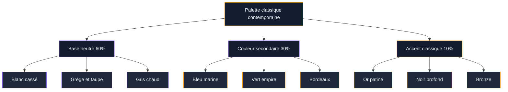
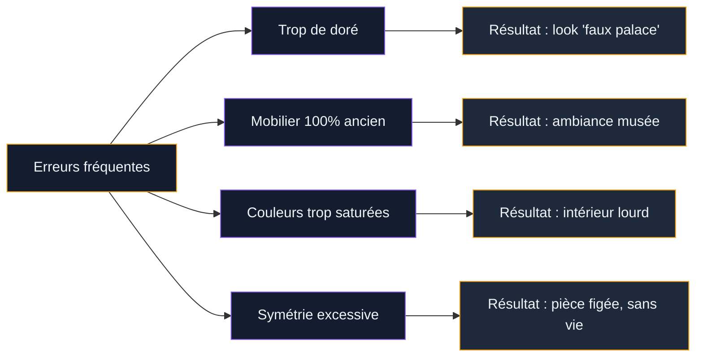

Tu connais cette sensation quand tu entres dans un appartement haussmannien qui a été refait avec du mobilier moderne, et que tu te dis "mais comment ils ont fait pour que ca marche aussi bien" ? C'est exactement le sujet du jour. La décoration classique contemporaine, c'est cet entre-deux qui mélange le charme d'un héritage décoratif riche - moulures, dorures, velours - avec la sobriété et la fonctionnalité du design actuel. Et le résultat, quand c'est bien fait, donne des intérieurs absolument magnifiques.

Je te propose 20 idées concrètes pour réussir ce mélange chez toi, avec des repères de prix, des marques accessibles, et surtout les erreurs à ne pas commettre.

## Ce qu'on appelle "classique contemporain" en déco

Le style classique pur, c'est le mobilier sculpté, les tissus damassés, les couleurs bordeaux et or, les lustres à pampilles, les consoles en marbre. Beau, mais parfois lourd et un peu muséal quand on en fait trop. Le contemporain, c'est l'inverse : lignes droites, couleurs neutres, matériaux bruts, praticité avant tout.

Le classique contemporain prend le meilleur des deux mondes. On garde les éléments décoratifs qui apportent du caractère - une cheminée en marbre, des boiseries, un miroir doré - et on les associe à un mobilier épuré, des couleurs apaisantes et une mise en scène aérée.

> [!NOTE]
> Le classique contemporain n'est pas du "néoclassique". Le néoclassique reproduit les codes anciens avec des matériaux modernes. Ici, on mélange vraiment ancien et nouveau dans un même espace, sans chercher à copier un style historique.

C'est un style qui fonctionne particulièrement bien dans les appartements anciens avec du cachet architectural (moulures, parquet point de Hongrie, hauts plafonds), mais aussi dans des espaces neufs où tu peux ajouter des éléments classiques pour créer de la personnalité.

## La palette de couleurs : entre neutralité et profondeur

La couleur est la base de tout dans ce style. On travaille avec des tons neutres et élégants, rehaussés par des touches plus riches qui rappellent le vocabulaire classique.

### Les bases neutres

Le blanc cassé, le grège (gris-beige), le taupe clair et le gris chaud forment la toile de fond. Ces teintes permettent aux éléments classiques de respirer sans alourdir l'atmosphère. Concrètement, peins tes murs dans un ton clair et chaud - pas un blanc froid d'hôpital, mais un blanc crémeux qui absorbe la lumière.

Chez Farrow & Ball, les teintes "Skimming Stone" ou "Pointing" fonctionnent bien (environ 85-100 euros le litre). Si le budget est serré, Dulux Valentine propose sa gamme "Crème de Couleur" à 25-35 euros le pot de 2,5L, avec des tons neutres très réussis.

### Les accents classiques

Pour les touches de couleur, on pioche dans la palette traditionnelle : bleu marine profond, vert empire, bordeaux, or patiné. Mais attention - on les utilise en petites doses. Un canapé en velours bleu nuit, des coussins bordeaux, un vase en laiton doré. Pas un mur entier en rouge cardinal.

> [!TIP]
> La règle des 60-30-10 fonctionne à merveille ici : 60% de neutre (murs, sol, gros meubles), 30% de couleur secondaire (textiles, petits meubles), 10% d'accent fort (objets décoratifs, dorures, touches de couleur vive). C'est simple et ca évite les faux pas.

## 20 idées concrètes pour un intérieur classique contemporain

### 1. Le canapé capitonné en version moderne

Le canapé Chesterfield, c'est l'icône du style classique. Mais au lieu de le choisir en cuir marron foncé dans un salon tout boisé, prends-le en velours gris clair ou bleu nuit et pose-le dans un espace épuré aux murs blancs. Chez Maisons du Monde, le modèle "Chesterfield" en velours gris tourne autour de 800-1200 euros. Made.com propose aussi des versions très réussies dans leur gamme "Branagh" à partir de 699 euros.

### 2. Un miroir doré surdimensionné

Un grand miroir à cadre doré patiné posé au sol contre un mur blanc, c'est l'une des images les plus iconiques du classique contemporain. L'effet est immédiat : ca apporte de la lumière, de la profondeur, et cette touche de noblesse sans charger la pièce. Budget : entre 150 et 400 euros selon la taille et la qualité du cadre. Ikea propose le modèle "Svansele" à 79 euros, qui fait déjà très bien le travail.

### 3. Les moulures avec peinture contrastée

Si tu as la chance d'avoir des moulures au plafond ou des corniches, peins-les dans la même couleur que le mur mais dans une finition différente (mat pour le mur, satiné pour les moulures). Ca crée un jeu de lumière subtil et très chic. Si tu n'as pas de moulures, tu peux en poser toi-même avec des baguettes en polyuréthane (Orac Decor, à partir de 8 euros le mètre).

### 4. La console d'entrée en marbre et métal

Une console aux pieds fins en métal noir ou doré avec un plateau en marbre blanc, ca donne le ton dès l'entrée. C'est le parfait mélange entre l'élégance classique du marbre et la sobriété contemporaine de la structure. Chez AM.PM, tu en trouves autour de 350-500 euros.

### 5. Des rideaux longs et lourds

Dans un intérieur classique contemporain, les rideaux touchent le sol - et même trainent un peu. Choisis du lin épais ou du velours dans des tons neutres. Des anneaux en laiton brossé sur une tringle simple en métal noir complètent le look. Budget : environ 60-120 euros la paire chez La Redoute Intérieurs.

### 6. Un lustre moderne dans un décor ancien

Remplace le lustre à pampilles par un luminaire contemporain en métal et verre soufflé, dans un espace qui a déjà du caractère architectural. Le contraste entre le plafond mouluré et un luminaire aux lignes géométriques, c'est un des meilleurs coups déco du classique contemporain.

### 7. Le fauteuil bergère revisité

La bergère, ce fauteuil enveloppant typiquement français, revient en force dans des versions modernisées. En tissu boucle blanc ou en velours moutarde avec des pieds en bois naturel au lieu du bois sculpté doré, elle s'intègre dans tous les salons. Regarde chez Habitat ou La Redoute autour de 400-700 euros.

### 8. Un mur de cadres mixtes

Mélange des cadres dorés classiques avec des cadres noirs minimalistes. A l'intérieur : des gravures anciennes à côté de photos d'art contemporain. Ce "gallery wall" hybride résume à lui seul l'esprit du style.

### 9. La table de salle à manger ronde en marbre

La table ronde en marbre blanc ou en terrazzo avec un piétement contemporain (métal noir, bois clair) est un classique du genre. Chez Tikamoon, tu trouves de belles pièces autour de 600-900 euros. Plus accessible, Drawer propose des versions en grès effet marbre à 400-550 euros.

### 10. Des bibliothèques du sol au plafond

Grandes étagères ouvertes remplies de livres, de céramiques et de quelques objets dorés. C'est typiquement classique dans l'esprit, mais la disposition épurée et les étagères en métal noir ou en bois clair rendent l'ensemble contemporain.

> [!TIP]
> Pour un look vraiment soigné, alterne les livres posés debout et couchés. Ajoute deux ou trois objets par étagère maximum : un vase, un bougeoir, un petit cadre. L'espace vide entre les éléments compte autant que les objets eux-mêmes.

### 11. Le velours sur des lignes droites

Choisis un canapé ou un fauteuil aux lignes très géométriques, très contemporaines, mais en velours vert bouteille ou prune. La matière classique sur une forme moderne, ca marche à tous les coups.

### 12. Les pieds dorés sur du mobilier simple

Un bout de canapé en verre avec des pieds dorés, une chaise de bureau en tissu gris avec une base en laiton, une étagère minimaliste avec des détails en or brossé. Ces petites touches dorées font le lien entre les deux univers.

### 13. Un tapis persan dans un espace minimaliste

Un beau tapis persan ou d'inspiration orientale posé dans une pièce aux murs blancs avec du mobilier contemporain, c'est le choc visuel parfait. Ce type d'objet apporte de la chaleur, de la couleur et du vécu. Budget : entre 200 et 800 euros pour un tapis vintage sur Selency ou chez Emmaüs.

### 14. La cheminée habillée sobrement

Si tu as une cheminée en marbre, ne la surcharge pas. Pose un grand miroir simple au-dessus, deux bougeoirs en laiton, et c'est tout. La beauté du classique contemporain, c'est de laisser les belles pièces respirer.

### 15. Des coussins en tissus nobles

Soie, velours, jacquard - ces matières rappellent le vocabulaire classique. En les posant sur un canapé en lin neutre, tu crées un dialogue entre les époques. Zara Home propose de très bons coussins dans cette gamme entre 25 et 60 euros.

### 16. Le noir et blanc comme fil conducteur

Des photos en noir et blanc dans des cadres dorés, un sol en carrelage noir et blanc type damier, des rayures classiques sur des textiles contemporains. Le duo noir et blanc est à la fois très classique et très graphique.

### 17. Une commode ancienne dans une salle de bain moderne

Récupère une commode ancienne, adapte-la en meuble vasque avec un plan de travail en pierre et une vasque à poser. Le résultat est saisissant dans une salle de bain carrelée en grand format contemporain. C'est un projet DIY très populaire, et tu peux trouver la commode en brocante pour 80-200 euros.

### 18. Les appliques murales art déco

Les appliques en laiton avec des abat-jour en opaline ou en verre strié rappellent les grands hôtels parisiens. Posées de chaque côté d'un miroir ou d'un lit, elles apportent une touche d'élégance sans effort. TineKHome et Madam Stoltz en proposent autour de 60-120 euros.

### 19. Un plafond travaillé

Peins le plafond dans un ton légèrement plus soutenu que les murs (un grège doux ou un bleu très pâle), ajoute une rosace décorative autour du luminaire central, et tu obtiens un "cinquième mur" qui change tout. Les rosaces en polyuréthane se trouvent à partir de 15-30 euros chez Leroy Merlin.

### 20. Le mélange des matériaux

Marbre + métal noir + bois clair + velours + lin. C'est la formule magique du classique contemporain. Chaque matière apporte sa propre histoire, et ensemble elles créent un intérieur riche sans être chargé.

## Les erreurs qui cassent le style

**Le total look doré.** Un miroir doré, oui. Des pieds de table dorés, oui. Mais si tu ajoutes aussi des lampes dorées, des cadres dorés et des poignées dorées, ca vire au palais de Versailles en solde. Limite-toi à deux ou trois éléments dorés par pièce.

**Tout dans le même registre.** Un salon avec un canapé Chesterfield, des rideaux en velours, un lustre à pampilles ET une table en marqueterie, c'est trop. Il faut que chaque élément classique soit contrebalancé par quelque chose de simple et moderne.

**Les fausses dorures brillantes.** Le doré qui fonctionne en classique contemporain, c'est le laiton brossé, l'or patiné, le bronze vieilli. Pas le doré brillant neuf qui fait plastique. Cette nuance change tout.

> [!WARNING]
> Les meubles "style Louis XV" vendus en grande surface (en médium peint avec des pieds en plastique doré) sont le piège le plus courant. Ils dénaturent complètement le style. Mieux vaut un meuble Ikea sobre qu'une imitation de meuble classique en matériaux bas de gamme.

## Budget et marques pour se lancer

| Projet | Budget estimé | Où chercher |
|---|---|---|
| Touches classiques dans un salon moderne | 300-600 euros | Zara Home, H&M Home, Ikea |
| Salon classique contemporain complet | 2000-4000 euros | Maisons du Monde, AM.PM, La Redoute |
| Rénovation pièce avec éléments architecturaux | 3000-6000 euros | Orac Decor (moulures) + mobilier chiné |

Le style classique contemporain a un gros avantage : tu peux le construire progressivement. Commence par un ou deux éléments forts (un miroir doré, un canapé en velours), et ajoute des pièces au fil du temps. Ce n'est pas un style qui demande de tout changer d'un coup.

Si tu veux explorer d'autres registres qui dialoguent bien avec le classique contemporain, le style [décoration française romantique](/guides/decoration/decoration-francaise-idees-et-photos-romantiques/) partage cette même sensibilité pour les matières nobles et les éléments hérités. Et pour un mélange plus audacieux, la [décoration art déco](/guides/decoration/50-idees-de-decoration-art-deco/) joue aussi sur le contraste entre opulence et géométrie moderne. Tu peux aussi aller chercher du côté du [shabby chic](/guides/decoration/decoration-shabby-chic-idees-et-photos-de-style-et-de-decoration/) pour des inspirations plus patinées, ou voir comment les [salons modernes et élégants de 2026](/guides/decoration/salons-modernes-et-elegants-2026/) intègrent des touches classiques.

---

## Sur le meme theme

- [décoration africaine](/guides/decoration/decoration-africaine-50-photos-et-idees/)

## Questions fréquentes

### Le style classique contemporain convient-il aux petits espaces ?

Oui, et c'est même l'un de ses points forts. Dans un petit appartement, un seul élément classique bien choisi (un miroir doré, un fauteuil bergère) suffit à créer l'effet. La base contemporaine épurée évite l'impression d'étouffement que peut donner un intérieur classique pur dans un petit volume.

### Comment intégrer du mobilier hérité dans un intérieur contemporain ?

Isole la pièce ancienne dans un environnement sobre. Une armoire Louis-Philippe contre un mur blanc, entourée de meubles modernes, devient une sculpture. Si le meuble est en bois foncé, allège-le visuellement avec des poignées contemporaines ou un miroir posé dessus.

### Quelles couleurs de mur éviter dans ce style ?

Les couleurs trop froides (gris bleuté très froid, blanc pur) et les couleurs trop vives en aplat (rouge vif, jaune citron) ne fonctionnent pas bien. Le classique contemporain préfère les tons chauds et sourds : grège, taupe, blanc cassé, bleu profond mais sombre, vert forêt.

### Peut-on mélanger classique contemporain et design scandinave ?

Les deux styles partagent l'amour du minimalisme et des matériaux nobles. Un parquet en chêne clair, un canapé aux lignes nordiques et quelques éléments classiques (miroir doré, coussins en velours, lustre en cristal) donnent un résultat très équilibré. C'est une combinaison qui fonctionne bien en 2026.
