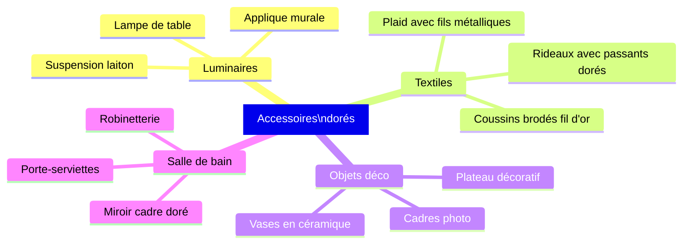
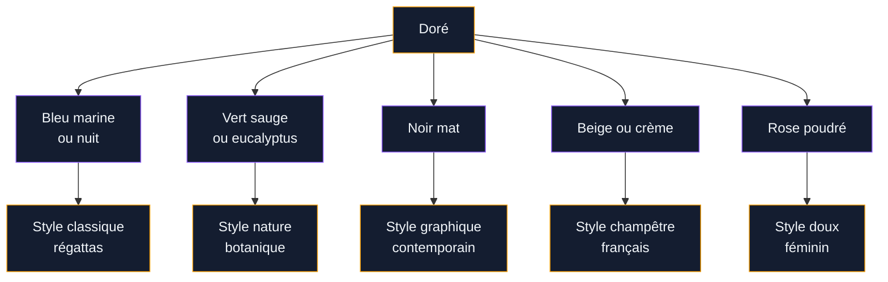

Le doré fait un sacré retour dans les intérieurs. Mais entre l'or qui illumine une pièce avec subtilité et l'or qui crie au kitsch, il y a une frontière que beaucoup hésitent à franchir. Bonne nouvelle : cette frontière, on peut l'apprivoiser. Dans cet article, je te montre comment utiliser le doré sur tes murs, tes meubles et tes accessoires pour un résultat vraiment chic - pas criard.

## Pourquoi le doré revient si fort en déco

Le doré n'a jamais vraiment disparu. Mais depuis quelques années, il s'est complètement transformé. Fini le dorure clinquante des années 90 qui évoquait les palaces kitsch. Ce qui revient aujourd'hui, c'est un or mat, terni, vieilli - qu'on appelle souvent "or brossé" ou "or antique".

<div class="my-8">
  
</div>


Ce changement tient à deux tendances de fond. D'abord, le retour du style classique français et des influences romantiques dans la déco (les [appartements modernes](/appartements-modernes-60-photos-et-conseils-de-decoration/) eux-mêmes intègrent des touches de doré sans complexe). Ensuite, l'émergence des matériaux mats : un robinet doré brossé dans une salle de bain en béton ciré, ça fait une combinaison que même les plus réticents trouvent belle.

> [!NOTE]
> Le doré "or brossé" (aussi appelé PVD or dans les catalogues de robinetterie) donne un rendu mat et chaleureux, très différent du laiton brillant des années 80. C'est cette finition qu'on retrouve chez Grohe, Hansgrohe ou encore IKEA dans sa gamme TÖRNVIKEN.

La question que tout le monde se pose, c'est : combien de doré c'est trop ? La réponse dépend de la surface et du contexte. Mais une règle fonctionne bien : le doré doit représenter au maximum 20 % de ta décoration. Au-delà, l'effet se dilue et l'ensemble perd en élégance.

## Le doré sur les murs : peinture, papier peint et stuc


<div class="my-8">
  
</div>

### La peinture dorée sur les murs

Peindre un mur en doré n'est pas une mauvaise idée - c'est même une très bonne idée si tu t'y prends bien. Le piège habituel : choisir une peinture trop brillante qui transforme ton mur en miroir. L'astuce : opter pour une peinture satinée ou mate avec des pigments dorés.

Quelques références concrètes :

- **Little Greene "Gold" (série métallique)** : environ 55 € le litre, finition satinée, résultat très raffiné. Cette teinte s'appelle "Pale Gold" dans le catalogue 2025.
- **Farrow & Ball "Dead Flat"** en teinte "India Yellow" avec glacis doré par-dessus : technique plus élaborée mais résultat somptueux, environ 100 € le litre pour la base.
- **Tollens Metallia or** : gamme plus accessible autour de 35 € le litre en GSB, finition satinée correcte.

Le mur doré fonctionne particulièrement bien en mur d'accent : un seul mur peint derrière un canapé ou une tête de lit fait tout l'effet sans saturer la pièce. Pour les autres murs, des neutres comme le blanc cassé, le beige chaud ou le vert sauge créent un beau contraste.

### Le papier peint doré

Le papier peint à motifs dorés connaît un vrai regain. Les motifs les plus tendance en ce moment : les géométriques discrets avec touches dorées, les herbes folles et feuillages stylisés, et les rayures verticales avec fil d'or.

- **Graham & Brown "Prestige"** : collection avec rehauts dorés, autour de 45 € le rouleau.
- **Elitis** : créateur français, magnifiques papiers avec feuilles d'or véritable, à partir de 120 € le rouleau - pour des projets ambitieux.
- **IKEA BLÅVINGE** : option budget à 25 € le rouleau, motif géométrique avec touches champagne discret.

> [!TIP]
> Avant de poser un papier peint doré, enduis les murs d'une sous-couche légèrement teintée en jaune paille. Ça renforce la luminosité du doré une fois le papier posé et évite que les raccords sombres transparaissent.

### Le stuc et les enduits dorés

Le stuc vénitien avec pigments dorés donne un résultat fastueux sans être tape-à-l'oeil. C'est une technique artisanale : compte entre 80 et 150 € le m² si tu fais appel à un artisan spécialisé. Plusieurs entreprises proposent ce type de prestation en France, notamment via la Guilde des Stuquateurs.

Pour une version DIY, les enduits de type "béton décoratif" enrichis de poudre de bronze ou d'or (disponibles chez Brico Dépôt ou en ligne chez Décopro) offrent un rendu intéressant pour un budget plus serré : autour de 40-60 € le m² en matériaux.

## Les meubles dorés : choisir et intégrer

```mermaid
flowchart LR
    A["Meuble doré"]:::principal --> B["Finition mate\nbrossée"]:::secondaire
    A --> C["Finition brillante\npolie"]:::warning
    B --> D["Style contemporain\nou scandinave"]:::success
    C --> E["Style baroque\nou empire"]:::success
    D --> F["Associer à bois\nclair ou béton"]:::principal
    E --> G["Associer à velours\nou marbre"]:::secondaire

<div class="my-8">
  
</div>


    classDef principal fill:#141D30,stroke:#F59E0B,color:#F1F5F9
    classDef secondaire fill:#141D30,stroke:#8B5CF6,color:#F1F5F9
    classDef warning fill:#141D30,stroke:#F97316,color:#F1F5F9
    classDef success fill:#141D30,stroke:#10B981,color:#F1F5F9
```

### Pieds et structures métalliques

C'est le point d'entrée le plus simple pour introduire du doré dans un intérieur. Un canapé avec des pieds dorés brossés, une table basse avec un plateau en marbre et des pieds laiton, une bibliothèque avec des étagères en chêne et des fixations dorées : ça change tout sans changer grand-chose.

Marques et prix de référence :
- **IKEA VITTSJÖ** avec pieds remplacés par des pieds dorés (les pieds Hairpin en or brossé coûtent 25-40 € les 4 sur Amazon ou MadeInDesign)
- **La Redoute Intérieurs, collection "Métal doré"** : tables de chevet à partir de 89 €, bibliothèques autour de 250 €
- **MADE.com** (maintenant chez Habitat) : canapés avec pieds brass à partir de 699 €

### Les commodes et consoles dorées

Une commode entièrement dorée, c'est un statement fort. Pour que ça fonctionne, il faut soit qu'elle soit seule et vraiment mise en valeur (fond de couleur unie, miroir au-dessus), soit qu'elle dialogue avec des matériaux naturels autour d'elle (parquet en chêne, tapis laine naturelle).

- **Maisons du Monde "Gatsby"** : commode 6 tiroirs laquée dorée, environ 599 €. Divisée d'avis dans les commentaires clients, mais dans le bon contexte elle est très réussie.
- **Zara Home, série "Vintage Brass"** : petits meubles d'appoint en métal doré brossé, 79 à 199 €.
- **Kare Design "Gold Rush"** : la marque allemande propose des meubles dorés assumés, autour de 800-1500 € pour les pièces de caractère.

> [!WARNING]
> Évite de mélanger plusieurs finitions dorées dans une même pièce : or brillant sur le miroir, or brossé sur la lampe et or champagne sur le vase créent une cacophonie visuelle. Choisis une seule finition dorée et tiens-y tout le long.

### Repeindre un meuble en doré : le DIY

C'est une des transformations les plus efficaces côté rapport impact/budget. Une vieille commode récupérée, quelques couches de peinture acrylique dorée (type Rust-Oleum "Metallic Gold", 15-20 € la bombe) et elle devient une pièce de caractère.

Technique en 5 étapes :
1. Poncer légèrement la surface (grain 120)
2. Appliquer une sous-couche grise ou ocre (meilleure adhérence)
3. Passer 2 couches de peinture métallique dorée
4. Finir avec un vernis mat pour protéger et adoucir l'effet brillant
5. Changer les poignées pour des boutons en céramique blanche ou en cuir camel

## Les accessoires dorés : la voie royale pour débuter

Si tu hésites encore à t'engager sur les murs ou les meubles, les accessoires sont la meilleure façon de tester le doré dans ton intérieur. C'est réversible, c'est abordable et l'effet est immédiat.

<div class="my-8">
  
</div>




### Les luminaires dorés

Un luminaire doré transforme une pièce ordinaire en espace distinctif. La suspension dorée au-dessus d'une table à manger, c'est devenu un classique dans les appartements contemporains.

- **IKEA HEKTAR** modifié avec une douille dorée : bricolage facile pour 15-20 € de pièces
- **Ferm Living "Collect"** : douilles et abat-jours modulables, suspension laiton dès 35 €
- **Tom Dixon "Beat"** : la référence en matière de suspension laiton, autour de 295 € - un investissement mais une qualité irréprochable
- **Westwing, sélection "Cuivre & Doré"** : bonnes options entre 79 et 250 € selon les modèles

Pour les appliques murales, la marque Gubi propose de très belles choses autour de 200-350 €. Plus accessibles, les appliques de chez La Redoute ou Maisons du Monde démarrent à 49 €.

### Les cadres et miroirs dorés

Un miroir avec un cadre doré au-dessus d'une cheminée ou dans une entrée, c'est un classique qui ne vieillit pas. Et c'est une des applications les plus cohérentes avec le style [décoration française romantique](/decoration-francaise-idees-et-photos-romantiques/) qui revient très fort en ce moment.

- **Miroir "Baroque" Maisons du Monde** : cadre doré sculpté, 120-220 € selon la taille
- **IKEA SÖDERHAMN** avec cadre personnalisé : le miroir de base à 30 € peut être transformé avec de la feuille d'or et du vernis
- **Gallery Direct** (marque britannique disponible en France) : miroirs dorés très réussis, 80-180 €
- **Les Puces de Paris** : pour les vrais cadres anciens dorés à la feuille, compter 50-200 € selon l'état

Pour les cadres photo, mélanger des cadres dorés avec des cadres en bois naturel ou noir mat sur un mur de photos donne un résultat très personnel et harmonieux.

### Les vases et objets décoratifs

Les vases en céramique avec rehauts dorés sont partout en ce moment. La technique "Kintsugi" (réparation à l'or) est même devenue un atelier tendance.

- **H&M Home** : vases céramique avec touches dorées, 12-35 €
- **Zara Home** : plateaux et objets dorés de bonne qualité, 25-80 €
- **Anthropologie** : objets déco dorés très esthétiques mais chers, 40-150 €
- **Brocante et vide-greniers** : des petits objets dorés anciens s'y trouvent souvent pour quelques euros

### La robinetterie et salle de bain

C'est peut-être l'endroit où le doré a le plus d'impact par rapport au coût. Un robinet doré brossé dans une salle de bain sobre transforme complètement l'espace.

- **Grohe Lineare Gold** : robinet de lavabo, autour de 350-450 €
- **Hansgrohe Tecturis E Gold** : très bon rapport qualité/prix, environ 280-350 €
- **IKEA DALSKÄR** en finish or : non disponible malheureusement, mais les têtes de robinets se remplacent facilement par des modèles dorés compatibles (autour de 80-120 €)
- **Leroy Merlin, marque Sensea** : robinetterie dorée brossée à partir de 149 €

> [!TIP]
> En salle de bain, cohérence = élégance. Si tu choisis la robinetterie dorée, assortis le porte-serviettes, le porte-papier toilette et la tringle de douche dans le même doré brossé. Les kits coordonnés Hansgrohe ou Grohe permettent ça sans effort.

## Comment combiner le doré avec les autres couleurs

Le doré est une couleur caméléon qui s'associe bien à beaucoup d'univers. Mais certaines combinaisons fonctionnent mieux que d'autres.

<div class="my-8">
  
</div>




**Doré + bleu marine** : une des combinaisons les plus élégantes, style marin chic. Pense aux [couleurs du salon 2026](/couleurs-du-salon-2026-palettes-de-murs-et-de-decors/) où le bleu profond avec touches dorées est très présent.

**Doré + vert sauge** : tendance nature, très populaire pour les cuisines et salons. Le vert tempère la chaleur du doré.

**Doré + noir mat** : ultra-graphique, pour un intérieur contemporain assumé. Un interrupteur doré sur un mur noir, c'est un détail qui fait tout.

**Doré + beige ou blanc cassé** : la combinaison la plus douce et la plus polyvalente. Idéale pour débuter avec le doré sans risquer de se tromper.

## Éviter les erreurs classiques

Quelques pièges que je vois souvent :

**Mélanger l'or et l'argent sans réflexion** : ça peut fonctionner (le "mixed metals" est une vraie tendance) mais ça demande une vraie intention. Si tu mélanges, fais-le assumé avec une vraie règle : 70% d'un métal, 30% de l'autre.

**Utiliser du doré bon marché très brillant** : la peinture or à 3 € du supermarché, le vase doré plastique à 2 €, le miroir or sous blister... Ces objets cassent immédiatement l'effet recherché. Mieux vaut un seul bel objet doré qu'une dizaine de dorures bas de gamme.

**Saturer une pièce entière** : même si tu adores le doré, garde-toi de l'espace de respiration. Les murs neutres, les surfaces naturelles (bois, lin, coton), les matières mates sont tes alliés pour que le doré ressemble à un bijou et non à une surcharge.

**Oublier l'entretien** : les surfaces dorées, notamment la robinetterie, se salissent et s'abîment plus vite que le chrome classique. Préfère les finitions PVD (dépôt physique en phase vapeur) qui résistent mieux aux rayures et aux produits ménagers. Elles coûtent un peu plus cher mais durent beaucoup plus longtemps.

> [!IMPORTANT]
> Si tu te lances dans une rénovation de salle de bain et que tu veux de la robinetterie dorée, investis dans du PVD certifié. La robinetterie dorée bon marché tient 2-3 ans au mieux avant que la finition parte en lambeaux. Une bonne robinetterie PVD, c'est 10-15 ans minimum.


## Sur le meme theme

- [décoration minimaliste](/decoration-minimaliste-idees-et-photos-faciles/)

## Inspiration : 3 ambiances dorées qui fonctionnent

**Ambiance 1 - Bibliothèque chic** : mur d'accent vert bouteille, bibliothèque bois foncé avec détails dorés, fauteuil en velours ocre, lampe laiton. Budget estimé pour refaire le coin lecture : 400-800 €.

**Ambiance 2 - Chambre romantique** : tête de lit velours bleu nuit, appliques murales dorées symétriques, miroir cadre doré, coussins brodés fil d'or. Cohérent avec les tendances [décoration chambre 2026](/decoration-de-la-chambre-a-coucher-2026-tendances-et-photos/), où l'alliance bleu/or est très présente. Budget : 300-600 € selon les marques choisies.

**Ambiance 3 - Salle à manger dramatique** : mur sombre (noir ou vert profond), suspension Tom Dixon laiton, table en chêne massif, chaises cannées avec pieds dorés. Budget : 800-2000 € selon la taille de la pièce.

---

Le doré n'est pas une couleur d'excès si on l'aborde avec intention. C'est une touche de chaleur, un rayon de lumière dans une pièce, un detail qui donne du caractère à des espaces qui en manquent. La clé : choisir peu, choisir bien, et laisser chaque élément doré respirer dans son environnement. Commence par un seul accessoire doré que tu aimes vraiment, observe comment il transforme ton espace, et continue à partir de là.
