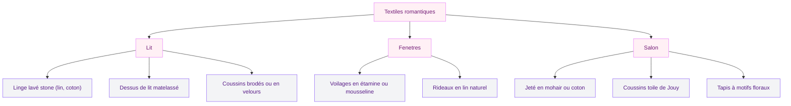
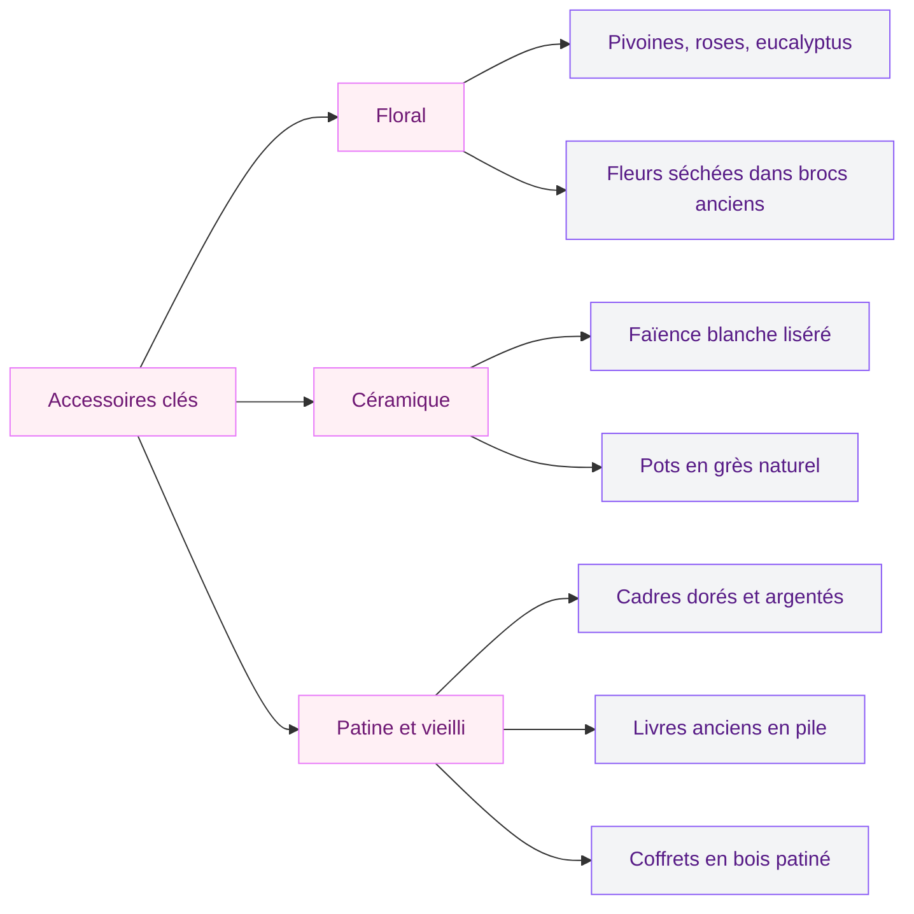

La décoration française romantique, c'est cet art de vivre qu'on imagine tout de suite avec des volets blancs ouverts sur un jardin, des bouquets de pivoines dans un broc en faïence et des rideaux en lin qui frémissent dans la brise. C'est un style qui ne cherche pas la perfection mais qui crée quelque chose de profondément habité, doux, et tellement personnel. Si tu rêves d'un intérieur qui ressemble à une aquarelle de campagne française - avec une bonne dose de charme romantique - cet article est fait pour toi.

## Ce qu'on entend vraiment par "décoration française romantique"

On confond souvent la déco romantique à la française avec le style shabby chic ou le style provençal. C'est lié, mais pas pareil. La déco française romantique, c'est un mélange très spécifique : des couleurs douces inspirées des jardins et des ciels d'aube, des matières naturelles un peu désuètes (la soie, le lin, le velours), et surtout cette esthétique du temps qui passe - quelque chose qui vieillit bien, qui patine, qui raconte une histoire.

Ce n'est pas du tout le même registre qu'une [décoration marocaine moderne avec ses contrastes forts](/guides/decoration/decoration-marocaine-moderne-ou-classique/) ou qu'un salon contemporain très épuré. Ici, on est dans la douceur, la sensibilité, le détail qui fait sourire.

> [!NOTE]
> La décoration française romantique se distingue du shabby chic anglais par son ancrage dans le patrimoine : faïence de Quimper, toiles de Jouy, osier tressé, boiseries peintes. C'est une esthétique "terroir" élevée au rang d'art de vivre.

### Les trois piliers du style

- La patine et l'ancien : meubles chinés, peintures écaillées, tissus usés avec élégance
- La nature et le jardin : fleurs séchées, couronnes végétales, bois flotté, céramiques artisanales
- La lumière douce : bougies, suspensions tamisées, miroirs anciens qui réfléchissent la lumière

## La palette de couleurs : du blanc cassé au rose poudré

C'est probablement le point le plus important quand on veut créer une ambiance romantique à la française. Oublie les blancs froids ou les beiges trop contemporains. Ici, on travaille avec des tons qui évoquent les robes d'un autre siècle, les murs d'un manoir normand, les roses du jardin de Giverny.

**Les couleurs qui font le style :**

- Blanc cassé type "vieux lin" (entre le blanc et le crème) pour les murs
- Rose poudré, rose antique, mauve très pâle pour les tissus et les accessoires
- Vert eau, vert sauge, bleu céladon pour les notes de couleur
- Terre cuite pâle, sable, gris perle pour équilibrer

> [!TIP]
> Mon secret : peins tes murs en blanc cassé (essaie la teinte "Craie" chez Ressource ou "Old White" chez Annie Sloan), puis habille l'espace avec des textiles roses et mauves. La profondeur vient des couches de matières, pas de la peinture seule.

Tu veux voir ce que ça donne en pratique ? Imagine un salon avec des murs presque blancs mais chauds, un canapé recouvert d'un drap en lin poudré, une table basse en bois patiné, des coussins en velours mauve et une guirlande de fleurs séchées au-dessus de la fenêtre. C'est ce qu'on cherche.

## Les meubles : chinés, patinés, racontés

Le mobilier d'une déco romantique française n'est jamais neuf et brillant. Ou en tout cas, il ne doit pas le paraître. L'idée, c'est d'habiller ta maison avec des pièces qui ont du vécu - soit vraiment chinées, soit patinées maison.

### Où trouver les bons meubles

Les brocantes restent la vraie mine d'or. Emmaüs, vide-greniers, Leboncoin : cherche des commodes Louis-Philippe, des fauteuils bergère, des buffets campagnards en bois blond. Budget : entre 40€ et 200€ pour une belle pièce à patiner.

Si tu n'as pas le temps de chiner, quelques marques proposent des meubles dans cet esprit :
- **Maisons du Monde** : leur gamme "Collection Campagne" avec des buffets à 299-450€
- **La Redoute Intérieurs** : plusieurs tables basses en bois avec pieds tournés autour de 180-250€
- **H&M Home** : petits meubles d'appoint abordables (desserte en bois à 79€)

> [!TIP]
> La patine à la craie, ça change vraiment tout. Prends n'importe quel meuble en bois massif, ponce-le légèrement, applique deux couches de peinture à la craie (Annie Sloan, Rust-Oleum ou Zara Home version DIY), laisse sécher et frotte avec une cire douce. Résultat garanti pour 25-40€ de matos.

### Les pièces stars

**Le lit en fer forgé ou en bois tourné.** C'est LA pièce centrale de la chambre romantique. Ikea a son modèle Sagstua en fer (199€) qui, avec quelques accessoires, peut vraiment fonctionner dans ce style. Mais si tu trouves un vrai lit ancien en chine, c'est encore mieux.

**Le fauteuil crapaud ou bergère.** La version française romantique du fauteuil accent. Tapissé en velours côté ou en lin fleuri, il donne instantanément de la personnalité à un coin de pièce.

**La coiffeuse avec miroir ovale.** Objet iconique du style - et très pratique. Cherches-en une ancienne sur Leboncoin (souvent entre 50 et 120€) ou regarde du côté de Rouen Antiques pour les pièces de qualité.

## Les textiles : la vraie magie du style romantique

Si tu ne devais retenir qu'une chose de cet article, c'est bien ça : dans une déco française romantique, les textiles font 60% du travail. Rideaux, coussins, jeté de lit, nappes, plaids - chaque tissu ajoute une couche de poésie.

**La toile de Jouy**, c'est le tissu emblématique de la déco à la française. Ces impressions en monochrome (bleu, rouge ou noir sur fond blanc crème) représentent des scènes pastorales ou des paysages. Sur des coussins, des tentures ou un dessus de lit, ça signe immédiatement le style. Trouves-en chez Thévenon (tissu d'éditeur, autour de 35-55€/m) ou en version plus abordable chez La Redoute.

**Le lin lavé stone** pour les draps et les rideaux, c'est l'autre signature. La marque Linot propose de belles pièces autour de 60-90€ la taie d'oreiller. Merci Handy fait aussi du très bon travail dans cet esprit.

**Le velours côté** pour les coussins et fauteuils : en rose poudré ou vert céladon, il apporte cette chaleur visuelle qu'on adore.

> [!WARNING]
> Évite le satin brillant et les velours "plats" trop contemporains - ils cassent l'ambiance. Dans la déco romantique française, la matière doit avoir du grain, de la texture, du caractère.

## La lumière : entre bougies et lumières tamisées

Dans un intérieur romantique, la lumière artificielle dure et froide est ton ennemi. Tu veux de la chaleur, du mouvement, des jeux d'ombres douces.

**Les suspensions** : opte pour des abat-jour en lin naturel ou en soie écrué, des formes baladeuse ou en cage dorée patinée. Harto propose de jolies suspensions dans cet esprit autour de 120-180€. Sinon, une simple ampoule Edison dans une suspension en osier tressé (Ikea, 14€99) fait le travail.

**Les bougies** : indispensables dans ce style. Des bougeoirs en laiton doré patiné, des chandeliers anciens en argent, des photophores en verre soufflé. Les bougies non parfumées dans des tons crème ou rose pâle posées en groupe sur un plateau, c'est imbattable.

**Les miroirs anciens** : ils doublent visuellement la lumière et ajoutent cette dimension mystérieuse et poétique. Un grand miroir en pied à cadre doré, une série de petits miroirs ronds en laiton vintage, ou un miroir ovale à fronton sculpté - cherche du côté de L'Atelier du Miroir ou directement en brocante.

Ce registre lumineux doux se retrouve aussi dans certains [salons modernes et élégants](/guides/decoration/salons-modernes-et-elegants-2026/) qui mixent contemporain et éléments romantiques - preuve que les styles peuvent dialoguer.

## Accessoires et détails : l'art du "juste ce qu'il faut"

La tentation dans ce style, c'est de trop en faire. Un intérieur romantique saturé devient vite chargé au mauvais sens du terme. L'idée, c'est le romantisme contrôlé : quelques pièces choisies, bien placées, qui racontent quelque chose.

**Le floral, signature absolue.** Un bouquet de pivoines dans un broc blanc, des branches d'eucalyptus séchées dans un vase en grès, une couronne de lavande au-dessus d'une porte - c'est ça, l'âme de la déco française romantique. Et le budget peut rester très raisonnable : les fleurs séchées de Bloom & Wild ou d'Ikea's Torka sont jolies et durent des mois.

**Les cadres en composition.** Regroupe cinq ou six cadres dorés et argentés patinés dans des tailles différentes sur un mur. Mets des illustrations botaniques imprimées (tu en trouves à télécharger gratuitement sur Unsplash ou Rawpixel), des photos en noir et blanc, ou même des cartes postales anciennes. Résultat : un mur qui raconte une histoire.

**Les livres anciens.** En pile sur une table basse ou sur une étagère, des livres aux couvertures en cuir ou en tissu patiné participent directement à l'ambiance. Et si tu les ranges par couleurs (tons crème, beige, rose pâle), c'est encore plus beau.

Ce style romantique partage certains codes avec la [décoration shabby chic](/guides/decoration/decoration-shabby-chic-idees-et-photos-de-style-et-de-decoration/) - meubles patinés et palette douce - mais il est plus ancré dans l'héritage français : la toile de Jouy, la faïence, les objets de campagne.

## Adapter le style pièce par pièce

### La chambre romantique

C'est la pièce la plus facile à transformer dans ce style, et souvent la plus réussie. Le lit devient le point focal : tête de lit en fer forgé ou en bois sculpté peint en blanc cassé, linge en lin lavé dans des tons crème ou rose, coussins en velours vert céladon ou mauve.

Ajoute une petite table de nuit en bois patiné (évite les commodes modernes trop rectangulaires), une lampe de chevet avec un abat-jour en soie écrué, et un miroir en pied à cadre doré dans un coin. Si tu as une chaise ou un tabouret, recouvre-le d'un jeté en mohair.

### Le salon romantique

Un peu plus délicat parce qu'on a tendance à surcharger. Ma stratégie : un grand canapé en lin naturel ou en velours (La Redoute fait de beaux modèles entre 600 et 1200€), deux ou trois coussins floraux, une table basse en bois patiné, et un tapis en laine avec motifs discrets. Pour les murs, quelques cadres en composition et une plante tombante dans un cache-pot en faïence.

> [!IMPORTANT]
> Le "moins c'est plus" s'applique vraiment ici. Si tu as l'impression que ton intérieur ressemble à une vitrine de brocante, c'est que tu as trop chargé. Enlève un tiers de tes accessoires et regarde le résultat - presque toujours mieux.

### La salle à manger romantique

Nappe en lin blanc ou écru, assiettes en faïence blanche (liséré bleu ou rose), couverts en argent patiné (ou en inox brossé pour un budget plus contenu), vases en grès avec fleurs séchées, bougies en laiton. Voilà, c'est tout ce qu'il faut.

## Les erreurs à éviter

**Trop de rose.** Le rose en teinte principale sur les murs, c'est souvent une erreur - ça devient facilement "chambre d'enfant" ou "années 80". Utilise le rose dans les textiles et les accessoires, pas comme couleur dominante des murs.

**Les imitations plastiques.** Dans ce style, la matière compte. Un cadre doré en plastique brillant ne donnera jamais l'effet d'un vrai cadre en bois doré patiné. Cherche de la qualité même sur de petites pièces.

**Le tout assorti.** Les ensembles "collection coordonnée" (même tissu partout, même motif partout) tuent la poésie de ce style. Mêle les motifs, les époques, les origines - c'est ça qui crée l'authenticité.

## Budget réaliste selon ton projet

| Type d'ambiance | Budget estimé | Ce que ça couvre |
|---|---|---|
| Quelques touches romantiques | 200-400€ | Textiles + accessoires + bougies |
| Transformation chambre complète | 600-1200€ | Meubles chinés + literie + rideaux + déco |
| Salon romantique complet | 1000-2500€ | Canapé + meubles + textiles + luminaires |

Trust me, le style romantique à la française est l'un des moins onéreux à recréer. Parce que la brocante, le DIY et les pièces chinées sont non seulement moins chers que le neuf - ils sont aussi plus authentiques.

---

## Questions fréquentes

### C'est quoi la différence entre déco romantique et déco shabby chic ?

Le shabby chic vient de l'Angleterre des années 80 - c'est plus blanc, plus lacé, plus "vieilli délibérément". La déco romantique française intègre des éléments du patrimoine comme la toile de Jouy, les meubles Louis-Philippe, la faïence artisanale. Le résultat est plus chaleureux et moins "désuet".

### Comment créer une ambiance romantique sans budget énorme ?

La brocante et le DIY sont tes meilleurs alliés. Un meuble à 30€ patiné à la cire Annie Sloan (15€) peut faire le même effet qu'une pièce à 300€. Focus sur les textiles (relativement abordables) et les bouquets de fleurs séchées. Les cadres dorés de chez Ikea peuvent aussi surprendre une fois patinés.

### Peut-on mixer la déco romantique avec un style plus contemporain ?

Oui, et c'est souvent plus réussi que le style pur. Un mur en béton décoratif avec des rideaux en lin et des meubles patinés, ça peut très bien fonctionner. L'astuce : garde la palette de couleurs douce et les matières naturelles comme fil conducteur.

### La déco romantique s'adapte-t-elle à un petit appartement ?

Tout à fait. En fait, la déco romantique fonctionne très bien dans les petits espaces parce qu'elle crée une intimité chaleureuse. Évite juste de surcharger : choisis deux ou trois pièces choisies plutôt que beaucoup de petits bibelots.

### Quelles fleurs utiliser dans une déco romantique française ?

Pivoines, roses anciennes, lavande, eucalyptus, gypsophile, pensées, digitales - tout ce qui évoque le jardin de maison de campagne. En version séchée, les pivoines, la lavande et les roses conservent leur charme pendant des mois.
