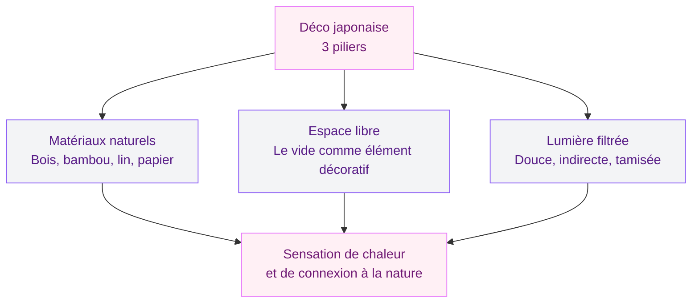
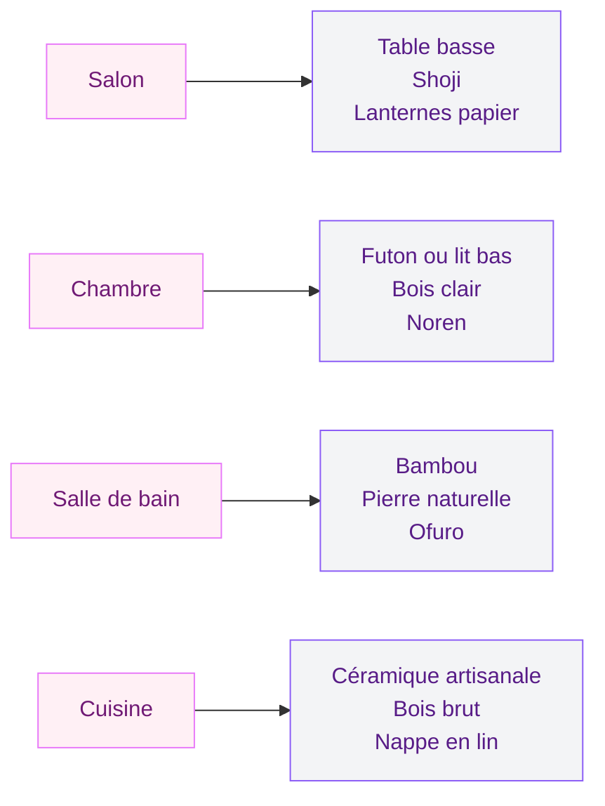
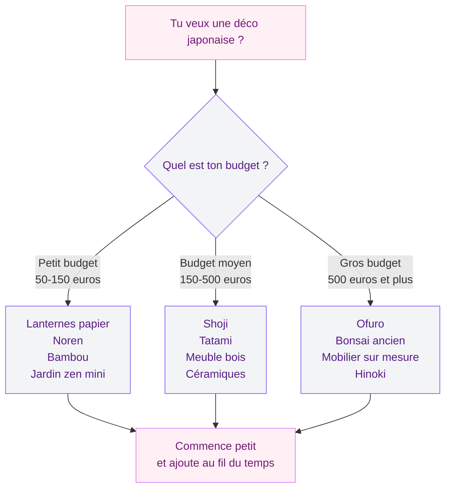

La déco japonaise, c'est ce style qui te fait respirer rien qu'en le regardant. Tu sais, ces intérieurs épurés où chaque objet semble avoir été choisi avec soin, où le bois clair rencontre le papier washi, où la lumière douce traverse des panneaux coulissants... Ce n'est pas du minimalisme froid. C'est une façon de vivre où le vide a autant de valeur que le plein.

Et la bonne nouvelle ? Tu n'as pas besoin de tout casser chez toi pour créer cette ambiance. Quelques choix bien pensés suffisent à transformer un salon banal en havre de paix à la japonaise. Voici 20 idées concrètes pour t'y mettre, avec des budgets et des astuces applicables dans n'importe quel appartement.

## Les bases du style japonais en déco intérieure

Avant de plonger dans les idées, il faut comprendre ce qui fait l'âme d'un intérieur japonais. C'est un équilibre entre trois éléments : les matériaux naturels, l'espace libre, et la lumière filtrée.

  

  

Au Japon, l'esthétique wabi-sabi célèbre la beauté de l'imperfection et du temps qui passe. Un bol en céramique avec une légère irrégularité a plus de valeur qu'un objet parfaitement industriel. Un bout de bois brut avec ses noeuds raconte une histoire. Cette philosophie imprègne toute la déco japonaise traditionnelle et contemporaine.

Les couleurs sont sobres : blanc cassé, beige sable, gris doux, vert mousse, noir profond. Les textures comptent plus que les teintes vives. Et l'espace vide - le "ma" en japonais - n'est pas un manque, c'est un élément décoratif à part entière.

> [!NOTE]
> Le concept de "ma" (espace négatif) est central dans la déco japonaise. Un mur vide n'est pas un mur à remplir : c'est un espace qui permet à l'oeil de se reposer et à l'esprit de se calmer.

## 20 idées pour adopter la décoration japonaise chez toi

  

### 1. Les panneaux shoji pour séparer les espaces

Les panneaux coulissants shoji, avec leur cadre en bois et leur papier translucide, sont l'élément le plus reconnaissable de l'intérieur japonais. Ils laissent passer la lumière tout en créant de l'intimité. Tu peux en installer comme séparation entre le salon et l'entrée, ou devant un dressing ouvert. Sur Etsy et Amazon, compte entre 80 et 250 euros pour un panneau de bonne qualité.

### 2. Un coin tatami dans le salon

Pose 2 ou 3 dalles de tatami (en igusa, la jonche naturelle japonaise) dans un angle du salon pour créer un coin lecture ou méditation. Les dalles sur Amazon (30-60 euros le module) font bien le travail. Ca sent bon la paille sèche et ça pose immédiatement l'ambiance.

### 3. Des lanternes en papier washi

Les lampes en papier japonais diffusent une lumière douce et chaude qui change complètement l'atmosphère d'une pièce. Ikea en propose avec la gamme REGOLIT (à partir de 5 euros), mais pour un rendu plus authentique, les lanternes artisanales en washi se trouvent entre 40 et 120 euros chez des artisans en ligne.

### 4. Une table basse au ras du sol

L'assise basse est typique du quotidien japonais. Une table de 30-35 cm de hauteur, des coussins zabuton au sol, et ton salon prend une toute autre dimension. Si tu veux aller plus loin, notre guide sur la [table basse japonaise kotatsu](/table-basse-japonaise-kotatsu/) te donne toutes les pistes pour un coin ultra cosy en hiver.

### 5. Du bambou partout où tu peux

Le bambou est le matériau roi de la déco japonaise. Stores en bambou pour les fenêtres (15-40 euros chez Leroy Merlin), petit meuble de rangement en bambou pour la salle de bain, set de table en bambou pour la cuisine. C'est résistant, écologique, et ça apporte une touche naturelle immédiate.

> [!TIP]
> Pour un effet "jardin japonais intérieur", plante un bambou d'intérieur (Dracaena sanderiana, le lucky bamboo) dans un vase transparent avec des galets au fond. C'est une déco vivante qui ne demande quasi aucun entretien - juste changer l'eau toutes les deux semaines.

### 6. Un jardin zen miniature sur la table basse

Les jardins zen de bureau (karesansui miniature) se trouvent entre 15 et 40 euros. Un plateau de sable fin, quelques galets, un râteau miniature. C'est décoratif et méditatif à la fois. Pour d'autres idées avec des galets, va voir nos [astuces de déco massif avec galets](/5-astuces-de-deco-massif-avec-galets/).

### 7. Des rideaux noren à l'entrée des pièces

Les noren sont ces courts rideaux fendus qu'on voit à l'entrée des maisons au Japon. En coton ou en lin, imprimés de motifs traditionnels (vagues, cerisiers, grues), ils remplacent joliment une porte dans un couloir ou entre la cuisine et le salon. Budget : 10-30 euros en ligne.

### 8. Une branche de cerisier dans un vase sobre

Les fleurs de cerisier - sakura - sont le symbole du Japon. Une grande branche de cerisier artificiel dans un vase en céramique, posée dans un angle du salon, crée un point focal poétique. Les branches de qualité se trouvent entre 15 et 50 euros. Choisis des modèles en tissu plutôt qu'en plastique pour un rendu crédible.

### 9. Le bois naturel comme fil conducteur

Le bois est partout dans la maison japonaise : murs, sols, meubles, accessoires. Préfère le chêne clair, le frêne, le pin naturel ou le cyprès hinoki. Un meuble TV en bois clair aux lignes droites, des étagères murales en bois brut, une crédence en bois dans la cuisine - tout ça contribue à l'ambiance.

### 10. Des céramiques artisanales

La céramique japonaise - raku, tenmoku, shino - est un art à part entière. Quelques bols ou vases aux finitions irrégulières posent immédiatement le ton wabi-sabi. Chez Muji, Zara Home ou sur Etsy, tu trouves des pièces entre 8 et 60 euros.

### 11. Un futon ou un lit très bas

Dans la chambre, le lit japonais est bas - très bas. Un cadre en bois à 15-20 cm du sol, ou un vrai futon posé sur un tatami. Ca libère visuellement l'espace et donne une impression de calme. Les cadres de lit type plateforme démarrent à 150 euros chez Emma, Kipli ou sur Amazon.

### 12. Des galets et pierres naturelles

Quelques galets lisses dans une coupelle, un arrangement de pierres sur une étagère, des cailloux autour d'une plante - la pierre est un élément central du jardin japonais qu'on transpose facilement à l'intérieur. Ramasse-les en bord de rivière ou achète un lot chez Jardiland pour quelques euros.

### 13. Le papier peint motif japonais

Un seul mur d'accent en papier peint à motifs japonais (cerisiers en fleur, grues, vagues kanagawa) peut transformer une pièce. Choisis des tonalités douces - bleu-gris, beige, blanc et or - pour rester dans l'esprit zen. Les papiers peints japonisants commencent à 15-20 euros le rouleau.

### 14. Des bonsais comme sculptures vivantes

Un bonsai bien entretenu, c'est une oeuvre d'art végétale. Place-le sur une petite tablette en bois à hauteur des yeux, dans l'entrée ou le salon. Les bonsais de débutant (ficus ginseng, carmona) coûtent entre 15 et 40 euros en jardinerie.

> [!WARNING]
> Un bonsai n'est pas une plante à poser et oublier. Il demande un arrosage régulier, de la lumière et une taille ponctuelle. Si tu n'as pas la main verte, commence par un ficus ginseng - c'est le plus résilient pour les débutants.

### 15. Un coin thé à la japonaise

Dédie un petit espace à la cérémonie du thé : une théière en fonte (tetsubin), des tasses sans anse en céramique, un plateau en bois. Ce coin fonctionnel devient un vrai élément de déco qui raconte une histoire. Une théière en fonte correcte démarre à 30 euros chez Maisons du Monde.

### 16. L'ikebana ou l'art de l'arrangement floral

L'ikebana, c'est l'art japonais de disposer les fleurs. Pas un gros bouquet foisonnant, mais une tige, une branche, une fleur - disposées avec intention dans un vase sobre. C'est l'anti-bouquet de supermarché. Avec un vase en céramique et trois branches de ton jardin, tu crées un point visuel fort pour zéro euro.

### 17. Le Japandi : le mix nippo-scandinave

Le Japandi marie l'esthétique japonaise avec le design scandinave. Bois clair, lignes pures, palette neutre, touches de noir. C'est la tendance déco qui ne vieillit pas, parce qu'elle combine le meilleur des deux mondes. Pour explorer d'autres styles épurés, notre article sur la [décoration minimaliste](/decoration-minimaliste-idees-et-photos-faciles/) va dans la même direction.

### 18. Des rangements invisibles et intégrés

La maison japonaise cache ses affaires. Pas de bibelots sur les étagères, pas de pile de magazines sur la table basse. Tout est rangé dans des placards fermés, des coffres, des tiroirs. Chez Muji, la gamme de boîtes de rangement empilables est parfaite pour ça.

### 19. Un ofuro ou baignoire profonde

La salle de bain japonaise est un sanctuaire. Si tu as de la place, une baignoire profonde style ofuro (en bois de cyprès ou en céramique moderne) transforme tes bains en rituel. C'est un investissement (500 euros et plus), mais l'expérience est incomparable. Le guide sur la [baignoire japonaise](/baignoire-japonaise/) détaille toutes les options.

### 20. Le parfum d'intérieur au yuzu ou au hinoki

Un élément souvent oublié : le parfum. Les Japonais utilisent l'encens (senko), les huiles essentielles de hinoki (cyprès japonais) ou de yuzu pour parfumer délicatement leur intérieur. Une bougie au yuzu, un diffuseur à bâton au bois de cèdre, ou un brûle-encens en céramique complètent l'expérience sensorielle. Budget : 10-30 euros.

> [!TIP]
> Pour une ambiance japonaise complète, combine trois sens : la vue (déco épurée, bois, lumière douce), le toucher (textures naturelles, lin, bois lisse) et l'odorat (encens, hinoki, yuzu). C'est ce trio sensoriel qui fait la différence entre une déco "à thème" et une vraie ambiance.

## Les erreurs qui cassent l'ambiance japonaise

**Trop d'objets déco** - C'est la contradiction la plus courante. Tu achètes 15 objets "japonais" et tu les exposes tous. Résultat : un intérieur encombré, l'exact opposé de ce que tu voulais. Choisis 3-4 éléments forts par pièce, pas plus.

  

**Le rouge et le noir à outrance** - Beaucoup de gens associent "déco japonaise" à du laque rouge vif et du noir brillant. C'est une vision cinéma, pas une réalité quotidienne. Les intérieurs japonais sont clairs, doux, neutres. Le rouge et le noir existent, mais en touches très légères.

**Du plastique partout** - Les fausses plantes en plastique, les lanternes en plastique, les faux bambous en plastique... Ca se voit et ça va à l'encontre de toute la philosophie japonaise des matériaux authentiques. Si tu ne peux pas mettre du vrai, mets moins, mais du vrai.

**Négliger la lumière** - Un intérieur japonais avec un plafonnier halogène blanc cru, c'est raté d'avance. La lumière douce et indirecte est un élément décoratif à part entière. Investis dans des lampes d'appoint plutôt que dans un objet déco supplémentaire.

## Comment commencer sans tout refaire

Si tout ça te donne envie mais que tu ne sais pas par où attaquer, voici mon plan en 4 étapes :

  

**Etape 1 - Désencombre.** La déco japonaise commence par le vide. Retire les objets inutiles, les cadres qui s'accumulent, les bibelots sans histoire. C'est gratuit et ça change déjà beaucoup.

**Etape 2 - Change l'éclairage.** Remplace les plafonniers centraux par des lampes basses et chaudes. Ajoute une ou deux lanternes en papier. Budget : 20-50 euros.

**Etape 3 - Ajoute du bois et du bambou.** Un petit meuble, des stores, un plateau. Ce sont les matériaux qui posent l'ambiance japonaise le plus vite.

**Etape 4 - Choisis un élément fort.** Un panneau shoji, un bonsai, un coin tatami, un kotatsu. Un seul élément vraiment japonais qui devient le point d'ancrage de ta déco.

Prends le temps. La déco japonaise n'est pas un makeover du week-end. C'est une démarche progressive, où chaque ajout est réfléchi. Exactement comme le wabi-sabi : la beauté se révèle lentement.

---

## Sur le meme theme

- [décoration art déco](/50-idees-de-decoration-art-deco/)

## Questions fréquentes sur la décoration japonaise

**Comment créer une ambiance japonaise dans un petit appartement ?**
Les petits espaces sont parfaits pour la déco japonaise, parce que le style repose sur l'épure. Désencombre d'abord, puis ajoute quelques éléments clés : un noren pour séparer les espaces, une lanterne papier, des rangements fermés. Moins tu as de mètres carrés, plus l'effet zen sera fort.

**Est-ce que la déco japonaise coûte cher ?**
Pas du tout si tu y vas par étapes. Les éléments les plus abordables (lanternes papier, noren, bambou, galets) coûtent entre 5 et 40 euros pièce. Le désencombrement ne coûte rien. Les pièces plus coûteuses (shoji, tatami, ofuro) peuvent attendre.

**Peut-on mixer déco japonaise et style moderne occidental ?**
Oui, et c'est même recommandé. Le Japandi (japonais + scandinave) en est l'exemple le plus connu. L'astuce : garde les lignes épurées et les matériaux naturels du style japonais, et intègre-les dans ton mobilier existant. Un canapé gris moderne avec des coussins en lin, une table basse en bois clair, une lanterne papier - ça suffit à créer la passerelle entre les deux univers.

**Quelles plantes choisir pour une déco japonaise ?**
Le bambou d'intérieur (lucky bamboo), le bonsai (ficus ginseng pour débuter), l'érable japonais en pot, le kokedama (boule de mousse avec plante) et les orchidées. Evite les plantes tropicales trop foisonnantes qui vont à l'encontre de l'esprit épuré.

**Quelle est la différence entre déco japonaise et déco zen ?**
La déco zen s'inspire de la philosophie bouddhiste zen, qui est elle-même japonaise. Les deux styles se recoupent énormément. La déco japonaise est un peu plus large : elle inclut des éléments culturels (noren, céramiques, motifs traditionnels) là où le style zen se concentre sur la sérénité pure et le dépouillement. Dans un intérieur, les résultats sont très proches.
