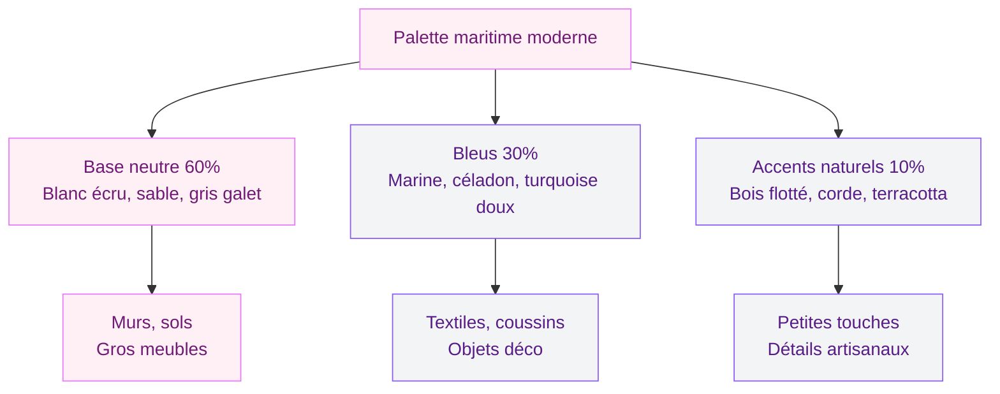
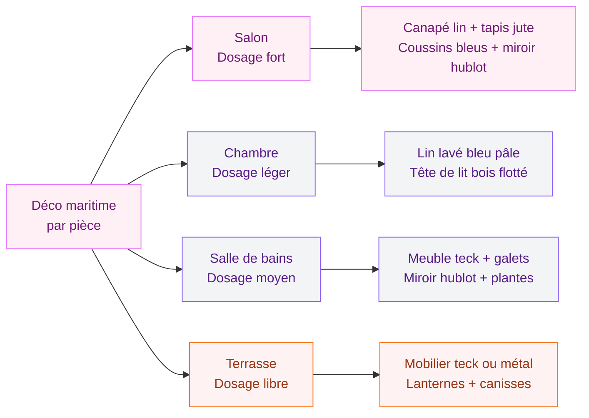
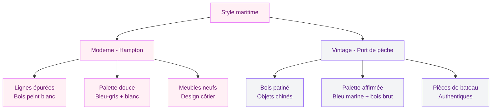

La déco maritime, c'est le style qui fait rêver quand on a besoin de respirer. Tu fermes les yeux et tu vois : un salon lumineux avec du bois clair, des coussins bleu profond, un miroir hublot, une corde de bateau sur une étagère. L'odeur de l'iode, presque. C'est toute la promesse - ramener l'océan chez soi, même en plein centre de Lyon ou Lille.

Mais la ligne est mince entre une déco bord de mer réussie et un salon qui ressemble à un restaurant de fruits de mer. Ancres partout, coquillages par kilos, rayures sur chaque surface... La version moderne du style maritime, celle qui tient la route en 2026, c'est l'inverse : des touches subtiles, des matériaux authentiques, et une palette apaisante qui te fait du bien chaque jour.

## La palette de couleurs maritime moderne : bien plus que du bleu et blanc

Oui, le bleu et le blanc sont les piliers. Mais la palette maritime moderne va beaucoup plus loin. Elle pioche dans les tons naturels du littoral pour créer des ambiances nuancées, jamais monotones.

### Les bleus qui fonctionnent

**Le bleu marine profond** - C'est la couleur star. Pas le bleu roi criard, non. Un bleu intense, dense, presque noir quand la lumière baisse. Sur un mur d'accent, c'est spectaculaire. Chez Tollens, la teinte "Bleu Abyssal" (environ 38EUR les 2,5L) donne cet effet. Dulux Valentine propose aussi un "Bleu Nuit" très réussi autour de 35EUR.

**Le bleu céladon et le bleu gris** - Plus doux, plus quotidiens. Parfaits pour une chambre ou un couloir. Ressource propose la teinte "Brume Marine" autour de 55EUR le litre - cher mais le rendu est incomparable.

**Le turquoise doux** - Pas le turquoise Caraïbes flashy. Un turquoise passé, presque vert d'eau, comme une bouée qui a vécu plusieurs étés.

### Les neutres du littoral

**Le sable et le beige chaud** - La base de toute déco maritime moderne. Murs en blanc cassé chaud, textiles couleur sable, meubles en bois blanchi. C'est ce fond clair qui fait respirer la pièce.

**Le gris galet** - Discret mais utile pour ancrer l'ensemble. Un canapé gris galet, un tapis gris chiné : ça pose le cadre sans écraser les bleus.

**Le blanc écru** - Pas le blanc froid. Un blanc chaud, crémeux, qui tire vers le jaune pâle. Le blanc des voiles de bateau, du lin lavé par le sel.

> [!TIP]
> La règle 60-30-10 version maritime : 60% de neutres (blanc écru, sable), 30% de bleus (un bleu principal + un bleu secondaire), 10% d'accents naturels (bois, corde, terracotta douce). Cette proportion te garantit un résultat apaisant sans effet "tout bleu".

## Les matériaux : le naturel brut du bord de mer

C'est ici que la déco maritime moderne se distingue vraiment de la version kitch qu'on veut éviter. Les matériaux authentiques, bruts, travaillés par les éléments - c'est eux qui donnent l'âme à ton intérieur.

### Le bois, roi de la déco côtière

**Le bois flotté** - La pièce déco par excellence. Ramassé sur la plage ou acheté en ligne (Etsy, Amazon : 10-50EUR selon la taille), le bois flotté s'utilise partout. En centre de table, en porte-manteau, en cadre de miroir. Sa texture grisée et usée par le sel raconte une histoire que tu ne peux pas reproduire autrement.

**Le bois blanchi ou cérusé** - Pour les meubles principaux, c'est la finition idéale. Une commode en pin cérusé blanc (Maisons du Monde, 250-450EUR), une table basse en bois blanchi (La Redoute, 180-320EUR), des étagères en sapin lavé. C'est lumineux, c'est léger, ça dit "bord de mer" immédiatement.

**Le teck et le bois exotique** - Pour un côté plus haut de gamme, le teck rappelle les ponts de bateau. Un banc de salle de bains en teck (Tikamoon, 150-300EUR) ou une desserte d'extérieur qui rentre aussi bien au salon qu'à la terrasse.

### Les fibres naturelles

**La corde et le chanvre** - En accessoires (poignées de porte, rampe d'escalier, dessous de plat) ou en déco murale. Un miroir entouré de corde de chanvre, c'est 20-40EUR chez H&M Home ou Zara Home et ça transforme une salle de bain.

**Le rotin et l'osier** - Paniers de rangement, suspensions lumineuses, fauteuils d'appoint. Le rotin naturel s'intègre dans un intérieur maritime sans effort. Chez Ikea, les paniers FLADIS à 15EUR ou le fauteuil BUSKBO à 129EUR font le job.

**Le jonc de mer** - En tapis ou en panier, c'est la matière qui te met du sable sous les pieds (sans le sable). Un tapis en jonc de mer 120x180cm, c'est autour de 40-80EUR selon la marque. Saint Maclou en propose une belle gamme. Et pour les textiles, mise tout sur le lin lavé : rideaux, housses de coussin, jeté de canapé. Chez AM.PM, les rideaux en lin lavé tournent autour de 60-90EUR la paire.

## Les objets déco maritimes : le dosage qui fait tout

C'est LE piège de la déco bord de mer. Tu commences par une ancre décorative, tu ajoutes un filet de pêche, des coquillages, et soudain ton salon ressemble au musée de la Marine. La version moderne, c'est la retenue.

### Les pièces qui marchent à tous les coups

**Le miroir hublot** - Un classique qui ne vieillit pas. Rond, encadré de métal (laiton, cuivre vieilli ou noir mat). Chez Maisons du Monde, entre 30 et 90EUR. Chez AM.PM, les versions en laiton brossé autour de 120EUR sont magnifiques.

**Les lampes en corde ou en rotin** - Les suspensions tressées diffusent une lumière douce et naturelle. Chez Leroy Merlin, des modèles sympas dès 25EUR. Pour du plus qualitatif, regarde chez Made.com ou Tikamoon (80-200EUR).

**Les vases en verre soufflé** - Transparents, bleutés ou verts, ils rappellent les bouteilles rejetées par la mer. Groupés par trois sur une étagère, c'est simple et élégant. Zara Home et H&M Home, entre 15 et 45EUR.

**Les coussins à motifs marins** - Rayures fines (pas épaisses type marinière caricaturale), motifs corail stylisés, imprimés algues ou vagues abstraites. Budget : 10-25EUR chez H&M Home, 20-40EUR chez La Redoute.

### Ce qu'il vaut mieux éviter

Les ancres géantes posées au sol, les bouées accrochées au mur, les filets tendus au plafond, les coquillages collés sur chaque cadre. Tout ça, c'est la version "thème marin" qui a mal vieilli. La déco maritime moderne suggère l'océan, elle ne le reproduit pas.

> [!WARNING]
> La règle d'or : pas plus de 3 objets ouvertement "marins" par pièce. Un miroir hublot + un vase en verre dépoli + un coussin à rayures, c'est suffisant. Le reste de l'ambiance vient des couleurs et des matériaux, pas des accessoires.

## Pièce par pièce : adapter la déco maritime chez toi

Le style bord de mer ne se limite pas au salon. Chaque pièce peut accueillir sa dose d'océan, à condition d'adapter le dosage.

### Le salon maritime

C'est la pièce où tu peux te permettre le plus d'éléments côtiers. Un canapé en lin blanc ou gris clair (Ikea EKTORP à 449EUR pour démarrer, ou Made.com autour de 900EUR pour monter en gamme), des coussins dans les bleus, un tapis en jute ou jonc de mer au sol, une table basse en bois blanchi. Ajoute quelques éléments en verre et en corde, et c'est plié.

Si tu cherches a donner de la personnalité a tes murs, jette un oeil aux [idées pour décorer avec des tableaux et cadres muraux](/guides/decoration/bien-accrocher-tableau-mural/) - le mix cadres + déco maritime fonctionne très bien.

### La chambre bord de mer

Ici, on joue la carte de la douceur. Du linge de lit blanc et bleu pâle en lin lavé, une tête de lit en bois flotté ou en rotin (DIY possible avec des planches de palette cérusées), une ou deux touches de corde sur la table de nuit. Pas besoin de plus.

Pour la palette idéale de ta chambre, tu peux aussi t'inspirer des [tendances couleurs 2026 pour le salon](/guides/decoration/couleurs-du-salon-2026-palettes-de-murs-et-de-decors/) - les tons bleu gris et sable fonctionnent aussi bien dans une chambre.

### La salle de bains

C'est LA pièce où la déco maritime prend tout son sens. L'eau, les matériaux résistants à l'humidité, l'ambiance spa : tout colle. Meuble vasque en teck, miroir hublot, paniers osier pour le rangement, galets décoratifs, plantes tropicales (sanseveria, pothos).

### La terrasse et le jardin

Mobilier en teck ou métal patiné, coussins d'extérieur à rayures, lanternes en verre, brise-vue en canisses naturelles. La terrasse maritime prolonge naturellement le salon côtier.

## DIY maritime : 5 projets faciles et pas chers

Pas besoin de tout acheter. La déco maritime se prête particulièrement bien au fait-maison - et c'est souvent les pièces DIY qui ont le plus de caractère.

**Cadre photo en bois flotté** - Colle 4-5 branches autour d'un cadre basique (pistolet à colle, 3 min). Budget : 0EUR si tu ramasses en bord de mer, 10-15EUR sinon.

**Suspension en corde** - Enroule de la corde en sisal autour d'une suspension Ikea HEMMA (5EUR). 20 min pour un rendu artisanal magnifique.

**Étagère corde et bois** - Deux planches de pin (5-10EUR pièce chez Leroy Merlin), de la grosse corde marine (10EUR les 5m), quatre trous aux angles, la corde qui passe et se noue. Budget : 20-30EUR.

**Bougie dans un verre "mer"** - Un bocal, du sable (3EUR en jardinerie), des coquillages, une bougie chauffe-plat. Simple, beau, et parfait en cadeau.

**Mur de planches cérusées** - Planches de palette (gratuites), un léger ponçage, une cire blanche ou peinture très diluée. Fixe au mur en tête de lit. Effet wow pour moins de 15EUR.

> [!TIP]
> Mon secret pour un intérieur maritime authentique : mélange toujours du vrai et du fabriqué. Un galet ramassé en vacances posé à côté d'un vase acheté en boutique, du bois flotté trouvé sur la plage avec des coussins neufs. C'est ce contraste entre l'organique et le travaillé qui crée l'ambiance.

## Maritime moderne vs maritime vintage : deux ambiances, un même ADN

Le style maritime se décline en deux directions principales. Les deux marchent, et tu peux même les mixer.

### Le maritime moderne (Hampton style)

Inspiré des maisons de plage américaines de Long Island. Lignes épurées, couleurs douces, meubles en bois peint en blanc, beaucoup de lumière naturelle. C'est propre, aéré, élégant. Si tu aimes la [décoration minimaliste et ses lignes épurées](/guides/decoration/decoration-minimaliste-idees-et-photos-faciles/), le Hampton style va te plaire - c'est du minimalisme avec l'âme de l'océan.

### Le maritime vintage (style port de pêche)

Plus rustique, plus chargé, plus authentique. Bois patiné, objets chinés en brocante de port, vraies pièces de bateau recyclées. Un vieux gouvernail en bois (200-800EUR en brocante), une lampe en laiton (150-500EUR), des cordages marins en vrac (20-50EUR). C'est le style pour ceux qui ont grandi en Bretagne ou passent leurs étés face à l'Atlantique. Si tu aimes les ambiances patinées, regarde du côté de la [déco shabby chic](/guides/decoration/decoration-shabby-chic-idees-et-photos-de-style-et-de-decoration/) - les deux styles partagent ce gout pour les objets qui ont vécu.

> [!IMPORTANT]
> Quel que soit ton choix - moderne ou vintage - la lumière naturelle est ta meilleure alliée. La déco maritime vit grâce à la lumière. Privilégie les rideaux légers (lin, voilage), les miroirs bien placés pour refléter la lumière, et des ampoules blanc chaud (2700K) pour les soirées.

## Budget : combien coute une déco maritime complète ?

Pour transformer un salon de 20m2 en ambiance bord de mer :

**Budget mini (200-400EUR)** - Peinture d'un mur en bleu marine (40EUR), 4 coussins maritimes (40-80EUR), un miroir hublot (30-50EUR), un tapis en jute (40-80EUR), bougies et vases en verre (20-40EUR), DIY bois flotté (0-20EUR).

**Budget moyen (800-1500EUR)** - On ajoute un canapé en lin (450-900EUR), des rideaux en lin lavé (60-90EUR), une table basse en bois blanchi (180-320EUR), des luminaires en corde (50-150EUR).

**Budget premium (2000-4000EUR)** - Mobilier Made.com ou Tikamoon, peintures Ressource ou Farrow & Ball, pièces artisanales authentiques.

> [!NOTE]
> Le bon plan : les magasins de fournitures nautiques (Uship, Accastillage Diffusion) vendent corde, poulies et manilles à bon prix. Détournés en déco, ces objets de bateau apportent une authenticité introuvable chez un distributeur d'ameublement classique.

## FAQ

### La déco maritime convient-elle à un petit appartement ?

Absolument. Le style maritime moderne est même parfait pour les petits espaces : ses couleurs claires agrandissent visuellement les pièces, ses matériaux naturels ne chargent pas, et quelques touches suffisent à poser l'ambiance. Un studio de 25m2 en blanc cassé avec des coussins bleus, un tapis en jute et un miroir hublot - c'est tout ce qu'il faut.

### Comment éviter le côté kitsch de la déco bord de mer ?

Trois règles simples. D'abord, limite les objets explicitement marins à 3 par pièce maximum. Ensuite, préfère les matériaux naturels (bois, corde, lin) aux imitations plastique. Enfin, choisis des couleurs nuancées plutôt que le bleu et blanc pur - le bleu gris, le bleu céladon et le sable remplacent le combo rayé qui vieillit mal.

### Quelles plantes s'associent bien avec une déco maritime ?

Les plantes grasses et les plantes au feuillage graphique fonctionnent très bien : agave, aloe vera, sanseveria, palmier d'intérieur, olivier nain. Leur silhouette évoque les jardins méditerranéens et les côtes ensoleillées. Évite les plantes trop fleuries ou colorées qui casseraient la palette naturelle.
