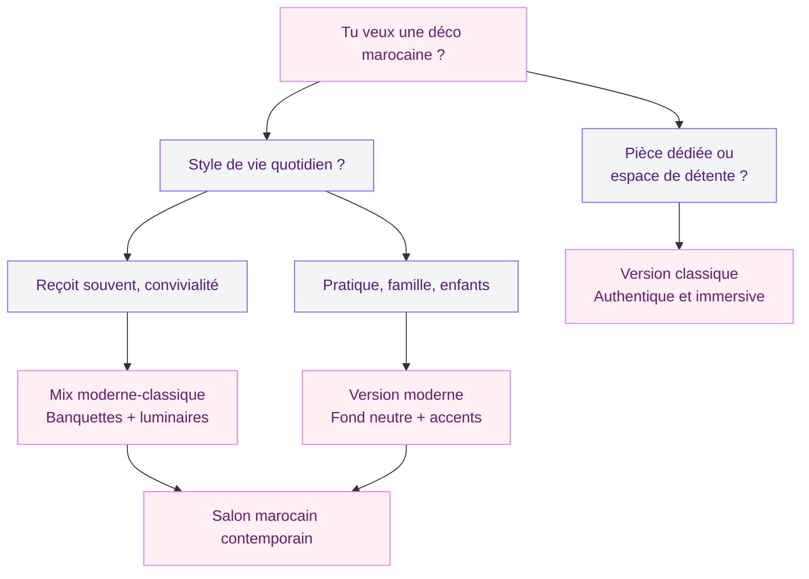
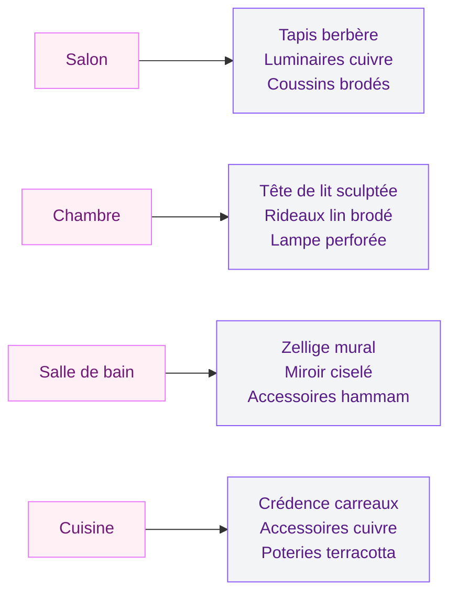

La déco marocaine, c'est un de ces styles qui ne laisse personne indifférent. Soit tu es complètement sous le charme - les couleurs chaudes, les motifs géométriques, cette ambiance de riad qu'on voudrait ramener chez soi après les vacances - soit tu trouves ça un peu trop surchargé. Mais honnêtement ? La plupart du temps, c'est juste une question de dosage.

La vraie question que tout le monde se pose : est-ce qu'on y va à fond style "salon marocain traditionnel" avec banquettes basses et moucharabieh, ou est-ce qu'on adopte une version plus épurée, moderne, facile à vivre au quotidien ? Et si la réponse était : les deux, intelligemment mixés ?

On va décortiquer ça ensemble.

## Décoration marocaine classique : ce qui la définit vraiment

Le style marocain traditionnel, c'est d'abord une philosophie. Chaque élément raconte quelque chose - l'artisanat berbère, les influences andalouses, les échanges commerciaux avec toute la Méditerranée. C'est riche, dense, chaleureux.

### Les piliers de la déco marocaine traditionnelle

**Le zellige** - Ces carreaux en céramique émaillée disposés en mosaïque sont l'âme de l'intérieur marocain. Fabriqués à la main à Fès ou Marrakech, chaque pièce est unique. Tu les trouves sur les murs, les fontaines, les tables basses. Chez Maisons du Monde, une table zellige tournera autour de 200-350€. Pour un habillage mural DIY avec des carreaux achetés en ligne, compte 40-80€ le m².

**Les tapis berbères** - Beni Ouarain (laine épaisse crème avec motifs géométriques noirs), Azilal (colorés, à franges), Boucherouite (recyclé, effet patchwork)... Chaque tribu a sa signature. Un vrai Beni Ouarain fait main, c'est 300-1200€ selon la taille. Les versions Ikea ou H&M Home à 80-150€ s'en inspirent sans l'authenticité, mais font le job visuellement.

**Les luminaires ciselés** - Les lanternes en métal perforé qui projettent des ombres sur les murs, les suspensions en cuivre martelé, les bougeoirs en laiton. C'est ce qui crée cette ambiance lumineuse si particulière. Amazon et Etsy regorgent de modèles entre 20 et 80€. Pour du vrai artisanat, va regarder chez les boutiques spécialisées en importation marocaine.

**Les banquettes et canapés bas** - La structure typique du salon marocain : des banquettes tout autour de la pièce, recouvertes de coussins en tissu brodé. Dans une maison française contemporaine, c'est pas toujours pratique, mais ça peut devenir un coin lecture ou un espace salon d'appoint magnifique.

**La fontaine d'intérieur** - Moins commune, mais tellement emblématique. Le son de l'eau qui coule, la fraîcheur... C'est le luxe du riad marocain. Il existe des versions compactes adaptables à n'importe quel intérieur dès 150€.

> [!NOTE]
> Le style marocain classique utilise une palette très précise : terracotta, ocre doré, vert menthe, bleu Klein (dit "bleu de Fès"), blanc cassé. Si tu pars sur ces couleurs, tu poses déjà les bases d'une ambiance authentique sans avoir besoin de beaucoup d'accessoires.

### Les couleurs du Maroc traditionnel

La palette marocaine traditionnelle est chaude et affirmée. Les murs sont rarement blancs purs - on parle d'ocre, de terracotta, de jaune safran. Les textiles brodés mélangent rouge, or, vert bouteille. C'est somptueux mais ça demande une cohérence dans toute la pièce.

## Décoration marocaine moderne : l'art de l'épure

La version contemporaine du style marocain, c'est garder l'âme, diluer l'intensité. On prend les meilleurs éléments - le zellige, le tapis berbère, les lanternes - et on les intègre dans un intérieur plus neutre, plus "d'aujourd'hui".

### Comment ça se traduit concrètement ?

**Fond neutre, accents marocains** - Les murs blancs ou gris clair laissent respirer les pièces artisanales. Un tapis Beni Ouarain posé sur du parquet clair, une lanterne cuivrée dans un salon scandinave, quelques coussins à motifs berbères sur un canapé en lin gris. L'effet est immédiat et élégant.

**Moins de pièces, mais plus fortes** - Là où le style traditionnel superpose les couches, la version moderne choisit 3-4 pièces maîtresses et leur laisse toute la place. Une grande table zellige devient la pièce centrale d'un salon épuré. Un tapis berbère habille tout un sol nu. Une paire de poufs en cuir (les fameux poufs marocains, 40-90€ pièce) transforme un coin lecture.

**Matières naturelles** - Bois, lin, coton, raphia, paille... La version moderne du style marocain joue beaucoup sur les textures naturelles. Ça crée de la profondeur sans surcharge visuelle.

**Couleurs plus douces** - On garde l'ocre mais plus dilué, le terracotta mais comme accent ponctuel plutôt que couleur dominante. Les tons sable, beige chaud, blanc cassé forment la base.

> [!TIP]
> Mon conseil si tu démarres : commence par un tapis berbère dans ton salon actuel. C'est la pièce qui change le plus l'ambiance sans que tu aies à tout revoir. Un Beni Ouarain ou son clone accessible chez Tikamoon (60-180€) suffit à poser une direction marocaine douce dans n'importe quel intérieur.

## Le mix moderne-classique : la vraie bonne idée

Honnêtement, le mix des deux styles, c'est souvent ce qui marche le mieux dans un intérieur français contemporain. L'authenticité du classique tempérée par la légèreté du moderne.

### La stratégie des pièces-clés

Plutôt que d'essayer de recréer un riad de bout en bout (mission quasi impossible et très chère), tu te concentres sur 4-5 pièces qui portent toute l'identité marocaine.

**1. Le tapis** - On en a parlé, c'est la base. Pose-le sur du parquet ou du béton ciré pour un effet maximal.

**2. Les luminaires** - Une suspension en laiton ciselé dans la salle à manger, des bougeoirs en métal perforé sur la table basse. La lumière du soir fait 50% du travail d'ambiance.

**3. Un meuble artisanal** - Table basse en zellige, commode en bois sculpté, table de nuit en laque. Un seul meuble "fort" suffit à ancrer le style.

**4. Les coussins et textiles** - C'est le budget le plus accessible. Des coussins à motifs kilim ou broderies berbères (15-45€ pièce chez H&M Home, Zara Home ou La Redoute), un jeté en laine tissée sur le canapé.

**5. Les plantes** - Le figuier de Barbarie en céramique terracotta, le palmier, le ficus dans un pot en terre cuite... La végétation méditerranéenne s'intègre parfaitement à l'univers marocain.

> [!WARNING]
> Évite le piège du "trop plein de couleurs". La déco marocaine peut vite basculer dans le bazar si tu mélanges trop de tons chauds sans ordre. Choisis une couleur dominante (terracotta OU ocre OU bleu de Fès) et travaille en déclinaison autour d'elle.

### Par pièce : comment adapter le style marocain

**Le salon** - C'est le terrain de jeu idéal. Banquettes basses ou canapé en lin avec coussins brodés, table basse en zellige ou en bois flotté, tapis berbère, suspension en cuivre. Tu peux y aller plus fort en quantité d'éléments qu'ailleurs dans la maison.

**La chambre** - Une touche suffit : une tête de lit en bois sculpté, des rideaux en lin avec broderies, une lampe de chevet en métal perforé. La chambre marocaine moderne joue sur la douceur, pas l'opulence.

**La salle de bain** - Zellige sur les murs ou en crédence derrière le lavabo, savon beldi (en pierre ponce ou en pot), miroir en métal ciselé. C'est la pièce où le style marocain s'intègre le plus naturellement, même dans un appartement contemporain.

**La cuisine** - Une crédence en carreaux ciment à motifs géométriques (dans la famille zellige, mais plus facile à poser), des accessoires en cuivre martelé, des étagères en bois avec poteries.

## Budget et où acheter : le guide pratique

### Pour tous les budgets

**Petit budget (moins de 200€ pour transformer une pièce)**
- Tapis inspiration berbère : Ikea Lohals (20€), H&M Home (80-120€)
- Coussins kilim : H&M Home (19-29€ pièce), La Redoute (25-45€)
- Poufs en cuir : Amazon (35-60€ pièce)
- Lanternes en métal : Maisons du Monde (15-40€)
- Bougies et photophores en verre coloré : Action ou Hema (2-8€)

**Budget moyen (200-600€ pour un vrai changement)**
- Table basse zellige ou en mosaïque : Maisons du Monde (180-350€)
- Tapis Beni Ouarain inspiré : Tikamoon ou La Redoute (120-250€)
- Suspension en laiton ciselé : Made.com ou AM.PM (80-160€)
- Vase ou poterie de Safi : boutiques spécialisées ou Etsy (40-90€)

**Budget confort (600€+)**
- Vrai tapis berbère fait main : marché aux puces, boutiques import, Etsy créateurs marocains (300-1200€)
- Table en zellige artisanal : création sur mesure ou import (350-800€)
- Meuble en bois de cèdre sculpté : 400-1000€

> [!IMPORTANT]
> Si tu achètes du vrai artisanat marocain - en boutique ou lors d'un voyage - demande toujours l'origine et le mode de fabrication. Le zellige véritable se reconnaît à ses légères imperfections : chaque morceau est taillé à la main, aucun n'est identique. C'est exactement ce qui le rend beau.

## Les erreurs à éviter

**Tout en même temps** - Le style marocain est généreux par nature, mais dans un intérieur français, il faut savoir retenir sa main. Si tu poses un tapis berbère, des coussins kilim, un meuble en bois sculpté, une suspension ciselée ET une fontaine d'intérieur dans la même pièce, ça va saturer. Choisis tes combats.

**Les faux zelliges brillants plastifiés** - Il en existe beaucoup dans les grandes surfaces déco. De loin ça ressemble, de près ça hurle "faux". Préfère de vrais carreaux de ciment ou du vrai zellige céramique, même en petite quantité.

**La couleur sans cohérence** - Terracotta sur les murs + coussins rouges bordeaux + tapis multicolore + suspension en cuivre jaune... Ça peut fonctionner dans un riad authentique où tout a été pensé ensemble sur des années. Dans un appartement moderne, ça donne du désordre. Définis d'abord ta palette, ensuite tu achètes.

**Oublier la lumière** - La déco marocaine est intimement liée à la lumière tamisée, indirecte, mystérieuse. Si tu as un éclairage blanc froid au plafond, tes plus beaux objets marocains perdront 80% de leur charme. Investis dans des lampes d'appoint, des bougies, des luminaires avec ampoules à filament.

## L'ambiance que tu veux créer

Au final, la vraie question n'est pas "moderne ou classique ?" mais plutôt "quelle ambiance tu veux dans ta maison ?"

Tu veux un cocon chaud et sensoriel où tu te déconnectes du monde ? Va vers le classique, avec ses superpositions de textures et ses couleurs profondes. Tu veux un intérieur aéré et contemporain avec une touche d'ailleurs ? Le mix moderne est pour toi - quelques pièces marocaines fortes dans un cadre épuré.

Et si tu cherches d'autres façons de travailler les couleurs dans ton intérieur, les conseils sur les [couleurs compatibles avec l'orange pour les murs et la décoration](/guides/decoration/couleurs-compatibles-avec-lorange-pour-les-murs-et-la-decoration/) peuvent t'aider à intégrer les tonalités chaudes du Maroc dans ta palette globale.

La déco marocaine, qu'elle soit traditionnelle ou réinterprétée, a cet avantage rare : elle vieillit bien. Les matières artisanales, le zellige qui prend une patine, le tapis berbère qui raconte des années de passage... ce sont des objets qui gagnent du caractère avec le temps. Contrairement à beaucoup de tendances déco, ici tu investis dans des pièces qui durent.

Alors, tu te lances plutôt côté classique ou côté moderne ?
