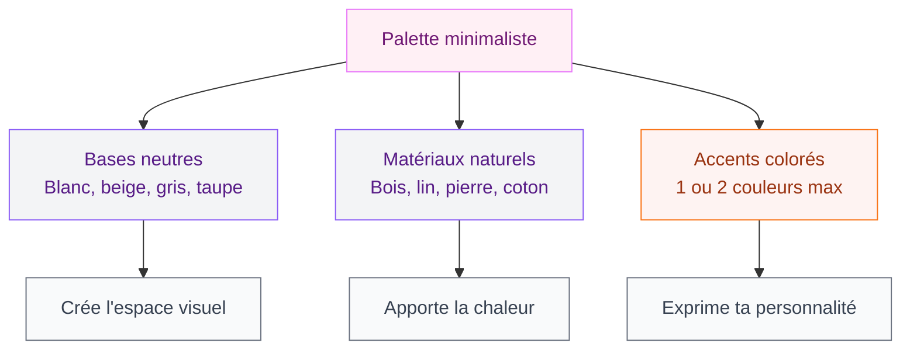
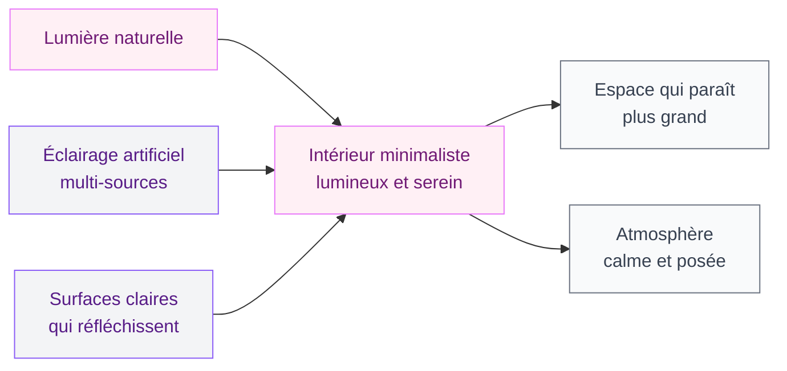

Tu en as marre de cet intérieur encombré qui te stresse dès que tu rentres chez toi ? Tu regardes des photos de déco sur Instagram et tu te demandes comment ces espaces arrivent à être aussi calmes, aussi beaux, avec aussi peu d'objets ? La décoration minimaliste, c'est exactement ça. Mais contrairement à ce qu'on croit souvent, ça ne veut pas dire vivre dans un appartement vide ou froid.

Le minimalisme en déco, c'est une philosophie qui dit : garde ce qui compte, enlève le reste. Et le résultat, c'est une maison qui respire, où tu te sens vraiment bien. Voilà comment t'y mettre, pièce par pièce, sans te perdre.

## Ce que la déco minimaliste n'est pas

Avant d'aller plus loin, clarifions un truc : le style minimaliste ne veut pas dire austère. Beaucoup de gens confondent "minimaliste" avec "dépouillé comme une salle d'attente". C'est une erreur classique.

Un intérieur minimaliste peut être chaleureux. Il peut avoir des textures, de la couleur (dans des tons neutres, oui, mais de la couleur quand même), des plantes, des livres, des objets qui ont une vraie valeur sentimentale. Ce qui change, c'est la quantité et l'intention derrière chaque choix.

Le minimalisme, c'est l'inverse de l'accumulation. Tu n'achètes pas un objet parce qu'il est en promo ou parce qu'il te semblait joli en magasin. Tu le choisis parce qu'il a sa place, parce qu'il apporte quelque chose à l'espace.

> [!NOTE]
> Le principe de base du minimalisme est souvent résumé ainsi : "moins de choses, plus de sens". Chaque objet que tu gardes doit mériter sa place dans ton intérieur.

## La palette de couleurs : la base de tout

Si tu ne devais changer qu'une chose pour donner à ton intérieur un look minimaliste, ce serait la palette. Les intérieurs épurés fonctionnent presque toujours sur des tonalités neutres et harmonieuses.

Les bases classiques : blanc cassé, beige, gris clair, crème, taupe, greige (ce mélange beige-gris ultra versatile). Ces couleurs agrandissent visuellement les pièces, réfléchissent la lumière et créent cet effet de calme qu'on associe au minimalisme.

Mais attention : une palette neutre ne signifie pas monochrome ennuyeux. Tu peux jouer sur les nuances, les matériaux et les textures pour créer de la profondeur. Un mur blanc, un canapé en lin écru, un parquet en chêne clair - c'est déjà trois tons différents qui s'harmonisent parfaitement.

Pour les touches de couleur, quelques règles simples : reste dans les couleurs terre (terracotta, kaki, ocre) ou les teintes sombres comme le vert bouteille ou le noir. Et limite-toi à une ou deux couleurs d'accent dans la pièce. Tu peux voir comment ce principe fonctionne en pratique dans nos idées pour [des salons modernes et élégants en 2026](/guides/decoration/salons-modernes-et-elegants-2026/).

## Le mobilier : choisir moins mais mieux

Le meuble minimaliste, c'est celui qui fait ce pour quoi il est fait, et qui le fait bien. Pas de fioritures, pas de détails inutiles, des lignes propres.

En pratique, ça veut dire privilégier les meubles aux formes géométriques simples - rectangles, carrés, cylindres. Les pieds fins et hauts (comme les scandinaves des années 60) donnent une impression de légèreté visuelle. Les rangements fermés cachent le désordre. Les surfaces sans poignées apparentes créent une continuité visuelle agréable.

Chez Ikea, la gamme KALLAX (25-80€) pour les rangements et les tables LACK sont des références abordables. Pour un peu plus de budget, la table LISABO en frêne (99€) a des lignes vraiment épurées. Si tu veux investir dans quelque chose de plus qualitatif, Made.com propose des canapés et tables avec des formes minimalistes autour de 300-800€.

Un point important : le mobilier multifonctions est ton ami. Un ottoman qui sert de table basse ET de rangement, un lit avec tiroirs intégrés, une banquette avec coffre - ça diminue le nombre de meubles nécessaires tout en maximisant les fonctions. Pour aller plus loin sur l'optimisation des rangements, l'article sur [comment ranger sa chambre](/guides/chambre/ranger-chambre/) est vraiment utile.

> [!TIP]
> Avant d'acheter un nouveau meuble, pose-toi toujours la question : est-ce qu'il remplace quelque chose qui existe déjà, ou est-ce qu'il s'ajoute simplement ? Dans un intérieur minimaliste, on cherche toujours à remplacer plutôt qu'à accumuler.

## Désencombrer : le vrai travail de la déco minimaliste

On peut parler de couleurs et de meubles tant qu'on veut, mais la vraie transformation d'un intérieur vers le minimalisme, c'est le désencombrement. C'est l'étape la plus difficile - et la plus libératrice.

La méthode la plus simple : pièce par pièce, objet par objet. Pour chaque chose, tu te poses une question : est-ce que je l'utilise régulièrement, ou est-ce qu'il me rend vraiment heureux/heureuse quand je le regarde ? Si la réponse est non aux deux, il peut partir.

Quelques règles pratiques qui m'ont vraiment aidé :

- **Les plans de travail restent vides** : en cuisine, seul le toaster et la cafetière (si tu les utilises chaque matin) ont le droit de rester. Tout le reste va dans les placards.
- **La règle du "un entre, un sort"** : quand tu achètes un nouveau livre ou un nouvel objet, un équivalent part.
- **Les surfaces horizontales sont le piège classique** : tables, rebords de fenêtres, consoles - c'est là que le désordre s'accumule en premier. Garde-les quasi vides.

Le résultat quand tu désencombres bien ? Les pièces semblent instantanément plus grandes, la lumière circule mieux, et ce calme visuel que tu admirais dans les photos... il apparaît vraiment.

## Les matériaux naturels : la chaleur du minimalisme

C'est le secret pour ne pas tomber dans l'intérieur froid et stérile. Les matériaux naturels apportent texture, chaleur et humanité à un espace épuré.

**Le bois** est le matériau roi du minimalisme. Parquet en chêne clair, table en noyer, étagères en frêne - le bois apporte instantanément de la vie et de la chaleur. Et il vieillit bien, ce qui compte quand on veut acheter moins mais mieux.

**Le lin et le coton** pour le textile. Rideau en lin naturel, coussins en coton texturé, plaid tissé - ces matières ont ce côté imparfait-naturel qui contraste joliment avec les lignes propres des meubles. Chez H&M Home, tu trouves des plaids en coton à partir de 25€, et Zara Home a des rideaux en lin autour de 40-60€.

**La pierre et la céramique** pour les accents. Un vase en céramique artisanale, un dessous-de-plat en pierre, un bac à plante en ciment - ces matériaux ancrent l'espace et lui donnent du caractère sans l'encombrer.

> [!IMPORTANT]
> Mixe toujours les textures dans un intérieur minimaliste. Un espace entièrement lisse et brillant peut vite sembler froid et clinique. La règle : une surface lisse (verre, métal, laque) pour deux surfaces rugueuses ou naturelles (bois, lin, céramique).

## La lumière : l'élément qu'on oublie toujours

La lumière, c'est ce qui fait ou défait un intérieur minimaliste. Dans les photos de déco épurée que tu admires, tu remarques presque toujours deux choses : beaucoup de lumière naturelle, et un éclairage artificiel très soigné.

Pour maximiser la lumière naturelle : vires les rideaux épais et sombres (ou retrousse-les vraiment haut), évite les meubles hauts devant les fenêtres, opte pour des miroirs stratégiquement placés pour multiplier la lumière.

Pour l'éclairage artificiel : oublie le plafonnier central unique qui "grille" tout. Le minimalisme, c'est des sources multiples et basses - une lampe de sol, des appliques, des lampes de table. Ça crée de la profondeur et de la chaleur. Et une lampe design simple (une sphère en verre, un cylindre en céramique matte) peut être le seul objet décoratif dont tu as besoin sur une étagère.

## Les plantes : le seul "désordre" autorisé

Les plantes, c'est l'élément qui humanise vraiment un intérieur minimaliste. Elles apportent de la couleur (ce vert qu'on trouve nulle part ailleurs), du mouvement, de la vie.

En minimalisme, on choisit ses plantes avec intention. Quelques grandes plantes impactantes plutôt qu'une collection de petits pots sur toutes les surfaces. Un grand ficus lyrata (figuier lyre) dans un angle, c'est un statement déco à lui seul. Un monstera deliciosa dans un bac en ciment, c'est graphique et naturel à la fois.

Les bacs et pots : cache-pots en céramique unie, bacs en béton, paniers en corde naturelle. Pas de pots en plastique, pas de pots peints de couleurs vives - ça casse l'harmonie de l'espace.

> [!TIP]
> Pour maintenir l'aspect minimaliste avec des plantes, règle simple : maximum 3 plantes par pièce, dont une grande. Et privilégier les plantes aux formes graphiques et franches plutôt que les plantes buissonnantes ou foisonnantes.

## Minimalisme vs autres styles : où tu te situes ?

Le minimalisme n'est pas pour tout le monde - et c'est ok ! Si tu aimes le côté douillet et romantique d'un intérieur chargé de textures et d'objets chinés, le [style shabby chic](/guides/decoration/decoration-shabby-chic-idees-et-photos-de-style-et-de-decoration/) pourrait te convenir davantage. Ce sont deux philosophies décoratives très différentes, et l'une n'est pas supérieure à l'autre.

Ce qui compte, c'est que ton intérieur te ressemble et te fasse du bien. Le minimalisme convient particulièrement aux personnes qui se sentent mentalement plus légères dans des espaces épurés, qui trouvent le désordre visuel stressant, ou qui veulent investir dans quelques belles pièces plutôt que beaucoup de petites choses.

## Par où commencer concrètement ?

Si tout ça te parle mais que tu te demandes par où attaquer, voici le plan d'action simple :

**1. Commence par une pièce** - Pas toute la maison. Une chambre, un salon, une entrée. Complètement. Ça te permettra de voir le résultat rapidement et de trouver la motivation pour continuer.

**2. Vide d'abord, achète après** - Beaucoup de gens font l'inverse. Ils achètent des meubles de rangement pour organiser le désordre. Ça ne marche pas. D'abord tu enlèves ce dont tu n'as pas besoin, ensuite seulement tu évalues ce qu'il manque.

**3. Les rangements fermés sont tes amis** - Pas besoin de tout cacher, mais les objets du quotidien (câbles, papiers, produits, piles...) ont besoin d'un "chez eux" hors de vue. Ça change tout.

**4. Attends avant d'acheter** - Quand une pièce est désencombréee, vis dedans quelques semaines avant de racheter quoi que ce soit. Souvent, tu réalises que tu as besoin de beaucoup moins que tu ne le croyais.

> [!WARNING]
> Le piège du "minimalisme shopping" : ne remplace pas tes objets par d'autres objets "minimalistes". La tentation est réelle - on vend énormément d'objets en promettant un style épuré. Mais acheter 10 objets "minimalistes" ne te donnera pas un intérieur minimaliste. La réduction du nombre d'objets est l'étape non-négociable.

La décoration minimaliste, c'est vraiment l'un des styles les plus accessibles qui soit. Pas parce qu'il ne demande pas d'effort - au contraire, le désencombrement est un vrai travail - mais parce qu'il ne nécessite pas de budget important. Souvent, le minimalisme, c'est enlever et retravailler ce que tu as déjà, pas acheter du neuf. Et c'est ça qui en fait quelque chose d'aussi satisfaisant quand tu y arrives.

---

## Questions fréquentes sur la décoration minimaliste

**Comment rendre un intérieur minimaliste sans le rendre froid ?**
Les matériaux naturels (bois, lin, céramique) et les plantes sont les deux éléments qui apportent la chaleur dans un intérieur épuré. Une palette de neutres chauds (beige, crème, taupe) plutôt que de blancs froids aide aussi beaucoup.

**Peut-on avoir des objets de décoration dans un intérieur minimaliste ?**
Oui, mais peu et choisis avec intention. Chaque objet doit avoir une raison d'être là - soit esthétique réelle, soit sentimentale forte. Un vase, une sculpture, quelques livres : c'est largement suffisant.

**Combien ça coûte de passer à la décoration minimaliste ?**
Ça peut même faire économiser de l'argent ! Le désencombrement ne coûte rien, et le minimalisme pousse à acheter moins mais mieux. Le premier investissement peut être zéro si tu travailles uniquement avec ce que tu as déjà.

**Par quelle pièce commencer un réaménagement minimaliste ?**
Le salon ou la chambre sont les meilleurs points de départ, parce que ce sont les pièces où tu passes le plus de temps. Voir la transformation dans un espace que tu fréquentes au quotidien est très motivant pour continuer dans le reste de la maison.

**Le minimalisme convient-il aux petits espaces ?**
Encore plus que les grands ! Les petites pièces bénéficient vraiment d'un désencombrement radical. Moins d'objets = impression d'espace plus grande, circulation plus fluide, moins de stress visuel. C'est même dans les petits appartements que le minimalisme donne les résultats les plus spectaculaires.
