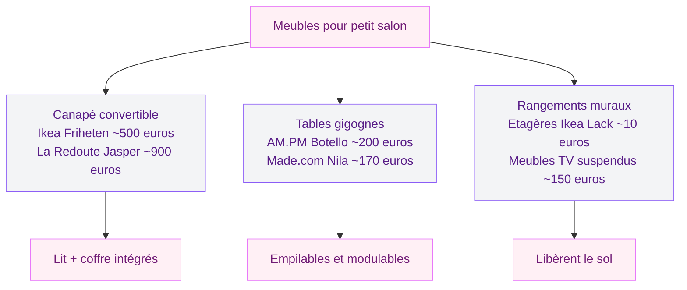
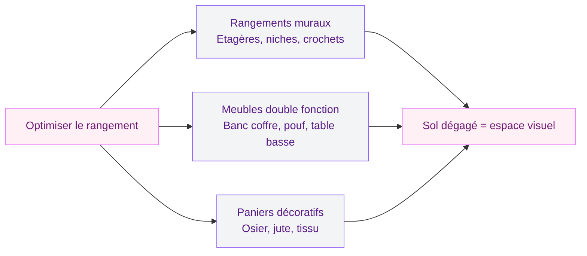

Tu vis dans un petit salon et tu as l'impression que chaque meuble te mange de l'espace ? Que la pièce paraît sombre, étriquée, un peu étouffante ? Bonne nouvelle : un petit salon n'est pas une punition. C'est même un terrain de jeu génial pour la déco - à condition de connaître les bonnes astuces.

J'ai aménagé trois petits salons en huit ans (merci les déménagements parisiens), et je peux te garantir un truc : ce n'est pas la surface qui fait la qualité d'un intérieur, c'est la façon dont tu l'organises. Un salon de 12 m2 bien pensé sera toujours plus agréable qu'un 30 m2 encombré de meubles mal choisis.

Ici, je te donne toutes mes astuces testées et approuvées, avec des repères de prix et des marques accessibles.

## Les couleurs qui agrandissent visuellement ton salon

Le choix des couleurs, c'est le premier levier pour transformer un petit espace. Et la règle de base est simple : les teintes claires et douces reculent visuellement les murs. Ton salon semble plus grand, plus lumineux, plus respirable.

  

### Les valeurs sûres

Le blanc cassé, le beige lin, le gris perle, le grège (ce mélange gris-beige très tendance) - ces couleurs réfléchissent la lumière naturelle et donnent une sensation d'ouverture. Chez Tollens, la teinte "Lin Brut" (environ 35 euros le litre) fonctionne très bien. Côté Leroy Merlin, la gamme Luxens propose des blancs chauds à 25 euros les 2,5 litres - un bon rapport qualité-prix.

Mais "clair" ne veut pas dire "blanc partout". Un salon tout blanc, ça manque de personnalité et ça peut même devenir un peu froid. L'idée, c'est de jouer sur des tonalités proches mais différentes.

### Le mur d'accent : ton meilleur allié

Un seul mur dans une couleur plus soutenue donne de la profondeur sans rétrécir l'espace. Vert sauge, bleu gris, rose poudré, terracotta doux - ces teintes ajoutent du caractère. Peins le mur du fond (celui que tu vois en entrant) pour créer un effet de perspective. Si tu veux aller plus loin sur ce sujet, notre guide sur [les couleurs pour donner de la profondeur à un mur ou à une pièce](/des-couleurs-pour-donner-de-la-profondeur-a-un-mur-ou-a-une-piece/) te donne des combinaisons concrètes.

> [!TIP]
> Garde les couleurs foncées pour les murs étroits que tu veux "repousser" visuellement. Les murs latéraux en teinte claire élargiront la pièce.

### Le plafond, cet oublié

On n'y pense jamais, mais peindre le plafond en blanc pur (même si les murs sont en blanc cassé ou en beige) crée une impression de hauteur. La différence de ton, même légère, fait lever le regard et "monte" le plafond de quelques centimètres visuels.

## Meubles malins : choisir ce qui fait double emploi

Dans un petit salon, chaque meuble doit justifier sa présence. Si un objet ne sert qu'à une seule chose, demande-toi si tu peux le remplacer par quelque chose de plus polyvalent.

  

### Le canapé convertible, le roi du petit salon

C'est le meuble qui change tout quand tu reçois des amis ou de la famille. Plus besoin d'une chambre d'amis - ton salon se transforme en couchage. Chez Ikea, le Friheten (environ 500 euros) offre un vrai lit double avec coffre de rangement intégré. Si tu veux monter en gamme, La Redoute propose le modèle Jasper en velours côtelé (autour de 900 euros) avec un mécanisme clic-clac solide et un look vraiment soigné.

Le point important : teste toujours le mécanisme d'ouverture en magasin. Un convertible qu'on n'ouvre jamais parce que c'est galère, ça ne sert à rien.

### Les tables gigognes et les tables basses à rangement

Les tables gigognes, c'est le concept parfait pour les petits espaces. Tu en sors une quand tu as des invités, tu les empiles quand tu es seul. Chez AM.PM, le set de deux tables gigognes Botello en métal et bois tourne autour de 200 euros. Chez Made.com, les Nila en marbre et laiton sont à 170 euros - très esthétiques.

Pour la table basse, privilégie un modèle avec du rangement intégré. Un plateau qui se soulève, un tiroir, une étagère basse - tout ce qui te permet de planquer télécommandes, magazines et plaids.

### Les meubles suspendus : libérer le sol

Un meuble TV fixé au mur, des étagères murales, une console d'entrée suspendue - tout ce qui libère le sol agrandit visuellement la pièce. Tu vois le sol en continu, et ça change complètement la perception de l'espace. Les étagères Lack d'Ikea à 10 euros pièce restent imbattables pour ça.

## Miroirs et lumière : les amplificateurs d'espace

Si tu ne devais retenir qu'une seule astuce de ce guide, ce serait celle-ci : pose un grand miroir dans ton petit salon. L'effet est immédiat et bluffant.

  

### Le miroir mural XXL

Un miroir de grande taille (au moins 120 x 60 cm) posé face à une fenêtre double littéralement la lumière naturelle. Il reflète la pièce et crée une illusion de profondeur. Chez Zara Home, tu trouves des miroirs rectangulaires avec cadre en bois à partir de 130 euros. Chez Ikea, le miroir Stockholm (130 x 50 cm) est à environ 100 euros - un classique.

Place-le sur le mur le plus sombre ou face à la source de lumière principale. Evite de le mettre en face de la porte d'entrée - selon les principes du feng shui, ça "repousse" l'énergie, mais surtout, en pratique, ça te renvoie ton propre reflet à chaque fois que tu entres et c'est un peu perturbant.

> [!NOTE]
> Un miroir placé face à une fenêtre peut doubler la lumière naturelle dans la pièce. C'est l'astuce la plus rapide et la moins chère pour transformer un petit salon sombre.

### La composition de cadres

Plutôt qu'un seul miroir, tu peux aussi créer une composition murale qui mélange miroirs et cadres de tailles variées. L'oeil voyage d'un cadre à l'autre, ce qui donne du mouvement et de la vie à un mur sans prendre un centimètre de surface au sol.

### L'éclairage en couches

Un petit salon mal éclairé paraît encore plus petit. L'erreur classique : un seul plafonnier central qui aplatit tout. A la place, travaille l'éclairage en trois niveaux.

L'éclairage d'ambiance (lampadaire, guirlandes, bougies LED) crée une atmosphère chaleureuse. L'éclairage fonctionnel (lampe de lecture, spot orientable) te permet de lire ou travailler. L'éclairage décoratif (appliques murales, rubans LED derrière un meuble) donne de la profondeur.

Chez H&M Home, les lampadaires en arc démarrent à 50 euros et apportent un look design sans encombrer. Les appliques murales Nymane d'Ikea (25 euros) sont parfaites pour les petits espaces - elles ne prennent aucune place au sol.

## L'approche minimaliste : moins c'est plus

Dans un petit salon, le minimalisme n'est pas juste une tendance esthétique. C'est une stratégie de survie. Plus tu accumules, plus la pièce étouffe. L'idée, c'est de garder le strict nécessaire et de soigner chaque détail.

  

### Désencombre avant de décorer

Avant d'acheter quoi que ce soit, fais un tri. Chaque objet qui reste dans ton salon doit répondre à au moins une de ces deux questions : est-ce que ça me sert ? est-ce que ça me rend heureux quand je le regarde ? Si la réponse est non aux deux, dehors.

Si la déco minimaliste t'intéresse vraiment, notre guide complet sur la [décoration minimaliste avec idées et photos](/decoration-minimaliste-idees-et-photos-faciles/) te donne toutes les clés pour un intérieur épuré sans tomber dans le vide.

### La règle du 60-30-10

Cette règle de design fonctionne particulièrement bien dans les petits espaces. 60% de la pièce dans une couleur dominante (murs, sol, gros meubles). 30% dans une couleur secondaire (rideaux, coussins, tapis). 10% dans une couleur d'accent (objets déco, vases, oeuvres murales).

En respectant ce ratio, tu obtiens un salon harmonieux qui ne paraît ni surchargé ni monotone.

> [!WARNING]
> Evite d'avoir plus de trois couleurs principales dans un petit salon. Trop de teintes différentes fragmentent visuellement l'espace et le font paraître encore plus petit.

## Rangements invisibles : la clé d'un salon aéré

Le rangement, c'est le vrai secret des petits salons réussis. Pas les gros meubles de rangement qui mangent la moitié de la pièce - les rangements malins, ceux qu'on ne voit pas.

  

### Les paniers et boîtes décoratives

Un panier en osier sous la table basse, des boîtes en tissu sur une étagère, un pouf coffre - ces solutions combinent déco et rangement. Chez La Redoute, les paniers en rotin Tressie (30 euros le lot de deux) sont jolis et pratiques. Zara Home propose des paniers en jute tressée à partir de 20 euros.

### Les meubles à double fonction

Un banc coffre devant la fenêtre qui sert aussi d'assise, une bibliothèque basse qui fait office de séparation de pièce, un pouf qui s'ouvre pour stocker des plaids - chaque meuble peut cacher un espace de rangement.

## Les erreurs qui rétrécissent ton salon

Certaines erreurs de déco sont pardonnables dans un grand salon. Dans un petit, elles se voient immédiatement.

### Le canapé trop grand

C'est l'erreur numéro un. Un canapé d'angle géant dans un salon de 15 m2, ça bouche tout. Mesure ton espace avant d'acheter, et prévois au minimum 70 cm de passage autour de chaque meuble. Un canapé deux places (140-160 cm de large) avec un fauteuil d'appoint sera souvent plus adapté qu'un grand canapé trois places.

### Les rideaux trop courts

Des rideaux qui s'arrêtent au niveau de l'appui de fenêtre cassent la ligne verticale et tassent la pièce. Accroche ta tringle le plus haut possible (10-15 cm sous le plafond) et choisis des rideaux qui tombent jusqu'au sol. Ça allonge visuellement les murs et donne une impression de hauteur. Les rideaux en lin lavé H&M Home (à partir de 30 euros le panneau) fonctionnent super bien pour ça.

### Trop de petits meubles

Paradoxalement, remplir un petit salon de petits meubles le rend plus encombré que quelques pièces bien choisies. Cinq petites étagères dispersées créent plus de chaos visuel qu'un seul meuble de rangement cohérent. Rassemble tes rangements en un point et laisse le reste des murs respirer.

> [!IMPORTANT]
> Mesure toujours ton salon avant d'acheter un meuble. Fais un plan simple sur papier ou avec l'application Ikea Home Planner (gratuite). Un meuble qui a l'air petit en magasin peut être énorme chez toi.

## Textiles et accessoires : les touches finales

Les textiles jouent un rôle énorme dans un petit salon. Ils apportent la chaleur, la texture et la couleur sans manger d'espace.

### Le tapis adapté

Un tapis trop petit est pire que pas de tapis du tout. Il fragmente visuellement le sol et rapetisse la pièce. Choisis un tapis assez grand pour que les pieds avant de ton canapé reposent dessus (160 x 230 cm minimum pour la plupart des configurations). Côté style, reste sur des motifs discrets ou unis pour ne pas surcharger. Les tapis en jute AM.PM (à partir de 90 euros en 160 x 230 cm) apportent une texture naturelle sans alourdir l'ambiance.

### Les coussins et plaids

Limite-toi à trois ou quatre coussins maximum sur ton canapé. Varie les tailles (un grand 60 x 60 cm, deux moyens 45 x 45 cm, un petit 30 x 50 cm) et reste dans ta palette de couleurs. Les housses de coussin Zara Home (à partir de 15 euros) proposent de belles matières en lin et coton texturé.

Pour un salon qui fait aussi chambre d'amis, un joli plaid plié sur l'accoudoir du canapé ajoute une touche cosy. Un plaid en coton gaufré La Redoute autour de 45 euros fera l'affaire toute l'année.

## Inspiration : un petit salon stylé en 2026

Les tendances actuelles sont plutôt en faveur des petits espaces. L'ambiance japandi (mélange japonais-scandinave), le style warm minimalism, les intérieurs organiques aux courbes douces - tout ça fonctionne bien dans les espaces réduits. Pour voir des exemples concrets de salons tendance, jette un oeil à nos [salons modernes et élégants 2026](/salons-modernes-et-elegants-2026/).

Les formes arrondies remplacent les angles droits stricts : une table basse ovale plutôt que rectangulaire, un miroir rond plutôt que carré. Ces courbes adoucissent l'espace et créent une circulation visuelle plus fluide.

Et si tu aimes le charme à la française, notre article sur la [décoration française avec idées et photos romantiques](/decoration-francaise-idees-et-photos-romantiques/) peut t'inspirer pour un petit salon cosy et élégant.

## Sur le meme theme

- [salon chaleureux](/salon-plus-chaleureux/)

## FAQ

### Quelle couleur choisir pour agrandir un petit salon ?

Les couleurs claires et douces sont les plus efficaces : blanc cassé, beige, gris perle, grège. Un mur d'accent dans une teinte moyenne (vert sauge, bleu gris, rose poudré) ajoute de la profondeur sans réduire l'espace. Evite les couleurs sombres sur plus d'un mur.

### Comment aménager un petit salon de 10 m2 ?

Mise sur un canapé deux places compact (140 cm max), une table basse avec rangement intégré, et des étagères murales. Libère le sol au maximum avec des meubles suspendus. Un grand miroir face à la fenêtre doublera la sensation d'espace. Et surtout, désencombre : chaque objet doit avoir sa place.

### Quel canapé pour un petit salon ?

Un canapé deux places (140-160 cm) ou un canapé convertible si tu as besoin d'un couchage d'appoint. Evite les canapés d'angle dans les espaces de moins de 18 m2. Choisis des pieds visibles et surélevés (le fameux effet "pattes") pour laisser voir le sol et alléger visuellement le meuble. Budget : de 300 euros (Ikea) à 1000 euros (Made.com, La Redoute).

### Comment donner du style à un petit salon sans le surcharger ?

Applique la règle du 60-30-10 pour les couleurs, choisis des textiles de qualité (lin, coton texturé), et concentre la déco sur un ou deux points forts : une jolie composition murale, un beau tapis, ou une plante verte imposante. La clé, c'est de résister à l'envie d'en ajouter toujours plus.
