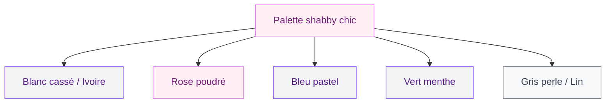
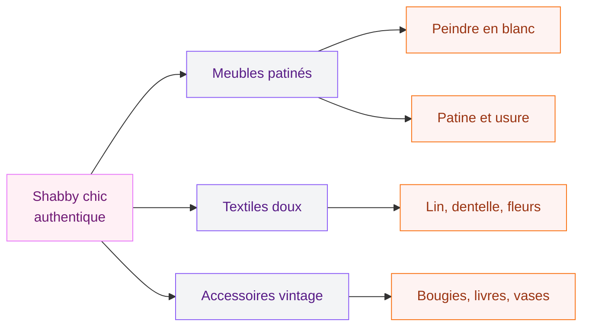

Tu fais partie de ces gens qui flashent sur les greniers de brocante, les meubles peints en blanc, les dentelles et les roses séchées ? Alors le shabby chic, c'est fait pour toi. Ce style dit "je vis ici, j'aime ici" sans jamais se prendre au sérieux. Et crois-moi, c'est un art en soi.

Le shabby chic, c'est ne pas viser la perfection. C'est choisir une vieille commode avec ses éclats de peinture, lui donner un coup de blanc, et la trouver plus belle qu'avant. C'est cette philosophie qui fait tout le charme du style.

## C'est quoi exactement le shabby chic ?

Le terme vient de l'anglais : "shabby" signifie usé, abîmé, vieilli - et "chic", eh bien, c'est du chic. Cette alliance apparemment contradictoire, c'est Rachel Ashwell qui l'a popularisée dans les années 80-90 en Californie. L'idée : valoriser ce qui est passé, poudré, presque fragile, et en faire quelque chose d'élégant.

  

Ce n'est pas du tout la même chose que le vintage brut ou le campagnard classique. Le shabby chic est plus romantique, plus féminin, plus poétique. On pense à des chambres de château un peu oubliées, à des jardins anglais, aux fleurs de l'été dans un vase en faïence craquelé.

> [!NOTE]
> Le shabby chic n'est pas réservé aux vieilles maisons. Dans un appartement haussmannien ou même un loft contemporain, quelques pièces bien choisies suffisent à créer cette atmosphère unique.

## La palette de couleurs : douceur avant tout

C'est la base du style. Les couleurs shabby chic sont comme des aquarelles : délavées, douces, jamais saturées.

  

- **Blanc cassé et ivoire** : la colonne vertébrale de tout intérieur shabby chic. Sur les murs, les meubles, les textiles.
- **Rose poudré et rose ancien** : chaud, romantique, jamais criard.
- **Bleu pastel et vert menthe** : frais, aérien, parfait pour une cuisine ou une salle de bain.
- **Beige sable et lin** : les neutres qui ancrent tout.
- **Gris perle** : moderne mais doux, parfait pour actualiser le style.

La règle d'or : jamais de couleur pure ou vive. Si tu craques pour une teinte, prends-la systématiquement dans une version plus claire, plus poudrée, plus délavée. Chez Farrow & Ball, les couleurs "Peignoir", "Setting Plaster" ou "Mizzle" sont parfaites. Sinon, Tollens et Dulux Valentine proposent des gammes pastels très réussies à moins de 30 euros le litre.

## Les meubles : chiner, peindre, patiner

Le shabby chic, c'est le paradis des chineurs. Vide-greniers, Leboncoin, Emmaüs, brocantes de village - tous ces endroits sont tes terrains de jeu. L'idée n'est pas d'acheter cher, mais de repérer du potentiel.

  

**Ce qu'on recherche :**

Une commode ancienne avec ses poignées en laiton ? Parfait. Une chaise Louis XVI avec le velours un peu usé ? Encore mieux. Une table de chevet en bois massif avec de la patine naturelle ? Jackpot.

**Ce qu'on fait avec :**

Tu n'as pas besoin d'être une artiste. Un pot de peinture blanche mate (type "Chalk Paint" d'Annie Sloan, autour de 25-30 euros les 500ml, ou une alternative moins chère comme les peintures craie de Leroy Merlin à 15 euros), une légère ponceuse, et tu transformes n'importe quel meuble en pièce shabby chic authentique.

La technique est simple : tu passes une ou deux couches de blanc, tu laisses sécher, puis tu ponces légèrement les arêtes et les zones d'usure naturelle. Résultat : un meuble qui ressemble à un trésor de famille.

> [!TIP]
> Pour une patine réussie sans effort, ponce surtout les angles, les pieds et les parties qui s'useraient naturellement avec le temps. La perfection serait une erreur - c'est l'imperfection qui fait le charme.

**Les pièces à chiner :**

- Une armoire à portes sculptées peinte en blanc
- Une commode ancienne avec miroir ovale
- Des chaises chinées à l'assise rembourrée
- Une table ronde en bois patiné
- Un lit en fer forgé ou à barreaux de bois tournés

Si tu ne peux pas tout chiner, Made.com et La Redoute ont des lignes très satisfaisantes : le lit "Anaïs" chez La Redoute tourne autour de 299 euros, et Maisons du Monde propose des commodes style shabby entre 180 et 350 euros selon le modèle.

## Les textiles : là où tout se joue

Si tu dois investir quelque part, c'est là. Les tissus font 50% de l'ambiance shabby chic. Et la bonne nouvelle : on n'est pas obligé de se ruiner.

  

**Les matières à privilégier :**

Lin brut, coton épais, velours doux, dentelle, broderie anglaise. On évite le synthétique brillant à tout prix - ça casse l'ambiance en deux secondes.

**Les motifs à adopter :**

- Fleurs anciennes et roses stylisées
- Rayures fines dans les tons pastels
- Carreaux Vichy (très "garden party" anglaise)
- Broderies et dentelles sur fond blanc
- Tissus à l'aspect "vieilli" ou "délavé"

**Où acheter :**

Zara Home propose des couvre-lits en coton fleuri autour de 59-89 euros, vraiment réussis pour le style. H&M Home a des rideaux en lin blancs à partir de 19 euros la paire. Pour la dentelle et les tissus vintage, etsy.fr est une mine d'or - compte entre 15 et 40 euros par mètre pour des tissus de qualité.

> [!WARNING]
> Attention aux mélanges de motifs : c'est possible en shabby chic, mais garde une cohérence de couleurs. Si tu mélanges rayures, fleurs et carreaux, fais-le dans une palette de 2-3 couleurs maximum.

## La décoration et les accessoires : les petits détails qui tout changent

C'est ici que la personnalité entre en jeu. Le shabby chic se construit détail par détail, et c'est ce qui le rend si attachant.

  

**Les classiques du style :**

- Des bouquets de roses séchées ou des pivoines en soie
- Des cadres anciens (dorés, blancs, ou à moulures) avec ou sans photo
- Des bougies en cire naturelle dans des bougeoirs usagés
- Des livres anciens empilés (les vieilles encyclopédies Larousse font merveille)
- Des vases en céramique craquelé ou en faïence
- Des miroirs à cadres ouvragés, suspendus ou posés contre le mur
- Des napperons en dentelle glissés sous les objets
- Des lanternes en fer forgé

**L'art du "vignette" :**

Les anglaises appellent ça le "vignette" - composer de petits tableaux sur une surface (une commode, une étagère, un rebord de fenêtres). La règle : impair toujours. 3 objets, 5 objets, jamais 2 ni 4. Varie les hauteurs, les matières, les textures.

Si tu aimes les ambiances romantiques mais avec une touche de modernité, jette un oeil à nos idées pour une [décoration marocaine moderne ou classique](/decoration-marocaine-moderne-ou-classique/) - certains éléments se marient étonnamment bien avec le shabby chic.

## Pièce par pièce : comment l'appliquer chez toi

### Le salon

Le salon shabby chic, c'est un endroit où on a envie de s'asseoir et de ne plus repartir. L'ingrédient star : un canapé recouvert de lin naturel (IKEA a le canapé Kivik avec housse lin à environ 700 euros, très bien pour la base) ou mieux, un vieux canapé chiné recouvert d'un grand plaid en coton à 29 euros chez Primark Home.

Ajoute des coussins en tissus différents mais dans la même palette - mixe le lin, la broderie anglaise et un motif fleuri. Une table basse en bois patiné avec des bouquets secs et quelques bougies. Des rideaux en lin blanc qui tombent jusqu'au sol.

Le sol ? Si tu peux, un parquet en bois clair ou un carrelage blanc. Sinon, un grand tapis en laine ou en coton tissé dans les tons naturels fait très bien l'affaire - Maisons du Monde a des modèles autour de 79-149 euros.

Pour plus d'idées sur la déco salon, tu peux aussi aller voir nos [salons modernes et élégants 2026](/salons-modernes-et-elegants-2026/) - certaines associations de textures fonctionnent bien au-delà des styles.

### La chambre

C'est la pièce reine du shabby chic. Le lit est le centre de tout : idéalement un lit en fer forgé ou à tête de lit en bois tourné peint en blanc. Ensuite, superpose les tissus - drap en lin, couvre-lit en matelassé blanc, plaid en coton, deux ou trois oreillers en dentelle.

La table de chevet : une petite table ancienne ou un tabouret, avec une lampe à l'abat-jour en tissu fleuri (entre 25 et 60 euros chez H&M Home), un livre, une petite bougie.

Sur les murs : un ou deux cadres avec des illustrations botaniques anciennes. On en trouve pour trois fois rien dans les vide-greniers, ou tu peux en imprimer chez toi via des sites comme Etsy (5-15 euros en format numérique).

### La cuisine

La cuisine shabby chic, c'est celle où tu as envie de faire des pâtisseries. Les éléments clés : des étagères ouvertes en bois peint blanc avec la vaisselle en faïence blanche et les bocaux en verre rangés joliment. Des carreaux de ciment blancs ou à motifs simples. Un rideau en lin pour cacher ce qui est sous l'évier.

Les petits détails qui font tout : une vieille balance de cuisine comme accessoire déco, un pot en grès pour les ustensiles, un bouquet de romarin séché sur un crochet.

> [!IMPORTANT]
> En cuisine, reste pratique. Le shabby chic ne doit pas empêcher de cuisiner confortablement. Mise sur des éléments décoratifs plutôt que sur des modifications structurelles coûteuses.

## Shabby chic vs autres styles : les limites

Le shabby chic se marie bien avec d'autres univers. Avec le style normand ou breton, il gagne en caractère. Avec le [style maison rustique moderne](/maisons-rustiques-modernes-idees-et-photos-de-decoration/), il prend une dimension plus contemporaine - c'est un mélange très tendance en ce moment.

Par contre, il supporte mal les lignes trop épurées du minimalisme ou les couleurs franches du style "colorblock". Dans ces cas, il devient incohérent visuellement.

**Ce qu'il faut éviter absolument :**

- Surcharger l'espace (le shabby chic aime l'air entre les objets)
- Mélanger trop de couleurs vives
- Utiliser du plastique ou du métal industriel
- Acheter uniquement du neuf sans aucune pièce chinée ou ancienne
- Tomber dans le "trop parfait" qui tuerait l'âme du style

## Budget : du DIY à l'investissement raisonné

La grande force du shabby chic, c'est qu'on peut le faire avec très peu. Voilà comment répartir ton budget selon tes moyens :

**Budget serré (200-500 euros) :**
- Peinture blanche pour un ou deux meubles chinés : 30 euros
- Textiles (coussins, plaid, rideaux) : 80-120 euros
- Accessoires (bougies, vases, cadres) : 50-80 euros
- Bouquets secs (lavande, eucalyptus, roses) : 20-30 euros
- Livres et objets dénichés en brocante : 20-50 euros

**Budget confortable (500-1500 euros) :**
- Un meuble central (commode, armoire) : 200-400 euros
- Textiles de qualité (lin, velours) : 150-250 euros
- Luminaire : 80-150 euros
- Accessoires et décoration : 100-200 euros

> [!TIP]
> Le meilleur investissement en shabby chic ? Un pot de "Chalk Paint" et du temps libre un samedi. Tu peux transformer un meuble à 10 euros de brocante en pièce qui en vaut dix fois plus visuellement.

## Sur le meme theme

- [décoration vintage](/decoration-vintage-50-images-et-idees-pour-linspiration/)
- [décoration art déco](/50-idees-de-decoration-art-deco/)

## FAQ

**Est-ce que le shabby chic est encore tendance en 2026 ?**

Oui, et il ne risque pas de passer de mode. Contrairement aux tendances éclairs, le shabby chic répond à un besoin profond : la chaleur, l'authenticité, les objets avec une histoire. En 2026, il se renouvelle en se mixant avec des éléments plus contemporains - du métal doré, des plantes tropicales, ou une touche de noir pour le contraste.

**Peut-on faire du shabby chic dans un appartement moderne ?**

Absolument. L'idéal est justement ce contraste entre une architecture contemporaine et des éléments romantiques et patinés. Un appartement avec des lignes architecturales propres + des meubles shabby chic = un résultat très chic et équilibré.

**Comment débuter sans tout changer chez soi ?**

Commence par les textiles et les accessoires. Change les coussins de ton canapé, ajoute un plaid en coton, pose un bouquet de roses séchées sur ta commode. C'est un investissement de 50-80 euros maximum et ça change déjà beaucoup l'ambiance.

**Où trouver des meubles shabby chic pas chers ?**

Leboncoin est ta meilleure option pour les meubles à patiner toi-même. Pour les pièces déjà préparées, Maisons du Monde, La Redoute et Emmaüs Connect proposent de belles choses. Les vide-greniers du samedi matin restent l'endroit où tu feras les meilleures affaires.

**Comment patiner un meuble soi-même ?**

Peins en blanc mat (peinture craie ou chalk paint), laisse sécher 24h, ponce doucement les angles et zones d'usure avec du papier de verre fin (grain 220), passe une cire transparente ou teintée pour protéger. C'est tout.
