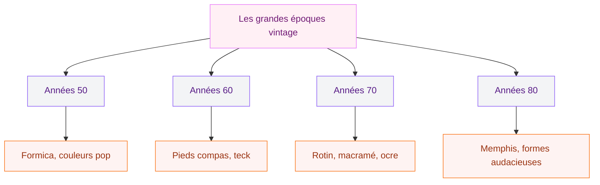
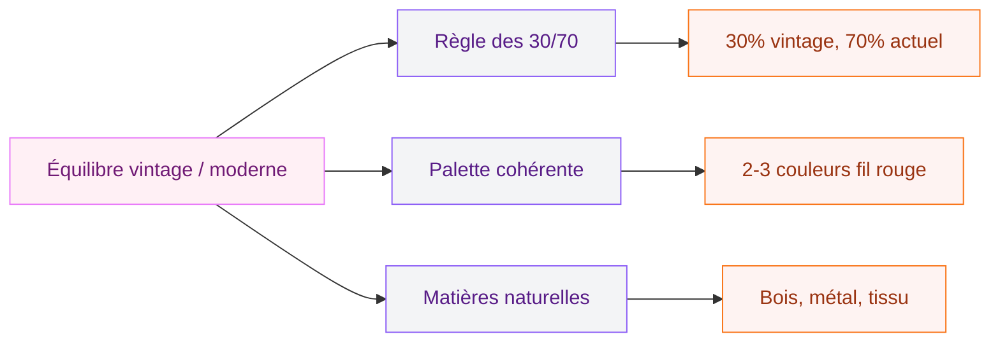

Tu craques pour les meubles des années 50, les formes organiques, les couleurs pop et les objets qui ont une histoire ? La déco vintage, c'est ce plaisir de redonner vie à des pièces d'un autre temps - et de les intégrer dans un intérieur qui te ressemble. Pas besoin de transformer ton appartement en musée : quelques trouvailles bien choisies suffisent à changer l'ambiance d'une pièce.

Le vintage, ce n'est pas une mode passagère. C'est une approche durable de la décoration : on récupère, on chine, on détourne. Et en 2026, cette démarche résonne plus que jamais avec les envies de consommation raisonnée. Alors on y va.

## Vintage, rétro, brocante : de quoi parle-t-on ?

Avant de se lancer, mettons les mots au clair. Le vintage désigne des objets fabriqués entre les années 1920 et 1980 - des pièces d'époque, pas des reproductions. Le rétro, c'est du neuf qui s'inspire des codes esthétiques du passé. Et la brocante, c'est l'endroit où tu trouves les deux.

  

En déco, on mélange souvent vintage et rétro dans un même intérieur, et c'est très bien comme ça. L'idée n'est pas de recréer un décor d'époque au centimètre près, mais de picorer des inspirations dans différentes décennies pour composer quelque chose de personnel.

> [!NOTE]
> Un objet vintage a entre 20 et 100 ans. Au-delà, on parle d'antiquité. En dessous, c'est de l'occasion. Cette distinction compte quand tu chines : un vrai fauteuil des années 60 vaut en général plus qu'une reproduction récente.

## Les grandes périodes vintage à connaître

Chaque décennie a ses codes, ses matériaux et ses couleurs. Voici un panorama rapide pour t'aider à identifier ce qui te plaît et ce qui ira chez toi.

  

### Les années 50 : formica, couleurs vives et électroménager pop

C'est l'époque de l'optimisme d'après-guerre. Les intérieurs se remplissent de couleurs franches - rouge, jaune citron, turquoise -, les cuisines adoptent le formica et les formes arrondies. Côté mobilier, on trouve des buffets aux lignes simples, des chaises en tube chromé et des luminaires en métal émaillé.

**Pièces à chiner :** table de cuisine en formica (80-200 euros sur Leboncoin), horloge murale Jaz ou Odo (30-80 euros), frigo rétro Smeg (1200-1800 euros neuf, mais l'effet est garanti).

### Les années 60 : le mid-century modern

La période préférée des décorateurs. Les pieds compas, les formes organiques, le teck chaud et les lignes tendues définissent le mid-century modern. On retrouve des designers comme Pierre Guariche, Charlotte Perriand ou Arne Jacobsen dans toutes les ventes aux enchères.

**Pièces à chiner :** enfilade en teck pieds compas (300-800 euros), fauteuil coque en plastique moulé (150-400 euros), lampe de bureau articulée (40-120 euros).

### Les années 70 : terre cuite, macramé et couleurs chaudes

Le retour à la nature, les tons ocre, orange brûlé et vert avocat. C'est l'époque du macramé accroché au mur, des suspensions en rotin, du velours côtelé sur les canapés et des carrelages aux motifs géométriques. Une ambiance chaleureuse et bohème.

**Pièces à chiner :** suspension en rotin ou osier (40-150 euros), miroir soleil en métal doré (60-200 euros), table basse en verre fumé et métal chromé (100-300 euros).

### Les années 80 : Memphis, géométrie et audace

Le mouvement Memphis (lancé par Ettore Sottsass à Milan) casse tous les codes avec des formes asymétriques, des couleurs électriques et des motifs géométriques. C'est plus clivant, mais quelques pièces bien dosées apportent une énergie unique.

**Pièces à chiner :** lampe Tahiti ou étagère Carlton (pièces de collection à prix élevé), miroirs aux formes irrégulières (50-150 euros), vaisselle Memphis colorée (20-60 euros le lot).

## Le salon vintage : 15 idées pour démarrer

Le salon, c'est la pièce où le vintage prend tout son sens. L'espace de vie, la vitrine de tes trouvailles. Voici comment l'aborder.

  

**Le canapé arrondi.** La pièce star du salon vintage. Les formes boudinées, les accoudoirs roulés et les pieds en bois des années 60-70 reviennent en force. Chez Made.com, le modèle "Tubby" tourne autour de 700-900 euros et capte bien l'esprit. En brocante, un canapé d'époque coûte entre 200 et 600 euros - mais pense au coût du retapissage si le tissu est fatigué.

**La table basse pieds compas.** C'est l'objet mid-century par excellence. En teck, en chêne ou en palissandre, avec son plateau ovale ou rectangulaire et ses pieds obliques. Compter 150-400 euros en brocante. La Redoute propose aussi des reproductions très réussies autour de 200 euros.

**Le papier peint géométrique.** Un pan de mur en papier peint à motifs graphiques (losanges, hexagones, arcs) ancre la pièce dans le vintage sans la figer. Les collections Graham & Brown ou Cole & Son proposent des motifs rétro contemporains entre 45 et 90 euros le rouleau.

> [!TIP]
> Pose le papier peint géométrique sur un seul mur - celui derrière le canapé ou le meuble TV. Ça crée un point focal fort sans étouffer la pièce. Les trois autres murs restent sobres en teinte unie.

**Le coin lecture rétro.** Un fauteuil coque des années 60 (ou sa réédition chez Vitra autour de 400 euros), une lampe de lecture articulée et une petite bibliothèque en bois. Le genre d'angle qui donne envie de poser son téléphone.

**Le tapis berbère.** Pas vintage au sens strict, mais il se marie avec tous les styles d'époque. Les motifs géométriques des tapis Beni Ouarain s'accordent aussi bien avec du mid-century qu'avec du 70s. Budget : 150-500 euros selon la taille.

Pour un mix réussi entre ancien et actuel, tu peux aussi t'inspirer du [style Art Déco](/50-idees-de-decoration-art-deco/) qui partage avec le vintage ce goût pour les lignes marquées et les matériaux nobles.

## La cuisine vintage : couleurs et convivialité

La cuisine est un terrain de jeu formidable pour le vintage. C'est souvent là que le style prend le plus de caractère, parce que les objets du quotidien deviennent de la déco.

  

**Les chaises dépareillées.** Quatre chaises de couleurs différentes autour d'une table en bois brut - c'est un classique qui fonctionne toujours. Cherche des chaises en bois coloré des années 70 (15-40 euros pièce en brocante), ou adopte les chaises Tolix en métal (90 euros neuves, 40-60 euros d'occasion) dans des tons pastel.

**L'électroménager rétro.** Un grille-pain Smeg (160 euros), une bouilloire Russell Hobbs Retro (50 euros), un robot KitchenAid coloré (450-600 euros) - ces objets transforment un plan de travail banal en cuisine des sixties. Pas besoin de tout changer : deux ou trois pièces suffisent.

**Les étagères ouvertes.** Fixe des planches en bois brut sur des équerres métalliques noires et expose ta vaisselle vintage : assiettes Arcopal à motifs floraux (5-15 euros le lot de 6 sur Vinted), verres Duralex colorés, bocaux Le Parfait en verre.

> [!WARNING]
> Ne tombe pas dans le total look cuisine des années 50. Un plan de travail moderne et des électroménagers performants, c'est ce qui rend la cuisine vraiment vivable. Le vintage doit venir par touches - une crédence en carreaux, des accessoires, du mobilier - pas par la plomberie.

## La chambre et les autres pièces : inspiration par espace

**La chambre.** Un lit en laiton ou en fer forgé avec une tête de lit travaillée (200-500 euros en brocante), une table de chevet qui était autrefois un tabouret d'atelier, une commode scandinave des années 60. Côté textiles, joue sur les motifs floraux et les couleurs moutarde ou terracotta pour une ambiance 70s cosy. Si tu cherches aussi un style déco avec du caractère pour ta chambre, le [style shabby chic](/decoration-shabby-chic-idees-et-photos-de-style-et-de-decoration/) se marie très bien avec le vintage.

  

**La salle de bain.** Un miroir barbier rond en laiton (40-100 euros), un meuble sous-vasque chiné et repeint, des paniers en osier pour le rangement, une affiche publicitaire rétro encadrée au mur.

**L'entrée.** Un portemanteau mural en bois et métal, un banc chiné recouvert d'un coussin en velours, un miroir rond au cadre doré. C'est la première impression - autant qu'elle ait du caractère.

**Le bureau.** Un bureau en teck pieds compas (le Graal du home office vintage), une chaise de bureau pivotante des années 70, une lampe de banquier verte. Le tout fonctionnel et beau.

## Comment mixer vintage et contemporain sans fausse note

C'est la question qui revient tout le temps : comment éviter l'effet "boutique d'antiquaire" ou "grenier de mamie" ? La réponse tient en quelques règles simples.

**La règle des 30/70.** 30% de pièces vintage, 70% de base contemporaine. Ton canapé peut être actuel, ta table basse chinée. Tes murs blancs et sobres, ton luminaire pop. Ce ratio empêche la surcharge et garde un intérieur vivable.

**Une palette de couleurs commune.** Choisis deux ou trois teintes qui traversent tout l'intérieur. Si tu pars sur du moutarde et du bleu canard, retrouve-les sur un coussin vintage, une affiche, un vase, un tapis. Ça crée une cohérence qui relie les époques.

**Les matériaux comme lien.** Le bois, le laiton, le velours, le lin - ces matières traversent les décennies. Un meuble 70s en teck s'associe naturellement à un canapé contemporain en lin. Le laiton d'un luminaire vintage dialogue avec des poignées de porte modernes dans le même métal.

La [décoration française romantique](/decoration-francaise-idees-et-photos-romantiques/) partage cette approche du mélange maîtrisé - et certaines de ses astuces s'appliquent aussi au vintage.

> [!IMPORTANT]
> Évite de mélanger plus de deux décennies vintage dans une même pièce. Années 50 + 70, c'est risqué visuellement. En revanche, 60s + 70s ou 50s + 60s, ça fonctionne parce que les transitions stylistiques sont progressives.

## Où chiner et à quel prix

Voici les meilleurs spots pour trouver du vintage de qualité sans exploser ton budget.

| Source | Type d'objets | Budget moyen |
|---|---|---|
| Leboncoin | Meubles, luminaires, vaisselle | 20-500 euros |
| Emmaüs | Mobilier, bibelots, textiles | 5-150 euros |
| Selency | Pièces sélectionnées, design signé | 50-2000 euros |
| Vinted | Petite déco, vaisselle, affiches | 5-50 euros |
| Brocantes de village | Trouvailles imprévisibles | 5-300 euros |
| Puces de Saint-Ouen | Pièces rares, mobilier design | 100-5000 euros |

Le [mobilier métallique vintage](/mobilier-metallique-vintage-pour-un-interieur-de-caractere/) est aussi une piste intéressante si tu cherches des pièces de caractère avec un budget maîtrisé.

**Astuces de chineur expérimenté :**

- Arrive tôt aux brocantes (les meilleures pièces partent avant 10h)
- Sur Leboncoin, enregistre des alertes sur tes mots-clés ("enfilade teck", "fauteuil 60s", "lampe jielde")
- Négocie toujours - en brocante, 20 à 30% de rabais se font naturellement
- Vérifie la solidité des assemblages et l'état des tiroirs avant d'acheter un meuble

## L'upcycling : donne une seconde vie à tes trouvailles

L'upcycling, c'est l'art de transformer un objet abîmé en pièce déco. Et c'est l'une des meilleures façons de personnaliser ton intérieur vintage.

**Le meuble repeint.** Une commode des années 60 un peu défraîchie ? Un coup de peinture bleu canard (la gamme Chalk Paint d'Annie Sloan autour de 25 euros les 500ml, ou Tollens à 20 euros le litre) et elle redevient une pièce maîtresse.

**La valise empilée.** Deux ou trois valises vintage empilées forment une table de chevet ou un bout de canapé original. Compter 15-30 euros par valise en brocante.

**Le luminaire détourné.** Une vieille cafetière italienne transformée en lampe, un globe terrestre percé et équipé d'une ampoule, un appareil photo ancien monté sur un pied - les possibilités sont infinies.

> [!TIP]
> Pour les débutants en upcycling, commence par les petits objets : repeindre un cadre, retapisser une chaise, transformer un pot en terre cuite en photophore. Tu progresseras vite et tu gagneras confiance pour les projets plus ambitieux.

## Sur le meme theme

- [décoration classique contemporaine](/decoration-classique-20-images-et-idees-contemporaines/)

## FAQ

**Quel budget prévoir pour un intérieur vintage ?**

Tout dépend de ton approche. Avec 300-500 euros de brocante et d'upcycling, tu peux déjà transformer un salon. Pour un intérieur complet avec des pièces de qualité (design signé, meubles restaurés), compte entre 2000 et 5000 euros. L'avantage du vintage : la valeur des vraies pièces d'époque ne baisse pas, contrairement au mobilier industriel neuf.

**Comment savoir si un meuble est vraiment vintage ou juste une copie ?**

Regarde les assemblages (tenon-mortaise, chevilles en bois = signe de qualité ancienne), les matériaux (bois massif, pas d'aggloméré), les étiquettes ou tampons sous le meuble. Un meuble mid-century en teck a aussi une odeur et une patine que le neuf ne reproduit pas. En cas de doute, des sites comme Design Market ou Selency authentifient leurs pièces.

**Le vintage est-il compatible avec un intérieur moderne ?**

C'est même la meilleure combinaison. Un intérieur 100% vintage peut vite paraître daté. Mélange un canapé contemporain avec une table basse chinée, des murs blancs sobres avec un luminaire rétro, du béton ciré avec du mobilier en teck. Le contraste entre les époques crée la richesse visuelle.

**Comment entretenir des meubles vintage en bois ?**

Dépoussiérage régulier au chiffon doux, cire d'abeille une à deux fois par an pour nourrir le bois, éviter les produits chimiques agressifs. Pour le teck, une huile spéciale teck (Starwax, autour de 12 euros) appliquée tous les six mois garde la teinte dorée. Protège les surfaces des verres mouillés avec des dessous de verre - les marques blanches sur le bois ancien sont la hantise de tout chineur.
