Cette année, le sapin de Noël revient en force avec des ambiances qui mêlent tradition revisitée et modernité assumée. Que tu sois fan de doré scintillant, de matières naturelles ou de minimalisme élégant, 2026 a vraiment quelque chose pour toi. On fait le tour des tendances qui vont marquer la saison - et je t'aide à choisir le style qui colle à ta déco.

## Les grandes tendances sapin de Noël 2026


<div class="my-8">
  
</div>

### Le retour au naturel et à l'éco-responsable

C'est la tendance la plus forte de cette saison. Les ornements en matières recyclées, le papier, le bois et le feutre ont complètement pris le dessus sur le plastique bon marché. Le sapin en papier façon origami géant ou accordéon devient même une alternative déco à part entière pour ceux qui veulent éviter l'arbre artificiel classique.

Pour les sapins naturels ou artificiels habillés dans ce style, on pense à :

- Des boules en verre soufflé artisanal (entre 3 et 8 € pièce chez des créateurs Etsy, ou 15-25 € le set chez Maisons du Monde)
- Des suspensions en feutre cousues à la main (kits DIY à partir de 12 € chez Cultura)
- Des guirlandes de pommes de pin séchées et de cannelle (à faire soi-même pour quelques euros)
- Des étoiles en bois découpé ou en branches assemblées

Le gros atout de ce style : il vieillit bien, tu peux réutiliser les ornements plusieurs années, et ça ne ressemble à rien d'autre dans ton salon.

> [!TIP]
> Si tu veux aller plus loin dans le style naturel, associe tes ornements à une couronne de branches de sapin fraîches posée au pied de l'arbre. L'odeur et l'ambiance sont vraiment incomparables.

### Le glamour cristal et scintillant

À l'opposé du naturel, le courant "crystal glam" explose. On voit partout des sapins recouverts de boules transparentes, de pendeloques en cristal, de tinsel irisé et d'ornements qui jouent avec la lumière. C'est spectaculaire, surtout le soir avec les guirlandes lumineuses allumées.

Les marques qui se positionnent sur cette tendance en 2026 :

- **Goodwill** et **LIDL** proposent des sets crystal basiques à partir de 8 €
- **Zara Home** : collections boules et cristaux entre 20 et 45 € le set
- **H&M Home** : suspensions en verre soufflé avec reflets irisés, autour de 6-12 € la pièce
- Pour le tinsel (guirlande lametta), comptez 4-9 € la bobine en grande surface

Ce style correspond bien à une [décoration dorée](/guides/decoration/decoration-doree-sur-les-murs-les-meubles-ou-les-accessoires/) dans le reste de la pièce : les reflets or et argent se répondent entre le sapin et les accessoires du salon.

> [!NOTE]
> Le crystal glam fonctionne mieux avec un sapin vert foncé dense qu'avec un sapin blanc. La profondeur de couleur fait ressortir les reflets et donne du relief à l'ensemble.

### Le style traditionnel chaleureux revisité

Rouge bordeaux, vert sapin, or mat, brun expresso... Les couleurs de Noël classiques font leur retour, mais dans des versions plus raffinées. On est loin des boules plastique des années 90 - ici, on parle de textures velours, de bois peint à la main, de petits animaux polaires en céramique et d'ornements qui racontent une histoire.

Ce courant s'inspire directement de la tradition des Noëls d'anteodors - les veillées autour du feu, la campagne, les vieux jouets. Il se prête bien au style [décoration shabby chic](/guides/decoration/decoration-shabby-chic-idees-et-photos-de-style-et-de-decoration/) si tu aimes les intérieurs avec du caractère.

Couleurs clés : rouge cerise, bordeaux profond, orangé chaud, vert mousse, or vieilli.

Ornements typiques de cette tendance :
- Petites maisons en pain d'épices suspendues (Ikea en propose à 7,99 € le set de 6)
- Figurines d'animaux polaires en bois peint (environ 5-15 € pièce)
- Boules en velours bordeaux ou vert (set de 12 chez Leroy Merlin, autour de 11 €)
- Rubans en satin et en lin naturel pour les noeuds

### Le minimalisme épuré

Pour ceux qui préfèrent la sobriété, la tendance minimaliste reste très présente en 2026. Peu d'ornements, un fil directeur de couleur strict (blanc + or, noir + argent, beige + cuivre), et surtout des espaces négatifs assumés qui donnent de l'élégance à l'ensemble.

Ce style est directement lié à l'univers de la [décoration minimaliste](/guides/decoration/decoration-minimaliste-idees-et-photos-faciles/) : si ton intérieur est épuré, ton sapin doit l'être aussi pour ne pas créer un décalage visuel.

Les règles du sapin minimaliste réussi :
1. Maximum 3 types d'ornements différents
2. Palette de 2 couleurs maximum
3. Une seule guirlande lumineuse (blanc chaud ou blanc froid, jamais multicolore)
4. Pas de tinsel ni de guirlandes en papier

## Les palettes de couleurs qui dominent en 2026

```mermaid
graph TD
    A["Palettes sapin 2026"] --> B["Or & Ivoire"]
    A --> C["Rouge & Expresso"]
    A --> D["Cristal & Argent"]
    A --> E["Vert Naturel & Bois"]
    A --> F["Noir & Or Mat"]
    B --> G["Lumière dorée,\nboules champagne"]
    C --> H["Bordeaux velours,\nornemanets boisés"]
    D --> I["Tinsel irisé,\ncristaux transparents"]
    E --> J["Matières naturelles,\nornements recyclés"]
    F --> K["Style graphique,\nélégance urbaine"]

<div class="my-8">
  
</div>


    style A fill:#141D30,stroke:#F59E0B,color:#F1F5F9
    style B fill:#141D30,stroke:#F59E0B,color:#F1F5F9
    style C fill:#141D30,stroke:#8B5CF6,color:#F1F5F9
    style D fill:#141D30,stroke:#F59E0B,color:#F1F5F9
    style E fill:#141D30,stroke:#8B5CF6,color:#F1F5F9
    style F fill:#141D30,stroke:#F59E0B,color:#F1F5F9
    style G fill:#141D30,stroke:#8B5CF6,color:#F1F5F9
    style H fill:#141D30,stroke:#F59E0B,color:#F1F5F9
    style I fill:#141D30,stroke:#8B5CF6,color:#F1F5F9
    style J fill:#141D30,stroke:#F59E0B,color:#F1F5F9
    style K fill:#141D30,stroke:#8B5CF6,color:#F1F5F9
```

## Comment construire ton sapin par étapes

Habiller un sapin, c'est un vrai art - et la plupart des gens le font dans le mauvais ordre, ce qui explique pourquoi le résultat est souvent décevant. Voici la méthode qui fonctionne vraiment.

```mermaid
flowchart LR
    A["1. Guirlandes lumineuses\n(en premier, en spirale)"] --> B["2. Guirlandes décoratives\n(ruban, tinsel, feuillage)"]
    B --> C["3. Grosses boules\n(en profondeur)"]
    C --> D["4. Boules moyennes\n(milieu de branche)"]
    D --> E["5. Petits ornements\n(pointe de branche)"]
    E --> F["6. Cime\n(étoile ou ange)"]

    style A fill:#141D30,stroke:#F59E0B,color:#F1F5F9
    style B fill:#141D30,stroke:#8B5CF6,color:#F1F5F9
    style C fill:#141D30,stroke:#F59E0B,color:#F1F5F9
    style D fill:#141D30,stroke:#8B5CF6,color:#F1F5F9
    style E fill:#141D30,stroke:#F59E0B,color:#F1F5F9
    style F fill:#141D30,stroke:#8B5CF6,color:#F1F5F9
```

<div class="my-8">
  
</div>




**Les guirlandes lumineuses en premier** : c'est la règle numéro un que tout le monde oublie. Si tu mets les lumières après les boules, tu vas tout déplacer et casser des ornements. Enroule-les en partant du bas, en spirale vers la cime, en variant la profondeur pour donner du volume.

**Les grosses boules en profondeur** : place les boules les plus volumineuses au coeur du sapin, près du tronc. Elles créent de la profondeur et donnent l'impression que l'arbre est rempli, même si tu n'as pas des dizaines d'ornements.

**Les petits ornements en surface** : les détails fins, les petits animaux, les étoiles filées - tout ce qui est léger et fragile va en bout de branche, là où il y a le plus de mouvement.

> [!WARNING]
> Évite de surcharger les branches du bas avec des boules trop lourdes. Les branches basses des sapins artificiels sont souvent les plus fragiles et les ornements lourds finissent au sol, souvent cassés.

## Les ornements tendance à shopper cette saison


<div class="my-8">
  
</div>

### Budget serré (moins de 30 € pour tout le sapin)

- **Action** : sets de boules basiques 12-20 pièces entre 2,99 et 5,99 €, guirlandes LED à partir de 3,99 €
- **Ikea VINTER** : ornements en verre, céramique et métal peint, 3-8 € la pièce ou en set
- **Gifi** : sets thématiques complets à partir de 9,99 €
- **Primark Home** : ornements en feutre et tissu, 2-5 € la pièce

### Budget moyen (30-80 €)

- **Maisons du Monde** : collections thématiques complètes (boules, suspensions, ruban, étoile) entre 35 et 65 € selon le style
- **H&M Home** : ornements en verre soufflé et céramique peinte à la main, 6-15 € pièce
- **Zara Home** : sets haut de gamme avec beaucoup de cohérence graphique, 25-45 € le set

### Budget plaisir (80 € et plus)

- **Bloomingville** (disponible chez des revendeurs en ligne) : ornements en porcelaine et verre scandinaves, 8-20 € pièce
- **Christofle** : boules en métal argenté, collections collector, 35-80 € pièce
- **Artisans Etsy** : ornements en verre soufflé bouche, pièces uniques, 15-40 € pièce

> [!TIP]
> Si tu veux créer des ornements originaux qui sortent du lot, jette un oeil aux techniques de [fleurs en tissu ou en papier](/guides/decoration/comment-realiser-des-fleurs-en-tissu-ou-en-papier-etape-par-etape/) - une guirlande de petites fleurs en papier kraft autour du sapin est à la fois très tendance et très peu chère à fabriquer.

## Idées originales pour se démarquer


<div class="my-8">
  
</div>

### Le sapin monochrome

Choisir une seule couleur et l'assumer à fond. Un sapin tout blanc avec des ornements blanc nacré et des lumières chaudes, c'est d'une élégance folle. Un sapin tout rouge avec des ornements bordeaux et des touches or, c'est très dramatique et très beau.

### Les ornements personnalisés

En 2026, la personnalisation est partout. Des sites comme Etsy, Not On The High Street ou même des imprimeurs locaux proposent des boules gravées ou imprimées avec des prénoms, des dates, des photos. Budget : 8-20 € pièce. Ça fait aussi de très beaux cadeaux.

### Le sapin thématique

Un thème assumé et cohérent du haut jusqu'en bas : tout en animaux de la forêt (écureuils, renards, hiboux en céramique ou en bois), tout en vintage avec des ornements qui imitent les jouets d'antan, tout en forêt nordique avec des rennes et des flocons géants... Le principe : choisir 3-4 éléments visuels forts et les décliner à travers tous les ornements.

### Le "sapin photographique"

Pas forcément un style visuel, mais une idée : intègre quelques mini-cadres photo ou des ornements qui contiennent une photo de famille à chaque décoration de Noël. Au bout de quelques années, ton sapin devient une archive vivante de ta famille, c'est une idée que beaucoup de gens adorent.


## Sur le meme theme

- [salons modernes 2026](/guides/decoration/salons-modernes-tendances-2026/)

## FAQ - Les questions les plus posées sur les décorations de sapin

**Combien d'ornements faut-il pour un sapin de 180 cm ?**
Pour un résultat visuellement équilibré, comptez entre 50 et 80 ornements pour un sapin de 180 cm. Mélangez les tailles : 15-20 grosses boules, 25-35 moyennes et 15-25 petites. Si tu as beaucoup de branches et un sapin très dense, tu peux monter à 100 ornements sans surcharger.

**Blanc chaud ou blanc froid pour les guirlandes lumineuses ?**
Le blanc chaud (2700-3000K) donne une ambiance cosy et douce, parfait pour un style traditionnel ou naturel. Le blanc froid (5000-6000K) est plus graphique et s'accorde mieux avec un style cristal ou minimaliste. Les deux peuvent fonctionner selon le contexte, mais ne les mélange pas.

**Comment éviter que les boules tombent ?**
Utilise des crochets en S à double attache plutôt que de simplement poser l'ornement sur la branche. Pour les ornements précieux, tu peux aussi les attacher avec un fin fil de nylon transparent - invisible et très solide.

**Comment conserver les ornements d'une année sur l'autre ?**
Dans des boîtes à compartiments rigides avec couvercle (Ikea et Leroy Merlin en vendent spécialement pour ça, entre 6 et 15 €). Enveloppe les ornements en verre dans du papier de soie. Évite les sacs plastique hermétiques qui créent de la condensation et peuvent abîmer les ornements peints.

**Est-ce que le sapin blanc est toujours tendance en 2026 ?**
Oui, mais il s'est radicalisé dans deux directions opposées : soit très minimaliste avec très peu d'ornements, soit au contraire surchargé de boules argentées et de tinsel pour un effet "winter wonderland" spectaculaire. Le sapin blanc "normal" avec des boules colorées standard a, lui, un peu vieilli.
