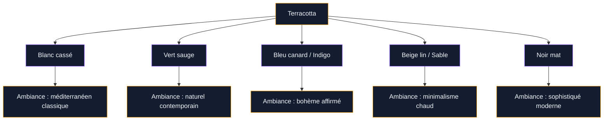
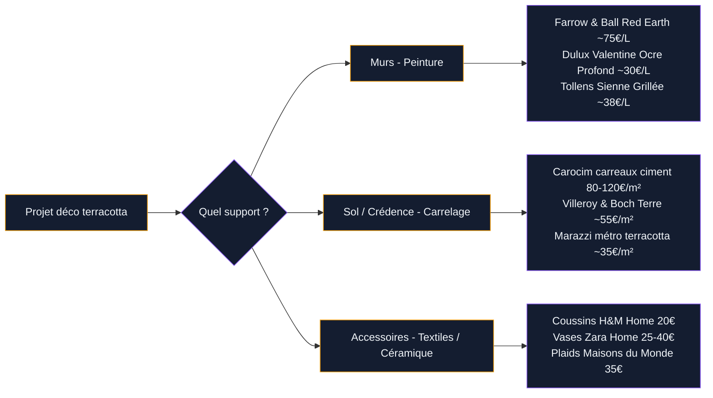

La terracotta, c'est cette teinte ocre-orangée qui évoque la Toscane, les maisons provençales et les poteries d'antan. En 2026, elle n'a rien perdu de sa popularité - bien au contraire. Elle s'invite dans les salons modernes, les cuisines contemporaines et les chambres cosy. Tu te demandes comment l'utiliser sans tomber dans le cliché "maison de campagne des années 90" ? Voilà un guide complet pour décliner la terracotta dans chaque pièce, avec des idées concrètes, des marques précises et des associations de couleurs qui fonctionnent vraiment.

## Pourquoi la terracotta séduit autant en ce moment

La terracotta n'est pas une tendance qui surgit de nulle part. C'est une couleur ancrée dans notre histoire, celle de la terre cuite, des amphores antiques, des toits méditerranéens. Ce qui change aujourd'hui, c'est la façon dont les designers l'interprètent : plus sophistiquée, moins saturée, souvent mélangée à des matières naturelles comme le lin, le rotin ou le béton.

  

Ce qui la rend si facile à vivre, c'est sa chaleur intrinsèque. Elle capte la lumière naturelle et réchauffe les pièces sans les alourdir. Dans une salle de séjour orientée nord, elle compense la froideur de la lumière. Dans une chambre exposée plein sud, elle crée un cocon qui invite au repos.

Le spectre de la terracotta est large : du brique rosé très clair chez Farrow & Ball (coloris "Red Earth" No.64) jusqu'au brun-orangé profond chez Little Greene ("Orange Aurora"). Entre les deux, une cinquantaine de nuances, et chacune raconte quelque chose de différent.

> [!NOTE]
> La terracotta n'est pas une couleur unique mais une famille de teintes. Avant d'acheter ta peinture, commande des échantillons et observe-les à différentes heures de la journée - la même couleur peut paraître rose le matin et brique le soir.

## Les combinaisons de couleurs qui marchent

Avant de te lancer dans la déco, il faut choisir ton "camp" : quelle ambiance veux-tu créer ? La terracotta accepte plusieurs partenaires, chacun donnant un résultat très différent.

  

### Terracotta + blanc cassé = classique méditerranéen

L'association la plus simple et la plus efficace. Le blanc cassé - attention, pas le blanc pur qui crée un contraste trop dur - adoucit la terracotta et évite l'effet oppressant. Pense au coloris "Elephant's Breath" de Farrow & Ball ou au "Blanc Antique" de Ressource Peintures pour les murs adjacents.

### Terracotta + vert sauge = contemporain et naturel

C'est la combinaison star des intérieurs 2025-2026. Le vert sauge désaturé (comme le "Mizzle" de Farrow & Ball ou le "Khaki Green" de Little Greene) crée une tension douce avec la chaleur de la terracotta. Les deux couleurs renvoient toutes les deux à la nature, et ça se ressent.

### Terracotta + bleu canard ou indigo = le contraste audacieux

Si tu veux quelque chose de plus affirmé, le bleu profond est ton meilleur allié. Cette association, très présente dans la [décoration marocaine](/guides/decoration/decoration-marocaine-moderne-ou-classique/), donne une énergie incroyable à un salon ou une cuisine. Utilise le bleu en petites touches - coussins, vase, cadres - pour ne pas trop charger.

Pour aller plus loin sur les combinaisons qui fonctionnent avec les tons chauds, jette un oeil aux [couleurs compatibles avec l'orange](/guides/couleurs/couleurs-compatibles-avec-lorange-pour-les-murs-et-la-decoration/) - la terracotta partage beaucoup d'affinités avec les orangés.

## Pièce par pièce : comment intégrer la terracotta

  

### Le salon : la terracotta en mur d'accent

Dans un salon, le mur d'accent terracotta est la solution la plus impactante et la moins engageante. Tu peins un seul mur - généralement celui derrière le canapé ou celui avec la cheminée - et tu laisses les trois autres en blanc cassé ou en beige clair.

Pour la peinture murale, quelques références solides :
- **Farrow & Ball "Red Earth" No.64** : environ 75€ le litre, une terracotta rougeâtre très riche
- **Dulux Valentine "Ocre Profond"** : aux alentours de 30€ le litre, plus accessible, légèrement plus orange
- **Tollens "Sienne Grillée"** : 35-40€ le litre, un brun-orangé doux parfait pour les salons

Côté mobilier, la terracotta au mur appelle des matières naturelles : canapé en lin beige ou gris clair, table basse en bois clair ou en rotin, étagères en chêne naturel. Évite les meubles laqués blanc brillant qui cassent l'harmonie.

> [!TIP]
> Si tu habites en appartement et que tu ne veux pas t'engager sur un mur entier, commence par des accessoires terracotta : un plaid Maisons du Monde aux alentours de 35€, deux coussins H&M Home à 20€ pièce et un vase Zara Home entre 25 et 40€. Tu peux ainsi tester l'ambiance avant de sauter le pas.

### La cuisine : carrelage et crédence

La cuisine est l'endroit où la terracotta trouve ses racines les plus profondes. Le carrelage en terre cuite fait partie du patrimoine architectural français - on en trouve encore dans des cuisines provençales centenaires. Aujourd'hui, les nouvelles versions sont traitées et faciles d'entretien.

Pour une crédence, les carreaux de ciment terracotta de chez Carocim (comptez 80 à 120€/m² posé) ou les carreaux de métro à glaçure terracotta de Marazzi (environ 35€/m²) créent un effet immédiat. Sur des murs blancs et avec des meubles blanc mat ou bois naturel, le résultat est saisissant.

Si tu veux rester sur de la peinture, la cuisine appelle à une peinture lavable. Essaie le "Desert Sand" de Leroy Merlin (gamme Tollens, 28€ le 2,5L) sur le mur au-dessus du plan de travail.

### La salle de bain : terracotta minérale

La salle de bain terracotta, c'est l'une des tendances les plus fortes de ces deux dernières années. L'esthétique "bain hammam" ou "spa naturel" se marie parfaitement avec cette couleur.

Deux approches :
1. **Le carrelage grand format** : des dalles terracotta mat de type grès cérame (Villeroy & Boch "Terre", environ 55€/m²) pour le sol et les murs de douche. Associé à des accessoires en laiton brossé, c'est un rendu haut de gamme.
2. **La peinture hydrofuge** : si ta salle de bain est bien ventilée, une peinture spéciale pièces humides en teinte terracotta suffit. Bostik Murs et Plafonds "Argile" ou la gamme Hydrofuge de Leroy Merlin (25-30€ le 2,5L) font l'affaire.

### La chambre : cocon chaleureux

La chambre terracotta crée une atmosphère très cosy, propice au sommeil et à la détente. Mais attention à ne pas trop saturer : dans une petite chambre, un seul mur terracotta (généralement celui de la tête de lit) suffit largement.

Pour une chambre sereine, associe :
- Un mur terracotta en "headboard" visuel
- Un linge de lit en lin naturel beige (La Redoute, Harmony, Libeco)
- Des rideaux en coton épais couleur sable ou vert kaki
- Une ou deux plantes (un ficus lyrata ou un philodendron apportent le vert naturel sans accessoire)

Si tu veux aller plus loin dans la déco chambre terracotta, consulte notre guide dédié à la [déco terracotta chambre](/guides/chambre/deco-terracotta-chambre/) pour des idées plus poussées sur le mobilier et la literie.

> [!WARNING]
> Dans une chambre d'enfant, dose la terracotta avec prudence. Une pièce trop saturée en tons chauds peut rendre le sommeil difficile. Préfère des touches légères : un mobile en céramique terracotta, un coussin, plutôt qu'un mur entier.

## Les accessoires terracotta : le moyen le plus simple de commencer

Tu n'es pas prêt(e) à peindre un mur ? Pas de problème. Les accessoires terracotta sont faciles à trouver, abordables et réversibles. C'est la meilleure façon de tester la couleur dans ton espace avant de s'engager davantage.

  

**Céramique et poterie** : le secteur le plus riche. IKEA propose des vases terracotta entre 5 et 25€. H&M Home a des collections de bols et mugs en grès terracotta à des prix accessibles (8-20€ pièce). Pour quelque chose de plus artisanal, La Trésorerie à Paris ou les marchés d'artisans locaux proposent des pièces uniques entre 20 et 80€.

**Textiles** : un coussin terracotta change une pièce en 30 secondes. Cherche chez H&M Home, Zara Home, ou Maisons du Monde. Comptez 15 à 40€ selon la taille et la matière. En lin, c'est encore mieux - la matière naturelle renforce l'effet terracotta.

**Cadres et tableaux** : les cadres en terre cuite ou en résine imitation terracotta sont tendance. IKEA (gamme RIBBA avec moulure terracotta peinte) ou des boutiques comme Desenio proposent des cadres adaptés à moins de 20€.

Les tons ocres et terracotta s'inscrivent dans une palette plus large que tu peux explorer dans notre guide sur les [couleurs ocres pour les murs et la décoration](/guides/couleurs/couleurs-ocres-pour-les-murs-et-la-decoration/), très utile pour coordonner l'ensemble de tes pièces.

## Les erreurs courantes à éviter

  

### Trop de terracotta partout

La terracotta en excès peut devenir oppressante et vieillir rapidement. La règle du 60-30-10 est ta meilleure alliée : 60% de couleur neutre (blanc cassé, beige, gris doux), 30% de terracotta, 10% d'accents (bleu, vert, noir).

### La mauvaise nuance pour la lumière

Une terracotta trop orangée dans une pièce très lumineuse peut devenir criarde. Si ton salon est baigné de soleil, oriente-toi vers des teintes plus brun-rosé que orange-vif. Farrow & Ball "Etruscan Red" est plus doux en plein soleil que "Red Earth".

### Mélanger plusieurs "rouges"

Terracotta, brique, tomette, rouille... tous ces tons semblent proches mais entrent souvent en conflit. Choisis UN ton dominant et décline-le. N'associe pas un carrelage brique avec un mur terracotta orangé et un coussin rouge bordeaux - ça devient incohérent.

> [!IMPORTANT]
> Toujours tester ta peinture terracotta avec un échantillon A4 collé au mur pendant 48h, observé matin, midi et soir. La même peinture peut donner un résultat très différent selon l'orientation de la pièce et la qualité de la lumière naturelle.

## Entretien et durabilité

Le carrelage en terre cuite traditionnelle (non émaillée) demande un entretien régulier : une protection à l'huile de lin ou à la cire spéciale terre cuite (produit Lithofin, environ 20€ le demi-litre) tous les 1 à 2 ans selon le passage. Les versions contemporaines en grès cérame émaillé sont nettement plus simples - un simple nettoyage à l'eau savonneuse suffit.

Pour les peintures murales terracotta, une finition velouté ou satin est plus résistante qu'une finition mate dans les pièces à fort passage (couloir, cuisine). Le mat est plus beau mais moins pratique.

## Sur le meme theme

- [salon brun](/guides/decoration/salons-bruns-idees-et-images/)

## FAQ

**Quelle couleur associer à la terracotta pour une ambiance moderne ?**
Le vert sauge, le beige lin ou le noir mat sont les associations les plus contemporaines. Évite les orangés vifs qui renvoient à une esthétique datée.

**Peut-on utiliser la terracotta dans une petite pièce ?**
Oui, en jouant sur le mur d'accent. Un seul mur terracotta dans une petite pièce crée de la profondeur sans alourdir. Les trois autres murs restent clairs.

**La terracotta est-elle démodée ?**
Non. La terracotta traverse les tendances parce qu'elle est ancrée dans des matériaux naturels intemporels. Elle a eu une phase "vintage" dans les années 90, puis s'est modernisée. En 2026, elle est plus contemporaine que jamais.

**Quelle peinture terracotta recommander pour les débutants ?**
La gamme Tollens chez Leroy Merlin offre le meilleur rapport qualité-prix (28-38€ le litre). Les nuances "Sienne Grillée" ou "Ocre Rouge" sont faciles à poser et couvrent bien en deux couches.

**Comment associer la terracotta au parquet clair ?**
Très bien ! Un parquet en chêne naturel ou en pin clair équilibre la chaleur de la terracotta. Évite les parquets très blonds (trop de jaune peut saturer) et préfère les teintes naturelles moyennes.

**La terracotta convient-elle à une cuisine blanche ?**
C'est une des combinaisons les plus réussies. Quelques carreaux terracotta en crédence ou un mur de fond terracotta transforment une cuisine blanche froide en espace chaleureux et vivant.
