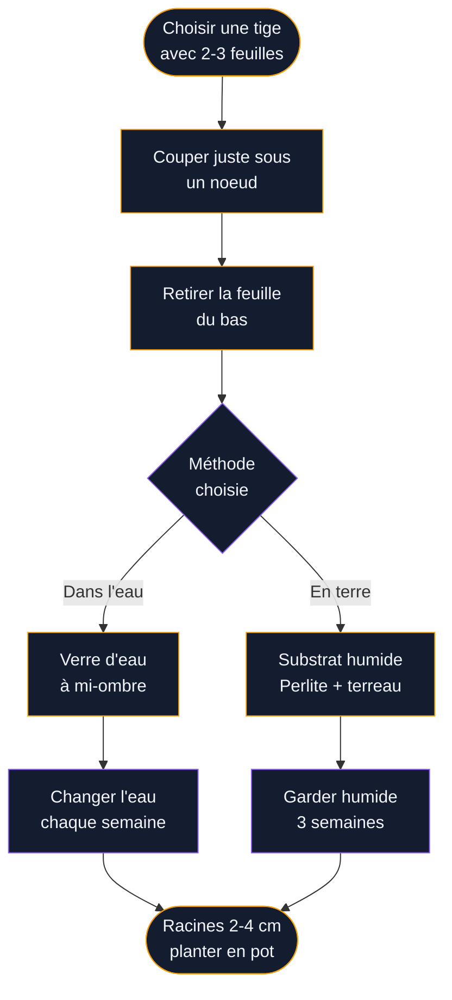

Tu cherches une plante qui tient le choc, qui ne demande pas des soins quotidiens et qui apporte quand même un vrai charme à ta déco ? Le Scindapsus pictus coche toutes ces cases. Avec ses feuilles vert foncé mouchetées d'argent, il a ce côté graphique et sophistiqué qu'on adore dans les intérieurs actuels - et pourtant, il pardonne les oublis d'arrosage sans faire la tête.

Je l'ai adopté il y a deux ans après avoir cherché longtemps une plante retombante pour ma bibliothèque. Depuis, il a multiplié ses tiges, supporté plusieurs semaines d'absence et illuminé un coin qui manquait cruellement de verdure. Dans cet article, je te donne tout ce qu'il faut savoir pour l'entretenir, le bouturer, et comprendre les signaux qu'il t'envoie quand quelque chose ne va pas.

## Le Scindapsus pictus, c'est qui exactement ?

Le Scindapsus pictus appartient à la famille des Aracées, la même que le pothos et le philodendron - des cousins dont il partage l'allure générale mais pas la facilité à trouver en jardinerie de quartier. On le reconnaît à ses feuilles en forme de cœur légèrement bombées, d'un vert profond parsemé de taches argentées qui captent la lumière. La variété la plus répandue s'appelle 'Argyraeus' : ses reflets sont particulièrement marqués, presque métalliques.

Originaire des forêts tropicales d'Asie du Sud-Est (Thaïlande, Philippines, Malaisie), il grimpe naturellement le long des arbres en s'accrochant à leur écorce. En pot, il préfère retomber ou s'enrouler autour d'un tuteur. Son allure change beaucoup selon ce choix : en mode cascade depuis une étagère haute, les feuilles restent petites et rapprochées ; attaché à un tuteur mousse, elles grossissent davantage.

> [!NOTE]
> Le Scindapsus pictus est souvent confondu avec le pothos argenté (Epipremnum pictum 'Argyraeus'). Ce sont deux plantes proches mais distinctes. Le vrai Scindapsus a des feuilles légèrement plus épaisses et mates, et ses taches argentées sont plus définies.

## La lumière : le seul vrai point de vigilance

C'est le paramètre qui compte le plus pour le Scindapsus pictus. Il tolère l'ombre, oui, mais à condition de ne pas lui en donner trop. Dans une pièce très sombre, les taches argentées pâlissent et les feuilles perdent leur éclat caractéristique. Il finit par devenir banal, vert uniforme, sans le motif qui fait tout son intérêt.

L'idéal, c'est une lumière indirecte lumineuse : à 1 ou 2 mètres d'une fenêtre orientée est ou ouest, ou à 2-3 mètres d'une fenêtre sud sans soleil direct qui brûlerait ses feuilles. Dans une pièce nord, il s'en sortira si la fenêtre est grande, mais les taches argentées seront moins prononcées.

Ce qui est bien avec lui, c'est qu'il s'adapte aux conditions intérieures changeantes - un déménagement de salon ne lui fait pas peur si l'exposition reste acceptable.

## L'arrosage : moins, c'est mieux

Le Scindapsus stocke l'eau dans ses feuilles charnues, ce qui lui donne une belle résistance à la sécheresse. La règle d'or : laisser les 2 à 3 premiers centimètres de terre se dessécher complètement entre deux arrosages. Pour le vérifier, enfonce ton doigt dans le substrat. Si c'est encore humide en surface, tu attends.

En pratique, ça donne :
- **Printemps-été** : environ tous les 7 à 10 jours
- **Automne-hiver** : environ tous les 14 à 21 jours selon la chaleur de ton appartement

Utilise de l'eau à température ambiante, si possible laissée reposer 24h pour évacuer le chlore. Un arrosage généreux jusqu'à ce que l'eau coule dans la soucoupe, puis on laisse drainer - on vide la soucoupe après 30 minutes. Il déteste avoir les pieds dans l'eau en permanence : la pourriture des racines est sa principale cause de mort.

> [!WARNING]
> Un Scindapsus aux feuilles qui jaunissent en masse souffre presque toujours d'un excès d'eau. Avant d'ajouter de l'engrais ou de changer d'emplacement, vérifie ton fréquence d'arrosage et l'état du drainage.

## La température et l'humidité

Le Scindapsus pictus aime la chaleur et craint le froid. Entre 18 et 29°C, il est à l'aise - ce qui correspond parfaitement à nos intérieurs chauffés. En dessous de 13°C, il ralentit fortement. En dessous de 10°C, les feuilles peuvent noircir.

Sur l'humidité, c'est une plante tropicale qui apprécie l'air humide, mais elle supporte sans problème l'air sec des appartements en hiver. Si tu veux aller plus loin, quelques options :

- Pose le pot sur un plateau de gravier avec de l'eau (sans que le pot trempe dedans)
- Brumise les feuilles une à deux fois par semaine avec un vaporisateur - le modèle Haws mini en aluminium (environ 15€) est parfait pour ça
- Place-le dans une salle de bain lumineuse si tu as cette chance - il adore l'humidité naturelle de ces pièces

> [!TIP]
> Tu peux placer ton Scindapsus pictus près d'autres plantes pour créer un micro-climat humide. Grouper trois ou quatre plantes augmente naturellement l'hygrométrie locale sans effort supplémentaire.

## Le substrat et le rempotage

Pour la terre, un mélange bien drainant est préférable à la terre universelle pure qui retient trop l'eau. Le plus simple : deux tiers de terreau universel de qualité (Plagron ou Biobizz, environ 10-15€ le sac de 10L) et un tiers de perlite pour aérer. Tu peux aussi ajouter un peu d'écorces de pin qui imitent son substrat naturel en forêt.

Le rempotage se fait tous les 1 à 2 ans, au printemps, quand les racines pointent par les trous de drainage ou que la plante semble stagner malgré de bonnes conditions. Choisis un pot seulement 2 cm plus grand que le pot actuel - un pot trop grand retient trop d'eau non utilisée par les racines.

Pour les pots, le terre cuite est excellent : il est poreux et laisse l'excès d'humidité s'évaporer. La marque Elho propose des pots avec réserve d'eau intégrée autour de 12-20€ qui peuvent convenir aussi, à condition de ne pas trop remplir la réserve.

## L'engrais : discret mais utile

Le Scindapsus n'est pas gourmand. De mars à septembre, un engrais liquide pour plantes vertes dilué à moitié de la dose indiquée, une fois par mois, suffit. J'utilise le Botanik Plantes Vertes de Bakker (environ 8€) ou l'engrais liquide Algoflash - les deux font bien le travail. En automne-hiver, on arrête complètement.

Ne sur-engraise surtout pas : les pointes des feuilles qui brunissent peuvent signaler un excès de sels minéraux.

## Le bouturage : gratuit et simple

C'est là que le Scindapsus pictus brille vraiment. Il se boutique facilement dans l'eau ou directement en terre, et le taux de réussite est excellent.

Le meilleur moment pour bouturer : le printemps et l'été, quand la plante est en pleine croissance. En 2 à 4 semaines dans l'eau, les racines apparaissent. Attends qu'elles mesurent 2 à 4 cm avant de planter dans un substrat humide. Dans les premières semaines, protège la nouvelle bouture du soleil direct et garde le substrat légèrement humide.

## Les problèmes courants et leurs solutions

### Feuilles qui jaunissent
- **Trop d'eau** : le plus fréquent. Laisse sécher davantage entre les arrosages.
- **Manque de lumière** : déplace la plante vers un endroit plus lumineux.
- **Âge naturel** : les feuilles du bas vieillissent et tombent normalement.

### Feuilles qui brunissent aux pointes
- **Air trop sec** : brumise ou groupe avec d'autres plantes.
- **Excès d'engrais** : rincer abondamment le substrat à l'eau claire.
- **Eau trop calcaire** : utilise de l'eau filtrée ou laissée reposer.

### Perte de taches argentées
- **Pas assez de lumière** : la principale raison. Rapproche la plante d'une source lumineuse indirecte.

### Tiges molles et feuilles flétries
- **Pourriture des racines** si tu arrosais beaucoup : dépote la plante, coupe les racines noires et rembranche dans du substrat frais.
- **Stress hydrique** si la terre est très sèche : arrose bien et attends quelques heures, la plante récupère vite.

### Parasites
Le Scindapsus est assez résistant mais peut attirer araignées rouges (en air très sec) et cochenilles farineuses. Pour les araignées rouges : pulvérise les feuilles, surtout le dessous. Pour les cochenilles : tamponne avec un coton imbibé d'alcool à 70° ou utilise un insecticide biologique à base d'huile de neem (Terra Neem de Neudorff, environ 12€).

> [!CAUTION]
> Le Scindapsus pictus est toxique pour les chats, les chiens et les enfants en bas âge. La sève contient des cristaux d'oxalate de calcium qui irritent la bouche et le système digestif en cas d'ingestion. Place-le hors de portée des animaux et des jeunes enfants.

## Comment l'intégrer dans ta décoration

Le Scindapsus pictus est une plante caméléon décorative. Quelques idées selon les styles :

**Style jungle** : mix avec d'autres plantes à feuillage contrasté. Ses mouchetures argentées tranchent bien à côté d'une [peperomia hope](/guides/decoration/la-peperomia-hope/) aux feuilles rondes et lisses.

**Style minimaliste** : un seul pot blanc mat, en hauteur sur une étagère, avec les tiges qui retombent librement. Il suffit à animer tout un mur nu. Pour aller plus loin dans ce style, jette un oeil à nos idées de [décoration minimaliste](/guides/decoration/decoration-minimaliste-idees-et-photos-faciles/).

**Salle de bain** : si tu as un peu de lumière naturelle, c'est un emplacement de choix. Il adore l'humidité et apporte une touche végétale bienvenue dans une pièce souvent négligée. Nos conseils sur les [plantes salle de bains](/guides/salle-de-bain/plantes-salle-de-bains/) peuvent t'aider à choisir le bon emplacement.

**Mur végétal** : si tu veux aller plus loin dans la déco murale, le Scindapsus s'intègre bien dans une composition encadrée. Pour t'inspirer, regarde comment [choisir un cadre tableau mural végétal](/guides/decoration/choisir-cadre-tableau-mural-vegetal/) qui mette en valeur ce type de feuillage.

Pour lui donner plus d'ampleur, laisse les tiges pousser longues (certains atteignent 1 mètre 50 ou plus en appartement) et pincer les pointes en été pour densifier le port.

## Où acheter un Scindapsus pictus

Il est moins répandu que le pothos classique mais de plus en plus accessible. Tu peux en trouver :

- **Truffaut et Jardiland** : rayon plantes tropicales, en pot de 12 cm autour de 8-12€
- **Amazon et Etsy** : boutures enracinées de particuliers, souvent moins chères (3-8€ la bouture), fiables si le vendeur a de bonnes évaluations
- **Marchés aux plantes** : les brocantes végétales et marchés spécialisés sont excellents pour trouver des variétés moins courantes comme 'Silvery Ann' ou 'Exotica' avec des taches encore plus grandes

La variété 'Argyraeus' est la plus facile à trouver. 'Silvery Ann' a des feuilles presque entièrement argentées et se vend un peu plus cher (15-20€ en pot de 12 cm).

## Ce qu'il faut retenir

Le Scindapsus pictus est une plante qui sait se faire aimer sans trop exiger. Une lumière indirecte lumineuse, un arrosage mesuré, un substrat drainant : c'est à peu près tout ce dont il a besoin pour prospérer des années. Ses feuilles mouchetées apportent une texture et un éclat qu'on ne trouve pas chez beaucoup d'autres plantes faciles, ce qui en fait un vrai atout décoratif.

Si tu viens d'en acquérir un ou si le tien te pose des questions, la réponse est souvent dans l'arrosage. Moins arroser, c'est souvent la meilleure décision qu'on puisse prendre avec lui. Et pour le reste, il sait se débrouiller.
