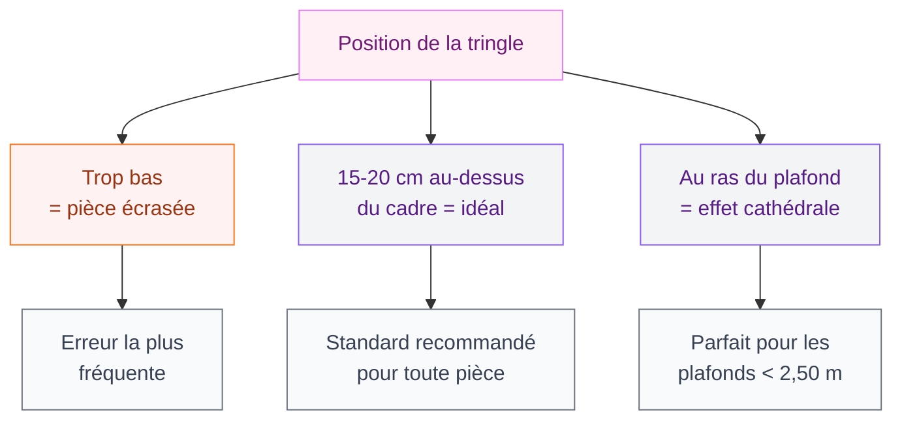
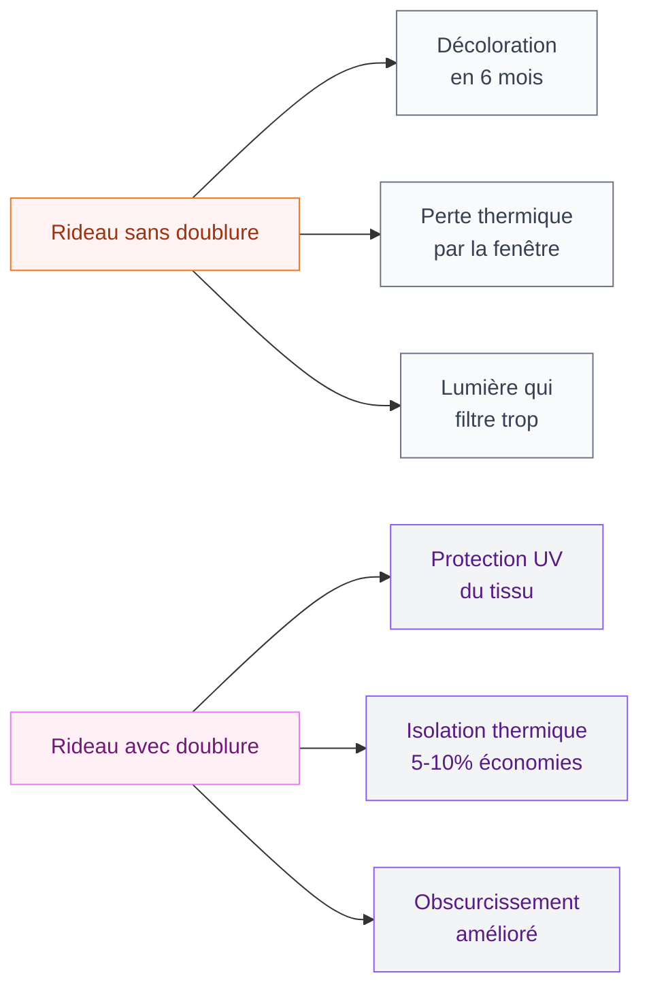
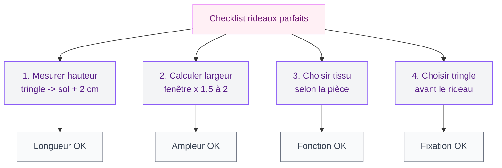

On peut avoir le plus beau canapé du monde, les murs parfaitement peints, un parquet impeccable - et tout gâcher avec des rideaux mal choisis. Si si, c'est possible. Et c'est même l'une des erreurs les plus fréquentes en déco. Les rideaux, c'est le cadre de ta fenêtre, la touche finale qui lie tout l'ensemble. Mal posés ou mal dimensionnés, ils renvoient instantanément une impression de "pas fini" ou de "quelque chose cloche".

Bonne nouvelle : ces erreurs sont simples à corriger une fois qu'on les connaît. Je te donne les 8 fautes les plus courantes, avec à chaque fois la solution concrète pour rattraper le coup ou éviter le piège.

## Erreur n'1 : des rideaux trop courts qui "flottent" au-dessus du sol

C'est LA faute numéro un. Tu sais, ces rideaux qui s'arrêtent 10 ou 15 cm avant le sol, comme s'ils avaient rétréci au lavage ? Ça donne un effet "pantalon trop court" à toute la pièce. Le regard est immédiatement attiré vers cet espace vide entre le bas du rideau et le sol, et ça casse toute l'élégance.

  

### La bonne longueur

Un rideau doit arriver à 1 cm du sol au minimum. C'est la règle de base. Pour un look plus décontracté et luxueux, tu peux le laisser "casser" légèrement au sol, avec 2 à 3 cm de tissu qui repose par terre. Et si tu veux le look dramatique à la parisienne, laisse 10 à 15 cm traîner au sol - mais attention, ça demande un entretien régulier.

> [!TIP]
> Mesure toujours depuis la tringle (pas depuis le haut de la fenêtre) jusqu'au sol, puis ajoute 2 cm. Si tu hésites entre deux tailles en prêt-à-poser, prends la plus longue - on peut raccourcir avec un ourlet, mais rallonger c'est beaucoup plus compliqué.

Pour les rideaux prêt-à-porter, Ikea propose des longueurs standard de 250 cm (série DYTAG à partir de 29,99 euros) et La Redoute a des modèles jusqu'à 300 cm (gamme Onega, 45-80 euros la paire). Si ta hauteur sous plafond dépasse 270 cm, le sur-mesure devient presque obligatoire - Leroy Merlin propose un service de confection à partir de 15 euros le mètre linéaire, tissu non compris.

## Erreur n'2 : la tringle posée trop bas

C'est l'erreur sournoise qui va de pair avec la précédente. Tu accroches ta tringle juste au-dessus du cadre de la fenêtre, et hop - ta pièce paraît plus basse qu'elle ne l'est. Le plafond semble s'écraser sur toi.

  

### La bonne hauteur

La règle d'or : pose ta tringle 15 à 20 cm au-dessus du cadre de la fenêtre, ou encore mieux, le plus près possible du plafond. Ça crée une illusion de hauteur qui transforme complètement la pièce. Dans un appartement avec des plafonds standards de 2,50 m, cette simple astuce peut donner l'impression de gagner 20 cm de hauteur visuelle.

Et pour la largeur, la tringle doit dépasser de 15 à 20 cm de chaque côté de la fenêtre. Ça permet aux rideaux ouverts de ne pas bloquer la lumière et donne l'impression que la fenêtre est plus large.

## Erreur n'3 : des rideaux trop étroits (pas assez d'ampleur)

Tu as acheté une paire de rideaux de 140 cm de large pour une fenêtre de 120 cm ? Mauvaise pioche. Le tissu va être tout plat, tendu, sans aucun mouvement. On dirait un drap suspendu. Pas exactement l'effet cocooning recherché.

  

### Le bon calcul

Pour un plissé joli et naturel, il faut entre 1,5 et 2 fois la largeur de ta fenêtre en tissu. Une fenêtre de 120 cm demande donc entre 180 et 240 cm de tissu au total (soit 90 à 120 cm par panneau). Pour un effet vraiment généreux avec un tissu léger comme le voile ou le lin, tu peux monter à 2,5 fois.

> [!WARNING]
> Attention aux dimensions affichées sur les emballages : la largeur indiquée est souvent celle d'un seul panneau. Si ton paquet dit "140 x 260 cm", c'est 140 cm pour un rideau. Pour une fenêtre standard de 120 cm, tu as besoin de deux panneaux - ce qui te donne 280 cm de tissu au total. C'est parfait.

## Erreur n'4 : choisir le mauvais tissu pour la mauvaise pièce

Un rideau en velours épais dans une cuisine ouverte ? Un voilage transparent dans une chambre plein sud ? Chaque pièce a ses contraintes, et le tissu doit suivre.

  

### Quel tissu pour quelle pièce

**Salon** : le lin (39-89 euros le mètre chez Ikea à Maison du Monde), le coton épais ou le velours pour les ambiances cocooning. Le lin a ce tombé naturel un peu froissé qui fonctionne dans tous les styles - du scandinave au [shabby chic](/decoration-shabby-chic-idees-et-photos-de-style-et-de-decoration/).

**Chambre** : privilégie un tissu occultant ou un doublage occultant. Ikea propose la série MAJGULL (dès 29,99 euros) qui bloque 99% de la lumière. Pour du plus haut de gamme, les rideaux occultants AM.PM sur La Redoute sont autour de 60-120 euros le panneau et ont un tombé vraiment classe.

**Cuisine** : opte pour des tissus lavables en machine et qui ne retiennent pas les odeurs. Le polyester ou un mélange coton-polyester fonctionnent bien. Évite le lin brut qui absorbe tout et le velours qui capture la graisse. Un store enrouleur (à partir de 15 euros chez Castorama) est souvent plus pratique qu'un rideau dans cette pièce.

**Salle de bain** : si tu as une fenêtre, un store d'intérieur en PVC ou un voilage synthétique résistant à l'humidité feront l'affaire. Les rideaux en tissu naturel vont moisir, c'est garanti.

## Erreur n'5 : la couleur ou le motif qui jure avec le reste

Tu as flashé sur ce rideau à motifs tropicaux en promo, mais ton salon est déjà plein de couleurs et de motifs sur les coussins, le tapis, les cadres... Résultat : une cacophonie visuelle. L'oeil ne sait plus où se poser.

  

### La règle simple

Si ta pièce est déjà chargée en motifs (coussin, tapis, papier peint d'accent), choisis des rideaux unis. Et inversement : si ton intérieur est plutôt sobre et monochrome, les rideaux peuvent être le point d'intérêt avec un joli motif.

Pour la couleur, deux approches fonctionnent :

1. **Ton sur ton** : le rideau reprend une couleur déjà présente dans la pièce (un coussin, le tapis, un objet déco). Ça unifie l'ensemble sans risque.
2. **Contraste maîtrisé** : le rideau introduit une couleur complémentaire. Par exemple, un rideau vert sauge dans un salon aux tons chauds (beige, bois, terracotta). Si les palettes couleurs te passionnent, je te conseille notre guide sur les [couleurs du salon 2026](/couleurs-du-salon-2026-palettes-de-murs-et-de-decors/) - il y a plein d'idées de combinaisons.

> [!NOTE]
> En cas de doute, les tons neutres sont toujours un choix sûr : blanc cassé, beige, gris perle, taupe. Ils fonctionnent dans 95% des intérieurs et tu peux les accessoiriser avec des embrasses colorées si tu veux un peu de peps.

## Erreur n'6 : négliger la doublure

C'est l'erreur invisible. Tes rideaux sont beaux, bien posés, bonne longueur... mais sans doublure, le tissu se décolore au soleil en quelques mois, laisse passer trop de lumière, et n'isole ni du froid ni de la chaleur.

### Pourquoi la doublure change tout

Une doublure protège le tissu côté fenêtre des UV (un rideau en lin non doublé va jaunir en 6 mois côté soleil). Elle améliore aussi l'isolation thermique - selon l'ADEME, des rideaux doublés peuvent réduire les déperditions de chaleur par les fenêtres de 5 à 10%. En plein hiver, ça se sent sur la facture de chauffage.

Tu as deux options : acheter des rideaux déjà doublés (regarde la composition sur l'étiquette - la doublure est souvent en polyester blanc), ou ajouter une doublure toi-même. Ikea vend des panneaux de doublure thermique (gamme GLANSNAVA, environ 12 euros le panneau) qui se fixent sur la tringle derrière le rideau existant. Malin et pas cher.

## Erreur n'7 : ignorer le type de tringle et de fixation

Tu as acheté des rideaux à oeillets pour les mettre sur une tringle rail ? Ou des rideaux à ruban fronceur sur une tringle décorative ? La fixation et la tringle doivent être cohérentes, sinon le rideau ne tombe pas bien, il coulisse mal, et tu auras un résultat bancal.

### Le bon duo tringle + rideau

**Tringle décorative ronde** : elle va avec les rideaux à oeillets, à pattes ou à pinces. C'est le style le plus courant dans les salons et les chambres. Les tringles extensibles Ikea (gamme RACKA, 5-15 euros) sont un bon rapport qualité-prix pour démarrer. Pour quelque chose de plus design, les tringles en laiton brossé Maisons du Monde commencent à 35 euros.

**Rail à glissières** : il va avec les rideaux à ruban fronceur (avec crochets). C'est le système le plus discret car le rail peut se fixer au plafond. Résultat : les rideaux ont l'air de tomber directement du plafond, c'est très élégant. Les rails Kvartal chez Ikea (14,99 euros le rail) ou les systèmes Leroy Merlin (à partir de 20 euros) sont fiables.

**Câble tendu** : idéal pour les petits espaces, les niches ou les fenêtres étroites. Les rideaux légers (voilage, coton fin) s'y prêtent bien, mais oublie le velours - le câble va ployer sous le poids.

> [!IMPORTANT]
> Avant d'acheter tes rideaux, choisis ta tringle. Pas l'inverse. Le type de tringle détermine le système d'accroche de ton rideau. Et vérifie la charge maximale indiquée - un rideau en velours occultant est beaucoup plus lourd qu'un voilage. Certains supports d'entrée de gamme ne supportent pas plus de 3 kg par panneau.

## Erreur n'8 : ne pas repasser ou défroisser avant la pose

Tu viens de déballer tes rideaux neufs, tu les accroches direct et... les plis de l'emballage sont visibles. Ça donne un air froissé, négligé, même si le rideau est de bonne qualité. Cette erreur est la plus facile à éviter et pourtant la plus souvent commise.

### La solution selon le tissu

**Coton et polyester** : un coup de fer à repasser à température moyenne, en commençant par l'envers. Un défroisseur vapeur vertical (à partir de 30 euros chez Darty) est encore plus pratique car tu peux défroisser le rideau directement sur la tringle.

**Lin** : le lin se froisse naturellement et c'est son charme. Mais les gros plis de l'emballage, ce n'est pas pareil. Un léger passage vapeur suffit. Ne cherche pas à le rendre parfaitement lisse - un lin trop repassé perd tout son caractère.

**Velours** : jamais de fer à repasser directement sur le velours ! Utilise un défroisseur vapeur ou suspends le rideau dans la salle de bain pendant une douche chaude. La vapeur va détendre les fibres en douceur.

## Le checklist avant d'acheter tes rideaux

Pour ne plus jamais te tromper, voilà les questions à te poser avant de sortir la carte bleue :

1. **Quelle hauteur ?** Mesure depuis la tringle (ou depuis l'endroit où tu vas la poser) jusqu'au sol. Ajoute 2 cm.
2. **Quelle largeur ?** Mesure la largeur de la fenêtre et multiplie par 1,5 à 2. Divise par le nombre de panneaux.
3. **Quel tissu ?** Adapte-le à la pièce et à l'orientation de la fenêtre.
4. **Quel système de fixation ?** Choisis la tringle d'abord, les rideaux ensuite.
5. **Quelle couleur ?** Regarde ce qui existe déjà dans la pièce. Unis si motifs partout, motifs si déco sobre.
6. **La doublure ?** Oui, sauf pour un simple voilage décoratif.

Si tu veux aller plus loin dans l'habillage de tes murs et de tes fenêtres, jette un oeil à notre article sur [comment bien accrocher un tableau mural](/bien-accrocher-tableau-mural/) - parce que l'équilibre entre les rideaux et les cadres, ça compte aussi.

## Sur le meme theme

- [salons modernes 2026](/salons-modernes-tendances-2026/)

## FAQ

### À quelle hauteur poser sa tringle à rideaux ?

Idéalement entre 15 et 20 cm au-dessus du cadre de la fenêtre, ou au plus près du plafond. Plus la tringle est haute, plus la pièce paraît grande. Dans un appartement standard avec des plafonds de 2,50 m, vise 10 cm sous le plafond pour un effet maximum.

### Quelle largeur de rideau choisir pour une fenêtre de 120 cm ?

Il te faut entre 180 et 240 cm de tissu au total (soit 1,5 à 2 fois la largeur de la fenêtre). Si tu achètes deux panneaux, chaque panneau doit faire au moins 90 cm de large. Pour un tissu léger comme le voile, monte à 2,5 fois, soit 300 cm au total.

### Comment empêcher ses rideaux de se décolorer au soleil ?

La doublure est ta meilleure alliée. Un rideau doublé avec une couche de protection anti-UV en polyester blanc va résister beaucoup plus longtemps. Tu peux aussi ajouter un film UV sur la fenêtre (à partir de 8 euros le mètre chez Leroy Merlin) ou choisir des tissus teints dans la masse plutôt qu'imprimés en surface.

Et si tu cherches d'autres idées pour transformer ton intérieur, notre guide sur la [décoration minimaliste](/decoration-minimaliste-idees-et-photos-faciles/) montre bien comment des rideaux simples et bien choisis peuvent sublimer un espace épuré.
