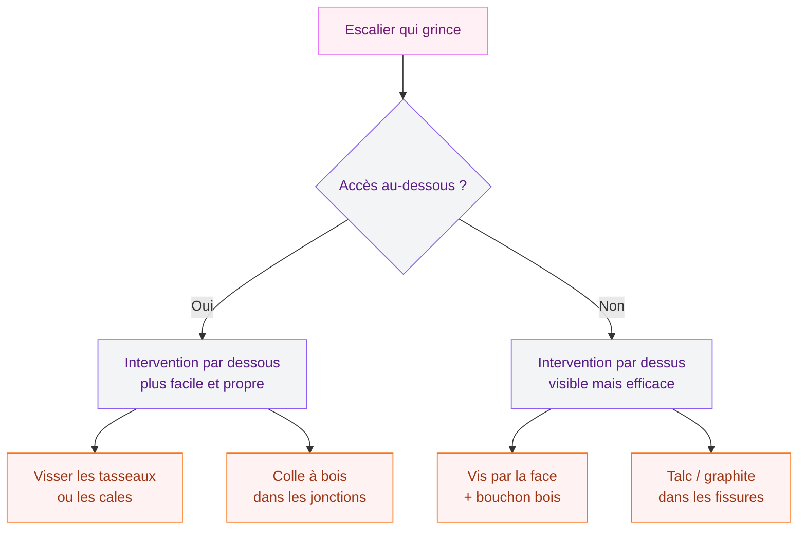
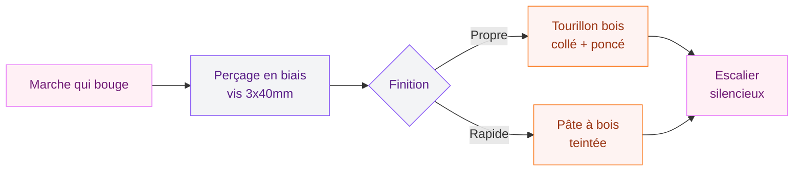

Tu connais ce son ? Ce petit craquement aigu à 7h du matin quand tu descends chercher ton café, ou ce grincement qui réveille tout le monde quand tu rentres tard. Un escalier bruyant, c'est une source de stress quotidien, surtout dans les maisons où les chambres donnent directement sur la cage d'escalier. La bonne nouvelle : dans la grande majorité des cas, tu peux régler ça toi-même, sans appeler un artisan et sans te ruiner.

Je vais te guider pas à pas pour identifier l'origine du problème et choisir la solution qui colle à ton escalier. On commence par les gestes les plus simples, et on monte en difficulté seulement si c'est nécessaire.

## Pourquoi un escalier se met à grincer ?

Avant de sortir la perceuse ou le pot de colle, il faut comprendre ce qui se passe. Un escalier craque quand deux pièces de bois bougent l'une contre l'autre. Avec le temps, le bois travaille - il se dilate en été, se rétracte en hiver - et les assemblages se desserrent.

  

Les coupables les plus fréquents :

- **Les marches** : la planche horizontale sur laquelle tu poses le pied
- **Les contremarches** : les planches verticales entre deux marches
- **Les limons** : les grandes pièces latérales qui supportent tout
- **Les tasseaux et cales** : les petites pièces qui maintiennent l'ensemble

Le bruit vient souvent du frottement entre la marche et la contremarche, ou entre la marche et le limon. Quand l'assemblage bouge de 1 ou 2 millimètres, ça suffit à produire un son bien désagréable.

> [!NOTE]
> Les escaliers métalliques ont un tout autre comportement acoustique. L'acier et l'aluminium propagent le son plutôt qu'ils ne l'absorbent - c'est leur nature physique. Pour ce type d'escalier, les solutions sont différentes et souvent plus complexes.

## Localiser précisément le problème

La première étape, c'est le diagnostic. Monte et descends ton escalier lentement, en appuyant sur chaque marche à différents endroits : au milieu, vers le côté gauche, vers le côté droit. Note exactement quelle(s) marche(s) grince(nt) et à quel endroit.

  

Ensuite, regarde sous l'escalier si tu y as accès. C'est souvent là que tout se passe : tu peux voir si des cales sont tombées, si des vis ont lâché, si du bois est fendu.

## Les solutions rapides (5 minutes chrono)

  

### Le talc, le graphite ou le savon sec

C'est la solution de dépannage par excellence. L'idée : glisser un lubrifiant en poudre dans les interstices entre les pièces de bois pour réduire le frottement.

- **Talc** (marque Gifrer, 3-4€ en pharmacie) : saupoudre entre la marche et la contremarche, puis piétine la marche pour faire pénétrer la poudre
- **Graphite en poudre** (marques Loctite ou Wurth, 6-8€) : plus efficace et plus durable que le talc
- **Savon sec ou savon de Marseille** : frotte les bords des marches au savon, c'est gratuit si tu en as déjà

Ce type de traitement dure quelques semaines à quelques mois selon l'humidité et l'usage. C'est une solution temporaire, mais parfois ça suffit.

> [!TIP]
> Avant d'appliquer le talc, passe l'aspirateur dans les fissures. Plus les espaces sont propres, mieux le lubrifiant pénètre et plus ça tient longtemps.

### L'huile de lin

Applique de l'huile de lin pure (Liberon, environ 12€ pour 500ml en GSB) sur les bords des marches avec un pinceau fin. L'huile pénètre dans le bois, le nourrit et réduit le mouvement. Résultat en 24-48h, après séchage complet.

## La solution intermédiaire : la colle à bois

Si le talc n'a pas suffi, c'est que les pièces bougent trop. La colle à bois va fixer les assemblages.

  

**Ce dont tu as besoin :**
- Colle à bois Titebond III ou D3 Sader (7-12€ selon le format)
- Une seringue à colle ou un pistolet à embout fin
- De l'essuie-tout

**La méthode :**

1. Injecte la colle dans les fissures et les jonctions, là où tu as entendu le bruit
2. Appuie sur la marche plusieurs fois pour faire travailler la colle dans les interstices
3. Essuie le surplus
4. Laisse sécher 12 à 24h sans marcher sur la marche (si possible)
5. Répète pour chaque marche problématique

> [!WARNING]
> La colle à bois est difficile à enlever une fois sèche. Évite d'en mettre sur les parties visibles de ton escalier. En cas de tache, lave immédiatement avec un chiffon humide.

## La solution durable : visser les marches

C'est la méthode la plus efficace à long terme. Une vis bien placée empêche physiquement la marche de bouger.

  

### Par dessous (si accessible)

Si tu peux accéder au-dessous de ton escalier, c'est la méthode idéale : elle ne laisse aucune trace visible.

**Le principe :** visser des tasseaux triangulaires en bois dans les angles entre la marche et la contremarche, ou renforcer les tasseaux existants qui ont lâché.

1. Repère les jonctions qui bougent
2. Applique de la colle à bois sur les deux faces du tasseau
3. Colle et visse le tasseau dans l'angle (vis 3x30mm, perceuse/tournevis)
4. Laisse sécher avant d'utiliser l'escalier

### Par dessus (escalier sans accès au-dessous)

Tu vas visser directement à travers la marche, ce qui laissera des traces. Deux options pour les dissimuler.

**Option 1 - Bouchons en bois :**

1. Pré-perce un trou en biais (45°) depuis le dessus de la marche vers la contremarche
2. Visse une vis à bois de 3x40mm
3. Coupe un tourillon bois de la même essence
4. Colle-le dans le trou, laisse dépasser légèrement, ponce à ras
5. Teinte si besoin

**Option 2 - Pâte à bois :**

Même principe, mais tu bouches le trou avec de la pâte à bois Liberon (5-8€) teintée à la couleur de ton escalier.

> [!IMPORTANT]
> Si tu veux visser dans les limons (les pièces latérales), utilise des vis avec rondelles pour ne pas fendre le bois. Un limon fendu, c'est un problème structurel autrement plus sérieux qu'un grincement.

## Cas particulier : les marches creuses ou qui rebondissent

Parfois, le problème n'est pas une jonction qui grince mais une marche qui fléchit sous le poids. Le bois est peut-être trop mince, ou la marche n'est plus bien supportée en son milieu.

La solution : ajouter un tasseau support en dessous de la marche (si accessible) ou coller une baguette d'angle en bois sous le nez de marche pour rigidifier.

Si tu travailles sur ton escalier, c'est aussi le bon moment pour penser à l'isolation thermique de la montée d'escalier. Un escalier bien isolé phoniquement et thermiquement, ça change vraiment le confort au quotidien - et tu trouveras des conseils détaillés dans notre guide sur [comment isoler une montée d'escalier](/comment-isoler-une-montee-descalier/).

## Entretenir son escalier pour éviter que ça revienne

Une fois que tu as réglé le problème, quelques gestes simples permettent de garder un escalier silencieux plus longtemps.

**L'humidité est ton ennemi numéro un.** Un escalier en bois dans une maison avec de grandes variations hygrométriques travaillera beaucoup plus qu'un escalier dans un intérieur stable. Si tu as un chauffage très sec en hiver, un humidificateur d'air dans le couloir aide à stabiliser le bois.

**L'entretien régulier du bois** compte aussi. Une fois par an, applique une huile ou une cire sur les marches pour nourrir le bois et maintenir sa souplesse. Le bois sec craque plus que le bois bien entretenu. La marque Blanchon propose des huiles dures vitrifiantes à environ 30€ le litre, adaptées aux escaliers à fort passage.

**Vérifie les vis et tasseaux** chaque automne, avant la saison de chauffe. Un léger resserrement préventif vaut mieux qu'une réparation en urgence à minuit.

Si tu refais aussi d'autres surfaces en même temps, pense à la cohérence des matériaux. Un sol en lino récemment peint peut être traité avec des produits similaires à ceux pour l'escalier. Notre guide sur [peindre le lino](/peindre-lino/) donne de bonnes bases sur la préparation des surfaces bois et vinyle.

## Et si ton parquet aussi grince ?

La même logique s'applique au parquet. Si tu as ce problème ailleurs dans la maison, sache que les techniques sont proches : talc, colle à bois dans les interstices, vissage discret. Notre article sur [les taches sur parquet](/parquet-tache/) traite aussi des problèmes courants du parquet en bois massif.

## Les solutions pros pour les grincements persistants

Quand tout le reste a échoué, ou quand l'escalier est vraiment en mauvais état, il reste deux options professionnelles.

### Le remplacement des marches

Si une marche est fendue, pourrie ou trop fine, le remplacement s'impose. Une marche en hêtre ou en chêne de 22mm d'épaisseur coûte entre 20 et 60€ selon l'essence et la longueur. La main-d'oeuvre d'un menuisier pour remplacer 3-4 marches tourne autour de 200-400€.

### Les systèmes de marches acoustiques

Pour les escaliers métalliques ou les rénovations complètes, il existe des solutions spécialisées comme la marche Nanoacoustic® d'Escaliers Décors. Ces marches en acier intègrent des matériaux absorbants qui coupent la résonance propre au métal. C'est coûteux mais ça règle le problème à la source.

Pour les escaliers en bois dans un immeuble (cage d'escalier commune), l'isolation acoustique passe par des matériaux mis en place sous les marches et contre les murs. C'est un chantier de copropriété, avec des produits comme ceux d'Isolgomma qui associent plusieurs couches d'absorption.

## Budget récapitulatif

| Solution | Matériaux | Durabilité | Difficulté |
|----------|-----------|------------|------------|
| Talc/graphite | 3-8€ | Quelques mois | Très facile |
| Colle à bois | 7-12€ | 2-5 ans | Facile |
| Vissage + bouchons | 15-25€ | 10+ ans | Moyen |
| Remplacement marche | 20-60€ + pose | Définitif | Professionnel |

> [!TIP]
> Commence toujours par la solution la moins invasive. Le talc d'abord, la colle ensuite, les vis en dernier recours. Chaque étape te donne de l'information sur la gravité du problème et peut suffire à le régler.

## Sur le meme theme

- [tableau planning et pense-bête](/choisir-tableau-planning-pense-bete/)

## Ce que je ferais dans ma situation

Si c'est juste 1 ou 2 marches qui grincent, je commence par le graphite en poudre Loctite (6€). Si ça revient dans le mois, je passe à la colle Titebond avec une seringue. Si le grincement persiste après la colle, je visse par dessous avec des tasseaux si j'ai accès, ou par dessus avec des vis et tourillons sinon.

Pour un escalier entier qui grince sur 5 marches ou plus, je visse directement. Le temps passé à tâtonner avec les solutions temporaires n'en vaut pas la peine.

Et si tu veux aller plus loin dans la rénovation de ta maison, notre guide sur [crépir un mur intérieur](/crepir-un-mur-interieur/) aborde un autre chantier que beaucoup hésitent à se lancer seuls - et qui est pourtant très accessible.

Un escalier silencieux, c'est une maison plus sereine. Et ça, ça n'a pas de prix - enfin si, entre 6 et 25€ dans la grande majorité des cas.
