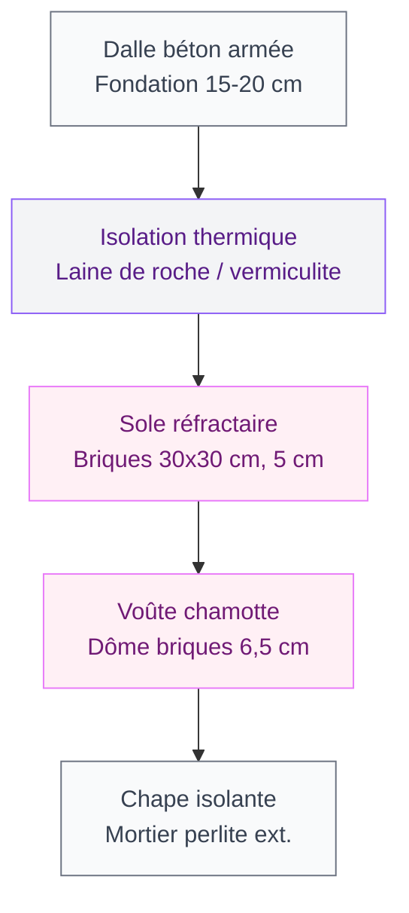
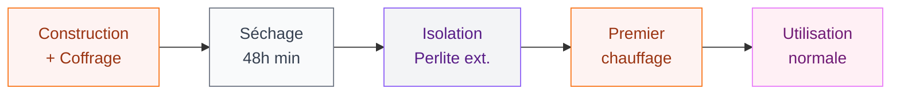
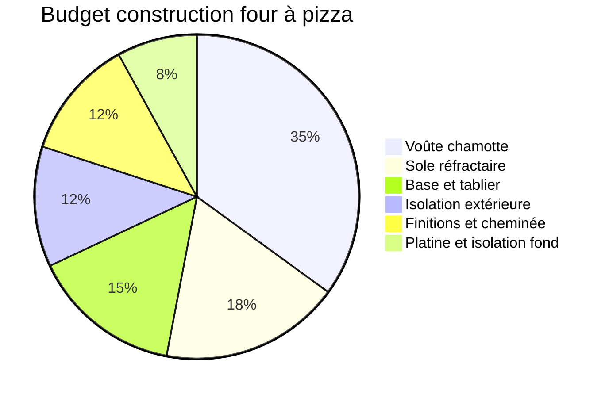

Construire un four à pizza dans son jardin, c'est le genre de projet qui change une terrasse. Pas besoin d'être maçon professionnel pour y arriver - avec les bons matériaux, un week-end et un peu de patience, tu peux te retrouver à cuire ta première pizza napolitaine à 450°C dans ton propre four maison. Dans cet article je te guide étape par étape, avec les prix réels et les marques que j'ai utilisées ou testées.

## Ce dont tu as besoin avant de commencer

  

### Les matériaux clés

Un four à pizza maison repose sur deux matériaux différents selon la zone :

**Les briques réfractaires** (ou briques chamotte) encaissent les hautes températures sans se fissurer. Pour la sole (le sol du four) et la voûte, c'est la base. Compte environ 60 à 80 briques de format 23 x 11,4 x 6,5 cm pour un four de taille familiale (diamètre intérieur 80 cm). Chez Hornbach tu trouves des briques réfractaires à 2,20 € pièce, soit 130-180 € pour la sole et la voûte.

**Le mortier réfractaire** pour coller ces briques : prendre un mortier spécial haute température (400°C minimum, idéalement 1200°C). La marque Weber Thermix ou le mortier chamotte de Pisé-Refractaire s'en sortent bien. Budget : 20-35 € pour un seau de 5 kg.

Pour la base et le tablier extérieur, des **parpaings standard** (environ 0,90 € pièce chez Leroy Merlin) font très bien l'affaire.

**Budget total estimé : 350 à 600 €** selon la taille et les finitions. Un four cuit mieux, dure plus longtemps et se personnalise exactement comme tu veux - c'est difficile à obtenir avec un kit du commerce à 900 €.

> [!NOTE]
> La différence entre four à pizza et four à pain ? La hauteur de la voûte. Un four à pizza a une voûte basse (rapport hauteur/diamètre autour de 0,63) pour concentrer la chaleur et cuire en 90 secondes. Un four à pain a une voûte plus haute pour un chauffage plus uniforme sur la durée.

### Les outils à prévoir

- Niveau à bulle et cordeau
- Meuleuse avec disque diamant (pour couper les briques)
- Truelle et taloche
- Seau et perceuse-malaxeur pour le mortier
- Pelle de maçon
- Un compas et craie pour tracer le cercle de la sole

## Etape 1 : la base et le tablier

La base doit être solide, stable et à la bonne hauteur. 80-90 cm de hauteur de travail est confortable pour enfourner sans te casser le dos.

  

Commence par **une dalle béton de fondation** de 15-20 cm d'épaisseur, armée, sur sol stabilisé. Elle doit dépasser le tablier d'au moins 20 cm tout autour pour l'isolation. Laisse sécher 48h minimum.

Monte ensuite le tablier en parpaings creux 20 x 20 x 50 cm, montés avec du mortier bâtiment classique. Prévois une **case de stockage** pour le bois à l'avant : c'est pratique et ça fait beau. Tu peux t'inspirer des mêmes techniques que pour [poser une bordure de jardin sans béton](/guides/exterieur/poser-bordure-jardin-sans-beton/) pour les finitions extérieures - la gestion des niveaux et des joints est similaire.

Une fois le tablier monté, coule une dalle de béton réfractaire de 10 cm pour la platine (le plancher sur lequel reposera la sole). Ou utilise des dalles béton standard 5 cm + une couche de sable réfractaire tassé.

> [!TIP]
> Avant de poser la sole, place une couche de laine de roche (ou vermiculite, 2-3 cm) entre la platine béton et les briques réfractaires. C'est elle qui empêche la chaleur de s'échapper vers le bas et qui améliore vraiment le résultat de cuisson.

## Etape 2 : la sole

La sole, c'est le fond du four où posent directement les pizzas. Elle doit être parfaitement plane et aussi homogène que possible (peu de joints) pour que la pelle glisse bien.

  

**Utilise des briques réfractaires 30 x 30 cm** de 5 cm d'épaisseur (Terres Cuites de Raujolles propose ce format, comptez 8-10 € pièce). Dispose-les à sec d'abord pour optimiser le calepinage et minimiser les joints.

Une fois satisfait du résultat, trace au cordeau le cercle de ta sole (80 cm de diamètre intérieur = bonne taille pour 2 à 3 pizzas de suite). Pose les briques avec un lit de sable réfractaire légèrement humidifié - pas de mortier pour la sole, ça permet de les remplacer si besoin. Tasse, vérifie la planéité, tasse encore.

## Etape 3 : la voûte en briques chamotte

C'est la partie la plus technique - et la plus gratifiante. La voûte en dôme concentre la chaleur par rayonnement, ce qui fait toute la différence avec un four ordinaire.

  

### Construire le coffrage

Trace un gabarit en contreplaqué de la section de ton dôme : un demi-cercle dont le rayon est la moitié du diamètre intérieur (40 cm pour un four 80 cm). Découpe deux morceaux identiques et relies-les par des planches pour former un coffrage en bois sur lequel tu vas appuyer les briques pendant la construction.

Alterne des lignes droites et des cales biseautées (briques taillées à la meuleuse) pour monter le dôme en spirale ou en rangs successifs. Chaque brique est posée avec du mortier réfractaire Weber Thermix sur les deux faces de joint.

### L'ouverture de la porte

L'ouverture de la porte se situe à l'avant du dôme. Sa hauteur doit représenter environ 63% de la hauteur intérieure de la voûte - c'est le "ratio Napolitain" qui optimise le tirage et la rétention de chaleur. Pour un dôme intérieur de 40 cm, prévois une ouverture de 25 cm de haut et 38 cm de large.

Flanque l'ouverture de deux plaquettes chamotte (200 x 50 mm) posées au mortier. Pour le linteau (dessus de porte), un profilé aluminium coupé à 450 mm fait l'affaire - il ne sera pas directement en contact avec les flammes.

> [!WARNING]
> Ne retire le coffrage qu'après 48h de séchage minimum et toujours par petits morceaux progressifs. Un dôme retiré trop vite peut s'effondrer sur lui-même. Laisse le mortier prendre complètement avant toute contrainte.

### La cheminée

La cheminée se place juste derrière l'ouverture de la porte (côté extérieur), pas au sommet du dôme. Ce positionnement force les fumées à balayer la voûte avant de sortir, ce qui améliore la diffusion de chaleur. Un tube inox 150 mm de diamètre, 30-40 cm de haut, suffit. Le raccord se fait au mortier réfractaire.

## Etape 4 : l'isolation extérieure

Une fois la voûte terminée et sèche, applique une couche d'isolation extérieure de 10-15 cm. Mélange du mortier avec de la **perlite** (granulés minéraux ultra-légers, 15 € le sac de 100L chez Jardiland) dans un ratio 1:3 (1 mortier pour 3 perlite). Cette couche réduit les pertes de chaleur et te permet de moins alimenter en bois.

  

Applique-la en deux passes de 6-7 cm chacune, laisse sécher 24h entre les couches. Une fois sec, tu peux finir avec un crépi coloré - ça donne un rendu soigné et protège de l'humidité. Si tu veux en savoir plus sur les techniques de finition murale, l'article sur [crépir un mur intérieur](/guides/decoration/crepir-un-mur-interieur/) donne de bons repères sur la gestion des couches et des temps de séchage.

## Etape 5 : la première chauffe

C'est une étape à ne pas bâcler. Les briques réfractaires neuves contiennent de l'humidité résiduelle. Si tu montes en température trop vite, cette humidité se transforme en vapeur et peut fissurer le mortier, voire faire éclater les briques.

**Protocole de première chauffe :**

1. Jour 1 : petite flambée de 30 minutes avec du bois léger (brindilles, bûchettes). Temperature max 100°C. Laisse refroidir complètement.
2. Jour 2 : flambée de 1h, température 200-250°C. Laisse refroidir.
3. Jour 3 : flambée de 1h30, température 300-350°C. Laisse refroidir.
4. Jour 4 : première utilisation normale, montée progressive jusqu'à 400-450°C.

Sur les premières chauffe, quelques microfissures dans le mortier sont tout à fait normales - c'est le mortier réfractaire qui "travaille". Si les fissures font plus de 2-3 mm, rebouche avec du mortier réfractaire en tube (Weber Thermix Réparation, environ 8 €).

## Comment cuire une vraie pizza napolitaine

Ton four atteint sa température idéale quand tu vois les briques de la voûte devenir blanches (plus noires de suie). À ce stade tu es autour de 400-450°C.

Pousse les braises sur le côté (jamais directement sous la pizza), attends 5 minutes que la sole se stabilise. Enfourne ta pizza avec une pelle en acier ou en bois (pizza peel), tourne-la après 45 secondes. Compte 90 secondes à 2 minutes de cuisson en tout.

> [!TIP]
> Le bois de chêne et de charme sont les meilleurs pour un four à pizza : ils brûlent longtemps, chauds, avec peu de fumée. Évite les résineux (pin, sapin) qui dégagent de la créosote et peuvent donner un goût fumé désagréable à la pâte.

## Budget récapitulatif

| Poste | Matériaux | Prix indicatif |
|---|---|---|
| Base + tablier | Parpaings 20x20x50 x 50 | 45-60 € |
| Platine + isolation | Dalle béton + laine roche | 30-50 € |
| Sole | Briques réfractaires 30x30 x 8 | 70-90 € |
| Voûte | Briques chamotte x 60 + mortier | 160-200 € |
| Isolation ext. | Perlite + mortier | 25-40 € |
| Finitions + cheminée | Crépi + tube inox | 30-50 € |
| **Total** | | **360-490 €** |

Les variations de prix viennent surtout de la taille du four et des finitions extérieures. Pour le côté déco du tablier, tu peux t'inspirer de l'article sur les [pneus recyclés pour la décoration](/guides/decoration/pneus-recycles-pour-la-decoration/) - la même logique de récup et de matières texturées peut donner un look original au bas du four. Et si tu hésites encore sur la couleur de ton crépi extérieur, jette un oeil à notre guide sur les [couleurs pour les extérieurs et facades en 2026](/guides/exterieur/couleurs-pour-les-exterieurs-et-les-facades-de-maisons-2026/).

## Sur le meme theme

- [table basse diy](/guides/decoration/creez-votre-table-basse-au-design-original-avec-ces-astuces-diy/)

## FAQ

**Combien de temps dure un four à pizza maison ?**
Un four bien construit avec des briques réfractaires de qualité dure 20 à 30 ans, parfois plus. La maintenance se limite à reboucher quelques fissures au mortier réfractaire tous les 5-10 ans.

**Faut-il un permis de construire pour un four à pizza dans le jardin ?**
En France, les constructions de moins de 5 m2 et de moins de 12 m de hauteur sont exonérées de permis. Un four de jardin entre dans cette catégorie. Vérifie quand même auprès de ta mairie si tu es en zone protégée ou lotissement avec règlement particulier.

**Peut-on utiliser des briques normales à la place des briques réfractaires ?**
Non, les briques normales n'encaissent pas les chocs thermiques répétés et se fissurent rapidement. Les briques réfractaires (chamotte) sont faites pour ça - l'économie de 50-60 € n'en vaut pas la peine.

**Combien de temps pour chauffer le four à bonne température ?**
Entre 1h et 1h30 de feu actif avec du bon bois de chêne ou charme. La sole (plus épaisse) demande plus de temps que la voûte. Un thermomètre laser (15-20 € chez Amazon, marque Etekcity) est utile pour mesurer la température de la sole sans contact.

**Quelle taille de four choisir pour une famille ?**
Un diamètre intérieur de 80 cm permet de cuire 2 à 3 pizzas en séquence confortable. Pour des grandes tablées ou si tu veux aussi faire du pain, passe à 100-110 cm de diamètre intérieur. Le coût et le temps de chauffe augmentent proportionnellement.
