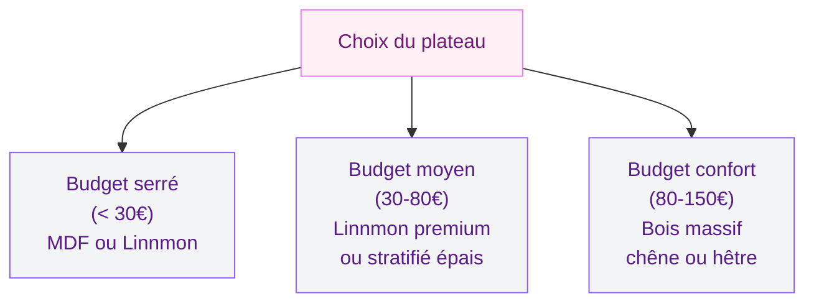
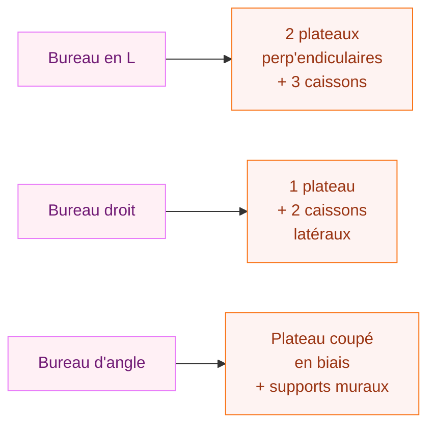

Si tu cherches un bureau fonctionnel, bien rangé et adapté exactement à ton espace, la solution la plus maline reste de le fabriquer toi-même avec des caissons. C'est le projet DIY que j'ai fait dans mon appartement il y a deux ans, et honnêtement, ça m'a changé la vie. Un plateau, deux caissons, quelques vis - et tu obtiens un meuble personnalisé que tu aurais payé trois fois plus cher en magasin.

Dans cet article, je te guide pas à pas, avec les prix réels que j'ai payés et les pièges à éviter.

## Pourquoi choisir des caissons plutôt qu'un bureau classique ?

Un bureau acheté tout fait, ça a ses limites. La largeur ne correspond jamais exactement à ton mur, les tiroirs sont trop petits ou mal placés, et le prix pour quelque chose de qualité monte vite.

  

Avec des caissons comme support, tu contrôles tout : la largeur du plateau, la hauteur de travail, le nombre de tiroirs. Et côté budget, on parle d'un projet entre 80 € et 250 € selon les matériaux choisis, contre 300 € à 800 € pour un bureau de bureau en L chez un fabricant.

L'autre avantage ? Tu peux démonter et reconfigurer si tu déménages ou si tes besoins changent. J'ai déplacé mon bureau trois fois dans le même appartement sans perdre un seul élément.

> [!TIP]
> Si tu rénoves aussi ton sol en ce moment, jette un oeil à l'article sur le [parquet taché](/parquet-tache/) - les deux projets peuvent se combiner pour une pièce complètement relookée.

## Les différents types de caissons à utiliser

Avant de foncer acheter des matériaux, il faut choisir ton type de caissons. Les options ne manquent pas.

  

### Les caissons Kallax d'Ikea (le choix le plus populaire)

Les cubes Kallax sont parfaits pour fabriquer un bureau. Le modèle 1x2 casiers (77 × 42 × 39 cm) coûte environ 30 €. Tu en prends deux, tu poses un plateau dessus, et voilà ton bureau de 150 cm de large.

Avantages : prix imbattable, insert tiroir disponible (10 € l'unité), disponible en blanc, noir, bouleau, noyer. Inconvénient : la profondeur de 42 cm est parfaite pour les jambes mais un peu limitée si tu veux poser deux écrans.

### Les caissons Alex d'Ikea (le bureau professionnel)

Les caissons Alex sont spécialement conçus pour les bureaux. Le modèle à 5 tiroirs coûte environ 70 €. La profondeur est de 48 cm, les tiroirs sont équipés de fermeture en douceur. C'est plus cher mais nettement plus pratique si tu travailles de chez toi.

Pour un bureau de 160 cm avec deux Alex, compte environ 180 € pour les caissons seuls.

### Les caisses en bois récupérées

C'est le choix le plus économique et le plus unique. Les caisses de vin se trouvent dans les recycleries pour 1 à 5 € pièce, parfois gratuitement chez les cavistes. Il faut les poncer, traiter le bois, parfois les renforcer. C'est plus de travail, mais le rendu est magnifique - un bureau qui ressemble vraiment à quelque chose qu'on ne peut pas acheter.

### Les caissons cuisine recyclés

Une cuisine Metod ou Sektion d'occasion sur le Bon Coin, c'est une mine d'or pour ce projet. Des caissons avec roulettes, des tiroirs avec amortisseurs, à 20-40 € l'unité. J'ai récupéré une colonne de 3 caissons pour 35 €, c'est mon meilleur achat DIY de l'année.

> [!NOTE]
> Les caissons cuisine ont souvent une profondeur de 60 cm, idéale pour un grand bureau de travail ou de création. Garde ça en tête si tu utilises souvent plusieurs écrans ou si tu étales beaucoup de documents.

## Le plateau : le choix qui change tout

Le plateau, c'est l'élément visible de ton bureau. Il doit être à la fois solide et esthétique.

  

### Plateau LINNMON Ikea

Le plateau Linnmon (120 cm, 150 cm ou 200 cm de large) coûte entre 15 € et 25 €. Il est léger, facile à poser, disponible en plusieurs couleurs. Sa profondeur de 60 cm est parfaite. Point faible : il n'est pas très épais (5 cm) et peut fléchir légèrement sur une grande longueur sans support central.

### Plateau en bois massif

Un plateau en chêne massif (1,5 m × 60 cm × 2,7 cm d'épaisseur) coûte environ 80-120 € chez Leroy Merlin ou dans une scierie locale. C'est lourd, solide, et clairement plus beau. Si tu veux quelque chose qui dure 20 ans, c'est le bon choix.

### Plateau en MDF ou aggloméré

Pour un budget serré, le MDF mélaminé (120 cm × 60 cm) se trouve à 20-30 € dans les grandes surfaces de bricolage. Il supporte bien les charges et se peint facilement. Moins chic visuellement, mais très fonctionnel.

## Matériel nécessaire et budget total

Voici ce dont tu as besoin pour le projet complet :

**Outils :**
- Perceuse-visseuse (obligatoire)
- Foret à bois 4 mm et 8 mm
- Niveau à bulle
- Mètre ruban
- Cales en bois (ou des magazines épais !)

**Consommables :**
- Vis à bois 5 × 40 mm (une vingtaine, environ 4 €)
- Équerres de fixation si tu veux sécuriser le plateau (6 équerres = 8 € chez Leroy Merlin)
- Patins antidérapants pour les caissons (3 € en GSB)
- Papier abrasif grain 120 et 180 si tu travailles du bois brut
- Huile ou vernis pour le plateau bois (huile dure Rubio Monocoat : 25 € pour 100 ml, suffisant pour un plateau)

**Budget récapitulatif selon scénario :**

- Version économique (2 Kallax + Linnmon 150 cm) : environ 85 €
- Version classique (2 Alex + plateau bois 160 cm) : environ 230 €
- Version récup' (caissons cuisine d'occasion + bois massif) : environ 100-150 €

> [!WARNING]
> Vérifie TOUJOURS la hauteur de ton bureau avant de tout assembler. La hauteur standard est de 72 à 76 cm. Si les caissons font 77 cm de haut et le plateau 3 cm, tu arrives à 80 cm - trop haut pour travailler confortablement. Calcule en amont, ou prévois des pieds réglables sous les caissons.

## La fabrication étape par étape

### Étape 1 : Préparation et traçage

Commence par marquer au sol l'emplacement exact de ton bureau avec du scotch de masquage. Ça parait inutile mais ça évite les mauvaises surprises quand tu déplaces les meubles autour.

Si tes caissons sont en bois brut ou récupérés, c'est maintenant qu'il faut poncer (grain 120 d'abord, puis 180), dépoussiérer soigneusement, et appliquer ton traitement de surface (huile, cire, vernis). Laisse sécher 24 heures.

### Étape 2 : Positionnement des caissons

Pose les deux caissons à leur emplacement final. Vérifie qu'ils sont bien de niveau - un caisson légèrement bancal sur un sol irrégulier va faire fléchir ton plateau. Glisse des cales sous les angles si besoin.

Si tu veux fixer les caissons ensemble (recommandé pour la stabilité), utilise deux équerres métalliques à l'intérieur, vissées dans les parois des caissons face à face.

### Étape 3 : Pose du plateau

C'est la partie la plus simple. Pose le plateau sur les caissons, vérifie qu'il est centré et qu'il dépasse équitablement de chaque côté.

Pour fixer le plateau aux caissons sans le percer par dessus (c'est moche), utilise des équerres invisibles à l'intérieur des caissons. Visse une équerre côté caisson, puis visse dans le dessous du plateau par le dessus de l'équerre. Le plateau reste plat en surface.

Pour un plateau Ikea Linnmon, les plots d'emboitement sont déjà prévus et s'adaptent directement sur les pieds Ikea - mais pas toujours sur d'autres caissons. Dans ce cas, quelques équerres font le travail.

### Étape 4 : Finitions

Une fois tout assemblé, il reste les détails qui font la différence :

- Cache-fils à fixer sous le plateau (câble de bureau, modèle SIGNUM Ikea = 15 €)
- Poignées de tiroirs à changer si tu veux personnaliser (5 à 15 € pièce selon le style)
- Patins feutres sous les caissons pour ne pas rayer ton sol

> [!TIP]
> Si tu peins ton plateau en MDF, applique deux couches d'apprêt avant la peinture. Le MDF absorbe énormément et sans apprêt, ta peinture partira en quelques semaines. Pour une finition impeccable, essaie la [peinture Luxens](/peinture-luxens/) - la gamme meuble est très bien adaptée à ce type de projet.

## Personnalisation et idées de configuration

La grande force de ce type de bureau, c'est qu'on peut le configurer dans tous les sens.

### Version minimaliste

Un seul caisson côté droit, un pied réglable côté gauche, plateau 120 cm. Parfait pour un petit espace ou une chambre. Budget total : 60 €.

### Version bureau à domicile

Deux caissons Alex de chaque côté (4 caissons en tout !), plateau 200 cm, surface de travail XXL. On peut intégrer une tablette coulissante pour le clavier en dessous du plateau. Budget : 350 à 400 €.

### Version créative avec caisses récupérées

Des caisses de vin empilées, fixées entre elles avec des équerres intérieures, un plateau de bois massif. Un petit [relooking du sol en lino](/peindre-lino/) sous le bureau pour unifier l'espace, et tu obtiens un coin de travail qui ressemble à quelque chose qu'on trouverait dans un magazine de déco.

## Les erreurs à ne pas faire

J'en ai fait quelques-unes avant de trouver la bonne méthode.

**Sous-estimer le poids du plateau bois.** Un plateau en chêne de 160 cm pèse facilement 15 à 20 kg. Assure-toi que les caissons sont stables et que les équerres de fixation sont vissées dans le bois solide, pas dans du MDF de finition.

**Négliger la hauteur.** J'ai insisté là-dessus mais c'est la source d'erreur numéro un. Mesure, remesure, calcule. Une hauteur de travail inadaptée, c'est des douleurs dans le dos et les épaules en quelques semaines.

**Choisir un plateau trop fin.** En dessous de 2 cm d'épaisseur pour un plateau de plus de 120 cm, le bois va fléchir sous le poids de ton matériel. Soit tu ajoutes un support central (une troisième paire de pieds ou un caisson), soit tu optes pour un plateau plus épais.

**Oublier les passages de câbles.** Si tu branches un ordinateur, des enceintes, des lampes, les câbles deviennent vite le chaos. Prévois dès le départ un passe-câble dans le plateau (30 mm de diamètre, 4 € en GSB) ou une goulotte sous le bureau.

> [!CAUTION]
> Si tu fixes tes caissons au mur pour plus de stabilité (bonne idée dans une pièce avec des enfants ou si le bureau est dans un couloir), vérifie toujours la nature du mur avant de percer. Sur du placo, utilise des chevilles spéciales placo adaptées à la charge.

## Entretien et durabilité

Un bureau DIY bien construit dure aussi longtemps qu'un bureau acheté, à condition d'y faire un minimum d'entretien.

Pour le bois massif ou les caisses traitées, une petite couche d'huile par an suffit à garder le bois nourri et protégé des taches. Pour les plateaux mélaminés, une simple serpillère légèrement humide fait l'affaire.

Si ton bureau est dans une pièce où le sol peut être un peu pris, pense à protéger les sols sensibles. Un article sur le [traitement des escaliers en bois](/escaliers-silencieux/) donne des bonnes pistes sur la protection du bois en intérieur - les mêmes principes s'appliquent aux pieds de tes caissons.

Les caissons Ikea (Kallax, Alex) ont une structure solide mais les glissières de tiroirs peuvent s'user avec le temps. Des pièces de rechange sont disponibles sur le site d'Ikea ou en GSB à moins de 5 € pièce.

## Sur le meme theme

- [table basse diy](/creez-votre-table-basse-au-design-original-avec-ces-astuces-diy/)

## Questions fréquentes

**Est-ce que je peux mettre des roulettes sous les caissons ?**

Oui, et c'est une très bonne idée si tu veux pouvoir déplacer facilement ton bureau pour nettoyer ou reconfigurer. Les roulettes pivotantes avec frein (modèle 50 kg de charge, 5 cm de diamètre) coûtent environ 2 € pièce chez Leroy Merlin. Attention : elles ajoutent 5-6 cm de hauteur, donc recalcule ton plan avant.

**Mon bureau doit-il être fixé au mur ?**

Ce n'est pas obligatoire, sauf si les caissons sont très légers ou si tu as des enfants qui pourraient grimper dessus. Des caissons Alex d'Ikea bien posés et chargés de dossiers ne bougent pas. Pour les caisses en bois légères, une fixation murale simple avec deux équerres suffit.

**Combien de temps pour construire ce bureau ?**

Pour un montage classique deux caissons + plateau, compte 1 heure maximum si tout est préparé. Si tu ponces et traites du bois récupéré, ajoute une journée de séchage.

**Peut-on peindre les caissons Kallax ?**

Absolument. Un apprêt spécial meuble (Zinsser BIN ou apprêt Leroy Merlin, environ 12 €), deux couches de peinture au latex ou acrylique, et le résultat est très propre. La surface mélaminée des Kallax prend bien la peinture si l'apprêt est bien appliqué.
