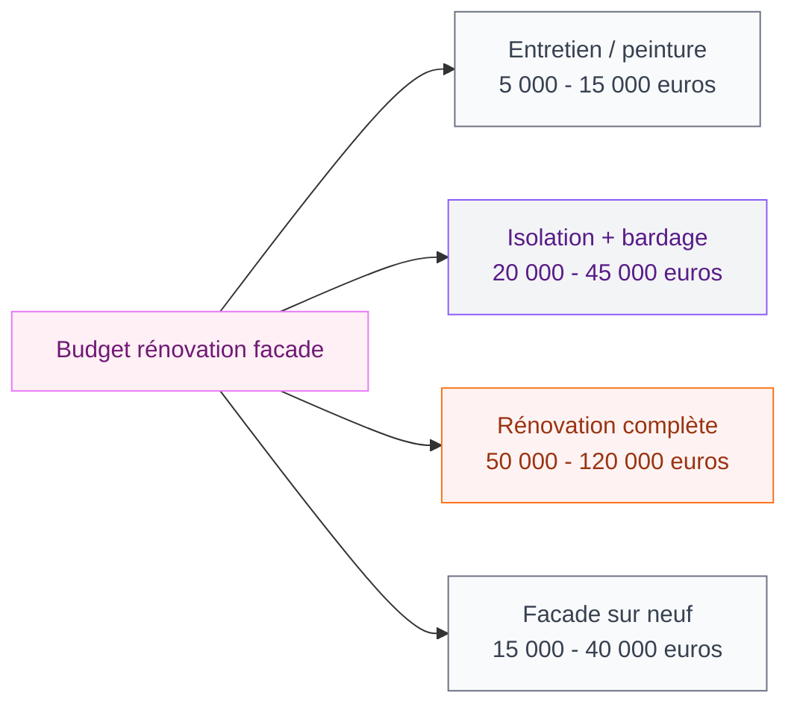

Tu envisages de construire ou de rénover l'extérieur de ta maison et tu veux savoir ce qui se fait vraiment en 2026 ? La bonne nouvelle, c'est que les tendances cette année sont à la fois belles ET intelligentes - fini les facades monobloc un peu plates, place aux mélanges de matières et aux finitions naturelles qui vieillissent bien. Je te détaille tout ce que j'ai observé et compilé pour toi.

## Ce qui définit la facade moderne en 2026

L'année 2026 marque un vrai tournant dans la façon dont on pense l'extérieur d'une maison. On ne cherche plus à faire "propre et minimal" comme dans les années 2010 - on veut de la profondeur, du caractère, quelque chose qui raconte une histoire.

<div class="my-8">
  
</div>


La grande tendance ? Le mix de matériaux. Verre, métal, pierre et bois se combinent sur une même facade pour créer du contraste et du relief. Tu vois une maison avec un bardage bois chaud sur la partie haute, du béton lisse en bas et une structure métallique sombre autour des fenêtres ? C'est exactement ça, et c'est très 2026.

Ce mélange n'est pas aléatoire - chaque matériau a son rôle. Le bois apporte la chaleur, le métal donne la précision, la pierre ou le béton ajoute la solidité visuelle. Résultat : une facade qui a l'air fabriquée avec soin, pas sortie d'un moule.

> [!TIP]
> Pour un mix de matières réussi, limite-toi à 2-3 matériaux maximum. Trop de textures différentes, ça devient confus. Choisis un matériau dominant (60%), un secondaire (30%) et un accent (10%).

## Les matériaux stars de 2026


<div class="my-8">
  
</div>

### Le bardage bois - chaud et durable

Le bois reste LE matériau de l'année, mais pas n'importe lequel. On parle de bois traité thermiquement (le thermowood), qui grisaille naturellement avec le temps et ne nécessite quasiment pas d'entretien. Marque à connaître : Kebony, qui propose des bois certifiés à des prix corrects autour de 80-120 euros le m2 posé.

Ce qui est tendance : les lames horizontales larges (format 200mm de largeur minimum), parfois avec des espacements qui créent de l'ombre et du relief.

### Le métal - la précision assumée

L'acier Corten - ce métal rouillé qui ne rouille pas vraiment - est partout en 2026. Sa patine orange-brun s'intègre étonnamment bien dans les paysages naturels. Comptez 150-250 euros le m2 selon le format des panneaux.

L'aluminium laqué fait aussi son grand retour, notamment dans les teintes anthracite ou bronze. C'est ce qu'on trouve chez des fabricants comme Trespa ou Alucobond - pour des budgets à partir de 60 euros le m2 (hors pose).

### Le verre - la lumière comme matériau

Les fenêtres en bande continue, les facades avec pan entier vitré, les vérandas qui deviennent partie intégrante de la facade : le verre n'est plus un simple élément de fenêtre, c'est un matériau de facade à part entière. Les menuiseries "slim frame" (cadres ultra-fins) permettent des proportions auparavant impossibles.

> [!NOTE]
> Le vitrage triple vitre est aujourd'hui le standard pour les maisons BBC. Niveau performance, c'est nettement mieux que le double vitrage standard - un investissement qui se rentabilise en 8-12 ans via les économies de chauffage.

### La pierre et le béton lisse

La pierre naturelle reste un classique qui ne vieillit pas, mais 2026 la propose dans des formats plus grands et plus minces (pierres de parement ultra-fines, 2-3 cm d'épaisseur). Moins lourdes, plus faciles à poser, et l'effet reste très premium.

Le béton lisse ou béton-ciré en facade, lui, donne cet effet industriel chic qu'on voit beaucoup dans les magazines. C'est un revêtement composé (pas du vrai béton coulé), plus accessible : autour de 40-80 euros le m2 selon la finition.

## Les couleurs tendance pour les facades 2026

```mermaid
graph TD
    A["Palette facades 2026"]
    A --> B["Tons naturels"]
    A --> C["Couleurs sombres"]
    A --> D["Accents colorés"]
    B --> E["Gris clair / beige"]
    B --> F["Blanc cassé / lin"]
    C --> G["Anthracite / noir mat"]
    C --> H["Vert forêt profond"]
    D --> I["Terracotta / rouille"]
    D --> J["Ocre doré"]

<div class="my-8">
  
</div>


    style A fill:#FFF0F5,stroke:#E879F9,color:#701A75
    style B fill:#F3F4F6,stroke:#8B5CF6,color:#581C87
    style C fill:#F3F4F6,stroke:#8B5CF6,color:#581C87
    style D fill:#F3F4F6,stroke:#8B5CF6,color:#581C87
    style E fill:#F9FAFB,stroke:#6B7280,color:#374151
    style F fill:#F9FAFB,stroke:#6B7280,color:#374151
    style G fill:#F9FAFB,stroke:#6B7280,color:#374151
    style H fill:#F9FAFB,stroke:#6B7280,color:#374151
    style I fill:#FEF3F2,stroke:#F97316,color:#9A3412
    style J fill:#FEF3F2,stroke:#F97316,color:#9A3412
```

Les couleurs sombres et saturées continuent de s'imposer sur les facades. Le vert forêt très profond - presque noir - est l'une des teintes les plus demandées en 2026. On le retrouve souvent associé à du bois naturel pour un effet très organique.

Le noir mat reste safe et moderne, mais ce qui monte vraiment c'est le terracotta et les teintes ocrées. Plus chaud, plus humain, ça contraste bien avec les vitres et les structures métalliques.

Pour les couleurs plus claires, le blanc cassé (creamy white) et le gris lin restent très demandés - parfaits pour les facades avec reliefs, parce que les jeux d'ombre et de lumière ressortent bien sur ces teintes neutres.

Si tu veux aller plus loin sur la question des couleurs pour tes extérieurs, j'ai fait un article entier là-dessus : [couleurs pour les facades et extérieurs de maisons en 2026](/couleurs-pour-les-exterieurs-et-les-facades-de-maisons-2026/) avec des palettes et des combinaisons testées.

## Les styles architecturaux qui dominent


<div class="my-8">
  
</div>

### Le minimalisme contextuel

Ce n'est pas du minimalisme froid et déshumanisé - c'est un minimalisme qui s'adapte au terrain et au paysage. Une maison en zone forestière va utiliser le bois et des teintes forestières. En bordure de mer, le blanc et le zinc. En zone urbaine, le béton et le métal.

L'idée : la maison doit avoir l'air d'appartenir à son environnement, pas d'atterrir comme un objet venu d'ailleurs.

### La maison container réinventée

La maison container a beaucoup évolué. Ce n'est plus l'empilement de boîtes métalliques "brut de chantier" - c'est devenu une architecture sophistiquée avec des facades habillées, des extensions vitrées et des aménagements très soignés. Si tu es curieuse de ce concept, j'en parle en détail dans mon article sur la [maison container et son architecture moderne](/maison-container/).

### L'architecture bioclimatique visible

De plus en plus de maisons affichent leur performance énergétique depuis leur facade : grandes baies au sud avec protections solaires architecturales (brise-soleils intégrés, avancées de toit calculées), toiture avec végétation, murs à inertie épais. Ce n'est plus caché - c'est mis en avant comme un atout esthétique.

> [!IMPORTANT]
> Si tu fais construire ou rénover en 2026, les nouvelles réglementations RE2020 sont pleinement en application. Ton architecte ou maître d'oeuvre doit intégrer les contraintes bioclimatiques dès le départ - ça influence directement les choix de facade (orientation, surfaces vitrées, matériaux à forte inertie).

## Budget : ce que ça coûte vraiment

Un des aspects les plus importants quand on parle de facade, c'est le budget. Voici un repère concret :

<div class="my-8">
  
</div>




Pour une rénovation de facade avec isolation par l'extérieur (ITE) et bardage bois, compte entre 150 et 250 euros le m2 tout compris (matériaux + pose + isolation). Sur une maison de 120m2 avec 200m2 de facade environ, tu arrives à 30 000-50 000 euros.

Bonne nouvelle : l'isolation par l'extérieur est éligible aux aides MaPrimeRénov'. Selon tes revenus et la classe énergétique de départ, tu peux récupérer entre 25% et 75% du montant de l'isolation. Ça change le calcul !

Pour la construction neuve, la facade n'est pas un poste séparé - elle est intégrée au devis global. Mais en général, les architectes comptent 8 à 15% du budget total de construction pour la facade et les menuiseries extérieures.

> [!TIP]
> Demande TOUJOURS 3 devis à des entreprises spécialisées (pas des peintres qui "font aussi la facade"). Un bardeur ou une entreprise d'isolation par l'extérieur aura une bien meilleure maîtrise du détail et de l'étanchéité.

## Les détails qui font toute la différence

Ce sont souvent les petits éléments qu'on ne voit pas sur les photos larges qui font qu'une facade est vraiment réussie ou pas :

**Les menuiseries** : En 2026, les portes d'entrée ont leur moment de gloire. Une porte pivot en métal laqué, une grande porte en bois massif avec poignée design - l'entrée est traitée comme une pièce architecturale à part entière. Budget : 800-3000 euros pour une belle porte d'entrée.

**L'éclairage extérieur** : Les spots encastrés dans le sol ou dans les soubassements, les rubans LED intégrés dans les éléments architecturaux - l'éclairage est désormais conçu avec la facade, pas rajouté après. Marque accessible : Philips Hue Outdoor pour commencer (autour de 150-400 euros selon l'installation).

**La végétation intégrée** : Les murs végétaux de facade, les grimpantes guidées sur des structures métalliques, les jardins de devant soignés - le végétal fait partie de la composition architecturale de la facade.

Si tu t'intéresses aux maisons modernes avec ces détails soignés, j'ai compilé des photos et exemples dans mon article sur les [maisons modernes 2026 : images d'extérieur et d'intérieur](/maisons-modernes-2026-images-dexterieur-et-dinterieur/) - il y a de vrais cas concrets inspirants.

## Rénovation vs construction neuve : les contraintes à connaître

La rénovation d'une facade existante est soumise à des règles qui varient selon ta commune. Dans la plupart des cas, tu n'as pas besoin de permis de construire si tu ne modifies pas les volumes (tu restes en déclaration préalable de travaux). Mais si tu changes de couleur, de matériau ou si ta maison est en zone ABF (Architecte des Bâtiments de France), il faut valider avec la mairie.

Pour une construction neuve, tout passe par le permis de construire - et ton architecte (obligatoire si la surface dépasse 150m2) connaît les règles locales du PLU (Plan Local d'Urbanisme) qui peuvent imposer des contraintes de couleurs ou de matériaux.

> [!WARNING]
> Certaines communes ont des règles très strictes sur les couleurs de facade - surtout dans les centres-bourgs et villages classés. Avant de commander ta peinture anthracite, vérifie auprès du service urbanisme de ta mairie. Ça peut t'éviter une mise en demeure coûteuse.


## Sur le meme theme

- [salons modernes et élégants 2026](/salons-modernes-et-elegants-2026/)
- [maisons modernes en adobe](/maisons-modernes-en-adobe-images-dinterieurs-et-dexterieurs/)

## FAQ

### Quel matériau de facade est le plus durable en 2026 ?

Le zinc et l'aluminium laqué sont les plus durables (50 ans et plus sans entretien majeur). Le bois traité thermiquement dure 25-35 ans avec un entretien minimal tous les 5-10 ans. Le béton lisse est aussi très résistant mais peut craquer avec les mouvements de la structure.

### Peut-on mixer les couleurs sur une même facade ?

Oui, c'est même conseillé pour créer du relief. La règle de base : une couleur dominante claire pour les grandes surfaces, une teinte sombre pour les structures et cadres, et une teinte de caractère (bois naturel, terracotta) pour les éléments d'accent. Maximum 3 teintes.

### Combien coûte une isolation par l'extérieur avec bardage en 2026 ?

Compte entre 150 et 250 euros le m2 tout compris selon le matériau de bardage choisi. Le bardage fibrociment est le moins cher (150-180 euros le m2), le bardage bois nobles comme le Kebony le plus cher (200-280 euros le m2). L'ITE seule (sans bardage premium) peut être éligible à MaPrimeRénov'.

### La maison container est-elle toujours tendance en 2026 ?

Oui, mais elle a évolué. On ne voit plus les stacks de containers basiques - les projets 2026 sont architecturalement soignés avec des facades habillées. Le concept attire surtout pour sa rapidité de construction et son caractère original.

### Quels sont les documents nécessaires pour rénover une facade ?

En général, une déclaration préalable de travaux suffit (remplissable en ligne sur service-public.fr). Si ta maison est en secteur ABF ou si tu modifies les volumes, un permis de construire peut être nécessaire. Délai de traitement : 1 mois pour la déclaration préalable, 3 mois pour le permis.
