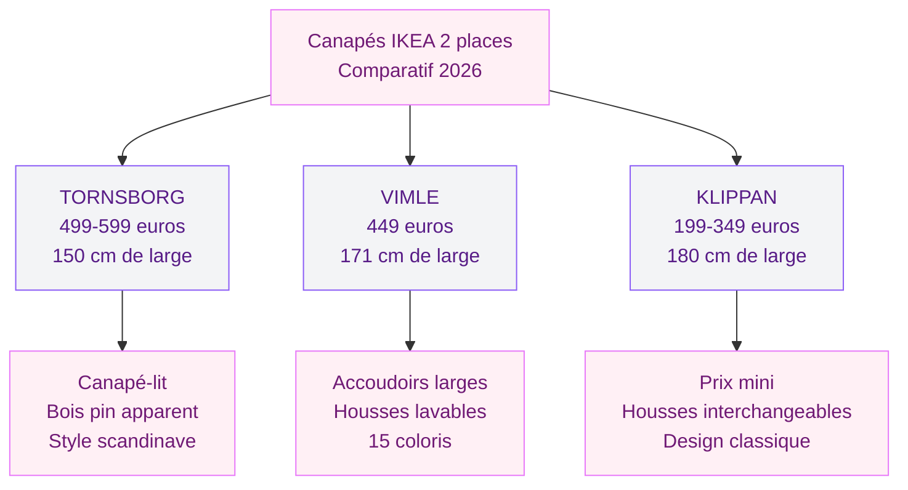
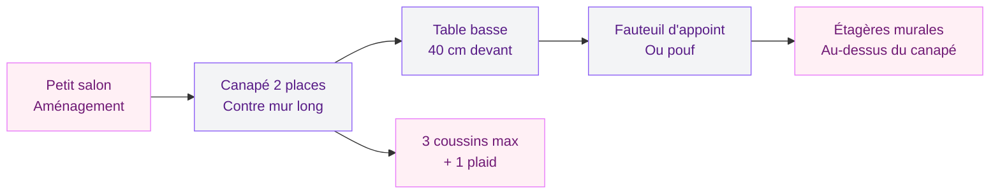

Tu cherches un canapé 2 places pour ton petit salon et tu ne sais pas lequel prendre chez IKEA ? Je te comprends - le catalogue est immense, les noms sont imprononçables, et tu te retrouves à comparer des fiches techniques pendant des heures sans savoir si le canapé rentrera vraiment dans tes 15 m2.

J'ai testé pas mal de canapés IKEA (trois déménagements en six ans, ça forge l'expérience), et je peux te dire que le format 2 places reste le plus malin pour les petits espaces. Assez grand pour s'affaler à deux devant un film, assez compact pour laisser respirer la pièce.

En 2026, IKEA renouvelle sa gamme avec le TORNSBORG, un modèle canapé-lit au look scandinave très réussi. Mais les classiques VIMLE et KLIPPAN ont aussi leurs atouts. Je te fais le comparatif complet avec prix, dimensions, et surtout ce que ça donne dans la vraie vie.

## Pourquoi un canapé 2 places est le meilleur choix pour un petit salon

Avant de plonger dans les modèles, posons les bases. Dans un salon de moins de 20 m2, un canapé 3 places mange souvent trop de place. Il bloque la circulation, empêche d'ouvrir un tiroir ou une porte, et donne cette impression étouffante de pièce surchargée.

  

Un 2 places bien choisi, c'est le juste milieu : tu gardes le confort d'un vrai canapé, tu libères de l'espace pour une table basse, un fauteuil d'appoint, ou simplement du vide (et le vide, dans un petit salon, c'est du luxe).

### Les critères qui comptent vraiment

Quand tu choisis un canapé pour un petit espace, oublie le look cinq minutes et concentre-toi sur ces mesures :

- **Largeur totale** : c'est le premier filtre. Au-delà de 160 cm, tu commences à être serré dans un salon étroit. En dessous de 140 cm, tu perds en confort d'assise
- **Profondeur d'assise** : entre 50 et 55 cm, c'est idéal. Trop profond (60 cm+), tu te retrouves à caler des coussins dans le dos en permanence
- **Hauteur des accoudoirs** : des accoudoirs fins libèrent de la largeur utile. Des accoudoirs larges et rembourrés, c'est confortable mais ça prend de la place
- **Rangement intégré** : certains modèles cachent un coffre sous l'assise - un vrai bonus quand tu manques de placards

> [!TIP]
> Mesure ton salon avant d'aller en magasin. Note la largeur du mur où tu veux poser le canapé, la distance entre le canapé et la table basse (minimum 40 cm pour circuler), et la largeur de la porte d'entrée de l'immeuble pour la livraison.

## TORNSBORG : le nouveau canapé-lit scandinave d'IKEA

Le TORNSBORG est la grosse nouveauté IKEA de 2026. C'est un canapé-lit 2 places avec une structure en bois clair de pin apparent, des coussins beiges déhoussables, et un design scandinave minimaliste qui rappelle les marques comme Hay ou Muuto - mais au prix IKEA.

  

### Ce qui le rend spécial

La structure en pin visible donne au TORNSBORG une allure plus légère que les canapés classiques. Les pieds et l'armature sont exposés, ce qui crée une sensation d'espace autour du meuble. C'est un détail important dans un petit salon : un canapé "aéré" avec des pieds hauts et une structure ouverte donne l'impression de prendre moins de place qu'un modèle posé au ras du sol.

Les coussins sont amovibles et lavables en machine, ce qui est un vrai plus si tu as des enfants ou des animaux. Le tissu standard est dans un beige naturel type lin, mais IKEA proposera des housses supplémentaires en gris clair et vert sauge d'ici la fin de l'année.

### Dimensions et confort

Le TORNSBORG mesure environ 150 cm de large - c'est compact. La profondeur d'assise se situe autour de 52 cm, ce qui est bien calibré. Le mécanisme de conversion en lit est simple : tu tires l'assise vers l'avant et tu déplies un matelas fin (environ 120 x 190 cm). Ce n'est pas un lit pour dormir toutes les nuits, mais pour dépanner un ami de passage, ça fait le job.

### Prix et positionnement

Compte entre 499 et 599 euros selon la finition. C'est dans la fourchette haute d'IKEA, mais pour un canapé-lit avec une vraie finition bois apparent, c'est compétitif. A titre de comparaison, un canapé-lit de qualité similaire chez Made.com ou La Redoute démarre à 700-800 euros.

> [!NOTE]
> La fonction lit du TORNSBORG ajoute environ 10 cm de profondeur par rapport à un 2 places simple. Vérifie que tu as au moins 200 cm de recul devant le canapé si tu comptes l'utiliser en mode lit.

## VIMLE 2 places : la valeur sûre d'IKEA

Le VIMLE existe depuis plusieurs années, mais IKEA l'a repositionné en 2026 avec un nouveau prix plus agressif. C'est le modèle qui se vend le plus en France dans la catégorie 2 places, et il y a de bonnes raisons à ça.

  

### Confort et modularité

Le VIMLE a des accoudoirs larges et bien rembourrés. C'est le genre de canapé où tu peux poser la tête sur l'accoudoir pour lire - un vrai confort. L'assise est ferme sans être dure, avec des coussins en mousse haute résilience qui tiennent bien dans le temps (j'ai un VIMLE depuis quatre ans, l'assise n'a pas bougé).

La housse est entièrement amovible et lavable en machine. IKEA propose une quinzaine de coloris, du blanc écru au bleu pétrole en passant par le gris anthracite. Tu peux changer de housse quand tu te lasses - c'est un peu comme changer de canapé sans le payer en entier.

### Dimensions

Le VIMLE 2 places fait 171 cm de large. C'est plus généreux que le TORNSBORG, et les accoudoirs larges expliquent cette différence. La profondeur totale est de 98 cm, avec une profondeur d'assise de 55 cm - on est dans le haut de la fourchette, c'est confortable mais ça prend un peu plus de recul.

### Prix

Le VIMLE 2 places démarre à 449 euros en tissu standard. Les housses de remplacement coûtent entre 100 et 170 euros. Si tu veux un bon plan, regarde les housses Bemz (marque suédoise compatible IKEA) qui proposent des tissus premium à partir de 200 euros - lin lavé, velours, coton épais.

## KLIPPAN : le classique petit budget

Le KLIPPAN, c'est LE canapé d'entrée de gamme IKEA. Il équipe les studios étudiants et les premiers appartements depuis plus de vingt ans. Et il a un atout que les autres n'ont pas : son prix.

  

### Pourquoi il reste pertinent en 2026

A 199 euros en tissu basique (Vansbro), le KLIPPAN est difficile à battre. C'est un canapé honnête : l'assise est correcte (pas extraordinaire), la structure est solide, et le système de housses interchangeables permet de le relooker à moindre coût. Une housse KLIPPAN coûte entre 60 et 130 euros chez IKEA, et tu trouves aussi des housses sur mesure sur des sites comme Comfort Works ou Bemz avec des tissus plus qualitatifs.

Le KLIPPAN fait 180 cm de large - c'est le plus large des trois modèles, ce qui peut paraître paradoxal pour un canapé destiné aux petits espaces. Mais sa profondeur est contenue (88 cm) et ses accoudoirs sont fins, donc la surface d'assise est généreuse pour la taille du meuble.

### Pour qui ?

Le KLIPPAN est parfait si tu as un budget serré, si tu déménages souvent (il est léger et se démonte facilement), ou si tu veux un canapé "jetable" que tu peux relooker avec une housse trendy. Si tu veux aller plus loin sur le style de [ton canapé et sa couleur](/couleur-canape-choisir/), j'ai un guide dédié qui t'aidera à choisir la bonne teinte selon ton salon.

> [!WARNING]
> Le KLIPPAN n'a pas de pieds hauts - il est posé quasi au ras du sol. Dans un petit salon, ça alourdit visuellement l'ensemble. Si tu veux contrebalancer, mise sur des meubles suspendus autour (étagères murales, meuble TV fixé au mur).

## Comment intégrer ton canapé dans un petit salon

Choisir le bon canapé, c'est la moitié du travail. L'autre moitié, c'est l'aménagement autour. Voici ce qui fonctionne pour chaque modèle.

  

### Le placement optimal

Dans un salon rectangulaire (la configuration la plus courante en appartement), place ton canapé 2 places contre le mur le plus long, face à la fenêtre si possible. Ça libère le passage central et tu profites de la lumière naturelle.

Si ton salon est plutôt carré, tu peux poser le canapé en biais dans un angle ou le reculer du mur de 10-15 cm. Ce petit décalage évite l'effet "salle d'attente" et permet de glisser une console ou une petite étagère derrière.

### Les accessoires qui changent tout

Un canapé 2 places un peu nu, ça peut faire vide. Les [coussins décoratifs](/coussins-decoratifs-pour-les-salons-les-fauteuils-et-les-sols/) sont tes meilleurs alliés pour donner du volume et du style. Trois coussins suffisent sur un 2 places - pas plus, sinon tu n'as plus de place pour t'asseoir.

Ajoute un plaid en bout d'accoudoir (chez H&M Home, les plaids en coton gaufré sont à 30 euros) et un tapis sous la table basse pour délimiter visuellement le coin salon. Si tu veux creuser le sujet et rendre ton [salon plus chaleureux](/salon-plus-chaleureux/), tu trouveras dans mon guide toutes les astuces textiles et éclairage qui font la différence.

### Le coin canapé dans un studio

Si tu vis dans un studio, le canapé doit jouer double ou triple rôle : assise le jour, couchage la nuit, rangement en permanence. Le TORNSBORG est clairement le mieux adapté pour ça. Sa fonction lit est un vrai atout, et son look soigné évite l'effet "canapé de dépannage" qu'on retrouve souvent dans les studios.

Pour plus d'idées sur l'organisation d'un [petit salon bien décoré](/decoration-petit-salon/), mon guide complet couvre les couleurs, les miroirs, et toutes les astuces gain de place que j'utilise chez moi.

## Le tableau comparatif des trois modèles

Voici un récapitulatif rapide pour t'aider à trancher :

| Critère | TORNSBORG | VIMLE | KLIPPAN |
|---------|-----------|-------|---------|
| Prix | 499-599 euros | 449 euros | 199-349 euros |
| Largeur | 150 cm | 171 cm | 180 cm |
| Profondeur | ~95 cm | 98 cm | 88 cm |
| Fonction lit | Oui | Non | Non |
| Housses lavables | Oui | Oui | Oui |
| Pieds hauts | Oui (bois pin) | Oui (métal) | Non (bas) |
| Rangement intégré | Non | Non | Non |
| Nombre de coloris | 3 (lancement) | 15+ | 8+ |
| Idéal pour | Studio, style scandinave | Salon compact, confort max | Budget serré, premier appart |

> [!IMPORTANT]
> Vérifie toujours les dimensions de ta porte d'entrée et de ta cage d'escalier avant de commander. Le KLIPPAN (180 cm) et le VIMLE (171 cm) passent en général, mais les montées d'escalier étroites des immeubles anciens peuvent poser problème. IKEA propose un service de livraison avec montage (à partir de 49 euros) qui inclut la vérification de l'accès.

## Entretien : garder ton canapé IKEA comme neuf

Les canapés IKEA à housses amovibles ont un gros avantage sur la concurrence : tu peux les laver. Voici les bonnes pratiques :

- **Lavage des housses** : en machine à 40 degrés, cycle délicat. Ne pas utiliser de sèche-linge, laisser sécher à l'air libre. Les housses en coton peuvent rétrécir légèrement au premier lavage
- **Les coussins** : aspire-les une fois par mois avec l'embout brosse de ton aspirateur. Retourne-les toutes les deux semaines pour une usure uniforme
- **Les taches** : un mélange eau tiède + savon de Marseille retire la plupart des taches courantes (café, vin, sauce). Tamponne sans frotter, puis rince à l'eau claire
- **Le bois apparent (TORNSBORG)** : un coup de chiffon humide suffit. Évite les produits abrasifs. Tu peux appliquer une huile pour bois clair (type huile Stockaryd chez IKEA, 10 euros) une fois par an pour nourrir le pin

## Sur le meme theme

- [salons modernes 2026](/salons-modernes-tendances-2026/)

## FAQ

### Quel est le meilleur canapé IKEA 2 places pour un petit salon ?

Le TORNSBORG est le plus compact (150 cm de large) et le mieux adapté aux petits espaces grâce à ses pieds hauts en pin qui allègent visuellement le meuble. Si tu as besoin d'un couchage d'appoint, sa fonction lit est un bonus. Le VIMLE reste le plus confortable pour s'installer longtemps, mais il est plus large (171 cm).

### Combien coûte un canapé 2 places chez IKEA en 2026 ?

Les prix vont de 199 euros pour le KLIPPAN en tissu basique à 599 euros pour le TORNSBORG en finition premium. Le VIMLE se positionne à 449 euros. Ajoute entre 60 et 170 euros si tu veux une housse de remplacement dans un coloris différent.

### Le canapé-lit TORNSBORG est-il confortable pour dormir ?

Le TORNSBORG offre un couchage d'appoint correct pour une ou deux nuits. Le matelas déplié mesure environ 120 x 190 cm avec une épaisseur d'une dizaine de centimètres. C'est suffisant pour un invité occasionnel, mais pas adapté à un usage quotidien. Pour un vrai lit, il faudrait un matelas supplémentaire de 5-7 cm posé par-dessus.

### Peut-on changer la housse d'un canapé IKEA ?

Oui, c'est l'un des grands avantages de la gamme IKEA. Le KLIPPAN, le VIMLE et le TORNSBORG acceptent tous des housses amovibles lavables en machine. Tu peux acheter des housses supplémentaires chez IKEA (60 à 170 euros) ou chez des fabricants tiers comme Bemz ou Comfort Works (200 à 350 euros) pour des tissus haut de gamme en lin ou velours.

### Quelle largeur de canapé pour un salon de 12 m2 ?

Pour un salon de 12 m2, reste en dessous de 160 cm de large. Le TORNSBORG (150 cm) est le mieux calibré. Le KLIPPAN (180 cm) et le VIMLE (171 cm) fonctionnent aussi si tu optimises le reste du mobilier - table basse ronde ou ovale plutôt que rectangulaire, meubles suspendus, pas de meuble TV au sol.
