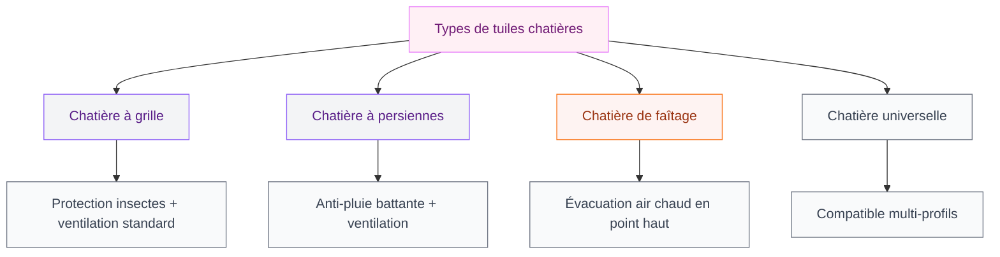
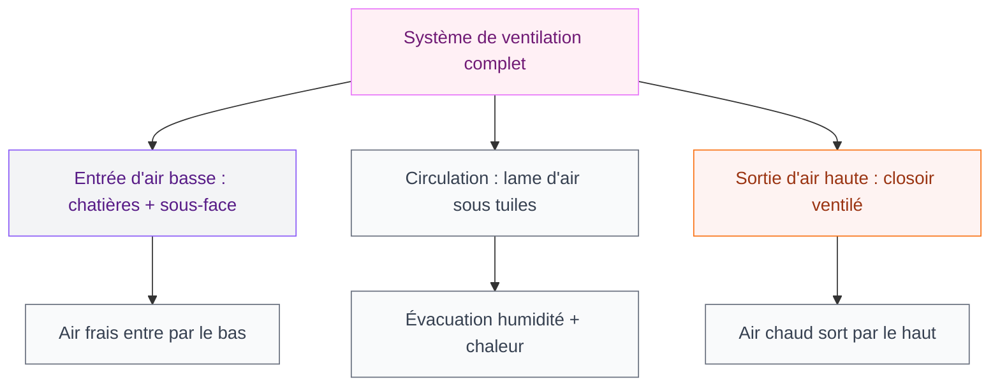

Tu as déjà remarqué de la condensation sous ta toiture, des traces d'humidité dans les combles ou une drôle d'odeur de renfermé quand tu montes au grenier ? Il y a de fortes chances que ta couverture manque de ventilation. Et la solution la plus simple, la plus accessible et la moins chère pour régler ça, c'est la tuile chatière.

Ce petit élément de toiture qu'on oublie souvent fait un boulot énorme : il laisse circuler l'air sous les tuiles pour évacuer l'humidité et réguler la température. Avant de grimper sur le toit ou d'appeler un couvreur, voilà tout ce que tu dois savoir pour bien choisir, bien poser et bien entretenir tes tuiles chatières.

## Qu'est-ce qu'une tuile chatière et à quoi ça sert ?

Une tuile chatière, c'est une tuile dotée d'ouvertures qui permettent à l'air de circuler entre la couverture et la charpente. Elle remplace une tuile classique sur le toit, sans modifier la structure ni l'esthétique globale de la toiture.

  

Son rôle est double. D'abord, elle évacue l'humidité qui s'accumule naturellement sous les tuiles (pluie, condensation, remontées d'humidité depuis l'intérieur). Sans évacuation, cette humidité stagne, favorise les moisissures et peut finir par détériorer la charpente en bois. Le deuxième rôle, c'est la régulation thermique : en été, l'air chaud accumulé sous la couverture s'échappe par les chatières, et en hiver, la circulation d'air évite la formation de condensation liée à la différence de température entre l'intérieur chauffé et l'extérieur froid.

> [!NOTE]
> La ventilation de la toiture n'est pas un bonus : c'est une obligation légale. Les normes DTU 40.21 et DTU 40.22 fixent les règles de ventilation pour les couvertures en tuiles de terre cuite et en béton. Ne pas les respecter, c'est risquer des sinistres non couverts par ton assurance.

### Les différents types de tuiles chatières

Toutes les chatières ne se ressemblent pas. Le modèle que tu choisis dépend de ton type de couverture et du débit d'air recherché.

**La chatière à grille** est le modèle le plus courant. Elle comporte des ouvertures protégées par une grille qui empêche les insectes et les petits animaux de s'introduire sous la toiture. Elle convient pour la ventilation standard des combles.

**La chatière à persiennes** fonctionne sur le même principe, mais les ouvertures en forme de lames inclinées offrent une meilleure protection contre la pluie battante. C'est le choix recommandé pour les régions à fortes précipitations.

**La chatière de faîtage** se pose au sommet du toit, près de la ligne de faîte. L'air chaud monte naturellement, et la chatière de faîtage l'évacue au point le plus haut - c'est le placement le plus efficace pour la ventilation thermique.

**La chatière universelle** est conçue pour s'adapter à plusieurs profils de tuiles (plates, canal, romanes). Pratique si tu n'es pas sûr du modèle exact de tes tuiles ou si ta couverture mélange plusieurs types.

## Combien de tuiles chatières poser ? Le calcul

C'est LA question que tout le monde se pose, et la réponse est encadrée par les normes DTU. La règle de base : la surface de ventilation doit représenter au minimum 1/3000e de la surface projetée de la couverture à plat.

  

En pratique, ça donne quoi ? Pour une toiture de 90 m2, tu as besoin de 300 cm2 de ventilation au total. Une tuile chatière standard offre entre 15 et 30 cm2 de surface de ventilation selon le modèle. Avec des chatières de 20 cm2, il te faut donc 15 chatières pour couvrir les 300 cm2 requis.

La règle du pouce souvent utilisée par les couvreurs : une tuile chatière tous les 20 m2 de surface de toiture pour les tuiles en terre cuite. Ça donne 4 à 5 chatières pour un toit de 90 m2, mais attention - cette règle simplifiée fonctionne uniquement avec des chatières à fort débit. Avec des modèles standards, il en faut plus.

> [!TIP]
> Pour un calcul précis : mesure ta surface de toiture en projection horizontale, divise par 3000, puis divise le résultat par la surface de ventilation unitaire de ta chatière (donnée dans la fiche produit). Ça te donne le nombre exact. Ajoute toujours 10% de marge pour compenser les pertes de débit liées au vent et à l'orientation.

### Où les placer sur le toit ?

La disposition est aussi importante que la quantité. Les chatières se posent en quinconce sur toute la surface de la couverture, réparties entre la partie basse (près des gouttières) et la partie haute (près du faîtage). L'objectif : créer un flux d'air ascendant naturel.

L'air frais entre par les chatières situées en bas de pente et sort par celles en haut de pente (ou par un closoir ventilé au faîtage). Ce tirage naturel fonctionne même sans vent, grâce à la convection thermique.

Si ta toiture a déjà un closoir ventilé au faîtage, tu peux concentrer tes chatières dans le tiers inférieur de la couverture. L'air entrera par les chatières basses et sortira par le faîtage - c'est le montage le plus efficace.

## L'installation étape par étape

Tu peux poser des tuiles chatières toi-même si tu es à l'aise sur un toit et que tu as l'équipement de sécurité adapté. Sinon, fais appel à un couvreur - on parle de prix juste après.

  

### Le matériel nécessaire

- Tuiles chatières (au bon format pour ta couverture)
- Échelle de toit ou crochet de faîtage
- Harnais de sécurité et ligne de vie
- Marteau et levier plat pour soulever les tuiles
- Scie à tuile si des ajustements sont nécessaires
- Mastic d'étanchéité pour toiture

### Les étapes de pose

**1. Repérer les emplacements.** Depuis les combles, identifie les zones où tu veux poser les chatières. Marque-les avec un crayon gras visible depuis l'extérieur, ou plante un petit clou qui dépasse entre les tuiles pour te repérer une fois sur le toit.

**2. Sécuriser l'accès.** Installe ton échelle de toit, enfile ton harnais, attache ta ligne de vie. Ce n'est pas un détail : chaque année en France, les chutes de toit causent des centaines d'accidents graves.

**3. Retirer la tuile existante.** Soulève délicatement la tuile située au-dessus de celle que tu veux remplacer, puis fais glisser la tuile à retirer vers le haut pour la dégager de son crochet ou de son tenon.

**4. Poser la chatière.** Glisse la tuile chatière à la place de la tuile retirée. Vérifie qu'elle s'emboîte correctement avec les tuiles adjacentes et que les ouvertures de ventilation sont bien orientées vers le bas (pour empêcher l'eau de pluie de s'infiltrer).

**5. Fixer si nécessaire.** Selon la pente de ton toit et les normes locales, tu devras peut-être fixer la chatière avec un clou ou une vis sur le liteau. En zone ventée ou pour les pentes supérieures à 60%, la fixation est obligatoire.

**6. Vérifier l'étanchéité.** Remets en place les tuiles adjacentes, vérifie que le recouvrement est correct et qu'il n'y a aucun jeu. Si besoin, applique un cordon de mastic sur les bords.

> [!WARNING]
> Ne jamais travailler sur un toit mouillé, par vent fort ou seul. Si ta pente dépasse 40%, l'intervention d'un professionnel équipé est fortement recommandée. Le risque de chute n'est pas à prendre à la légère.

## Prix d'une tuile chatière : combien ça coûte ?

Le budget dépend du type de chatière, du matériau et de la marque. Voici les fourchettes de prix actuels.

  

**Le prix de la tuile seule** varie de 3 à 15 euros pièce. Une chatière basique en terre cuite coûte entre 3 et 8 euros. Les modèles en béton sont un peu moins chers (2 à 5 euros). Les chatières en zinc ou en plomb, utilisées sur des couvertures en ardoise, montent entre 10 et 25 euros pièce.

Chez les grandes enseignes, tu trouves facilement :
- Point P : chatières terre cuite à partir de 4,50 euros
- Leroy Merlin : modèles universels entre 5 et 12 euros
- Wienerberger / Koramic : chatières premium adaptées à leurs gammes de tuiles, autour de 8-15 euros

**Le coût de la main-d'oeuvre** si tu fais appel à un couvreur se situe entre 40 et 60 euros de l'heure. La pose d'une chatière prend en général 15 à 30 minutes, mais le tarif inclut l'installation du matériel de sécurité et le temps de déplacement sur le toit. Pour la pose de 5 à 10 chatières, compte entre 150 et 400 euros de main-d'oeuvre.

**Budget total** pour un toit de 90 m2 avec 10 chatières : entre 30 et 150 euros en matériel seul, ou 200 à 550 euros tout compris avec un pro.

> [!TIP]
> Si tu as besoin de refaire ou de réparer d'autres éléments de toiture en même temps (remplacement de tuiles cassées, nettoyage de mousse, vérification du faîtage), regroupe tout en une seule intervention. Le coût du déplacement et de l'installation de sécurité sera mutualisé - tu économiseras 30 à 40% par rapport à plusieurs visites séparées.

## Les erreurs à éviter

Après avoir lu des dizaines de retours de propriétaires et discuté avec des couvreurs, voici les pièges les plus fréquents.

  

**Poser trop peu de chatières.** C'est l'erreur numéro un. Beaucoup de constructeurs posent le strict minimum réglementaire, et certains ne posent même pas de chatières du tout sur des toitures neuves. Si tu constates de la condensation dans tes combles, il te faut probablement en ajouter.

**Orienter les ouvertures vers le haut.** Les fentes ou persiennes de la chatière doivent toujours être orientées vers le bas de la pente, pour que l'eau de pluie ne puisse pas s'y engouffrer. Ça paraît logique, mais dans le feu de l'action sur un toit, l'erreur arrive vite.

**Oublier la complémentarité avec le faîtage.** Les chatières seules ne suffisent pas toujours. Pour une ventilation optimale, elles doivent fonctionner en combinaison avec un closoir ventilé au faîtage. L'air entre en bas (chatières) et sort en haut (closoir). Sans cette complémentarité, le flux d'air est faible.

**Boucher les chatières après coup.** Certains propriétaires, excédés par les courants d'air dans les combles aménagés, bouchent les chatières. Grosse erreur : ça supprime la ventilation et mène directement à des problèmes de condensation et de pourrissement de charpente. Si tu aménages tes combles, l'isolation doit être conçue pour maintenir la ventilation entre la couverture et l'isolant.

Si ta couverture comporte des zones en [tuile transparente](https://www.cristallina.fr/tuile-transparente-cout-et-usage/) (garage, véranda), vérifie que la ventilation est aussi assurée dans ces parties - la chaleur s'y accumule encore plus vite.

## Entretien et durée de vie

Une tuile chatière en terre cuite a la même durée de vie que les tuiles classiques de ta couverture, soit 30 à 50 ans minimum. Les modèles en béton durent aussi longtemps. Le seul point d'attention, c'est de vérifier régulièrement que les ouvertures ne sont pas obstruées.

**Tous les 2 ans**, monte vérifier (ou fais vérifier) que les grilles ne sont pas bouchées par des feuilles mortes, de la mousse, des nids d'insectes ou des toiles d'araignée. Un simple coup de brosse suffit en général.

**Après une grosse tempête**, contrôle que les chatières sont toujours en place et que le recouvrement avec les tuiles adjacentes est correct. Si une chatière est fissurée ou décalée, remplace-la rapidement pour éviter les infiltrations.

## Ventilation de toiture : chatière, closoir ou écran sous-toiture ?

La tuile chatière n'est qu'un élément parmi d'autres dans le système de ventilation d'un toit. Voici comment ces éléments fonctionnent ensemble.

Le **closoir ventilé** se pose au faîtage (sommet du toit) et permet à l'air chaud de s'échapper par le haut. Il complète les chatières basses. Sur une toiture récente, il est normalement posé d'origine.

L'**écran de sous-toiture** (ou pare-pluie) est une membrane posée entre les tuiles et la charpente. Il protège contre les infiltrations tout en laissant passer la vapeur d'eau. Si ton écran est HPV (haute perméabilité à la vapeur), il nécessite moins de ventilation que les anciens écrans bitumés.

La **ventilation en sous-face** (au niveau des débords de toiture) est un autre point d'entrée d'air qui complète les chatières.

Si tu as des soucis d'[isolation au niveau de l'escalier ou de la montée vers les combles](https://www.cristallina.fr/comment-isoler-une-montee-descalier/), la ventilation de la toiture joue un rôle direct là-dedans. Un toit mal ventilé rend l'isolation moins efficace et augmente la sensation d'inconfort thermique dans les étages.

Pour les murs extérieurs en parpaing qui bordent ta toiture, un bon [enduit de protection](https://www.cristallina.fr/comment-enduir-un-mur-en-parpaing/) complète la stratégie d'étanchéité globale de ta maison.

## Sur le meme theme

- [tuile transparente](/tuile-transparente-cout-et-usage/)
- [toiture shingle](/toiture-shingle-les-caracteristiques-le-cout-et-le-devis/)
- [isolation dalle béton](/isolation-dune-dalle-en-beton-techniques-options-disolation-et-cout/)
- [facades de maisons modernes 2026](/facades-de-maisons-modernes-2026/)
- [tableau planning et pense-bête](/choisir-tableau-planning-pense-bete/)

## FAQ - Tuile chatière

**Est-ce que je peux poser des tuiles chatières moi-même ?**
Oui, si tu es à l'aise sur un toit et que tu disposes du matériel de sécurité adapté (harnais, ligne de vie, échelle de toit). La pose en elle-même est simple - c'est l'accès sécurisé au toit qui est le point délicat. En cas de doute, fais appel à un couvreur.

**Combien de tuiles chatières faut-il pour un toit de 100 m2 ?**
La norme DTU impose 1/3000e de la surface projetée en ventilation. Pour 100 m2, ça représente environ 333 cm2. Avec des chatières de 20 cm2 de section utile, il faut donc 17 chatières. Avec des modèles à fort débit (30 cm2), une douzaine suffit.

**Les tuiles chatières laissent-elles entrer la pluie ?**
Non, si elles sont correctement posées et orientées (ouvertures vers le bas de pente). Les modèles à persiennes et à grille sont conçus pour empêcher l'eau de s'infiltrer tout en laissant l'air circuler. Seul un montage incorrect ou une chatière endommagée peut provoquer des infiltrations.

**Peut-on ajouter des chatières sur une toiture existante ?**
Absolument. C'est même l'intervention la plus courante. Il suffit de remplacer des tuiles classiques par des chatières compatibles avec ton modèle de couverture. L'opération ne nécessite aucune modification de la charpente ni de l'écran de sous-toiture.
