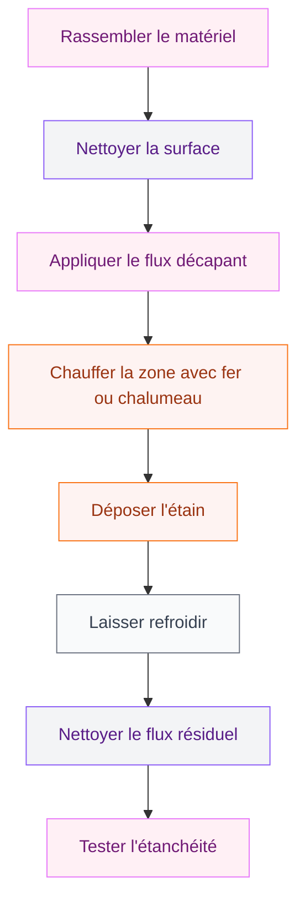
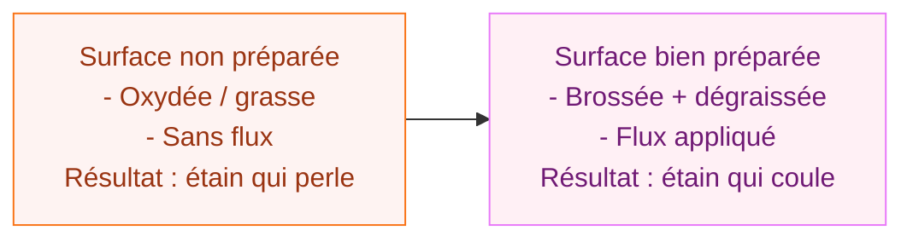
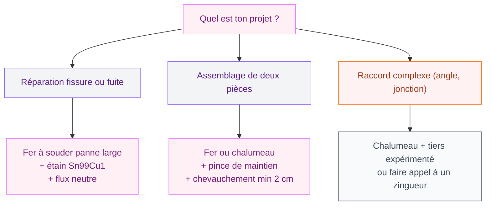

Une gouttière en zinc qui fuit, c'est souvent une question de soudure à refaire. Bonne nouvelle : tu n'as pas besoin d'appeler un zingueur professionnel pour ça. Avec le bon matériel et un peu de méthode, tu peux réparer ou assembler ta gouttière toi-même en une après-midi. Je vais te guider pas à pas, comme je l'ai fait chez moi l'été dernier quand j'ai décidé de rénover toute la façade nord.

Avant de plonger dans la technique, petit point de vocabulaire : ce qu'on appelle couramment "souder" du zinc, c'est en réalité de la **brasure tendre**. La différence ? On ne fait pas fondre le zinc - on chauffe la surface pour que l'étain (le métal d'apport) pénètre par capillarité entre les deux pièces. Le zinc garde sa forme, l'étain fait le joint. C'est important à comprendre parce que ça change toute l'approche : trop chaud, tu crèves le zinc ; pas assez chaud, l'étain ne coule pas.

## Le matériel dont tu as besoin

Pas besoin d'investir une fortune. Voici ce que j'utilise, avec des références concrètes :

  

**L'outil chauffant** - Deux options :
- Un **fer à souder à panne large** type Weller WHP 3000 (environ 45-60€ en bricolage). C'est l'outil préféré des zingueurs pour les réparations de gouttières : il chauffe progressivement et tu contrôles mieux la température.
- Un **chalumeau à gaz propane** (type Rothenberger Superfire 2, autour de 35€). Plus rapide mais moins précis - à réserver si tu as de l'expérience avec le chalumeau.

**La soudure** - Utilise uniquement de l'étain sans plomb, spécial zinc. La marque RHEINZINK propose un fil d'apport "Sn99Cu1" (étain 99%, cuivre 1%) qui coûte environ 15-20€ le rouleau de 500g. Chez Brico Dépôt ou Leroy Merlin, cherche aussi les références Castolin ou Rothenberger pour zinc.

**Le flux décapant** - Absolument nécessaire. Ce produit chimique nettoie la surface au moment du chauffage et permet à l'étain d'accrocher. Prends un flux spécial zinc sans chlorure (type "flux neutre"), environ 8-12€ le pot de 100g. Le flux acide existe mais il faut rincer après - plus contraignant.

**La protection** - Gants anti-chaleur, lunettes de protection, et une bonne ventilation ou masque de protection des vapeurs.

> [!WARNING]
> Les vapeurs de flux chauffé peuvent irriter les voies respiratoires. Travaille toujours en extérieur ou dans un espace très bien ventilé. Ne jamais braser du zinc dans un espace confiné.

**Le reste** : brosse métallique ou papier abrasif grain 80, chiffons propres, eau propre pour le nettoyage final.

## Préparer la surface : l'étape qui fait tout

La réussite d'une brasure dépend à 70% de la préparation. Une surface sale, grasse ou oxydée = étain qui ne colle pas. J'insiste là-dessus parce que c'est l'erreur classique du débutant.

  

**1. Gratter et brosser**

Commence par éliminer toute trace de rouille, de peinture ancienne, de vieille soudure décollée ou de dépôt calcaire. Utilise une brosse métallique à main en frottant bien dans tous les sens. Pour les zones plus récalcitrantes, le papier abrasif grain 80 est plus efficace.

Le zinc propre à souder doit avoir une teinte gris-bleu uniforme, légèrement brillante. Si tu vois des zones noires ou des taches blanches (oxydation), insiste jusqu'à retrouver le métal sain en dessous.

> [!TIP]
> Si ta gouttière est ancienne et très oxydée, un décapant spécial zinc (vendu en quincaillerie, type "décapant pour métaux non ferreux") peut accélérer le travail. Applique, laisse agir 5 minutes, rince à l'eau propre et sèche bien avant de continuer.

**2. Dégraisser**

Après le brossage, passe un chiffon imbibé d'acétone ou d'alcool isopropylique sur la zone à souder. Toute trace de graisse (même celle de tes doigts) empêchera l'étain d'adhérer. Laisse sécher complètement.

**3. Appliquer le flux**

Avec un pinceau ou le bout du doigt (gants !), étale le flux décapant sur toute la zone à souder, y compris 1 à 2 cm au-delà. Le flux va brunir et buller quand tu chaufferai - c'est normal et voulu. Il protège le zinc de l'oxydation pendant le chauffage et aide l'étain à "mouiller" la surface.

## La technique de brasure étape par étape

C'est là que beaucoup de gens se découragent, mais si tu as bien préparé ta surface, le reste est logique.

  

**Pour une réparation de fissure ou de joint décollé :**

Commence par positionner tes pièces de zinc exactement comme elles doivent être. Si tu répares un chevauchement, assure-toi que les deux parties se superposent sur au moins 2 cm.

Chauffe la zone avec ton fer à souder ou ton chalumeau en maintenant l'outil à 3-4 cm du zinc. L'objectif : monter le zinc autour de 230-280°C - assez pour faire fondre l'étain au contact, pas assez pour déformer le zinc. Comment tu sais que tu es à la bonne température ? Approche le fil d'étain de la surface chauffée (pas de l'outil !) : il doit fondre immédiatement et couler de lui-même.

> [!NOTE]
> La technique correcte, c'est de chauffer le métal, pas l'étain. Si tu fais fondre l'étain directement sur l'outil, tu obtiens des gouttes qui n'adhèrent pas. L'étain doit fondre au contact du zinc chaud - c'est la capillarité qui fait le travail.

Dépose l'étain progressivement en tenant le fil d'apport à 45° sur la surface. Avance lentement, le long du joint. L'étain doit couler et s'étaler tout seul, sans que tu aies besoin de l'étaler manuellement. Si tu dois l'étaler avec quelque chose, c'est que la surface n'est pas assez chaude ou pas assez propre.

Pour un joint de 10 cm, compte environ 30 à 60 secondes de chauffage en se déplaçant lentement. Ne reste jamais sur le même point plus de 3-4 secondes d'affilée pour éviter de déformer le zinc.

**Pour assembler deux pièces neuves :**

Même technique, mais fais attention à ce que le chevauchement soit d'au moins 2 cm pour une tenue solide. Maintiens les pièces en place avec des pinces pendant la brasure. Laisse refroidir avant de retirer les pinces.

## Après la soudure : finitions et test d'étanchéité

**Laisser refroidir naturellement.** Ne refroidis jamais une soudure en zinc avec de l'eau froide - le choc thermique peut créer des microfissures dans le joint. Laisse revenir à température ambiante (5-10 minutes).

  

**Nettoyer le flux résiduel.** Même avec un flux neutre, il reste souvent une substance collante ou légèrement corrosive une fois refroidi. Frotte avec un chiffon humide ou une brosse douce, puis rince à l'eau propre. Pour un flux acide (si tu en as utilisé un), ce rinçage est obligatoire sous peine de corrosion accélérée.

**Inspecter visuellement.** Un bon joint a une surface lisse, légèrement brillante, sans trous ni bulles. Si tu vois des cavités, tu peux facilement les combler : réchauffe doucement la zone et ajoute un peu d'étain.

**Le test décisif.** Verse de l'eau directement sur la zone réparée (avec un arrosoir ou un tuyau d'arrosage). Attends 2-3 minutes en observant dessous. Pas de goutte ? Tu as réussi.

> [!CAUTION]
> Si tu remarques que l'étain "perle" sur la surface plutôt que de former un joint continu, c'est le signe d'une surface pas assez propre ou d'un manque de flux. Gratte tout l'étain pendant qu'il est encore chaud, repart de zéro sur la préparation. Mieux vaut recommencer que d'avoir une réparation qui lâchera dans 6 mois.

## Erreurs fréquentes et comment les éviter

**Trop de chaleur** - Le zinc se bombe, se déforme ou se perce. Réduis la puissance ou éloigne l'outil et reprends plus doucement.

  

**Pas assez de chaleur** - L'étain fait des boules ou des "perles" qui ne s'étalent pas. Chauffe un peu plus longtemps avant de déposer l'étain.

**Surface mal nettoyée** - L'étain ne colle pas ou adhère par endroits seulement. Le seul remède : tout enlever et recommencer la préparation.

**Trop d'étain d'un coup** - Si tu déposes trop de fil d'un seul coup, tu obtiens une grosse goutte froide qui masque les défauts. Dépose-le progressivement, en petites quantités.

Si tu es en train de rénover ta façade en même temps, je te renvoie à notre article sur les [couleurs pour les extérieurs et façades de maisons en 2026](/guides/exterieur/couleurs-pour-les-exterieurs-et-les-facades-de-maisons-2026/) pour coordonner l'ensemble. Et si tu profites de l'occasion pour rafraîchir aussi l'intérieur, nos guides sur [comment crépir un mur intérieur](/guides/decoration/crepir-un-mur-interieur/) et sur [comment recouvrir des parpaings](/guides/decoration/recouvrir-parpaings/) pourront t'être utiles.

## Choisir le bon type de soudure selon le projet

## Budget et temps nécessaire

Pour une première réparation type (joint de 20-30 cm sur une gouttière) :

- Fer à souder Weller WHP 3000 : 50-60€ (investissement réutilisable)
- Fil d'étain sans plomb 500g : 15-18€
- Flux décapant neutre : 8-10€
- Brosse métallique + papier abrasif : 5€
- **Total pour la première fois : 80-100€**

Les fois suivantes, tu ne rachètes que l'étain et le flux. Sachant qu'un zingueur facture 80 à 150€ pour une simple réparation de joint, tu rentabilises au premier usage.

En termes de temps : comptez 1h30 à 2h pour une première réparation, dont la moitié pour la préparation. Avec l'habitude, tu diviseras ce temps par deux.

> [!IMPORTANT]
> Si ta gouttière est très ancienne (plus de 30 ans) ou présente plusieurs fuites sur différentes zones, la réparation par soudure peut être une solution provisoire. À un certain stade, le remplacement complet est plus rentable. Un zingueur peut te donner un devis gratuit pour te permettre de comparer.

## Sur le meme theme

- [isolation dalle béton](/guides/decoration/isolation-dune-dalle-en-beton-techniques-options-disolation-et-cout/)

## Les précautions à ne jamais ignorer

Le zinc et les produits chimiques liés (flux, décapants) demandent le respect de quelques règles simples :

- Porte toujours des gants épais (cuir ou anti-chaleur) quand tu travailles avec un outil chaud
- Les lunettes de protection sont obligatoires - les projections d'étain fondu sont minuscules mais brûlantes
- Ne jamais travailler seul sur une échelle haute sans point d'ancrage
- Si tu travailles sur une gouttière en hauteur, une ceinture de sécurité accrochée à un point fixe est la règle de base

Et si tu remarques que ton zinc présente des taches blanches poudreuses importantes ou des zones très aminces, ça peut indiquer une corrosion avancée. Dans ce cas, [peindre le lino](/guides/decoration/peindre-lino/) de la même façon que tu tenterais de "patcher" un zinc très abîmé avec de la peinture n'est pas une solution - la soudure ne tiendra pas sur du zinc en mauvais état. Un remplacement s'impose.

---

Souder une gouttière en zinc, c'est une technique accessible à partir du moment où tu comprends la logique derrière : préparer parfaitement, chauffer le métal (pas l'étain), et laisser la capillarité faire son travail. Les premières soudures sont rarement parfaites visuellement, mais elles tiennent. Et avec un peu de pratique, tu obtiendras des joints propres dont tu seras fier.
