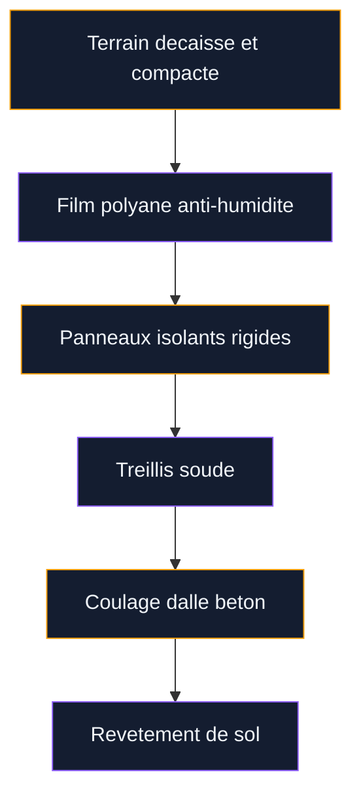
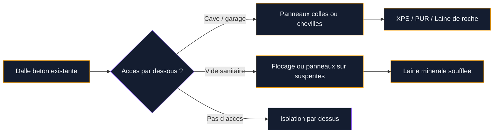

# Isolation d'une dalle en béton : techniques, matériaux et budget

Tu as un sol en béton qui reste glacial même en plein hiver avec le chauffage au max ? C'est normal : une dalle non isolée, c'est une vraie passoire thermique. Le béton conduit le froid directement depuis le sol vers tes pieds, et la chaleur que tu paies s'échappe par en bas. Résultat : inconfort permanent et facture de chauffage qui explose.

La bonne nouvelle, c'est qu'il existe trois grandes techniques pour isoler une dalle béton, selon ta situation : par-dessous avant le coulage, par-dessus sur une dalle existante, ou en sous-face quand tu as accès à un vide sanitaire ou une cave. Je te détaille chaque méthode avec les matériaux, les prix au m² et les erreurs à éviter.

## Pourquoi isoler ta dalle béton change tout

Le sol représente entre 7 et 10 % des pertes de chaleur d'une maison, selon l'ADEME. Ça paraît peu comparé aux murs ou à la toiture, mais c'est un froid très désagréable parce qu'il touche directement tes pieds. Une dalle non isolée en contact avec la terre, c'est un pont thermique permanent.

  

Les bénéfices concrets d'une isolation de dalle :

- **Confort thermique** : fini le sol glacé, tu gagnes 3 à 5 degres de température de surface
- **Economies d'énergie** : réduction de 5 à 10 % sur ta facture de chauffage annuelle
- **Absence de condensation** : plus de risques de moisissures au pied des murs
- **Compatibilité plancher chauffant** : l'isolation évite que la chaleur parte vers le bas

> [!NOTE]
> La réglementation thermique RE 2020 impose un coefficient R minimal de 3,7 m².K/W pour les planchers bas sur terre-plein ou vide sanitaire. Si tu rénoves ou construis, ton isolation de dalle doit respecter cette valeur pour obtenir les aides financières.

## Technique 1 : isolation sous dalle (construction neuve ou rénovation lourde)

C'est la méthode standard en construction neuve. On pose l'isolant directement sur le sol, avant de couler la dalle par-dessus. Si tu fais une extension ou que tu refais ton sol de zéro, c'est l'option à privilégier.

  

### Comment ça marche ?

Le principe est simple : on prépare le terrain, on pose un film polyane pour bloquer l'humidité, puis on installe des panneaux isolants rigides, et on coule le béton par-dessus.

### Quels matériaux choisir ?

| Matériau | Epaisseur courante | R (m².K/W) | Prix au m² |
|---|---|---|---|
| Polystyrène expansé (PSE) | 100 mm | 2,6 | 5-10 EUR |
| Polystyrène extrudé (XPS) | 100 mm | 3,4 | 10-18 EUR |
| Polyuréthane (PUR) | 80 mm | 3,6 | 15-25 EUR |
| Verre cellulaire | 120 mm | 3,0 | 25-40 EUR |

Le polystyrène extrudé (XPS) est le plus utilisé en sous-dalle. Il résiste bien à la compression (le poids de la dalle, des meubles, du passage) et supporte l'humidité sans se dégrader. Les marques Ursa XPS, Knauf Therm ou Sopra XPS sont des valeurs sûres.

Le polyuréthane offre la meilleure performance thermique à épaisseur égale. Si tu manques de hauteur sous plafond, c'est le choix malin : 80 mm de PUR isolent autant que 120 mm de PSE.

> [!TIP]
> Avant de poser les panneaux, vérifie que ton film polyane fait au moins 200 microns d'épaisseur et que les lés se chevauchent de 20 cm minimum. C'est le premier rempart contre les remontées d'humidité, et un film mal posé peut ruiner toute ton isolation.

### Budget complet isolation sous dalle

Pour un dallage béton complet avec isolation, compte environ 121 EUR HT/m² (source SP Batiment). Ce prix inclut le terrassement, le film polyane, l'isolant, le treillis soudé et le coulage du béton. Pour l'isolant seul, tu es entre 5 et 25 EUR/m² selon le matériau choisi.

## Technique 2 : isolation par-dessus (dalle existante)

Tu as déjà ta dalle béton et tu ne veux pas tout casser ? L'isolation par-dessus est la solution la plus accessible en rénovation. Tu poses des panneaux isolants rigides sur la dalle existante, puis un revêtement de sol par-dessus.

  

### Les deux approches possibles

**Panneaux rigides + chape** : tu poses des panneaux de polystyrène extrudé ou de polyuréthane directement sur la dalle, tu coules une chape liquide ou sèche par-dessus, puis tu poses ton carrelage, parquet ou lino. C'est la méthode la plus solide.

**Panneaux isolants avec revêtement intégré** : certains panneaux (type Efisol TMS ou Recticel Eurofloor) intègrent une couche de parement. Tu les poses et tu mets ton revêtement directement dessus. Plus rapide, mais moins de choix de finitions.

### Attention à la hauteur

C'est le point critique de cette technique. Ajouter de l'isolation par-dessus relève la hauteur du sol de 6 à 12 cm selon l'épaisseur de l'isolant et de la chape. Ca veut dire :

- Revoir les seuils de portes (raboter ou remplacer)
- Adapter les plinthes
- Vérifier la hauteur sous plafond (minimum 2,40 m après travaux)
- Recaler les prises électriques basses si besoin

> [!WARNING]
> Si ton sol n'est pas plan (différence de niveau de plus de 5 mm par mètre), il faut d'abord poser une ossature bois avec des laines isolantes entre les lambourdes. Un panneau rigide posé sur un sol irrégulier va se fissurer et perdre ses propriétés isolantes.

### Budget isolation par-dessus

| Poste | Prix au m² |
|---|---|
| Panneaux XPS 80 mm | 10-18 EUR |
| Panneaux PUR 60 mm | 12-22 EUR |
| Liège expansé 80 mm | 20-35 EUR |
| Chape liquide (6 cm) | 20-30 EUR |
| Pose par un pro | 25-40 EUR |
| **Total matériaux + pose** | **55-110 EUR** |

Le liège expansé est un choix intéressant si tu veux une solution naturelle. Il isole bien (lambda de 0,040 W/m.K), il est imputrescible et il apporte en plus une isolation phonique correcte. Tu en trouves chez Alsacork ou Amorim, entre 20 et 35 EUR/m² selon l'épaisseur.

## Technique 3 : isolation en sous-face (cave, garage, vide sanitaire)

Si tu as accès au plafond d'une cave, d'un garage ou d'un vide sanitaire sous ta dalle, c'est la technique la moins invasive. Tu n'as pas besoin de toucher à ton sol, pas de hauteur perdue, pas de revêtement à refaire. L'isolant se fixe directement sous la dalle.

  

### Comment procéder ?

Deux méthodes principales :

**Panneaux collés** : tu colles des panneaux de polystyrène extrudé ou de polyuréthane sous la dalle avec un mortier-colle adapté. Simple, rapide, efficace. Idéal pour les surfaces planes et régulières.

**Laine de roche en panneaux semi-rigides** : la solution Rockwool permet de poser jusqu'à 300 mm d'isolant sous dalle. C'est la méthode qui offre la meilleure performance thermique et aussi une bonne isolation acoustique. Fixation par chevilles à frapper dans le béton.

### Budget isolation en sous-face

| Solution | Prix au m² matériau | Prix pose incluse |
|---|---|---|
| XPS collé (80 mm) | 10-18 EUR | 25-40 EUR |
| PUR collé (60 mm) | 14-22 EUR | 30-45 EUR |
| Laine de roche Rockwool (200 mm) | 15-25 EUR | 35-55 EUR |
| Flocage laine minérale (vide sanitaire) | 8-15 EUR | 20-35 EUR |

L'isolation en sous-face est souvent la plus rentable en rénovation : pas de travaux à l'intérieur, pas de hauteur perdue, et des prix au m² contenus. C'est aussi la technique la plus simple à réaliser soi-même si ta cave est accessible et que le plafond est en béton brut.

> [!TIP]
> Si ta dalle est dans une cave humide, utilise du polystyrène extrudé (XPS) ou du polyuréthane et pas de la laine minérale. Les laines absorbent l'humidité et perdent leurs propriétés isolantes. Le XPS est insensible à l'eau et garde ses performances même en milieu humide.

## Normes et DTU à respecter

Que tu fasses les travaux toi-même ou que tu fasses appel à un pro, certaines règles techniques s'appliquent :

  

- **DTU 26.2** : chapes et dalles à base de liants hydrauliques (concerne la chape sur isolant)
- **DTU 52.10** : mise en oeuvre de sous-couches isolantes sous chape
- **RE 2020** : R minimal de 3,7 m².K/W pour plancher bas en construction neuve
- **CPT 3578** : cahier de prescriptions techniques pour les sols sur isolant

En rénovation, ces normes ne sont pas toujours obligatoires, mais les respecter te garantit un résultat durable et te permet d'accéder aux aides financières (MaPrimeRénov', CEE).

## Comparatif global : quelle technique pour ta situation ?

| Critère | Sous dalle | Par-dessus | En sous-face |
|---|---|---|---|
| Adapté à la rénovation | Non | Oui | Oui |
| Hauteur perdue | Aucune | 6-12 cm | Aucune |
| Travaux côté habitation | Oui (gros oeuvre) | Oui (sol) | Non |
| Budget moyen au m² | 20-40 EUR (isolant seul) | 55-110 EUR | 25-55 EUR |
| Difficulté DIY | Difficile | Moyen | Facile |
| Performance maximale | Très bonne | Bonne | Très bonne |

Si tu es en pleine construction, l'isolation sous dalle est le choix logique : c'est la plus performante et elle ne coûte pas beaucoup plus cher intégrée au chantier. En rénovation, la sous-face est souvent la meilleure option si tu as un accès par en dessous. L'isolation par-dessus reste la solution quand tu n'as pas d'autre choix, mais attention à la perte de hauteur.

Si tu dois aussi intervenir sur les murs en contact avec ta dalle, jette un oeil au guide pour [enduire un mur en parpaing](/guides/decoration/comment-enduir-un-mur-en-parpaing/) - c'est souvent l'occasion de traiter les ponts thermiques aux jonctions mur-sol. Et pour tes murs de cave ou de sous-sol, le guide pour [recouvrir des parpaings](/guides/decoration/recouvrir-parpaings/) te donnera des idées pour combiner isolation et finition esthétique.

Si ton projet inclut aussi l'isolation des espaces attenants (cage d'escalier vers la cave, par exemple), pense à consulter le guide sur [l'isolation d'une montée d'escalier](/guides/decoration/comment-isoler-une-montee-descalier/) pour traiter le problème dans sa globalité.

> [!IMPORTANT]
> Pense aux ponts thermiques en périphérie de dalle. L'isolant doit remonter sur les murs de fondation (bandes de rive) pour éviter que le froid passe par les bords. C'est un détail souvent oublié en DIY, mais il peut annuler jusqu'à 30 % du bénéfice de ton isolation si tu le négliges.

## Sur le meme theme

- [peindre du lino](/guides/decoration/peindre-lino/)
- [crépir un mur intérieur](/guides/decoration/crepir-un-mur-interieur/)

## FAQ

### Est-ce que je peux isoler ma dalle béton moi-même ?

Ca dépend de la technique. L'isolation en sous-face (coller des panneaux sous une dalle de cave) est tout à fait faisable en DIY avec un budget de 10 à 25 EUR/m² en matériaux. L'isolation par-dessus demande plus de soin (planéité, chape) mais reste accessible. L'isolation sous dalle en revanche implique du gros oeuvre - mieux vaut passer par un maçon.

### Quelle épaisseur d'isolant pour une dalle béton ?

Pour atteindre le R de 3,7 m².K/W exigé par la RE 2020, il te faut environ 100 mm de polystyrène extrudé (XPS), 80 mm de polyuréthane (PUR) ou 150 mm de polystyrène expansé (PSE). En rénovation, même 60 mm de PUR (R de 2,7) améliorent déjà beaucoup le confort.

### Combien coûte l'isolation d'une dalle béton de 50 m² ?

Pour 50 m², compte entre 1 250 et 2 750 EUR en sous-face (pose comprise), entre 2 750 et 5 500 EUR par-dessus (avec chape), et entre 1 000 et 2 000 EUR pour l'isolant seul en sous-dalle. Ces fourchettes varient selon le matériau choisi et ta région.

### L'isolation de dalle béton est-elle éligible aux aides ?

Oui, l'isolation du plancher bas est éligible à MaPrimeRénov' et aux Certificats d'Economies d'Energie (CEE), à condition de faire réaliser les travaux par un artisan RGE et d'atteindre un R minimal de 3,0 m².K/W. Les CEE peuvent couvrir 5 à 12 EUR/m², ce qui réduit le reste à charge de 20 à 40 %.
