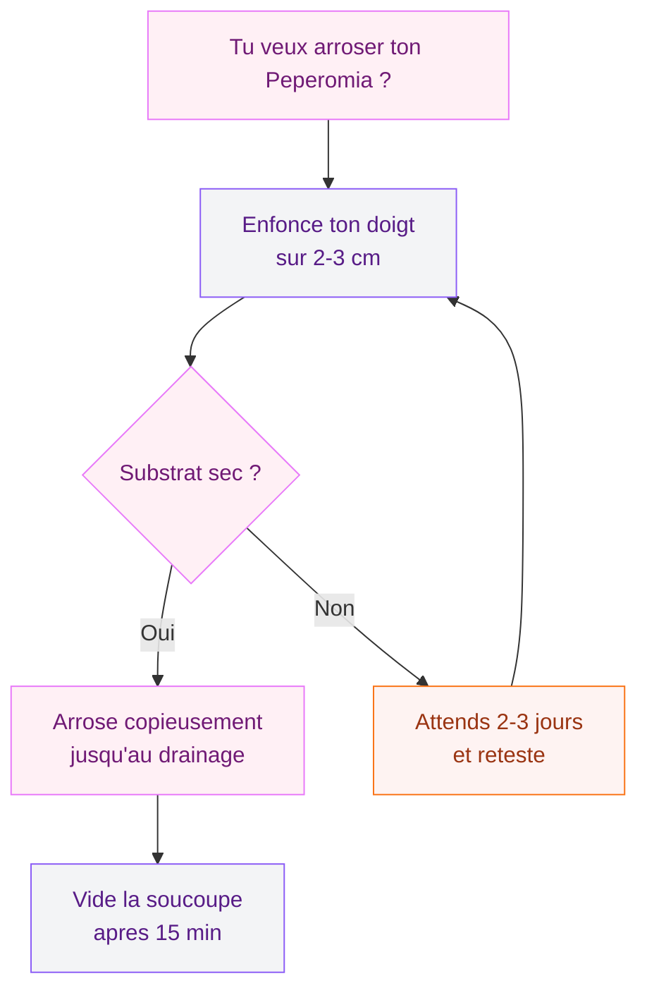
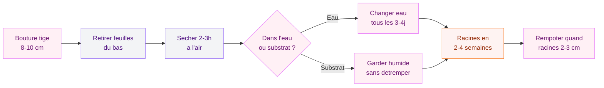

Le Peperomia Hope, c'est la plante retombante qui met tout le monde d'accord. Petites feuilles rondes et charnues, tiges souples qui cascadent d'une étagère ou d'une suspension, et surtout : une réputation de plante "facile" qui tient vraiment ses promesses. Si tu cherches une plante d'intérieur qui apporte du volume et de la douceur sans exiger un doctorat en botanique, tu es au bon endroit.

Je l'adore parce qu'elle s'adapte à presque toutes les ambiances déco - que tu sois plutôt [déco marocaine chaleureuse](/decoration-marocaine-moderne-ou-classique/) ou minimalisme scandinave. Et surtout, elle pardonne pas mal d'erreurs de débutant. Mais "facile" ne veut pas dire "zéro effort". Alors on va voir ensemble comment en prendre soin correctement pour qu'elle reste belle longtemps.

## Peperomia Hope : portrait rapide de cette petite merveille

Le Peperomia Hope est un hybride entre deux espèces - le Peperomia deppeana et le Peperomia quadrifolia. Originaire des forêts tropicales d'Amérique centrale et du Sud, il pousse naturellement dans les sous-bois humides, accroché aux troncs d'arbres ou installé dans la mousse. Ça te donne déjà un indice important sur ce qu'il aime : lumière filtrée, humidité modérée, pas de soleil direct qui crame.

  

Ses feuilles rondes, un peu succulentes, poussent par paires ou par groupes de quatre le long de tiges fines. Quand la plante est bien installée, ces tiges retombent joliment sur 30 à 40 cm. C'est pour ça qu'on l'aime autant en suspension macramé ou posée en hauteur sur une étagère.

> [!NOTE]
> Le Peperomia Hope est parfois vendu sous le nom "Peperomia rotundifolia" en jardinerie. C'est une confusion fréquente - ce sont des espèces proches mais pas identiques. Vérifie que les feuilles sont bien épaisses et charnues, pas fines et translucides.

### Où l'acheter et à quel prix ?

En jardinerie classique (Truffaut, Botanic, Jardiland), un Peperomia Hope en pot de 12 cm coûte entre 6 et 12€. En ligne, regarde du côté de Bergamotte (9-15€), Green Factory ou même Amazon (souvent 8-14€ avec le pot). Les spécimens plus fournis en pot suspendu de 17 cm tournent autour de 18-25€.

Mon conseil : évite les spécimens qui ont déjà des tiges très longues et dénudées à la base. C'est signe que la plante a manqué de lumière en magasin et elle aura du mal à se regarnir.

## Lumière : le premier réflexe pour un Peperomia Hope en forme

C'est LE point qui fait toute la différence. Le Peperomia Hope aime la lumière vive mais indirecte. Concrètement, ça veut dire :

  

- **L'idéal** : près d'une fenêtre orientée est ou ouest, à 50 cm du vitrage, ou derrière un voilage côté sud
- **Ça passe** : une pièce bien éclairée naturellement, même sans soleil direct sur la plante
- **À éviter** : le soleil direct d'été (derrière une baie vitrée plein sud sans filtre = feuilles brûlées) et les coins sombres (la plante s'étiole, les tiges s'allongent, les feuilles rapetissent)

En hiver, quand la lumière naturelle diminue, rapproche ta plante de la fenêtre. Tu peux même la mettre en plein soleil d'hiver sans souci - les rayons sont bien moins intenses de novembre à février.

> [!TIP]
> Tu veux savoir si ta plante manque de lumière ? Regarde l'espace entre deux paires de feuilles sur les tiges (les entre-noeuds). S'ils s'allongent et deviennent plus espacés que 2-3 cm, ta plante "file" pour chercher la lumière. Déplace-la vite vers un spot plus lumineux.

## Arrosage : la règle d'or pour ne pas le tuer

L'arrosage, c'est là où 90% des gens se plantent (sans mauvais jeu de mots). Le Peperomia Hope stocke de l'eau dans ses feuilles charnues - un peu comme une succulente. Résultat : il craint bien plus l'excès d'eau que la sécheresse.

  

### La méthode qui marche

**Laisse sécher le substrat entre deux arrosages.** Enfonce ton doigt sur 2-3 cm dans la terre. Si c'est sec, arrose. Si c'est encore humide, attends. C'est aussi simple que ça.

En pratique :
- **Printemps-été** : un arrosage tous les 7 à 10 jours
- **Automne-hiver** : un arrosage tous les 12 à 18 jours
- **En pot en terre cuite** : la terre sèche plus vite, donc arrose un peu plus souvent
- **En pot en plastique** : l'eau stagne plus, espace davantage

Quand tu arroses, fais-le copieusement jusqu'à ce que l'eau sorte par les trous de drainage. Puis vide la soucoupe après 15-20 minutes. Jamais de "pieds dans l'eau".

> [!WARNING]
> Les signes d'un excès d'eau : feuilles qui jaunissent à la base, tiges molles et noircies, odeur de moisi. Si tu en es là, dépote la plante immédiatement, retire les racines pourries, laisse sécher 24h et rempote dans du substrat frais et sec. Il y a encore moyen de la sauver si tu agis vite.

## Le bon substrat : léger, aérien, bien drainé

Oublie le terreau classique "spécial plantes vertes" acheté en supermarché - trop compact, il retient trop d'eau et les racines du Peperomia détestent ça. Ce qu'il faut, c'est un mélange léger et drainant.

  

### Ma recette maison

- 50% terreau plantes vertes (Compo ou Fertiligène, 5-8€ les 20L)
- 30% perlite (Plagron, 7-10€ les 10L)
- 20% écorce de pin fine (3-5€ les 10L)

Tu mélanges le tout, et tu obtiens un substrat qui retient juste assez d'humidité sans étouffer les racines. En alternative, un terreau "spécial cactées et succulentes" (Fertiligène, 5€ les 6L) fonctionne aussi très bien pour les Peperomia.

### Le pot idéal

Un pot en terre cuite avec un trou de drainage, c'est le top. La terre cuite est poreuse, elle laisse respirer les racines et aide le substrat à sécher plus régulièrement. Taille : un pot juste un peu plus grand que la motte racinaire, pas plus. Les Peperomia ont de petites racines et n'aiment pas les pots trop grands où l'eau stagne dans le surplus de terre.

Un pot en terre cuite de 12-14 cm chez Ikea coûte entre 1,50€ et 3€. Chez Deroma, les modèles en terracotta sont à 3-6€. Pas besoin de se ruiner.

## Température et humidité : les zones de confort

Le Peperomia Hope est une plante tropicale, mais pas capricieuse. Voici ses préférences :

  

**Température** : entre 18 et 26°C. Autrement dit, la température de ton appartement ou de ta maison lui convient parfaitement toute l'année. Ne descends pas en dessous de 13-14°C (pas de balcon en hiver, pas près d'une fenêtre qui laisse passer les courants froids).

**Humidité** : entre 40 et 60%, ce qui correspond à l'hygrométrie normale d'un intérieur chauffé. Pas besoin de brumisateur, pas besoin de plateau de billes d'argile, pas besoin de l'installer dans la salle de bain. Si ton air est vraiment très sec (chauffage électrique à fond en plein hiver), un petit humidificateur à côté fera l'affaire - mais c'est rarement utile.

> [!TIP]
> Tu aménages une pièce et tu veux y intégrer des plantes ? Pense à la [déco de chambre avec des couleurs chaudes](/deco-terracotta-chambre/) - le Peperomia Hope s'intègre parfaitement avec les tons terracotta et les matières naturelles comme le raphia ou le bois clair.

## Engrais : quand et comment nourrir ta plante

Le Peperomia Hope n'est pas un gros mangeur. Un engrais liquide pour plantes vertes (type Algoflash, 6-8€ les 500ml) dilué à moitié de la dose indiquée, une fois par mois de mars à septembre. C'est tout.

De octobre à février, pas d'engrais. La plante est au repos et n'assimile pas bien les nutriments. Trop d'engrais en hiver peut brûler les racines et provoquer des dépôts de sels dans le substrat.

## Rempotage : tous les 2 ans, max

Le Peperomia Hope a un système racinaire modeste. Il n'a pas besoin d'être rempoté souvent. La bonne fréquence : tous les 2 ans, au printemps (mars-avril), dans un pot d'un seul numéro au-dessus (passer d'un pot de 12 cm à un pot de 14 cm, par exemple).

**Les signes qu'il est temps de rempoter** :
- Les racines sortent par les trous de drainage
- Le substrat sèche extrêmement vite (en 1-2 jours)
- La croissance est stoppée depuis plusieurs mois malgré de bonnes conditions

Pour le rempotage, utilise le mélange de substrat décrit plus haut. Ne tasse pas trop la terre, les racines du Peperomia aiment respirer.

## Bouturage : multiplie ta collection gratuitement

C'est là que le Peperomia Hope devient vraiment génial. Le bouturage est ultra simple et le taux de réussite est élevé, même si tu débutes.

### Bouture de tige (la plus facile)

1. Coupe une tige saine de 8-10 cm avec un sécateur propre
2. Retire les 2-3 paires de feuilles du bas
3. Laisse la coupe sécher à l'air libre pendant 2-3 heures
4. Place la tige dans un petit verre d'eau (seule la partie dénudée doit tremper) ou directement dans du substrat humide
5. Installe dans un endroit lumineux et chaud
6. En eau : change l'eau tous les 3-4 jours. Des racines apparaissent en 2 à 4 semaines
7. Quand les racines font 2-3 cm, rempote dans du substrat

### Bouture de feuille

C'est aussi possible mais plus lent. Coupe une feuille avec un petit bout de tige, plante-la dans du substrat humide, couvre d'un sac plastique transparent pour maintenir l'humidité. Patience : ça peut prendre 6 à 8 semaines.

## Les problèmes courants (et comment les régler)

### Feuilles qui tombent

Si les feuilles tombent au moindre contact, c'est presque toujours un problème d'arrosage - trop ou pas assez. Vérifie le substrat. Si la terre est détrempée, laisse sécher et réduis la fréquence. Si elle est sèche comme du carton, arrose bien et reprends un rythme régulier.

### Feuilles molles et transparentes

Trop d'eau. Dépote, vérifie les racines (noires et molles = pourriture). Coupe les parties abîmées et rempote dans du substrat sec.

### Tiges qui s'allongent avec peu de feuilles

Manque de lumière. Déplace ta plante vers un emplacement plus lumineux. Tu peux tailler les tiges trop longues - ça stimulera de nouvelles pousses à la base et tu pourras bouturer les morceaux coupés.

### Petites bestioles blanches sous les feuilles

Ce sont probablement des cochenilles farineuses, l'ennemi numéro 1 des plantes d'intérieur. Traite avec un coton imbibé d'alcool à 70° sur chaque insecte visible, puis pulvérise un mélange eau + savon noir (1 cuillère à soupe de savon noir Marius Fabre pour 500ml d'eau). Répète tous les 5 jours pendant 3 semaines.

## Où installer ton Peperomia Hope dans la maison

Le Peperomia Hope est versatile en déco. Voici les spots qui fonctionnent le mieux :

- **Suspension macramé** devant une fenêtre est ou ouest : classique et efficace. Une suspension macramé chez H&M Home ou Maisons du Monde coûte 10-25€
- **Étagère haute** dans le salon ou la chambre : ses tiges retombantes créent un joli rideau végétal
- **Bureau** près d'une fenêtre : plante compacte et apaisante, parfaite pour un espace de travail
- **Salle de bain lumineuse** : si tu as une fenêtre dans ta [salle de bain en béton ciré](/meuble-salle-de-bain-beton-cire/) ou une salle d'eau bien éclairée, l'humidité naturelle lui plaira

Évite les courants d'air (près d'une porte d'entrée, d'une climatisation, d'une bouche de ventilation). Les variations brusques de température stressent la plante et provoquent la chute des feuilles.

> [!IMPORTANT]
> Le Peperomia Hope est non toxique pour les chats et les chiens (confirmé par l'ASPCA). Si tu as des animaux curieux qui grignotent les plantes, c'est une des rares options vraiment safe. Ça vaut la peine d'en tenir compte quand tu choisis tes [plantes de décoration intérieure](/guides/decoration/).

## Sur le meme theme

- [scindapsus pictus](/entretenir-du-scindapsus-pictus-la-plante-robuste-qui-a-tout-pour-plaire/)

## FAQ

### À quelle fréquence arroser un Peperomia Hope ?

En moyenne, tous les 7 à 10 jours au printemps-été et tous les 12 à 18 jours en automne-hiver. La règle fiable : enfonce ton doigt dans le substrat. Si les 2-3 premiers centimètres sont secs, c'est le moment d'arroser. Chaque intérieur est différent (chauffage, exposition, type de pot), donc fie-toi au toucher plutôt qu'au calendrier.

### Pourquoi les feuilles de mon Peperomia Hope tombent-elles ?

La chute des feuilles est le signe numéro 1 d'un problème d'arrosage. Un excès d'eau provoque la pourriture des racines, qui ne peuvent plus alimenter la plante. Un manque d'eau prolongé donne des feuilles ridées puis une chute. Vérifie le substrat et ajuste. Les courants d'air froid et les changements brusques de température peuvent aussi causer ce problème.

### Le Peperomia Hope est-il toxique pour les animaux ?

Non. Le Peperomia Hope est classé non toxique par l'ASPCA (American Society for the Prevention of Cruelty to Animals) pour les chats comme pour les chiens. C'est un excellent choix si tu vis avec des animaux de compagnie et que tu veux verdir ton intérieur sans risque.
