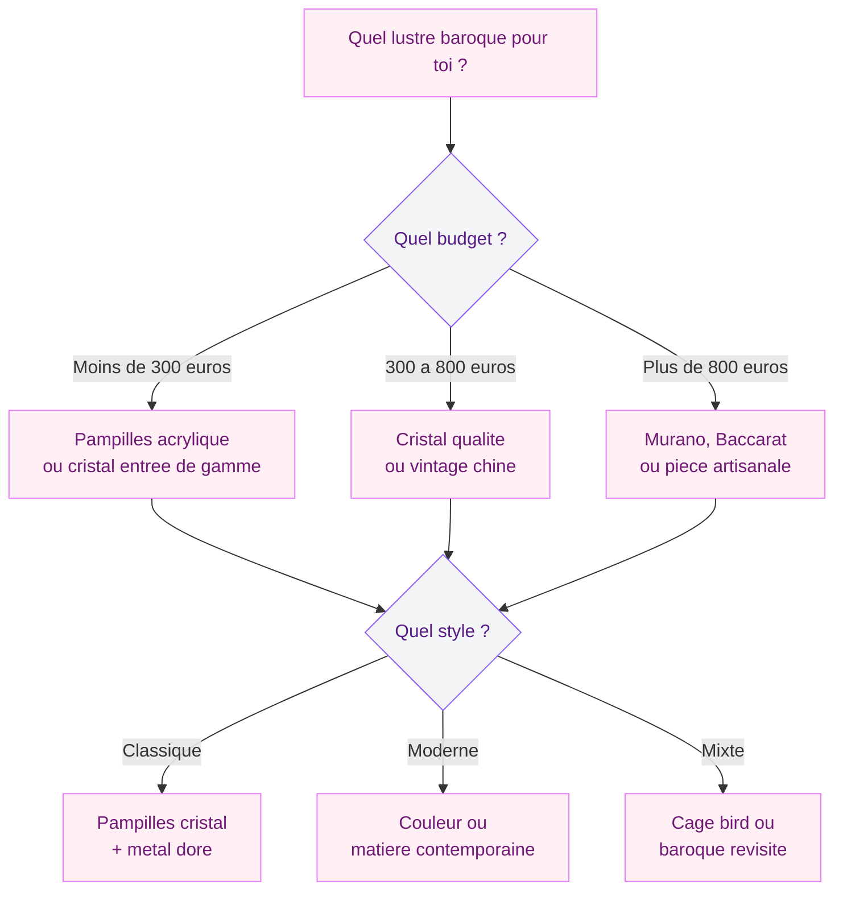
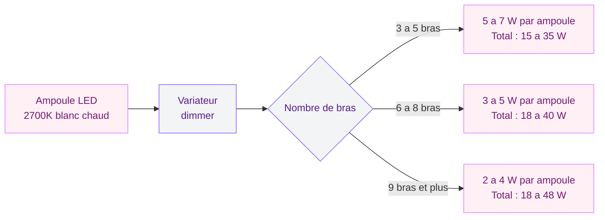
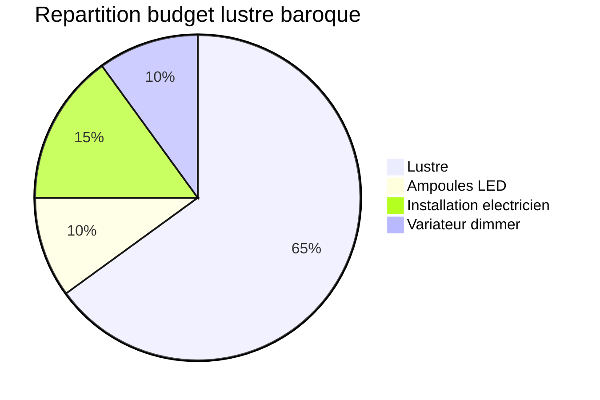

Un lustre baroque suspendu dans un salon épuré, ses bras en cristal qui captent la lumière du soir - ce mélange de grandeur classique et de sobriété contemporaine, c'est ce qui rend ce luminaire aussi intéressant en 2026. Mais attention : un lustre à pampilles, ca ne se pose pas n'importe comment. Mal choisi ou mal placé, il donne vite un effet "salle de bal abandonnée". Bien intégré, il devient la pièce maitresse de ta déco.

Je te guide pour choisir, installer et accorder un lustre baroque dans un intérieur moderne - avec des repères de prix concrets et des erreurs à éviter.

## D'où vient le lustre baroque (et pourquoi il revient)

Le lustre baroque nait au 17e siècle, en pleine explosion de l'art baroque en Europe - l'époque de Louis XIV, de Versailles, de tout ce qui brille. Les premiers lustres étaient en cristal de roche taillé à la main, suspendus dans les galeries des palais pour amplifier la lumière des bougies.

Le modèle emblématique reste la Galerie des Glaces à Versailles : 20 000 bougies, des centaines de lustres en cristal, une mise en scène pour impressionner. Le V&A Museum de Londres décrit le style baroque comme "orné, élaboré, et concu pour provoquer l'émerveillement". Le lustre en est la pièce centrale.

> [!NOTE]
> Le cristal de roche utilisé dans les premiers lustres baroques (17e siècle) était taillé à la main, pièce par pièce. C'est au 18e siècle que le cristal au plomb - moins cher et plus brillant - a permis de démocratiser les lustres à pampilles.

Pourquoi ce retour en 2026 ? On sort d'une longue période minimaliste. Après des années de suspensions filaires et de lampes scandinaves, l'envie de remettre du caractère dans les intérieurs s'impose. Le lustre baroque répond à ca : volume, reflet, personnalité. Et la tendance du [classique contemporain](/guides/decoration/decoration-classique-20-images-et-idees-contemporaines/) joue en sa faveur - on assume le mélange ancien-moderne sans complexe.

## Les différents types de lustres baroques

Tous les lustres baroques ne se ressemblent pas. Voici les grandes familles pour choisir celui qui colle à ton intérieur.

### Le lustre à pampilles en cristal

C'est le classique absolu. Des bras en métal (doré ou argenté) d'où pendent des dizaines de pampilles en cristal taillé. L'effet prisme est spectaculaire - chaque pampille diffuse des arcs-en-ciel discrets sur les murs quand le soleil la traverse.

Prix : de 150 euros pour un modèle d'entrée de gamme (Maisons du Monde, IKEA avec la gamme KNIXHULT) à 800-2 000 euros pour du cristal de qualité (marques comme Mathieu Lustrerie, MW Light). Les pièces vintage chinées se trouvent entre 200 et 600 euros en brocante ou sur Selency.

### Le lustre cage ou "bird cage"

Forme arrondie, structure en métal avec des pampilles qui cascadent depuis le sommet. C'est une version un peu plus compacte et moderne du lustre classique. Il fonctionne très bien dans une entrée ou au-dessus d'une table ronde.

Prix : entre 120 et 500 euros selon la taille et la finition.

### Le lustre baroque coloré

Tendance forte : des lustres en verre de Murano ou en acrylique teinté, rose poudré, noir mat ou bleu marine. L'esprit baroque est là (formes, courbes, pampilles) mais la couleur apporte une touche contemporaine qui casse le côté "chateau".

Prix : de 200 euros pour de l'acrylique à 3 000+ euros pour du Murano soufflé à la main.

### Le lustre baroque revisité (contemporain)

Des designers comme Philippe Starck (avec le Bourgie pour Kartell, autour de 250 euros) ou Baccarat (gamme Zénith, à partir de 5 000 euros) ont repris les codes baroques - symétrie, pampilles, volume - dans des matériaux modernes : polycarbonate, acier, cristal industriel. C'est le choix parfait si tu veux l'esprit sans le poids historique.

## Comment intégrer un lustre baroque dans un intérieur contemporain

C'est là que ca se joue. Un lustre baroque dans le mauvais contexte donne un effet décalé. Voici les règles que j'applique.

### Règle 1 : le contraste est ton ami

Le lustre baroque est orné, chargé. Pour qu'il respire, il a besoin d'un décor sobre autour de lui : murs blancs, gris clair ou béton brut, mobilier aux lignes droites. Pas de tapis persan ni de rideaux en velours bordeaux à côté - sauf si tu assumes le total look classique (voir [déco classique contemporaine](/guides/decoration/decoration-classique-20-images-et-idees-contemporaines/)).

L'idée : le lustre est le seul élément "chargé" de la pièce. Tout le reste se met en retrait.

### Règle 2 : bien dimensionner le lustre par rapport à la pièce

Un lustre trop petit dans une grande pièce, c'est ridicule. Trop gros, c'est étouffant. Une formule simple :

**Diamètre idéal en centimètres = (longueur de la pièce en mètres + largeur en mètres) x 10**

Pour un salon de 4 x 5 mètres : (4 + 5) x 10 = 90 cm de diamètre. Ca te donne un lustre imposant mais proportionné. Pour une chambre de 3 x 4 mètres : 70 cm, ce qui correspond à un modèle moyen.

> [!TIP]
> Pour la hauteur, le bas du lustre doit se trouver à minimum 2,10 m du sol dans une zone de passage, et entre 75 et 90 cm au-dessus d'une table à manger si tu le places au-dessus d'un coin repas.

### Règle 3 : jouer avec les finitions métal

Le choix de la finition change tout. Un lustre en laiton doré brillant donne un effet classique pur. Le meme modèle en noir mat ou chrome brossé bascule dans le contemporain.

En 2026, les finitions qui fonctionnent le mieux pour un mix baroque-moderne : le laiton brossé (or mat), le noir mat, et le bronze patiné. Si tu aimes les [touches dorées dans ta déco](/guides/decoration/decoration-doree-sur-les-murs-les-meubles-ou-les-accessoires/), le lustre baroque est l'un des meilleurs supports pour ca.

### Règle 4 : l'éclairage, pas juste la déco

Un lustre baroque est aussi un luminaire qui doit éclairer correctement. Quelques conseils :

- Opte pour des ampoules LED blanc chaud (2 700 K) pour retrouver la chaleur des bougies d'origine
- Installe un variateur d'intensité (dimmer) : un lustre baroque en lumière tamisée, c'est magique ; à pleine puissance, ca peut etre trop
- Si le lustre a beaucoup d'ampoules (6, 8, 12), choisis une puissance faible par ampoule (3 à 5 W LED) pour un total agréable

## Où placer un lustre baroque chez soi

Le salon est le choix évident, mais pas le seul emplacement possible.

### Au-dessus de la table à manger

C'est peut-etre le meilleur emplacement. Le lustre crée un centre de gravité visuel au-dessus de la table, la lumière des pampilles habille les repas d'une ambiance chaleureuse. Dans un salon [moderne et épuré](/guides/decoration/salons-modernes-et-elegants-2026/), il devient LE point focal de la pièce.

### Dans l'entrée

Un lustre baroque dans l'entrée, meme petit (40 à 60 cm de diamètre), donne le ton dès l'arrivée. Pour une entrée étroite, privilégie un modèle allongé plutot qu'étalé en largeur.

### Dans la chambre

Ca peut surprendre, mais un lustre baroque en chambre - modèle translucide ou aux teintes douces - apporte un côté romantique réussi. On retrouve ce choix dans la [déco française romantique](/guides/decoration/decoration-francaise-idees-et-photos-romantiques/), avec des draps en lin et des murs pastel.

### Dans la salle de bain (oui, vraiment)

Pour une salle de bain spacieuse avec baignoire ilot, un petit lustre baroque remplace avantageusement le plafonnier basique. Vérifie l'indice IP : il te faut un IP44 minimum (résistant aux projections). Quelques marques proposent des modèles adaptés (Kolarz, Eglo).

> [!WARNING]
> Ne place jamais un lustre standard (sans protection IP) dans une zone humide. En salle de bain, il doit se trouver à plus de 60 cm de la douche ou de la baignoire ET avoir un indice IP44 ou plus. C'est une norme de sécurité électrique, pas une option.

## Entretien : garder l'éclat du cristal

Un lustre baroque, ca s'entretient. Les pampilles accumulent la poussière et perdent leur brillance en quelques mois.

**Nettoyage rapide (toutes les 2 semaines)** : un coup de plumeau microfibre sur les pampilles. Ca suffit pour retirer la poussière de surface.

**Nettoyage en profondeur (2 à 3 fois par an)** : décroche les pampilles une par une (photo du montage avant pour te rappeler l'ordre). Trempe-les 10 minutes dans eau tiède + vinaigre blanc (1/3 vinaigre, 2/3 eau). Rince et sèche avec un chiffon doux sans peluche.

**Astuce rapide** : les sprays nettoyants pour cristal (Hagerty, autour de 12 euros) se vaporisent directement sans démontage. Tu poses un drap au sol pour les gouttes. Moins parfait qu'à la main, mais ca dépanne.

> [!TIP]
> Porte des gants en coton blanc quand tu manipules les pampilles en cristal : les traces de doigts sont très visibles une fois la lumière allumée et demandent un polissage supplémentaire.

## Budget : combien prévoir

Voici un récapitulatif réaliste des prix en 2026 :

| Type de lustre | Budget entrée de gamme | Budget milieu de gamme | Haut de gamme |
|---|---|---|---|
| Pampilles acrylique | 50 - 120 euros | 120 - 250 euros | - |
| Cristal standard | 150 - 300 euros | 300 - 800 euros | 800 - 2 000 euros |
| Cristal de Murano | - | 800 - 2 000 euros | 2 000 - 8 000 euros |
| Designer (Kartell, Baccarat) | 200 - 400 euros | 400 - 2 000 euros | 2 000 - 15 000 euros |
| Vintage/chiné | 80 - 200 euros | 200 - 600 euros | 600 - 1 500 euros |

Pour un premier achat, le créneau 200-500 euros est idéal : cristal véritable de qualité correcte, ou beau modèle vintage avec du caractère. Maisons du Monde, La Redoute Intérieurs et AM.PM proposent des modèles baroques revisités dans cette gamme.

Pour l'installation, compte 60 à 150 euros pour un électricien - recommandé pour les modèles lourds (plus de 5 kg) qui nécessitent un point d'accroche renforcé.

## Les erreurs les plus courantes (et comment les éviter)

**Erreur 1 : trop de baroque partout.** Un lustre baroque + des miroirs dorés + du velours + des moulures = saturation. Choisis un ou deux éléments baroques, pas plus. Le lustre est déjà une pièce forte.

**Erreur 2 : oublier la hauteur sous plafond.** Un lustre de 70 cm de diamètre avec 50 cm de hauteur a besoin d'au moins 2,50 m sous plafond. Si tes plafonds sont bas (2,30 m), oriente-toi vers un plafonnier baroque plutot qu'un lustre suspendu.

**Erreur 3 : négliger le poids.** Un lustre en cristal de 8 bras pèse facilement 8 à 15 kg. Un crochet de plafond standard supporte 5 kg max. Il faut une fixation dans une poutre ou un renfort spécifique. Fais vérifier par un pro avant de suspendre quoi que ce soit.

**Erreur 4 : mauvaise température de couleur.** Des ampoules blanc froid (5 000 K) dans un lustre baroque, c'est un crime visuel. Le cristal joue avec la lumière chaude. Blanc chaud (2 700 K) ou extra chaud (2 200 K) pour un effet bougie.

> [!IMPORTANT]
> Avant d'acheter un lustre lourd, vérifie que ta dalle de plafond peut supporter le poids. Dans un immeuble ancien, les plafonds en platre sur lattis ne sont pas toujours solides. Fais percer un trou d'essai ou demande à un artisan de vérifier la structure.

## Sur le meme theme

- [salons modernes 2026](/guides/decoration/salons-modernes-tendances-2026/)

## FAQ - Lustre baroque

### Est-ce qu'un lustre baroque va dans un petit appartement ?

Oui, à condition de choisir la bonne taille. Un petit lustre de 40 à 50 cm de diamètre fonctionne très bien dans un studio ou un deux-pièces. L'idée n'est pas de reproduire Versailles mais de créer un point lumineux avec du caractère. Place-le au-dessus de la table ou dans l'entrée pour un effet maximum sans surcharge.

### Comment savoir si mon lustre est en vrai cristal ou en verre ?

Le cristal au plomb est plus lourd que le verre ordinaire. Il produit un son clair et prolongé quand tu le frappes légèrement (le verre fait un son sourd et court). Il disperse aussi la lumière en arcs-en-ciel - c'est l'effet prisme du plomb. Si le vendeur annonce du "cristal" sans préciser le pourcentage de plomb (minimum 24 % pour s'appeler cristal en Europe), méfie-toi.

### Peut-on mettre un lustre baroque dans une cuisine ?

Tout à fait, surtout au-dessus d'un ilot central. Mais évite de le placer directement au-dessus de la zone de cuisson : les vapeurs de graisse se déposent sur les pampilles et le nettoyage devient vite pénible. Décale-le de 60 cm minimum par rapport à la plaque. Et dans une cuisine, un modèle en acrylique ou en métal sera plus facile à entretenir que du cristal.

### Quel style de mobilier associer à un lustre baroque ?

Le contraste fonctionne le mieux. Un canapé contemporain aux lignes droites, une table en bois brut ou en métal, des chaises design - le lustre baroque vient casser cette sobriété et crée une tension esthétique intéressante. Évite le total look classique (lustre baroque + mobilier Louis XV + tapis oriental) sauf si tu assumes un intérieur 100 % classique.

### Un lustre baroque consomme-t-il beaucoup d'électricité ?

Avec des ampoules LED modernes, non. Un lustre à 8 bras équipé d'ampoules LED de 4 W consomme 32 W au total - soit l'équivalent d'une ampoule classique de 200 W en luminosité, pour un cout d'environ 5 euros par an si tu l'allumes 4 heures par jour. Les LED ont rendu les lustres multi-bras très économiques.
