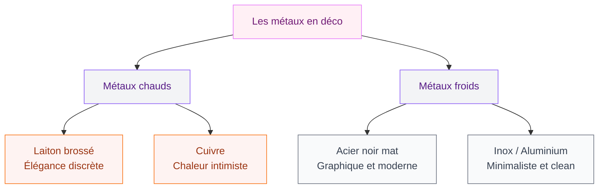
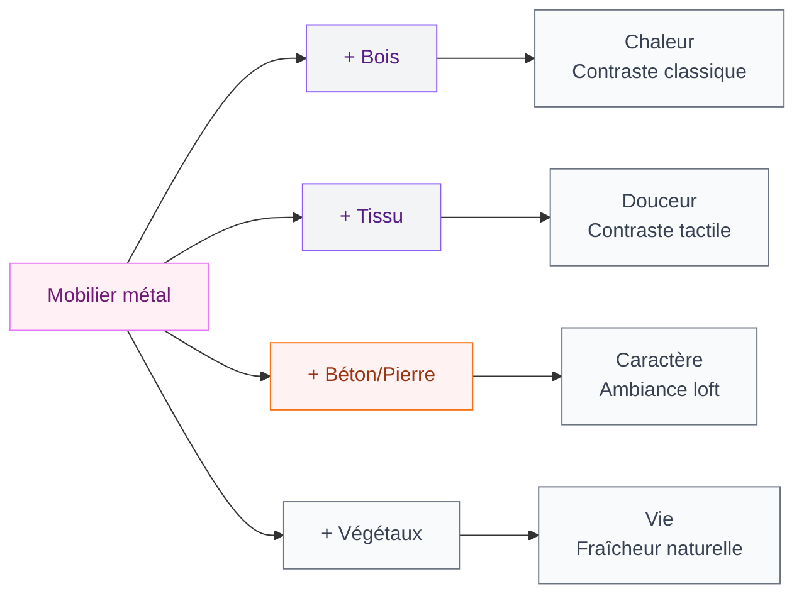
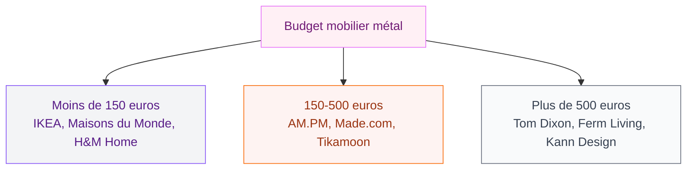

Tu as repéré ces étagères en métal noir dans un magazine, cette table basse en laiton brossé sur Instagram, ou ce tabouret en acier brossé chez une amie ? Le métal est partout en déco depuis quelques années, et en 2026, il s'impose encore plus fort. Mais pas n'importe comment. On est loin du total look industriel des lofts new-yorkais des années 2010. Aujourd'hui, le métal se mélange, se patine, se fond dans des intérieurs chaleureux et raffinés.

Dans cet article, je te guide pour choisir les bons métaux, les bons meubles, et surtout les bonnes associations pour créer un intérieur qui a du caractère sans tomber dans la froideur.

## Pourquoi le métal s'impose en décoration en 2026

Le métal a toujours eu une place dans nos intérieurs - poignées de porte, pieds de chaise, luminaires. Ce qui change, c'est qu'il passe du simple détail fonctionnel à un vrai élément de style. Plusieurs raisons expliquent ce retour en force.

D'abord, la tendance aux matières brutes et authentiques pousse vers des matériaux qui montrent leur texture. Le métal, qu'il soit brossé, martelé ou poli, raconte quelque chose. Il vieillit bien, il prend une patine avec le temps, il a une présence visuelle forte.

Le métal répond aussi à un besoin de durabilité. Un meuble en acier ou en fer forgé, ça traverse les décennies. Dans un contexte où la consommation raisonnée gagne du terrain, investir dans du mobilier métallique de qualité fait sens.

Et puis il y a l'esthétique pure. Le métal apporte des reflets, joue avec la lumière, crée des contrastes intéressants avec le bois, le tissu ou la pierre. C'est ce jeu de matières qui donne aux intérieurs contemporains cette richesse visuelle sans surcharge.

> [!NOTE]
> Le métal représente environ 15 % des matériaux utilisés dans le mobilier design en 2026, contre 8 % il y a dix ans. Cette progression témoigne d'un changement durable, pas d'un simple effet de mode.

## Les différents métaux et leurs ambiances

Tous les métaux ne donnent pas la même ambiance. Connaître leurs spécificités, c'est la clé pour réussir ta déco.

### L'acier noir mat

C'est le métal le plus répandu en déco actuelle. L'acier peint en noir mat donne un rendu graphique et contemporain. On le retrouve partout : pieds de table, étagères murales, luminaires, consoles. Son atout principal ? Il se marie avec tout. Bois clair, bois foncé, marbre, béton, tissu - l'acier noir fonctionne à chaque fois.

Quelques repères de prix :
- **Étagère murale en acier noir** (type IKEA BROR) : à partir de 80 euros
- **Table basse pieds métal noir** (AM.PM ou La Redoute) : 200-450 euros
- **Console d'entrée acier et bois** (Made.com) : 250-500 euros

### Le laiton brossé

Le laiton, c'est le métal chaud par définition. En version brossée (mate, pas brillante), il apporte une touche d'élégance discrète. On le retrouve sur les luminaires, les robinets, les poignées de meuble, et de plus en plus sur les structures de tables d'appoint ou de miroirs.

> [!TIP]
> Le laiton brossé véritable s'oxyde avec le temps et prend une belle patine verte. Si tu veux garder l'aspect doré mat, un coup de chiffon avec du vinaigre blanc une fois par mois suffit. Sinon, laisse-le vieillir - c'est encore plus beau.

Le laiton se marie très bien avec les tons chauds : terracotta, ocre, vert olive, bordeaux. C'est un choix parfait si tu cherches un intérieur qui respire le cocooning chic.

### Le cuivre et l'or rose

Le cuivre est plus orangé que le laiton, avec des reflets rosacés. Il crée une atmosphère très chaleureuse, presque intime. En 2026, on le retrouve surtout sur les accessoires - luminaires, vases, cadres - plutôt que sur les structures de meubles. C'est un métal d'accent.

### L'aluminium et l'acier inoxydable

Ces métaux froids et contemporains conviennent aux intérieurs ultra-modernes ou minimalistes. L'acier inox brossé, qu'on connaît surtout en cuisine, fait son apparition dans le salon et la salle à manger via des pieds de table et des structures de fauteuils. L'aluminium, léger et recyclable, séduit pour les meubles d'extérieur qui transitent vers l'intérieur.

## Pièce par pièce : où placer le mobilier métallique

### Le salon

Le salon, c'est LA pièce où le métal fait le plus d'effet. Une table basse avec une structure en métal et un plateau en bois ou en marbre devient le point central de la pièce. Les étagères métalliques ouvertes remplacent les bibliothèques massives et allègent visuellement l'espace.

Mon conseil : si tu débutes avec le métal, commence par les pieds de table. C'est le changement le plus simple et le plus impactant. Un plateau en chêne posé sur des pieds en acier noir - c'est beau, c'est sobre, et ça modernise n'importe quel salon. Pour aller plus loin dans cette direction, jette un oeil à nos idées de [salons modernes et élégants en 2026](/guides/decoration/salons-modernes-et-elegants-2026/) - tu y trouveras des combinaisons de matières qui fonctionnent bien.

### La salle à manger

Les chaises métalliques sont un grand classique - pense aux Tolix, ces chaises en acier galvanisé créées en 1927 qui n'ont pas pris une ride. Une version originale coûte autour de 300 euros la chaise. Les reproductions fidèles se trouvent entre 60 et 120 euros (Made in Design, Cult Furniture).

Le mix chaises métal + table bois massif, c'est une valeur sûre. Ça crée un contraste de matières dynamique, à la fois brut et élégant.

### La chambre

En chambre, le métal se fait plus discret. Un cadre de lit en fer forgé ou en acier donne une silhouette légère et aérienne à la pièce. Les tables de chevet en métal ajouré ou filaire sont très tendance : elles laissent passer la lumière et évitent l'effet "bloc" des chevets traditionnels.

Si tu aimes les ambiances cocooning pour ta chambre, le laiton et le cuivre seront tes meilleurs alliés. Un miroir en laiton vieilli posé contre le mur, une lampe de chevet en cuivre mat - ces touches réchauffent la pièce sans effort. Regarde aussi nos inspirations pour la [décoration de chambre 2026](/guides/chambre/decoration-de-la-chambre-a-coucher-2026-tendances-et-photos/) pour d'autres idées.

> [!IMPORTANT]
> En chambre, évite le total look métal. Deux à trois éléments métalliques maximum dans la pièce. Le reste doit être en matières douces (lin, velours, bois) pour garder une ambiance propice au repos.

### La cuisine et la salle de bain

La cuisine, c'est le terrain naturel du métal. Les étagères ouvertes en acier, les dessertes sur roulettes, les tabourets de bar en métal - tout ça fonctionne parfaitement. Si tu as une [salle de bain style industriel](/guides/salle-de-bain/salle-de-bain-industrielle/), le métal y trouvera sa place tout aussi facilement : porte-serviettes en acier noir, miroir en métal vieilli, étagère d'angle en fer forgé.

## Comment mixer le métal avec d'autres matières

C'est là le vrai secret d'une déco métallique réussie : le contraste. Le métal seul, c'est froid. Le métal combiné avec les bonnes matières, c'est spectaculaire.

### Métal + bois

Le duo le plus classique et le plus sûr. Le bois apporte la chaleur que le métal n'a pas. Les associations qui marchent le mieux :

- Acier noir + chêne clair = style scandinave industriel
- Fer forgé + bois de récup = ambiance atelier vintage
- Laiton + noyer foncé = élégance contemporaine

### Métal + tissu

Des coussins en lin sur un canapé à structure métallique, un plaid en laine sur un fauteuil en acier - ce contraste dur/doux est très agréable visuellement et au toucher. Les assises métalliques avec des galettes en tissu font partie des pièces les plus réussies du design actuel.

### Métal + béton ou pierre

Pour les intérieurs plus bruts, l'association métal + béton donne un rendu très architectural. Une table en béton ciré avec des pieds en acier, c'est spectaculaire dans un loft ou un grand espace ouvert.

### Métal + végétaux

Les plantes sont les meilleures amies du métal. Un porte-plante en fil métallique, une étagère en acier qui accueille des succulentes, un cache-pot en laiton - le vert vient adoucir la dureté du métal et apporter de la vie.

## Les erreurs à éviter avec le mobilier métallique

### Trop de métal tue le métal

La première erreur, c'est d'en mettre partout. Si ta table, tes chaises, ta bibliothèque, ton luminaire et tes accessoires sont tous en métal, l'espace devient froid et impersonnel. La règle des 30 % fonctionne bien : le métal ne devrait pas dépasser un tiers des matières visibles dans une pièce.

### Mixer trop de finitions différentes

Laiton + cuivre + acier noir + inox dans la même pièce, ça crée de la confusion visuelle. Limite-toi à deux finitions métalliques maximum par espace. Par exemple : acier noir pour les structures + laiton pour les accents. Ou inox pour les gros meubles + cuivre pour les détails.

### Ignorer l'entretien

Chaque métal demande un soin différent. L'acier peint se raye facilement (une retouche de peinture résout le problème). Le laiton non laqué s'oxyde. Le fer forgé rouille en milieu humide. Renseigne-toi sur l'entretien avant d'acheter, surtout pour les pièces de cuisine ou de salle de bain.

> [!WARNING]
> Le fer forgé et l'acier brut ne conviennent pas aux pièces humides sans traitement antirouille. Pour une salle de bain, préfère l'acier inoxydable ou l'aluminium thermolaqué qui résistent à l'humidité.

## Où trouver du bon mobilier métallique (et à quel prix)

Pas besoin de casser ta tirelire pour intégrer du métal dans ta déco. Voici mes adresses préférées par gamme de budget.

### Budget serré (moins de 150 euros)

- **IKEA** : la gamme FJÄLLBO (étagère métal + bois à 99 euros) et les tabourets RÅSKOG sont de bonnes entrées en matière
- **Maisons du Monde** : étagères et consoles métal à partir de 80 euros
- **H&M Home** : petits accessoires en laiton et cuivre (vases, bougeoirs) de 10 à 40 euros

### Budget moyen (150-500 euros)

- **AM.PM / La Redoute Intérieurs** : très bonne sélection de tables, consoles et étagères en métal et bois, entre 200 et 500 euros
- **Made.com** : design contemporain à prix corrects, surtout les étagères et desks
- **Tikamoon** : mobilier artisanal métal + bois massif, fait main, à partir de 300 euros

### Budget déco (plus de 500 euros)

- **Tom Dixon** : luminaires et tables en laiton et cuivre, à partir de 400 euros pour un luminaire
- **Ferm Living** : étagères modulaires Punctual (à partir de 600 euros le module), design danois impeccable
- **Kann Design** : marque française, structures métalliques minimalistes avec bois massif

## L'entretien au quotidien : garder ton métal beau longtemps

Le métal, ça s'entretient. Pas beaucoup, mais un minimum. Voici les gestes qui changent tout.

**Acier peint (noir mat, blanc, couleur)** : un coup de chiffon microfibre sec ou légèrement humide. Évite les produits abrasifs qui rayent la peinture. Pour les rayures, un stylo retouche peinture (type Edding, 5 euros) fait des miracles.

**Laiton** : eau savonneuse et chiffon doux. Pour raviver l'éclat, mélange du citron avec une pincée de bicarbonate de soude et frotte doucement. Rince bien et sèche immédiatement.

**Fer forgé** : dépoussiérage régulier et une couche de cire incolore une à deux fois par an pour protéger de l'oxydation. Si de la rouille apparaît, un papier de verre très fin (grain 400) suivi d'une retouche de vernis résout le problème.

**Inox** : eau savonneuse, rinçage, séchage. L'inox déteste les traces de calcaire - un peu de vinaigre blanc sur un chiffon les élimine en quelques secondes.

> [!TIP]
> Mon astuce perso : je passe un tout petit peu d'huile de lin sur mes meubles en acier brut deux fois par an. Ça nourrit le métal, ça évite l'oxydation, et ça donne un fini légèrement satiné très agréable au toucher.

## FAQ

### Le mobilier métallique est-il adapté aux familles avec enfants ?

Oui, à condition de choisir des pièces sans arêtes vives. L'acier peint et l'aluminium sont robustes et faciles à nettoyer - un vrai plus avec des enfants. Privilégie les finitions arrondies et les structures stables. Les chaises type Tolix avec des protections en caoutchouc sur les pieds évitent les rayures sur le sol et les bruits désagréables.

### Comment éviter que le mobilier métal paraisse froid dans un intérieur ?

Le secret, c'est l'équilibre des matières. Associe toujours le métal à du bois, du textile ou des végétaux. Un canapé en tissu chaud à côté d'une table en métal, des coussins moelleux sur des chaises métalliques, des plantes sur une étagère en acier - ces combinaisons annulent l'effet froid tout en gardant le caractère du métal.

### Le mobilier métallique est-il écologique ?

Le métal est l'un des matériaux les plus recyclables qui existent. L'acier se recycle à l'infini sans perte de qualité. Le laiton et le cuivre aussi. Acheter du mobilier métallique d'occasion ou vintage, c'est un excellent réflexe éco-responsable. Les meubles en métal durent des décennies, ce qui réduit le besoin de remplacement.

### Quel métal choisir pour un style scandinave ?

L'acier noir mat, sans hésiter. C'est le métal signature du style scandinave contemporain. Associe-le à du bois clair (chêne, bouleau, frêne) et des textiles naturels (lin, coton, laine). Le laiton ou le cuivre orientent davantage vers un style classique ou bohème. Si tu veux ajouter un métal chaud pour casser la monotonie, opte pour le laiton brossé en très petites touches - une poignée de tiroir, un bougeoir.
