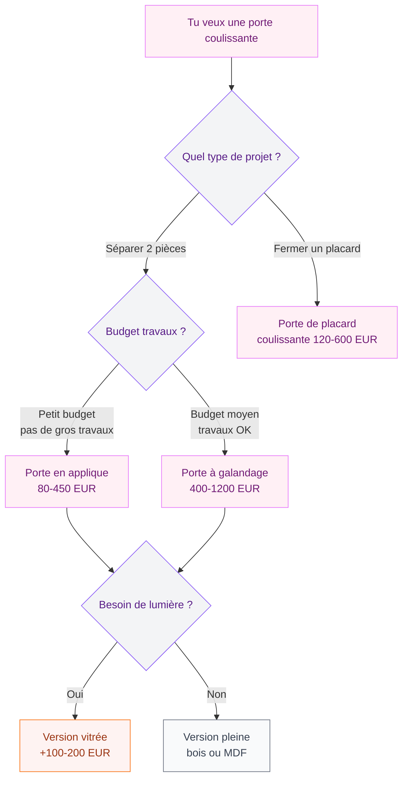

Tu as un couloir étroit, une chambre qui manque de lumière ou un placard qui bouffe la moitié de ta pièce quand tu l'ouvres ? La porte coulissante, c'est la solution qui revient tout le temps - et pour de bonnes raisons. Chez Leroy Merlin, le rayon est tellement large (plus de 500 références) qu'on peut vite s'y perdre entre les kits, les portes seules, les systèmes à galandage et les placards coulissants. Je t'aide à y voir clair, avec des prix concrets et mes recommandations pour chaque situation.

## Les grands types de portes coulissantes disponibles

Quand tu arrives chez Leroy Merlin (en magasin ou en ligne), tu tombes sur quatre grandes familles. Chacune répond à un besoin différent, et le budget varie du simple au triple.

### La porte coulissante en applique (avec rail apparent)

C'est le modèle le plus populaire et le plus simple à installer. La porte glisse sur un rail fixé au-dessus de l'ouverture, côté pièce. Tu la vois, elle fait partie du décor - et ça tombe bien, parce que les modèles actuels sont vraiment beaux.

**Prix chez Leroy Merlin** : 80 à 450 euros pour un kit complet (porte + rail + roulettes). Les modèles basiques en MDF blanc démarrent à 89 euros, les versions en chêne massif ou en verre dépoli montent à 350-450 euros.

**Avantage** : pose facile, même pour un débutant. Pas besoin de toucher aux murs.

**Limite** : la porte reste visible le long du mur quand elle est ouverte. Il faut donc un pan de mur libre à côté de l'ouverture.

### La porte à galandage (qui rentre dans le mur)

Là, c'est un autre niveau. La porte disparaît complètement dans une structure métallique intégrée à la cloison. Quand elle est ouverte, tu ne vois rien - magique. C'est le système idéal si tu veux un rendu ultra propre et maximiser chaque centimètre.

**Prix chez Leroy Merlin** : 200 à 700 euros pour le châssis seul (marques Éclisse, Scrigno). Ajoute 100 à 400 euros pour la porte elle-même. Budget total installé : 400 à 1200 euros selon le modèle et si tu fais poser.

**Avantage** : gain de place maximal, esthétique impeccable.

**Limite** : installation plus complexe, il faut ouvrir le mur. Pas un projet du dimanche après-midi si tu débutes.

> [!WARNING]
> Le galandage impose de vérifier ce qu'il y a dans ta cloison AVANT d'acheter. Gaines électriques, tuyaux, isolation - si la cloison est chargée, le châssis ne passera peut-être pas. Demande un diagnostic en magasin, c'est gratuit.

### La porte de placard coulissante

C'est la catégorie reine chez Leroy Merlin, avec des centaines de références. Deux ou trois vantaux qui glissent sur un rail haut et un rail bas, pour fermer un dressing ou un placard mural.

**Prix** : 120 à 600 euros le kit 2 vantaux (dimensions standard 120 x 250 cm). Les portes Optimum de Leroy Merlin offrent un super rapport qualité-prix autour de 150-200 euros. Les modèles Kazed avec miroir ou finition chêne tournent à 300-500 euros.

**Avantage** : choix énorme de finitions (miroir, bois, laqué, verre) et de dimensions.

**Limite** : les rails bas accumulent la poussière. Prévois un coup d'aspirateur régulier.

### La porte coulissante vitrée

Que ce soit en applique ou en galandage, la version vitrée apporte un vrai plus : elle laisse passer la lumière tout en séparant les espaces. C'est ce que je recommande entre une cuisine ouverte et un salon, ou pour une salle de bain avec fenêtre.

**Prix** : 200 à 550 euros. Les modèles en verre trempé dépoli (Artens, collection Leroy Merlin) démarrent à 219 euros. Les portes en verre atelier noir, très tendance, tournent autour de 350-500 euros.

> [!TIP]
> Le verre dépoli est parfait pour la salle de bain : il laisse passer la lumière sans sacrifier l'intimité. Le verre transparent, lui, marche bien entre un salon et une cuisine pour garder une sensation d'espace ouvert.

## Comment choisir la bonne porte coulissante

Le choix dépend de trois critères : ton espace disponible, ton budget et le niveau de travaux que tu es prête à accepter.

### Les dimensions : attention aux standards

Chez Leroy Merlin, les portes coulissantes existent en dimensions standard et sur mesure. Les standards sont les plus accessibles en prix :

- **63 cm de large** : pour les petites ouvertures (toilettes, cellier)
- **73 cm** : la largeur classique, passe dans la plupart des bâtis
- **83 cm** : confort standard, la plus vendue
- **93 cm** : large, top pour les pièces de vie
- **Hauteur** : 204 cm en standard, mais des modèles montent à 250 cm pour les plafonds hauts

Si tes dimensions sortent du standard, Leroy Merlin propose la découpe sur mesure en magasin (souvent gratuite à l'achat) ou des portes fabriquées à tes côtes avec un délai de 2 à 4 semaines.

### Le matériau : bois, MDF, verre ou alu ?

| Matériau | Prix moyen | Entretien | Style |
|----------|-----------|-----------|-------|
| MDF blanc | 80-150 EUR | Facile, chiffon humide | Basique, passe-partout |
| Chêne plaqué | 200-400 EUR | Huile 1x/an | Chaleureux, naturel |
| Verre dépoli | 220-450 EUR | Produit vitres | Moderne, lumineux |
| Verre atelier noir | 350-550 EUR | Produit vitres | Industriel, tendance |
| Alu + verre | 400-600 EUR | Très facile | Design, contemporain |

Mon conseil : si tu hésites, le MDF peint est un super point de départ. Tu peux toujours le peindre dans la couleur de ton choix pour 15-20 euros de peinture. Et si tu veux un look [décoration minimaliste](/guides/decoration/decoration-minimaliste-idees-et-photos-faciles/), une porte blanche mate sur rail noir fait un effet canon.

## Poser une porte coulissante en applique : le tuto pas à pas

C'est le type le plus accessible pour une pose DIY. Avec un bon kit et les bons outils, compte 2 à 3 heures max.

### Ce qu'il te faut

- Le kit complet (porte + rail + visserie) : à partir de 89 euros chez Leroy Merlin
- Perceuse visseuse
- Niveau à bulle (ou appli niveau sur ton téléphone, ça marche aussi)
- Crayon et mètre
- Chevilles adaptées à ton mur (placo, brique, béton)

### Les étapes

**1. Vérifie ton mur.** Le rail doit être fixé dans un support solide. Sur du placo, utilise des chevilles Molly ou, encore mieux, visse dans les montants métalliques. Sur du béton ou de la brique, des chevilles classiques suffisent.

**2. Marque la position du rail.** Le rail se fixe entre 5 et 10 cm au-dessus de l'ouverture. Trace un trait horizontal au niveau - c'est LA étape où il ne faut pas se louper. Un rail de travers, ça se voit tout de suite.

**3. Perce et fixe le rail.** En général, 4 à 6 points de fixation selon la longueur. Serre bien, mais sans excès : le rail doit être stable et parfaitement horizontal.

**4. Accroche la porte.** Les roulettes se fixent sur le haut de la porte. Tu les clipses ou tu les visses sur le rail selon le système. La plupart des kits Leroy Merlin utilisent un système à clipser, très intuitif.

**5. Règle la hauteur.** Chaque roulette a une vis de réglage pour ajuster la porte au millimètre. La porte doit être parallèle au sol avec un jeu de 5 à 10 mm en bas.

**6. Pose la butée et le guide bas.** La butée empêche la porte de sortir du rail, le guide bas la maintient dans l'axe sans frotter.

> [!NOTE]
> Leroy Merlin propose un service de pose à domicile à partir de 150 euros pour une porte coulissante en applique. Si tu n'as pas les outils ou si tu n'es pas à l'aise avec la perceuse, c'est un investissement qui vaut le coup. Le poseur ramène ses propres chevilles adaptées à ton mur.

## Portes de placard coulissantes : les meilleures gammes Leroy Merlin

Si ton projet, c'est de fermer un dressing ou un placard mural, Leroy Merlin a trois gammes principales qui couvrent tous les budgets.

### Gamme Optimum (entrée de gamme)

À partir de 130 euros les 2 vantaux en 120 x 250 cm. Finitions basiques (blanc, chêne clair, miroir) mais qualité correcte. Les rails sont en alu, les roulettes en nylon. C'est ce que je conseille pour un placard de chambre d'enfant ou une buanderie.

### Gamme Spaceo (milieu de gamme)

Entre 200 et 400 euros les 2 vantaux. Plus de choix de finitions (noyer, gris anthracite, laqué brillant), roulettes à roulement à billes (plus fluides et silencieuses). Si tu aménages un [dressing](/guides/rangement/) dans ta chambre parentale, c'est le meilleur rapport qualité-prix.

### Gamme Kazed (haut de gamme)

De 350 à 600 euros et plus. Personnalisation poussée : tu choisis le cadre (alu brossé, noir mat, blanc), le remplissage (miroir, verre laqué, bois, tissu tendu) et les dimensions exactes. Le rendu est vraiment premium.

## Entretien et astuces pour que ça dure

Une porte coulissante bien entretenue dure 15 à 20 ans sans broncher. Voici les gestes qui font la différence :

- **Nettoie le rail bas tous les 2-3 mois.** Un coup d'aspirateur avec la brosse fine, puis un chiffon humide. La poussière et les cheveux s'accumulent vite et finissent par bloquer les roulettes.
- **Lubrifie les roulettes une fois par an.** Un spray silicone (5 euros en grande surface) sur les roulettes et le rail. Pas de WD-40 qui attire la poussière.
- **Vérifie le réglage de hauteur.** Avec le temps et les changements de température, la porte peut se décaler légèrement. Un petit coup de tournevis sur les vis de réglage et c'est reparti.
- **Pour les portes en verre**, un produit vitres classique suffit. Évite les produits abrasifs sur les cadres en alu noir mat : un chiffon microfibre humide fait le travail.

> [!IMPORTANT]
> Si ta porte coulissante commence à "sauter" sur le rail ou à dérailler, ne force pas. Décroche-la, vérifie que les roulettes ne sont pas usées ou encrassées, et remets-la en place proprement. Un remplacement de roulettes coûte 10 à 25 euros - bien moins qu'un rail abîmé.

## Les erreurs à éviter quand tu achètes

J'en ai vu passer, des projets ratés à cause de détails qu'on oublie. Voici les pièges classiques :

**Oublier de mesurer l'épaisseur du mur.** Pour un galandage, l'épaisseur de cloison conditionne le choix du châssis. Une cloison de 72 mm n'accepte pas le même châssis qu'une de 100 mm. Mesure avant de commander.

**Sous-estimer le poids.** Une porte en chêne massif de 83 cm pèse entre 25 et 40 kg. Ton rail et tes fixations doivent supporter ce poids. Sur du placo, c'est chevilles Molly minimum, ou mieux, une planche de renfort derrière.

**Négliger l'isolation phonique.** Une porte coulissante classique n'isole presque pas du bruit. Si tu sépares une chambre d'un salon, choisis un modèle avec joint brosse sur les montants et un seuil bas. Ça ne remplace pas un mur, mais ça atténue le son.

**Acheter la porte sans le kit.** Chez Leroy Merlin, certaines portes sont vendues seules (sans rail ni roulettes). Vérifie toujours que tu prends un "kit porte coulissante" complet, ou ajoute le système de rail compatible (compte 40 à 80 euros en plus).

> [!TIP]
> Avant de te déplacer en magasin, utilise le configurateur en ligne de Leroy Merlin. Tu rentres tes dimensions, ton type de cloison et ton budget, et il te propose les kits compatibles. Ça t'évite un aller-retour inutile.

Si tu veux un intérieur qui respire tout en gardant la possibilité de fermer tes espaces, la porte coulissante est un des meilleurs investissements déco que tu puisses faire. Ça marche entre un [salon moderne](/guides/decoration/salons-modernes-et-elegants-2026/) et une cuisine, pour fermer un placard dans une [chambre](/guides/chambre/) sans perdre de place, ou même pour créer une séparation élégante dans un [appartement](/guides/decoration/appartements-modernes-60-photos-et-conseils-de-decoration/).

## FAQ

### Combien coûte une porte coulissante chez Leroy Merlin ?

Les prix varient beaucoup selon le type. Une porte en applique avec rail démarre à 89 euros pour un modèle basique en MDF. Les portes de placard coulissantes vont de 130 à 600 euros les 2 vantaux. Un système à galandage complet (châssis + porte) coûte entre 400 et 1200 euros.

### Est-ce qu'on peut poser une porte coulissante soi-même ?

Oui, surtout pour les modèles en applique. Avec un kit complet et une perceuse, la pose prend 2 à 3 heures. Le galandage est plus technique : il faut ouvrir la cloison, poser le châssis métallique et replâtrer. Pour ce type de projet, je recommande de faire appel à un poseur (150-300 euros de main d'oeuvre chez Leroy Merlin).

### Quelle largeur choisir pour une porte coulissante intérieure ?

La largeur standard la plus vendue est 83 cm, compatible avec la majorité des ouvertures. Pour un accès PMR (personne à mobilité réduite), prévois 90 cm minimum. Pour des toilettes ou un cellier, 63 cm peut suffire. Mesure toujours l'ouverture existante et ajoute 5 à 8 cm de chaque côté pour le recouvrement.

### Porte coulissante en applique ou à galandage : laquelle choisir ?

L'applique est plus simple, moins chère et ne demande pas de travaux lourds - c'est le choix par défaut. Le galandage offre un rendu plus épuré puisque la porte disparaît dans le mur, mais il coûte plus cher et il faut ouvrir la cloison. Si tu es en rénovation légère, l'applique. Si tu refais une pièce de zéro, le galandage vaut le détour.
